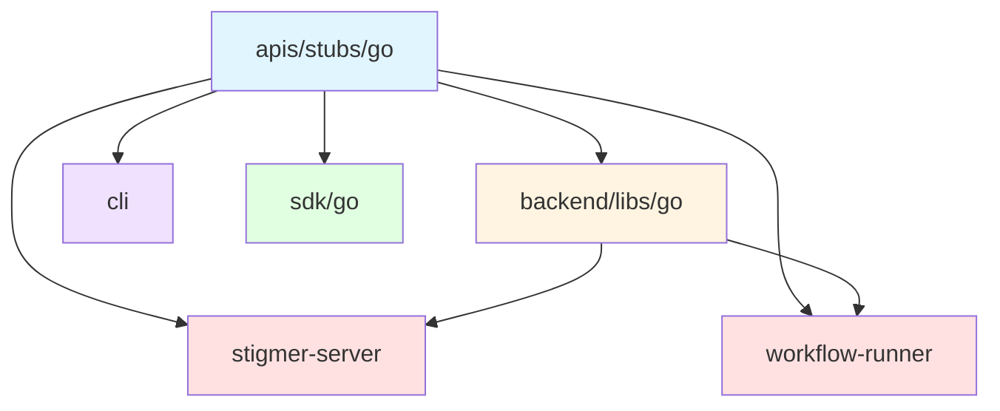

# Go Module Structure

Stigmer uses Go workspaces to manage multiple modules in a monorepo, following the pattern established by Planton Cloud.

## Overview

Each service and library is its own Go module with explicit dependencies. No root `go.mod` exists—only a workspace file (`go.work`) coordinates module relationships.

## Structure

```
stigmer/
├── go.work                             # Workspace coordinator
├── go.work.sum                         # Workspace checksums
├── apis/stubs/go/go.mod               # API definitions module
├── backend/
│   ├── libs/go/go.mod                 # Shared libraries module
│   └── services/
│       ├── stigmer-server/go.mod      # Main daemon module
│       └── workflow-runner/go.mod     # Workflow service module
├── client-apps/cli/go.mod             # CLI module
└── sdk/go/go.mod                      # Go SDK module
```

## Workspace File (`go.work`)

```go
go 1.25.6

use (
    ./apis/stubs/go
    ./backend/libs/go
    ./backend/services/stigmer-server
    ./backend/services/workflow-runner
    ./client-apps/cli
    ./sdk/go
)
```

**Purpose**: Tells Go where all modules live without publishing them.

## Module Relationships



**Dependencies**:
- **apis/stubs/go**: Protocol buffer stubs (no dependencies on other Stigmer modules)
- **backend/libs/go**: Shared libraries (depends on apis/stubs/go)
- **stigmer-server**: Main daemon (depends on apis/stubs/go + backend/libs/go)
- **workflow-runner**: Workflow service (depends on apis/stubs/go, not backend/libs/go)
- **cli**: Command-line tool (depends on apis/stubs/go)
- **sdk/go**: Go SDK (depends on apis/stubs/go)

## Adding a New Go Service

When creating a new Go service, follow this pattern:

### 1. Initialize Module

```bash
cd backend/services/{service-name}
go mod init github.com/stigmer/stigmer/backend/services/{service-name}
```

### 2. Add Replace Directives

In your `go.mod`, add:

```go
// Local development: Use APIs from monorepo
replace github.com/stigmer/stigmer/apis/stubs/go => ../../../apis/stubs/go

// Local development: Use backend libs from monorepo (if needed)
replace github.com/stigmer/stigmer/backend/libs/go => ../../../backend/libs/go
```

### 3. Update Workspace

Add your module to `go.work`:

```go
use (
    ...
    ./backend/services/{service-name}  // Add this line
)
```

### 4. Sync Workspace

```bash
go work sync
```

## Import Paths

Import paths are based on module paths, not file paths:

```go
// Importing from apis/stubs/go
import agentv1 "github.com/stigmer/stigmer/apis/stubs/go/ai/stigmer/agentic/agent/v1"

// Importing from backend/libs/go
import "github.com/stigmer/stigmer/backend/libs/go/badger"
import "github.com/stigmer/stigmer/backend/libs/go/grpc"
```

The `replace` directives in your `go.mod` ensure these resolve to local paths during development.

## Why This Pattern?

### Clear Module Boundaries

Each service/library declares its own dependencies explicitly. No implicit dependencies through a root module.

### Independent Versioning (Future)

Modules can be versioned and published independently if needed:

```go
// Could become:
require github.com/stigmer/stigmer/apis/stubs/go v1.2.3
```

### Better IDE Support

GoLand, VSCode, and other IDEs understand module boundaries, providing better:
- Code navigation
- Dependency tracking
- Refactoring support

### Matches Planton Pattern

Consistency with Planton Cloud's established build system:

```
planton/
├── go.work
├── apis/go.mod
└── backend/services/
    ├── iac-runner/go.mod
    ├── integration/go.mod
    └── tekton-webhooks-receiver/go.mod
```

## Common Operations

### Run All Tests

```bash
# From workspace root
go test ./...
```

### Build Specific Service

```bash
cd backend/services/stigmer-server
go build ./cmd/server
```

### Update Dependencies

```bash
# Update a specific module
cd backend/services/stigmer-server
go get -u github.com/rs/zerolog@latest
go mod tidy

# Sync workspace
cd ../../../
go work sync
```

### Add New Dependency

```bash
cd backend/services/{service-name}
go get github.com/some/package@latest
go mod tidy
```

## Troubleshooting

### "package X is not in GOROOT"

**Cause**: Module not in workspace or replace directive missing

**Fix**: Add module to `go.work` or add `replace` directive in `go.mod`

### "ambiguous import"

**Cause**: Multiple versions of same package (common with `google.golang.org/genproto`)

**Fix**: Explicitly upgrade to latest version:

```bash
go get google.golang.org/genproto/googleapis/api@latest
```

### "cannot find module providing package"

**Cause**: Missing replace directive for local module

**Fix**: Add replace directive in `go.mod`:

```go
replace github.com/stigmer/stigmer/apis/stubs/go => ../../../apis/stubs/go
```

## Related Documentation

- [Planton Go Coding Guidelines](/Users/suresh/scm/github.com/plantonhq/planton/.cursor/rules/product/coding-guidelines/golang-coding-guidelines.mdc)
- [Go Workspaces Documentation](https://go.dev/blog/get-familiar-with-workspaces)
- Changelog: `_changelog/2026-01/2026-01-20-072129-align-go-workspace-with-planton-structure.md`

## Design Decision

**Why no root `go.mod`?**

Having a root module creates ambiguity:
- Which code belongs to the root module vs service modules?
- Do services import from root or are they part of root?
- How do you version the root module vs services?

**Workspace-only pattern** makes boundaries explicit:
- Each module is self-contained
- Dependencies are declared, not implicit
- Services can be extracted to separate repos if needed

This aligns with microservices architecture principles even within a monorepo.
