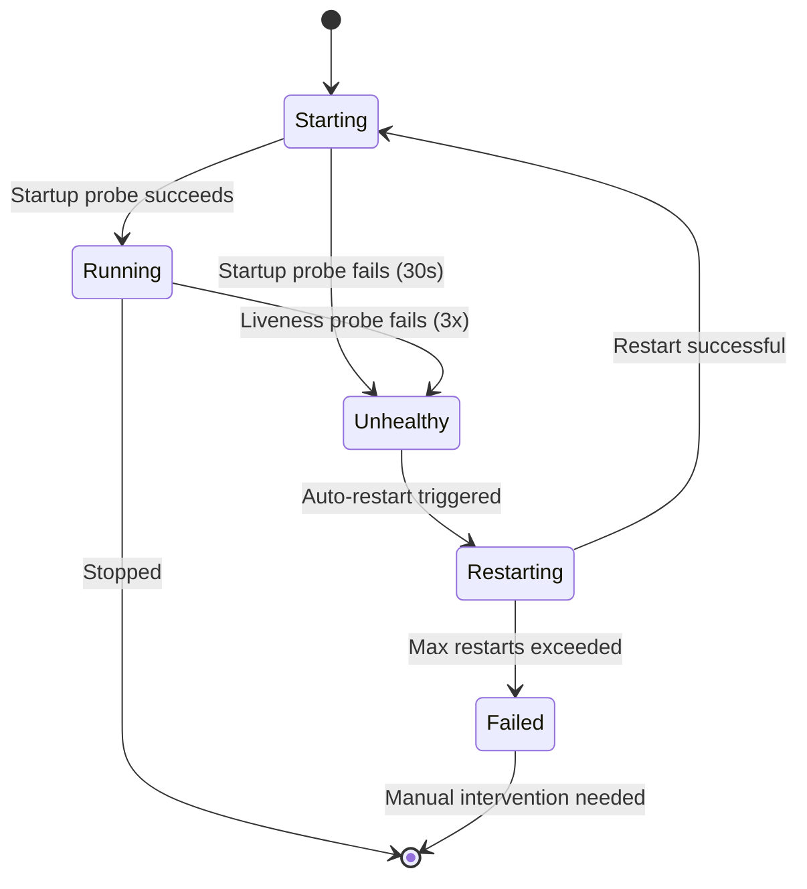

# Health Monitoring & Auto-Restart

Production-grade health monitoring and automatic restart for stigmer daemon components.

## Overview

Stigmer daemon includes automatic health monitoring and restart capabilities inspired by industry-proven patterns from Kubernetes, systemd, PM2, and Docker. All components (stigmer-server, workflow-runner, agent-runner) are continuously monitored and automatically recover from failures.

**Impact**: Eliminates silent component failures and reduces downtime through automatic recovery.

## How It Works

### Health Probe Types

Stigmer uses three types of health probes, inspired by Kubernetes:

**Startup Probe**
- Checks if component has started successfully
- Gives slow-starting components time to initialize  
- Runs frequently with high failure tolerance (30 seconds)
- Delays liveness checks until startup completes

**Liveness Probe**
- Checks if component is alive and healthy
- Detects crashes and unresponsive components
- Triggers restart after failure threshold (3 consecutive failures)
- Runs every 10 seconds

**Readiness Probe**
- Checks if component is ready to handle work
- Determines if component should receive traffic/tasks
- Does NOT trigger restart - just marks as not ready
- Runs every 5 seconds

### Component States

Components transition through these states:



- **Starting**: Component is starting up
- **Running**: Component is healthy
- **Unhealthy**: Component failed health checks
- **Restarting**: Component is being restarted
- **Stopped**: Component is stopped
- **Failed**: Component exceeded restart limits

### Automatic Restart

When a component becomes unhealthy:

1. **Detection**: Liveness probe fails 3 times (~30 seconds)
2. **Backoff**: Wait for exponential backoff delay
3. **Restart**: Stop and restart the component
4. **Verify**: Check if component runs for minimum uptime (10 seconds)
5. **Track**: Update restart count and timing

### Exponential Backoff

Restarts use exponential backoff to prevent restart storms:

```
Restart 1: 1s delay
Restart 2: 2s delay
Restart 3: 4s delay
Restart 4: 8s delay
Restart 5: 16s delay
Restart 6: 32s delay
Restart 7+: 60s delay (capped)
```

### Restart Limits

Components enter **Failed** state after exceeding restart limits:

- **Max Restarts**: 10 restarts
- **Time Window**: 10 minutes
- **Behavior**: If component restarts 10 times within 10 minutes, it enters Failed state
- **Recovery**: Manual intervention required

**Why restart limits?**
- Prevent infinite restart loops
- Detect persistent failures (not transient issues)
- Alert operator to investigate root cause
- Preserve system resources

### Minimum Uptime

Components must run for **10 seconds** before restart is considered successful:

```
Component starts → Crashes after 5s → Restart failed (counter increments)
Component starts → Runs 15s → Crash → Restart successful (counter resets)
```

**Why minimum uptime?**
- Distinguish startup failures from runtime failures
- Detect crash loops vs. transient issues
- Prevent rapid restart cycling

## Component-Specific Health Checks

### Stigmer Server

**Liveness Check:**
1. Process is alive (PID exists)
2. gRPC port is responding (localhost:50051)

**Why**: Ensures server is accepting requests, not just running

### Workflow Runner

**Liveness Check:**
1. Process is alive (PID exists)
2. Minimum uptime met (10 seconds)

**Why**: Detects crash loops and ensures stable operation

### Agent Runner (Docker)

**Liveness Check:**
1. Container is running (`docker ps`)
2. Container health status (if healthcheck defined)

**Why**: Docker-specific checks for containerized agent execution

## Viewing Health Status

Use `stigmer server status` to see component health:

```bash
$ stigmer server status

Stigmer Server Status:
─────────────────────────────────────

Stigmer Server:
  Status:   Running ✓
  PID:      12345
  Uptime:   2h 15m
  Restarts: 0

Workflow Runner:
  Status:   Running ✓
  PID:      12346
  Uptime:   2h 15m
  Restarts: 0

Agent Runner (Docker):
  Status:   Running ✓
  Container: abc123456789
  Uptime:   2h 14m
  Restarts: 0

Health Monitoring: ✓ Active
```

**Status Indicators:**
- `✓` Running (healthy)
- `↻` Starting/Restarting
- `✗` Unhealthy
- `✗✗` Failed (manual intervention needed)
- `○` Stopped

## Testing Health Monitoring

### Test Automatic Restart

```bash
# Start server
stigmer server

# Verify healthy state
stigmer server status
# All components should show "Running ✓" with 0 restarts

# Simulate component crash
pkill -f "workflow-runner"

# Wait for detection (~30 seconds)
# Health monitoring detects failure after 3 consecutive failed checks

# Check status during restart
stigmer server status
# workflow-runner should show "Restarting ↻"

# Wait for restart completion
sleep 40

# Verify recovery
stigmer server status
# workflow-runner should show "Running ✓" with restarts: 1

# Check logs for restart messages
tail -f ~/.stigmer/logs/workflow-runner.log
# Should see: "Restarting component" and "Component restarted successfully"
```

### Test Restart Limits

To verify restart limits work:

```bash
# Make component crash on startup (requires editing code)
# Edit workflow-runner to immediately exit

# Restart daemon
stigmer server stop
stigmer server

# Watch rapid restarts
watch -n 1 'stigmer server status'

# After ~3-5 minutes (10 restarts):
# Component should enter "Failed ✗✗" state
# Health monitoring logs: "Component has exceeded maximum restart limit"
```

## Configuration

Health monitoring is automatically enabled and uses sensible defaults. No configuration required for typical usage.

**Default Configuration:**
- **Check Interval**: 10 seconds (liveness probes)
- **Failure Threshold**: 3 consecutive failures to trigger restart
- **Max Restarts**: 10 restarts within 10-minute window
- **Min Uptime**: 10 seconds before restart considered successful
- **Backoff Range**: 1s to 60s (exponential)

## Logs

Health monitoring events are logged for debugging:

**Health Check Logs** (`~/.stigmer/logs/stigmer-server.log`):
```
Component started, health monitoring active
Health check passed (debug level)
Health check failed (warning level)
Component marked unhealthy
Restarting component (attempt 2/10)
Component restarted successfully
```

**Critical Errors:**
```
Component has exceeded maximum restart limit - manual intervention required
```

## When Components Fail

### Transient Failures

**Behavior**: Component crashes occasionally

**Automatic Recovery:**
1. Detected within 30 seconds
2. Automatically restarted after backoff
3. Component resumes normal operation
4. Restart counter increments

**User Action**: None required - monitor restart counts

### Persistent Failures

**Behavior**: Component repeatedly crashes

**Automatic Response:**
1. Component restarted up to 10 times
2. After 10 restarts in 10 minutes, enters Failed state
3. Health monitoring logs prominent error
4. Component remains stopped

**User Action**: Investigate logs, fix root cause, restart daemon

### Crash Loops

**Behavior**: Component crashes immediately on startup

**Detection**: Minimum uptime check (10 seconds)

**Automatic Response:**
1. Rapid restarts counted as failures
2. Restart counter doesn't reset
3. Quickly reaches failed state

**User Action**: Check startup logs, fix initialization issue

## Troubleshooting

### Component Stuck in Starting State

**Symptom**: Component shows "Starting ↻" for > 30 seconds

**Cause**: Startup probe is failing

**Solutions:**
- Check component logs for startup errors
- Verify dependencies (Temporal, Docker, etc.)
- Increase startup timeout (requires code change)

### Component Immediately Fails

**Symptom**: Component enters "Failed ✗✗" within minutes

**Cause**: Persistent crash on startup (crash loop)

**Solutions:**
- Check component logs for errors
- Verify configuration is correct
- Test component manually
- Fix underlying issue before restarting

### Health Checks Timing Out

**Symptom**: Warnings in logs: "Health check failed - timeout"

**Cause**: Health checks taking too long

**Solutions:**
- Check system resources (CPU, memory)
- Check network connectivity (for gRPC checks)
- Investigate component performance

### Restart Loops

**Symptom**: Component constantly restarting

**Cause**: Component crashes before minimum uptime

**Solutions:**
- Identify crash cause in logs
- Fix underlying issue (config, dependencies, bugs)
- Component must run stably for 10+ seconds

## Architecture Notes

**Thread Safety**: All health monitoring operations are thread-safe and can run concurrently.

**Performance**: Health monitoring adds negligible overhead:
- Watchdog goroutine: ~1 KB memory
- Health checks every 10 seconds
- Each check: < 100ms CPU, < 1 KB memory

**Failure Isolation**: If watchdog crashes, components continue running (but won't auto-restart on failure).

## Design Decisions

### Why Kubernetes Probe Model?

**Rationale**: Kubernetes health probes are battle-tested in production with millions of deployments. The three-probe model (startup, liveness, readiness) covers all failure scenarios.

### Why Exponential Backoff?

**Alternatives Considered:**
- No backoff → Resource exhaustion, restart storms
- Linear backoff → Too slow to recover
- Exponential → ✅ Fast recovery + protection

**Result**: Optimal balance between quick recovery and system protection.

### Why 10-Second Minimum Uptime?

**Rationale**: Distinguishes crash loops (immediate failures) from runtime failures (component runs, then crashes later). 10 seconds is enough to confirm process stability without being too lenient.

### Why 10 Restarts in 10 Minutes?

**Rationale**: Allows recovery from transient issues while preventing infinite loops from persistent failures. Time window resets, so temporary problems don't permanently affect component.

## Future Enhancements

Potential improvements (not currently implemented):

1. **HTTP Health Endpoints**: Expose health status via HTTP for external monitoring
2. **Configurable Thresholds**: Allow users to customize check intervals and limits
3. **Custom Health Checks**: Support user-provided health check scripts
4. **Circuit Breaker**: Temporarily disable failing components to prevent cascading failures
5. **Metrics Export**: Prometheus-compatible metrics for monitoring systems

## Related Documentation

- [Local Development Guide](../guides/local-development.md) - Running stigmer locally
- [Daemon Architecture](daemon-architecture.md) - How stigmer daemon works
- [Troubleshooting](../guides/troubleshooting.md) - Common issues and solutions

## Implementation Reference

For developers working on health monitoring:
- Package: `client-apps/cli/internal/cli/health/`
- Integration: `client-apps/cli/internal/cli/daemon/health_integration.go`
- Developer docs: `client-apps/cli/internal/cli/health/README.md`
