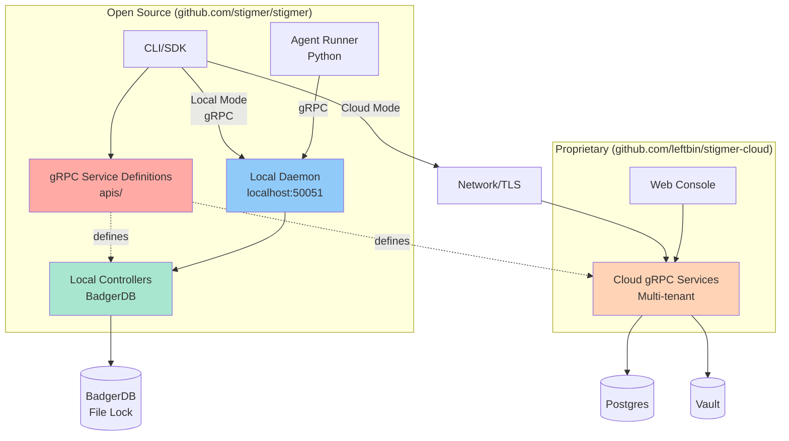

# Open Core Architecture

Stigmer uses an **Open Core** business model, where the execution plane is open source and the control plane is proprietary.

## Component Classification

### Open Source (Apache 2.0)

Located in `github.com/stigmer/stigmer`:

**Execution Components**:
- **CLI** (`cmd/stigmer/`) - Command-line interface for all operations
- **Workflow Runner** (`runners/workflow/`) - Executes workflow definitions
- **Agent Runner** (`runners/agent/`) - Executes agent instances
- **SDKs** (`sdk/go/`, `sdk/python/`) - Libraries for building workflows

**Local Backend**:
- **Local Daemon** (`cmd/stigmer-daemon/`) - gRPC server that holds BadgerDB file lock
- **Local Controllers** (`internal/backend/local/`) - BadgerDB-based gRPC service implementations
- **BadgerDB Storage** (`internal/backend/local/`) - Key-value storage layer (LSM tree)

**API Contracts**:
- **gRPC Services** (`apis/ai/stigmer/agentic/*/v1/`) - Protobuf service definitions
- **Resource Definitions** (`apis/ai/stigmer/agentic/*/v1/api.proto`) - Agent, Workflow, etc.

### Proprietary (Stigmer Cloud)

Located in `github.com/leftbin/stigmer-cloud` (private):

**Control Plane**:
- **gRPC Services** - Multi-tenant implementations of the same gRPC interfaces
- **Web Console** - Browser-based UI
- **Auth Service** - User authentication and IAM
- **Orchestration** - Workflow scheduling and distribution
- **Distributed Storage** - Postgres, Vault, Redis

## Why This Split?

**Open Source Benefits**:
- Developers can run Stigmer with zero infrastructure
- Full transparency in execution logic
- Community contributions to core functionality
- No vendor lock-in for execution

**Commercial Benefits**:
- Enterprise teams get collaboration features
- SaaS revenue supports development
- Advanced features remain competitive advantage
- Hosted service reduces operational burden

## gRPC Service Architecture

The key to this architecture is using **gRPC service interfaces as the contract** between CLI and backends.



### The Contract

Both backends implement the exact same gRPC service interfaces defined in `apis/`:

```protobuf
// Open source proto definition
service AgentCommandController {
  rpc create(Agent) returns (Agent);
  rpc update(Agent) returns (Agent);
  rpc delete(AgentId) returns (Agent);
}
```

**Local Backend**: Implements these services with BadgerDB storage via daemon.  
**Cloud Backend**: Implements these services with distributed storage (over network).

### Local Daemon Architecture

BadgerDB uses file-based locking (only one process can open the database at a time). To support both CLI and Agent Runner (Python) accessing the database concurrently, we use a **daemon model**:

**Components**:
1. **Local Daemon** (`stigmer local start`): Lightweight gRPC server that holds the BadgerDB file lock
   - Listens on `localhost:50051`
   - Implements the same gRPC services as Cloud
   - Opens BadgerDB in `~/.stigmer/data`

2. **CLI**: Connects to `localhost:50051` for all database operations
   - No direct BadgerDB access (avoids file lock conflicts)
   - Same gRPC client code as Cloud mode

3. **Agent Runner** (Python): Connects to `localhost:50051` via gRPC
   - No database driver needed
   - Language-agnostic access through gRPC

**Benefits**:
- ✅ Safe concurrent access (daemon holds exclusive lock)
- ✅ Language agnostic (Python, Go, Node can all talk to daemon)
- ✅ Same gRPC interface as Cloud (seamless migration)
- ✅ No complex database drivers needed in SDK

This guarantees:
- ✅ Feature parity between local and cloud
- ✅ Zero code changes when switching backends
- ✅ Compiler enforces interface compatibility
- ✅ No drift between implementations

## Feature Parity Matrix

| Feature | Local Backend | Cloud Backend |
|---------|---------------|---------------|
| Agent execution | ✅ | ✅ |
| Workflow execution | ✅ | ✅ |
| Secret storage | ✅ OS Keychain | ✅ Vault |
| Execution history | ✅ BadgerDB | ✅ Postgres |
| MCP server integration | ✅ | ✅ |
| CLI access | ✅ | ✅ |
| gRPC services | ✅ In-process | ✅ Network |
| Web console | ❌ | ✅ Cloud only |
| Multi-user collaboration | ❌ | ✅ Cloud only |
| IAM policies | ❌ Ignored | ✅ Cloud only |
| Distributed execution | ❌ | ✅ Cloud only |
| Enterprise support | ❌ | ✅ Cloud only |

## Migration Path

Users can start with local mode and upgrade to cloud mode seamlessly:

1. **Develop locally**:
   ```bash
   stigmer init
   stigmer agent create my-agent --instructions "..."
   stigmer agent execute my-agent "hello"
   ```

2. **Export resources**:
   ```bash
   stigmer export --all > stigmer-resources.yaml
   ```

3. **Switch to cloud**:
   ```bash
   stigmer login
   stigmer import < stigmer-resources.yaml
   ```

4. **Continue working** - Same CLI, same commands, now backed by cloud

## Security Model

### Local Mode

- **Authentication**: None (trust the local user)
- **Secrets**: Encrypted with OS keychain or local master key
- **Access control**: Single-user mode (no IAM)
- **Audit**: Basic timestamps in BadgerDB
- **Authorization**: Proto IAM annotations are ignored

### Cloud Mode

- **Authentication**: OAuth 2.0 / API keys
- **Secrets**: HashiCorp Vault
- **Access control**: IAM policies per resource (Proto annotations enforced)
- **Audit**: Complete audit logs with compliance tracking
- **Authorization**: Full IAM with organization/team/user scopes

## Development Workflow

### Contributing to Open Source

1. Fork `github.com/stigmer/stigmer`
2. Make changes to:
   - API contracts (`apis/`)
   - Local controllers (`internal/backend/local/`)
   - CLI (`cmd/stigmer/`)
   - SDKs (`sdk/`)
3. Test against local backend
4. Submit pull request

### Internal Development (Stigmer Team)

1. **API Changes**:
   - Update proto files in open source repo
   - Regenerate code: `make protos`
   - Update local implementation
   - Update cloud implementation (private repo)
   - Both repos stay in sync via shared protobuf definitions

2. **Local-Only Features**:
   - Add to open source repo
   - Implement in local controllers

3. **Cloud-Only Features**:
   - Add to cloud repo only
   - May extend existing gRPC services
   - Does not affect local mode

## Code Sharing Pattern

### Shared: API Contracts (Open Source)

```
apis/ai/stigmer/agentic/
├── agent/v1/
│   ├── api.proto          # Agent message definition
│   ├── command.proto      # AgentCommandController service
│   ├── query.proto        # AgentQueryController service
│   ├── spec.proto         # AgentSpec definition
│   └── status.proto       # AgentStatus definition
├── workflow/v1/
│   ├── api.proto
│   ├── command.proto
│   └── query.proto
└── ... (other resources)
```

Both local and cloud import these exact proto files.

### Divergent: Implementations

**Open Source** (`github.com/stigmer/stigmer`):
```
internal/backend/local/
├── agent_controller.go     # Implements AgentCommandControllerServer
├── workflow_controller.go  # Implements WorkflowCommandControllerServer
└── database.go             # BadgerDB operations
```

**Proprietary** (`github.com/leftbin/stigmer-cloud`):
```
apis/platform/grpc/
├── agent/
│   └── service.go          # Implements AgentCommandControllerServer
├── workflow/
│   └── service.go          # Implements WorkflowCommandControllerServer
└── middleware/
    ├── auth.go             # IAM enforcement
    ├── tenancy.go          # Multi-tenant isolation
    └── audit.go            # Audit logging
```

## License Compliance

**Open Source Code** (Apache 2.0):
- Permissive license allows commercial use
- Attribution required
- Patent grant included
- No copyleft requirements

**Proprietary Code**:
- Stigmer Cloud source code remains private
- Only exposed via gRPC API
- Client libraries (SDK) remain open source
- Protobuf definitions (API contracts) remain open source

## Community Governance

**Open Source Project**:
- Public roadmap and issue tracker
- Community contributions welcome
- Maintainers from Stigmer team + community
- Releases follow semantic versioning

**Commercial Product**:
- Private roadmap for cloud features
- Enterprise customer feedback prioritized
- SLA and support contracts available

## Why gRPC Services (Not a Separate "Backend Interface")?

**Previous approach**: Many projects define a Go interface for the backend, then implement it twice.

**Problem**: The Go interface can drift from the actual gRPC API. You end up maintaining two contracts.

**Our approach**: The gRPC service definitions in proto files **ARE** the interface.

**Benefits**:
- Single source of truth (Protobuf)
- Compiler enforces compatibility
- Works across languages (Go, Python, etc.)
- Impossible for local and cloud to drift
- Standard gRPC tooling and ecosystem

---

This architecture balances the needs of individual developers (free, open, local) with enterprise requirements (collaboration, governance, support).
