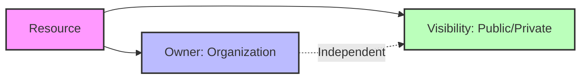
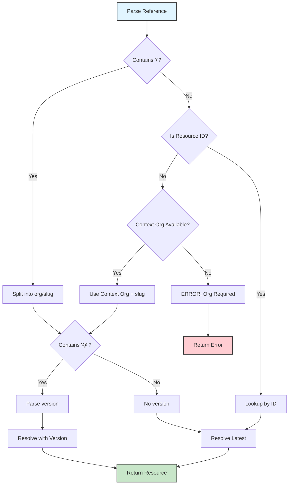
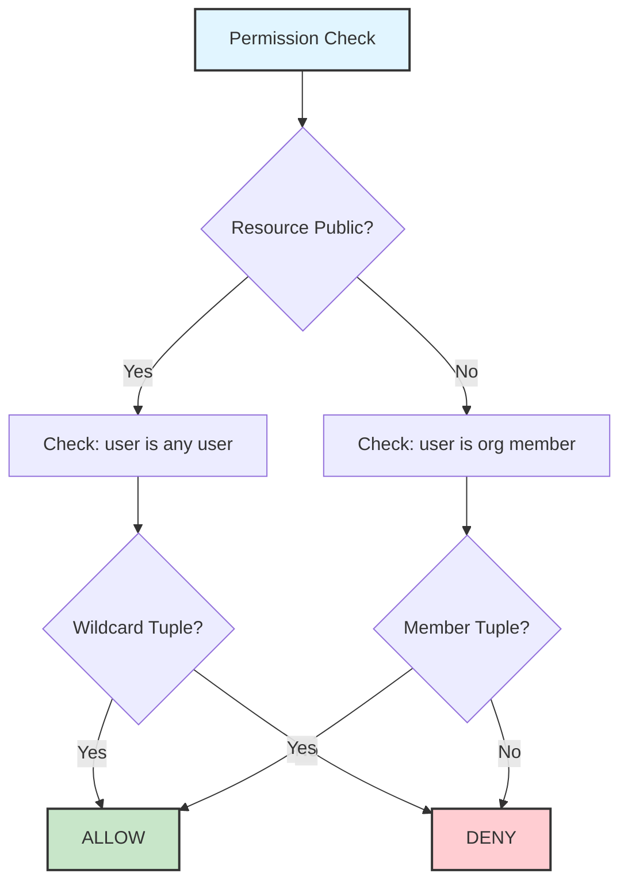

# Organization-Slug Ownership Model

Complete architectural documentation for Stigmer's simplified resource ownership and reference model.

## Purpose

Stigmer uses a GitHub-inspired ownership model: **every resource belongs to an organization**, referenced as `org/slug`. This eliminates scope complexity while maintaining clear ownership boundaries and enabling flexible visibility controls.

## Core Principles

### 1. Single Ownership Model

**Every resource belongs to exactly one organization.**

- ✅ No personal accounts
- ✅ No platform-scoped resources
- ✅ No scope-based conditionals
- ✅ Simplified authorization model

**Examples:**
- Agent: `stigmer/code-reviewer`
- Skill: `acme-corp/security-standards`
- Workflow: `my-team/deploy-pipeline`
- MCP Server: `stigmer/github`

### 2. Visibility is Orthogonal to Ownership

**Resources have visibility settings independent of ownership:**

- `PUBLIC` - Visible and usable by anyone
- `PRIVATE` - Visible only to organization members

**Key insight:** A resource owned by `stigmer` can be `PRIVATE`, and a resource owned by `acme-corp` can be `PUBLIC`.



### 3. Consistent Reference Format

**All resources use the same reference pattern:**

Format: `org/slug[@version]`

**Components:**
- `org` - Organization name (required)
- `slug` - Resource identifier within the organization (required)
- `version` - Optional version specifier (for versioned resources)

**Examples:**
```
stigmer/code-reviewer         # Agent (no version)
stigmer/security-scan@v2.1    # Skill with semantic version
acme-corp/deploy@prod         # Skill with tag
my-team/analyzer              # Workflow (no version)
```

## Architecture Overview

```mermaid
flowchart TB
    subgraph Resources
        A[Agent]
        S[Skill]
        W[Workflow]
        M[MCP Server]
    end
    
    subgraph Metadata
        O[org: string]
        SL[slug: string]
        V[visibility: PUBLIC/PRIVATE]
    end
    
    subgraph Reference
        R[org/slug<br/>or<br/>org/slug@version]
    end
    
    Resources --> Metadata
    Metadata --> Reference
    
    subgraph Authorization
        FGA[FGA Tuples]
        ORG[Organization<br/>Membership]
    end
    
    Metadata --> Authorization
    
    style Resources fill:#e1f5ff,stroke:#333,stroke-width:2px
    style Metadata fill:#fff4e1,stroke:#333,stroke-width:2px
    style Reference fill:#e8f5e9,stroke:#333,stroke-width:2px
    style Authorization fill:#fce4ec,stroke:#333,stroke-width:2px
```

## Proto Schema

### Resource Metadata

```protobuf
// apis/ai/stigmer/commons/apiresource/v1/metadata.proto

message ApiResourceMetadata {
  string org = 1;                              // Organization (required)
  string slug = 2;                             // Resource identifier (required)
  ApiResourceVisibility visibility = 5;        // Public/Private (default: PRIVATE)
  
  // Removed: ApiResourceOwnerScope owner_scope (deprecated)
}

enum ApiResourceVisibility {
  API_RESOURCE_VISIBILITY_UNSPECIFIED = 0;
  API_RESOURCE_VISIBILITY_PRIVATE = 1;         // Default
  API_RESOURCE_VISIBILITY_PUBLIC = 2;
}
```

### Resource Reference

```protobuf
// apis/ai/stigmer/commons/io/v1/io.proto

message ApiResourceReference {
  string org = 1;           // Organization (required)
  string slug = 2;          // Resource identifier (required)
  string version = 3;       // Optional version
  string id = 4;            // Alternative: resource ID (agt_, wf_, etc.)
  
  // Removed: ApiResourceOwnerScope scope (deprecated)
}
```

## Reference Resolution

### Supported Formats

**1. Explicit org/slug:**
```
stigmer/code-reviewer
acme-corp/security-scan
```

**2. With version:**
```
stigmer/security-scan@v2.1
acme-corp/deploy@prod
```

**3. Resource ID:**
```
agt_01abc123          # Agent ID
wf_01xyz789           # Workflow ID
skill_01def456        # Skill ID
mcp-01ghi789          # MCP Server ID
```

**4. Slug-only (SDK only, with context):**
```
code-reviewer         # Resolves using agent.Org
```

### Resolution Algorithm



## Authorization Model

### FGA Tuple Structure

**Organization membership determines access:**

```javascript
// Organization membership (base authorization)
{
  user: "user:alice",
  relation: "member",
  object: "organization:acme-corp"
}

// Resource ownership (created during resource creation)
{
  user: "organization:acme-corp",
  relation: "owner",
  object: "agent:agt_01abc123"
}

// Public visibility (optional, for public resources)
{
  user: "user:*",
  relation: "viewer",
  object: "agent:agt_01abc123"
}
```

### Permission Checks



### Authorization Scopes (Proto Annotations)

Resources define authorization requirements via proto annotations:

```protobuf
// Example: Agent creation requires org-level authorization
rpc Create(CreateAgentRequest) returns (CreateAgentResponse) {
  option (ai.stigmer.authorization.v1.authorization) = {
    scope: AUTHORIZATION_SCOPE_ORGANIZATION
    relation: "member"
    resource_kind: "agent"
  };
}
```

**Scope types:**
- `ORGANIZATION` - User must be org member (default for most resources)
- `PARENT` - User must have access to parent resource
- `OWNER_ONLY` - User must be the specific resource owner
- `PLATFORM` - Platform administrators only
- `NONE` - Public/unauthenticated access

## SDK Integration

### Go SDK Reference Parsing

**Agent package (supports slug-only with context):**

```go
// Create agent with org context
agent, _ := agent.New(ctx, "code-reviewer", &agent.AgentArgs{
    Org: "stigmer",  // Sets context
})

// Slug-only - uses agent.Org
agent.AddSkill("security-scan")  // → stigmer/security-scan

// Explicit org/slug
agent.AddSkill("acme-corp/security-scan")  // → acme-corp/security-scan

// With version
agent.AddSkill("stigmer/security-scan@v2.1")  // → stigmer/security-scan@v2.1
```

**SubAgent package (requires explicit org/slug):**

```go
sub, _ := subagent.New(ctx, "analyzer", &subagent.SubAgentArgs{})

// Must be explicit (no org context)
sub.AddSkill("stigmer/security-scan")  // ✅ Valid

// Slug-only rejected
sub.AddSkill("security-scan")  // ❌ ERROR: ErrOrgRequired
```

**Reference parsing packages:**

```go
// SDK: sdk/go/skill/
skill, _ := skill.Parse("stigmer/security-scan@v2.1")
// skill.Org = "stigmer"
// skill.Slug = "security-scan"
// skill.Version = "v2.1"

// SDK: sdk/go/mcpserver/
mcp, _ := mcpserver.Parse("stigmer/github")
// mcp.Org = "stigmer"
// mcp.Slug = "github"

// CLI: client-apps/cli/pkg/reference/
ref, _ := reference.Parse("stigmer/code-reviewer")
// ref.Org = "stigmer"
// ref.Slug = "code-reviewer"
```

## CLI Integration

### Reference Resolution

**CLI commands support multiple formats:**

```bash
# Explicit org/slug
stigmer run stigmer/code-reviewer
stigmer mcpserver get stigmer/github

# Slug-only (uses current org from context)
stigmer run code-reviewer

# Resource ID
stigmer run agt_01abc123

# With version (for versioned resources)
stigmer artifact skill push stigmer/security-scan@v2.1
```

### CLI Reference Package

**Location:** `client-apps/cli/pkg/reference/`

**Features:**
- Parses `org/slug[@version]` format
- Detects resource IDs (prefixes: `agt_`, `wf_`, `skill_`, `mcp-`, etc.)
- Validates org and slug format
- Comprehensive error messages

**Example usage:**

```go
import "github.com/stigmer/stigmer/client-apps/cli/pkg/reference"

// Parse reference
ref, err := reference.Parse("stigmer/code-reviewer")
if err != nil {
    // Handle parse error
}

// Check if it's an ID
if reference.IsResourceID("agt_01abc123") {
    // Handle ID-based lookup
}

// Must parse (panic on error)
ref := reference.MustParse("stigmer/github")
```

## Backend Implementation

### Java Service Layer (stigmer-cloud)

**Repository pattern (org-based lookups):**

```java
// All repositories use findByOrgAndSlug pattern
public interface AgentRepo extends MongoRepository<Agent, String> {
    Optional<Agent> findByOrgAndSlug(String org, String slug);
}

public interface SkillAuditRepo extends MongoRepository<SkillAudit, String> {
    Optional<SkillAudit> findByOrgAndSlugAndVersionHash(
        String org, String slug, String versionHash);
    Optional<SkillAudit> findMostRecentByOrgAndSlugAndTag(
        String org, String slug, String tag);
}
```

**GetByReference handlers:**

```java
// All handlers validate org is required
public class AgentGetByReferenceHandler {
    public Agent handle(ApiResourceReference ref) {
        if (ref.getOrg().isEmpty()) {
            throw new InvalidArgumentException("org is required");
        }
        return agentRepo.findByOrgAndSlug(ref.getOrg(), ref.getSlug())
            .orElseThrow(() -> new NotFoundException(...));
    }
}
```

### Go Service Layer (stigmer)

**Controller pattern (org-based resolution):**

```go
// All controllers use org-based resolution
func (c *AgentController) GetByReference(
    ctx context.Context,
    ref *commonsiov1.ApiResourceReference,
) (*agentv1.Agent, error) {
    if ref.Org == "" {
        return nil, status.Error(codes.InvalidArgument, "org is required")
    }
    
    return c.repo.GetByOrgAndSlug(ctx, ref.Org, ref.Slug)
}
```

## Migration from Old Model

### What Changed

**Before (scope-based model):**
```protobuf
message ApiResourceMetadata {
  ApiResourceOwnerScope owner_scope = 5;  // PLATFORM/ORGANIZATION/USER
  string org = 1;
  string slug = 2;
}

message ApiResourceReference {
  ApiResourceOwnerScope scope = 1;
  string slug = 2;
  string org = 3;  // Optional
}
```

**After (org-only model):**
```protobuf
message ApiResourceMetadata {
  string org = 1;                    // Required
  string slug = 2;                   // Required
  ApiResourceVisibility visibility = 5;  // PUBLIC/PRIVATE
}

message ApiResourceReference {
  string org = 1;                    // Required
  string slug = 2;                   // Required
  string version = 3;                // Optional
}
```

### Breaking Changes

1. **Scope field removed** - No more `ApiResourceOwnerScope` enum
2. **Org field required** - All references must specify org
3. **Visibility replaces scope** - Use `visibility` for access control
4. **Reference format standardized** - Always `org/slug[@version]`

### Migration Path

See [org-slug-migration.md](../guides/org-slug-migration.md) for complete migration guide.

## Benefits

### 1. Simplicity

**Before:**
```go
// Complex scope-based resolution
if ref.Scope == PLATFORM {
    return platformRepo.FindBySlug(slug)
} else if ref.Scope == ORGANIZATION {
    return orgRepo.FindByOrgAndSlug(org, slug)
} else {
    return userRepo.FindByUserAndSlug(user, slug)
}
```

**After:**
```go
// Simple org-based resolution
return repo.FindByOrgAndSlug(org, slug)
```

### 2. Portability

**Code works identically across environments:**

```go
// Same code works in local, cloud, and self-hosted
agent.AddSkill("stigmer/code-review")
agent.AddSkill("acme-corp/security-scan")
```

### 3. Clarity

**Reference format is intuitive:**
- `stigmer/code-reviewer` - Clearly org + slug
- `@stigmer/github` - Familiar to npm/GitHub users
- `acme-corp/deploy` - Obvious ownership

### 4. Flexibility

**Visibility is independent of ownership:**
- Platform org (`stigmer`) can create private resources
- User orgs can create public resources (marketplace)
- No special "platform scope" with different semantics

## Use Cases

### Public Resources (Marketplace)

**Organization shares resources publicly:**

```go
// Create public skill
skill := &Skill{
    Metadata: &ApiResourceMetadata{
        Org:        "acme-corp",
        Slug:       "security-scan",
        Visibility: API_RESOURCE_VISIBILITY_PUBLIC,
    },
}
```

**Anyone can use:**
```go
agent.AddSkill("acme-corp/security-scan")  // Works for any user
```

### Private Resources (Internal)

**Organization keeps resources private:**

```go
// Create private agent
agent := &Agent{
    Metadata: &ApiResourceMetadata{
        Org:        "acme-corp",
        Slug:       "deploy-pipeline",
        Visibility: API_RESOURCE_VISIBILITY_PRIVATE,
    },
}
```

**Only org members can access:**
```bash
# Works for acme-corp members
stigmer run acme-corp/deploy-pipeline

# Fails for non-members
Error: permission denied: not a member of organization 'acme-corp'
```

### Official Resources

**No special "platform" designation - users trust based on org name:**

```go
// Users trust stigmer org
agent.AddSkill("stigmer/code-review")        // Official
agent.AddSkill("stigmer/security-scan")      // Official

// Users can use any org
agent.AddSkill("acme-corp/custom-analyzer")  // Third-party
```

## Comparison to Other Systems

### GitHub Model (Inspiration)

**Similarities:**
- `org/repo` reference format
- Org-based ownership
- Public/private visibility
- No "platform" vs "user" distinction

**Differences:**
- Stigmer adds versioning for resources
- Stigmer uses FGA for fine-grained permissions

### NPM Model

**Similarities:**
- `@org/package` scoped packages
- Public/private packages
- Versioning with semver

**Differences:**
- Stigmer uses `/` separator (not `@org/`)
- Stigmer uses FGA (not package.json permissions)

### Docker Hub

**Similarities:**
- `org/image:tag` format
- Public/private images
- Official images by organization

**Differences:**
- Stigmer uses `@version` suffix (not `:tag`)
- Stigmer has explicit visibility field

## Best Practices

### 1. Use Explicit Org/Slug in Shared Code

```go
// ✅ Good - portable across environments
agent.AddSkill("stigmer/code-review")

// ❌ Avoid - depends on context org
agent.AddSkill("code-review")
```

### 2. Set Visibility Appropriately

```go
// Public resources for sharing
visibility: API_RESOURCE_VISIBILITY_PUBLIC

// Private resources for internal use
visibility: API_RESOURCE_VISIBILITY_PRIVATE  // Default
```

### 3. Use Versioning for Stability

```go
// ✅ Good - explicit version
agent.AddSkill("stigmer/security-scan@v2.1")

// ⚠️ Caution - tracks latest
agent.AddSkill("stigmer/security-scan")
```

### 4. Consistent Org Naming

```bash
# ✅ Good - consistent org names
stigmer/code-reviewer
stigmer/security-scan

# ❌ Avoid - inconsistent casing
Stigmer/code-reviewer
STIGMER/security-scan
```

## Testing Strategy

### Unit Tests

```go
func TestParseReference(t *testing.T) {
    tests := []struct {
        input    string
        wantOrg  string
        wantSlug string
    }{
        {"stigmer/code-review", "stigmer", "code-review"},
        {"acme-corp/deploy@v1", "acme-corp", "deploy"},
    }
    // ... test implementation
}
```

### Integration Tests

```go
func TestResolveByReference(t *testing.T) {
    // Create test agent
    agent := createTestAgent("test-org", "test-agent")
    
    // Resolve by org/slug
    ref := &ApiResourceReference{
        Org:  "test-org",
        Slug: "test-agent",
    }
    
    resolved, err := controller.GetByReference(ctx, ref)
    assert.NoError(t, err)
    assert.Equal(t, agent.Id, resolved.Id)
}
```

## Troubleshooting

### Error: "org is required"

**Cause:** Reference missing org field

**Solution:** Provide explicit org/slug reference
```bash
# ❌ Slug-only (context-dependent)
stigmer run code-reviewer

# ✅ Explicit org/slug
stigmer run stigmer/code-reviewer
```

### Error: "permission denied"

**Cause:** User not a member of resource org

**Solution:** Join organization or request access
```bash
# Check your organizations
stigmer org list

# Request access to organization
stigmer org join acme-corp
```

### Error: "resource not found"

**Cause:** Org or slug incorrect

**Solution:** Verify org and slug
```bash
# List resources in org
stigmer agent list --org stigmer

# Check exact slug
stigmer agent get stigmer/code-reviewer
```

## Future Enhancements

### 1. Org Aliases

Allow short aliases for frequently used orgs:
```bash
# Configure alias
stigmer config set alias.s=stigmer

# Use alias
agent.AddSkill("s/code-review")  # → stigmer/code-review
```

### 2. Default Org

Set default org for current session:
```bash
# Set default
export STIGMER_ORG=acme-corp

# Use slug-only
stigmer run deploy-pipeline  # → acme-corp/deploy-pipeline
```

### 3. Cross-Org References

Support references across organizations:
```go
// Reference resources from multiple orgs
agent.AddSkill("stigmer/base-skills")
agent.AddSkill("acme-corp/custom-skills")
agent.AddSkill("partner-org/integration-skills")
```

## References

### Related Documentation
- [org-slug Migration Guide](../guides/org-slug-migration.md) - Migration from scope-based model
- [SDK Reference Parsing](../../sdk/go/docs/guides/migration-guide.md) - SDK integration details
- [CLI Reference Package](../../client-apps/cli/pkg/reference/README.md) - CLI parsing implementation

### Design Decisions
- Phase 1: [Proto Changes](_changelog/2026-01/2026-01-31-phase-1-proto-scope-removal.md)
- Phase 2: [SDK Cleanup](_changelog/2026-01/2026-01-31-sdk-cleanup-scope-removal.md)
- Phase 3: [Backend Changes](_changelog/2026-01/2026-01-31-backend-scope-removal.md)
- Phase 4: [CLI Updates](_changelog/2026-01/2026-01-31-cli-scope-removal.md)

---

*Last Updated: 2026-01-31 (org/slug Ownership Model)*
