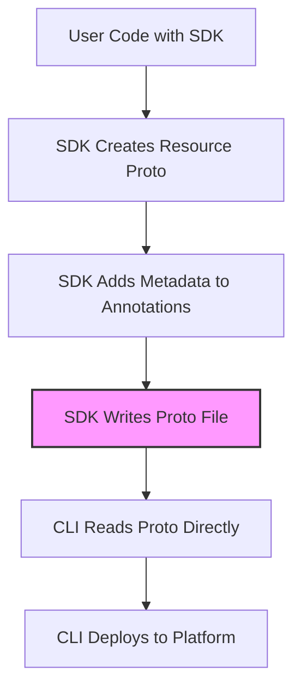

# SDK-CLI Contract for Stigmer Resources

This document defines how SDKs (Go, Python, TypeScript) communicate with the Stigmer CLI when deploying resources (Agents, Workflows, Skills, etc.).

## Architecture Overview

**Simplified Direct Proto Pattern** - SDKs write resource protos directly (Agent, Workflow, Skill) with SDK metadata in annotations. No manifest wrapper needed.



## Core Principle

**SDK writes platform protos directly with SDK metadata in annotations.**

No separate manifest proto, no conversion layer, no duplication. SDK and platform use the **exact same proto definitions**.

## SDK Metadata in Annotations

All SDK metadata goes into `metadata.annotations` using `stigmer.ai/sdk.*` namespace:

```protobuf
Agent {
  api_version: "agentic.stigmer.ai/v1"
  kind: "Agent"
  metadata: {
    name: "my-agent"
    annotations: {
      "stigmer.ai/sdk.language": "go"
      "stigmer.ai/sdk.version": "0.1.0"
      "stigmer.ai/sdk.project-name": "my-project"
      "stigmer.ai/sdk.generated-at": "1706789123"
      "stigmer.ai/sdk.path": "/usr/local/bin/stigmer"
      "stigmer.ai/sdk.host-environment": "darwin-arm64-go1.24.0"
    }
  }
  spec: {
    instructions: "You are a helpful assistant."
    // ... rest of spec
  }
}
```

### Standard SDK Annotations

| Annotation Key | Type | Description | Example |
|---|---|---|---|
| `stigmer.ai/sdk.language` | string | SDK language (required) | `"go"`, `"python"`, `"typescript"` |
| `stigmer.ai/sdk.version` | string | SDK version (required) | `"0.1.0"`, `"1.2.3-beta"` |
| `stigmer.ai/sdk.project-name` | string | User project name (optional) | `"my-agent-project"` |
| `stigmer.ai/sdk.generated-at` | string | Unix timestamp (optional) | `"1706789123"` |
| `stigmer.ai/sdk.path` | string | SDK executable path (optional) | `"/usr/local/bin/stigmer"` |
| `stigmer.ai/sdk.host-environment` | string | Host OS/arch/runtime (optional) | `"darwin-arm64-go1.24.0"` |

## Resource Types

All SDK-creatable resources follow the same pattern:

### Agent

```protobuf
Agent {
  api_version: "agentic.stigmer.ai/v1"
  kind: "Agent"
  metadata: {
    name: "code-reviewer"
    annotations: {
      "stigmer.ai/sdk.language": "go"
      "stigmer.ai/sdk.version": "0.1.0"
    }
  }
  spec: {
    instructions: "Review code for best practices"
    mcp_servers: [ ... ]
    skill_refs: [ ... ]
  }
}
```

**SDK writes**: `agent.pb` (or `agents.pb` for multiple)  
**CLI reads**: Agent proto directly

### Workflow

```protobuf
Workflow {
  api_version: "agentic.stigmer.ai/v1"
  kind: "Workflow"
  metadata: {
    name: "data-pipeline"
    namespace: "production"
    version: "1.0.0"
    annotations: {
      "stigmer.ai/sdk.language": "python"
      "stigmer.ai/sdk.version": "0.2.0"
    }
  }
  spec: {
    tasks: [ ... ]
  }
}
```

**SDK writes**: `workflow.pb` (or `workflows.pb` for multiple)  
**CLI reads**: Workflow proto directly

### Skill

```protobuf
Skill {
  api_version: "agentic.stigmer.ai/v1"
  kind: "Skill"
  metadata: {
    name: "coding-standards"
    annotations: {
      "stigmer.ai/sdk.language": "go"
      "stigmer.ai/sdk.version": "0.1.0"
    }
  }
  spec: {
    description: "Company coding standards"
    markdown_content: "# Coding Standards\n..."
  }
}
```

**SDK writes**: `skill.pb` (or `skills.pb` for multiple)  
**CLI reads**: Skill proto directly

## Multiple Resources

SDKs can create multiple resources in a single execution:

### Option 1: One file per resource

```
agent-code-reviewer.pb
agent-security-scanner.pb
workflow-deploy-pipeline.pb
skill-coding-standards.pb
```

Each file contains a single resource proto.

### Option 2: Multiple resources in one file

```
resources.pb
```

Contains an array of resources (repeated messages in protobuf).

### Option 3: Grouped by type

```
agents.pb        # repeated Agent
workflows.pb     # repeated Workflow
skills.pb        # repeated Skill
```

## SDK Implementation

### Go SDK Example

```go
package main

import (
    "context"
    "fmt"
    "time"
    
    agentpb "github.com/stigmer/stigmer/apis/stubs/go/ai/stigmer/agentic/agent/v1"
    apiresource "github.com/stigmer/stigmer/apis/stubs/go/ai/stigmer/commons/apiresource"
    "github.com/stigmer/stigmer/sdk/go/agent"
    "github.com/stigmer/stigmer/sdk/go/stigmer"
    "google.golang.org/protobuf/proto"
)

func main() {
    defer stigmer.Complete()
    
    // SDK-friendly API
    a, _ := agent.New(
        agent.WithName("code-reviewer"),
        agent.WithInstructions("Review code for best practices"),
    )
    
    // Convert to proto (happens internally)
    agentProto := &agentpb.Agent{
        ApiVersion: "agentic.stigmer.ai/v1",
        Kind: "Agent",
        Metadata: &apiresource.ApiResourceMetadata{
            Name: "code-reviewer",
            Annotations: map[string]string{
                "stigmer.ai/sdk.language":        "go",
                "stigmer.ai/sdk.version":         "0.1.0",
                "stigmer.ai/sdk.generated-at":    fmt.Sprintf("%d", time.Now().Unix()),
                "stigmer.ai/sdk.host-environment": "darwin-arm64-go1.24.0",
            },
        },
        Spec: &agentpb.AgentSpec{
            Instructions: "Review code for best practices",
        },
    }
    
    // Write to file
    data, _ := proto.Marshal(agentProto)
    os.WriteFile("agent.pb", data, 0644)
}
```

### Python SDK Example

```python
import time
import platform
from stigmer.apis.stubs.python.ai.stigmer.agentic.agent.v1 import api_pb2
from stigmer.apis.stubs.python.ai.stigmer.commons.apiresource import metadata_pb2
from stigmer.sdk.python.agent import Agent

def main():
    # SDK-friendly API
    a = Agent(
        name="code-reviewer",
        instructions="Review code for best practices",
    )
    
    # Convert to proto (happens internally)
    agent_proto = api_pb2.Agent(
        api_version="agentic.stigmer.ai/v1",
        kind="Agent",
        metadata=metadata_pb2.ApiResourceMetadata(
            name="code-reviewer",
            annotations={
                "stigmer.ai/sdk.language": "python",
                "stigmer.ai/sdk.version": "0.1.0",
                "stigmer.ai/sdk.generated-at": str(int(time.time())),
                "stigmer.ai/sdk.host-environment": f"{platform.system().lower()}-{platform.machine()}",
            },
        ),
        spec=api_pb2.AgentSpec(
            instructions="Review code for best practices",
        ),
    )
    
    # Write to file
    with open("agent.pb", "wb") as f:
        f.write(agent_proto.SerializeToString())

if __name__ == "__main__":
    main()
```

## CLI Implementation

### Reading Resources

CLI reads proto files directly (no conversion needed):

```go
// Read Agent proto
data, _ := os.ReadFile("agent.pb")
agent := &agentpb.Agent{}
proto.Unmarshal(data, agent)

// SDK metadata is in annotations
sdkLanguage := agent.Metadata.Annotations["stigmer.ai/sdk.language"]
sdkVersion := agent.Metadata.Annotations["stigmer.ai/sdk.version"]

// Deploy to platform (agent is already in platform format!)
client.CreateAgent(ctx, &agentpb.CreateAgentRequest{
    Agent: agent,
})
```

### Platform Enrichment

CLI fills in platform-managed fields before deployment:

```go
// Enrich metadata with platform-specific fields
agent.Metadata.Id = generateId()              // Platform generates ID
agent.Metadata.Org = currentOrg               // From CLI context
agent.Metadata.OwnerScope = ownerScope        // From CLI context
agent.Status = &agentpb.AgentStatus{          // Platform status
    Audit: createAuditInfo(),
}
```

## File Naming Conventions

### Single Resource

```
agent.pb
workflow.pb
skill.pb
```

### Multiple Resources of Same Type

```
agents.pb           # repeated Agent
workflows.pb        # repeated Workflow
skills.pb           # repeated Skill
```

### Multiple Resources of Different Types

```
resources.pb        # mixed types (requires type detection)
```

Or separate files:

```
agent-reviewer.pb
agent-scanner.pb
workflow-pipeline.pb
```

## Benefits

1. **Zero Duplication** - SDK and platform use identical protos
2. **No Conversion Logic** - CLI reads what SDK writes
3. **Standard Pattern** - Annotations for metadata (Kubernetes-style)
4. **Simpler SDK** - No manifest wrapper to manage
5. **Easier Debugging** - Proto files match platform format exactly
6. **Better IDE Support** - SDKs work directly with platform types

## Migration from Manifest Pattern

**Old (with manifest.proto)**:
```protobuf
AgentManifest {
  sdk_metadata: { language: "go", version: "0.1.0" }
  agents: [
    AgentBlueprint { name: "my-agent", instructions: "..." }
  ]
}
```

**New (direct proto with annotations)**:
```protobuf
Agent {
  metadata: {
    name: "my-agent"
    annotations: {
      "stigmer.ai/sdk.language": "go"
      "stigmer.ai/sdk.version": "0.1.0"
    }
  }
  spec: { instructions: "..." }
}
```

**Changes**:
- ❌ Deleted `manifest.proto` files
- ❌ Deleted `sdk/metadata.proto`
- ✅ SDK writes Agent/Workflow/Skill directly
- ✅ SDK metadata in annotations
- ✅ CLI reads protos directly

## Version History

**v2 (2026-01-22)**: Simplified to direct proto pattern with annotations  
**v1 (2026-01-13)**: Original manifest wrapper pattern (deprecated)

---

**Maintainer**: Stigmer Team
