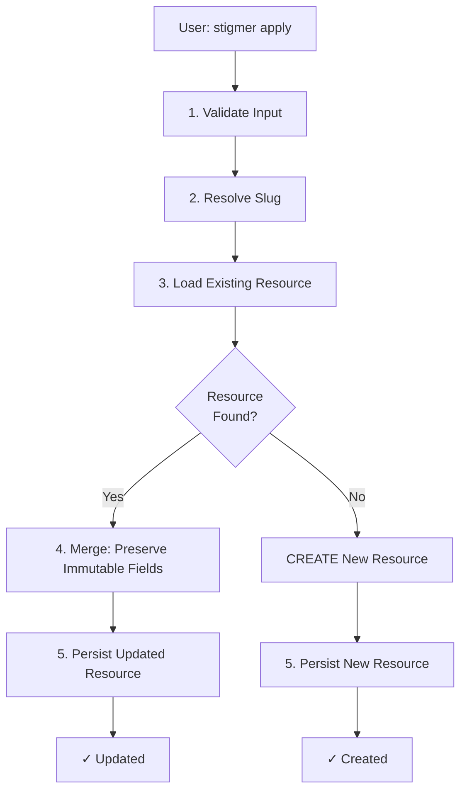

# Update Pipeline and Immutable Fields

How Stigmer's update pipeline preserves resource identity while allowing property modifications.

## Overview

When you run `stigmer apply` a second time, Stigmer needs to determine whether to **CREATE** new resources or **UPDATE** existing ones. This document explains how the update pipeline works and why certain fields are immutable while others can be modified.

## The Core Problem

```bash
# First apply - creates resources
stigmer apply
✓ Agent deployed: pr-reviewer (ID: agt-123...)

# Second apply - should UPDATE, not recreate  
stigmer apply
✓ Agent deployed: pr-reviewer (ID: agt-123...)  ← Same ID = UPDATE
```

The challenge: How do we merge the new configuration with the existing resource while preserving identity and ownership?

## Immutable vs Mutable Fields

### Immutable Fields (Never Change After Creation)

These fields establish resource **identity** and **ownership**:

**`metadata.id`**
- Unique resource identifier
- Generated once at creation
- Never changes
- Used for lookups, references, and relationships

**`metadata.slug`**  
- URL-safe identifier derived from **original** name
- Generated once from the first name provided
- Never changes, even if name is updated later
- Used in URLs, CLI commands, and as a stable reference
- Example: Name changes from "My Agent" → "My Cool Agent", slug stays "my-agent"

**`metadata.org`**
- Organization ownership
- Set at creation based on auth context
- Never changes (prevents unauthorized ownership transfers)
- Critical for multi-tenant security

### Mutable Fields (Can Change)

These fields represent resource **properties** and **configuration**:

**`metadata.name`**
- Human-readable display name
- **CAN be updated** (unlike slug which is immutable)
- Changes don't affect slug or references
- Example: Update "My Agent" → "My Awesome Agent"

**`metadata.title`**
- Optional display title
- Fully mutable

**`metadata.description`**
- Resource description
- Fully mutable

**`metadata.labels`, `metadata.tags`**
- User-defined metadata
- Fully mutable

**`spec.*`** (all spec fields)
- Resource configuration
- Fully mutable (depends on resource type)
- Example: Agent instructions, workflow steps, etc.

## Why This Distinction Matters

### Scenario 1: Name Update

```yaml
# Original resource
metadata:
  id: "agt-123"
  name: "code-reviewer"
  slug: "code-reviewer"  # Derived from original name
  org: "acme"

# User updates name
metadata:
  id: "agt-123"  
  name: "pr-reviewer"  # ← Changed
  slug: "code-reviewer"  # ← MUST stay the same!
  org: "acme"
```

**Why slug stays the same**:
- URLs don't break: `/agents/code-reviewer` still works
- CLI commands work: `stigmer agent get code-reviewer`  
- References remain valid: Other resources referencing this agent don't break
- Stable identifier for the resource's lifetime

### Scenario 2: Unauthorized Org Change Attempt

```yaml
# Existing resource (owned by "acme")
metadata:
  id: "agt-123"
  slug: "code-reviewer"  
  org: "acme"  # Original owner

# Attacker tries to change ownership
metadata:
  org: "attacker-org"  # ← Ignored!

# After update
metadata:
  org: "acme"  # ← Preserved from existing
```

**Why org is preserved**: Prevents unauthorized ownership transfers.

## Update Pipeline Flow

### High-Level Overview



### Detailed Steps

#### 1. Validate Input

```go
// ValidateProtoStep validates field constraints
func (s *ValidateProtoStep) Execute(ctx *RequestContext) error {
    // Validate using buf-validate rules defined in proto
    return validateProto(ctx.Input())
}
```

**What it checks**:
- Required fields are present
- Field constraints are satisfied (min/max lengths, patterns, etc.)
- Proto validation rules pass

#### 2. Resolve Slug

```go
// ResolveSlugStep generates slug from name (if not already set)
func (s *ResolveSlugStep) Execute(ctx *RequestContext) error {
    metadata := ctx.Input().GetMetadata()
    
    if metadata.Slug != "" {
        return nil  // Already set (idempotent)
    }
    
    // Generate from name: "My Agent" → "my-agent"
    metadata.Slug = generateSlug(metadata.Name)
    return nil
}
```

**Purpose**: Ensure every resource has a slug for lookups.

**Idempotent**: If slug already exists (from existing resource), keeps it.

#### 3. Load Existing Resource

```go
// LoadForApplyStep attempts to find existing resource
func (s *LoadForApplyStep) Execute(ctx *RequestContext) error {
    slug := ctx.Input().GetMetadata().GetSlug()
    
    existing, err := s.store.FindBySlug(ctx, slug)
    if err != nil {
        return err
    }
    
    if existing != nil {
        // Found - this is an UPDATE
        ctx.Set(ExistingResourceKey, existing)
        ctx.Set(ShouldCreateKey, false)
    } else {
        // Not found - this is a CREATE
        ctx.Set(ShouldCreateKey, true)
    }
    
    return nil
}
```

**Key insight**: Lookup is by **slug**, not name, because slug is stable.

#### 4. Merge: Preserve Immutable Fields

This is the **critical step** where immutability is enforced:

```go
// BuildUpdateStateStep merges input with existing
func (s *BuildUpdateStateStep) Execute(ctx *RequestContext) error {
    input := ctx.Input()
    existing := ctx.Get(ExistingResourceKey)
    
    // Start with input (user's desired state)
    merged := proto.Clone(input)
    
    // Preserve immutable fields from existing
    preserveImmutableFields(merged, existing)
    
    // Clear status (system-managed)
    clearStatusField(merged)
    
    // Set audit fields (timestamps, actors)
    updateAuditFields(merged, existing)
    
    ctx.SetNewState(merged)
    return nil
}

func preserveImmutableFields(merged, existing Resource) error {
    mergedMeta := merged.GetMetadata()
    existingMeta := existing.GetMetadata()
    
    // Preserve immutable identifiers
    mergedMeta.Id = existingMeta.Id      // Identity
    mergedMeta.Slug = existingMeta.Slug  // Stable reference
    mergedMeta.Org = existingMeta.Org    // Ownership
    
    // Note: Name is NOT preserved - it can be updated!
    // Note: Spec is NOT preserved - it comes from input (desired state)
    
    return nil
}
```

**What happens**:
1. User's input provides new values for mutable fields (name, spec, etc.)
2. Existing resource provides values for immutable fields (id, slug, org)
3. Merged result has:
   - Identity and ownership from existing (preserved)
   - Properties and configuration from input (updated)

#### 5. Persist Updated Resource

```go
// PersistStep saves the updated resource
func (s *PersistStep) Execute(ctx *RequestContext) error {
    resource := ctx.NewState()
    kind := apiresourceinterceptor.GetApiResourceKind(ctx)
    id := resource.GetMetadata().GetId()
    
    return s.store.SaveResource(ctx, kind, id, resource)
}
```

**Result**: Resource updated in database with preserved identity and new properties.

## Example: Full Update Flow

### Initial State (First Apply)

```yaml
# User's code defines agent
stigmer.agent(
    name="code-reviewer",
    description="Reviews code for issues"
)
```

**First apply creates**:
```yaml
metadata:
  id: "agt-123"              # Generated
  name: "code-reviewer"       # From input
  slug: "code-reviewer"       # Generated from name
  org: "acme"                # From auth context
spec:
  description: "Reviews code for issues"
```

### Updated State (Second Apply)

```yaml
# User updates agent name and description
stigmer.agent(
    name="pr-reviewer",  # ← Changed name
    description="AI-powered PR reviewer"  # ← Changed description
)
```

**Second apply updates**:
```yaml
metadata:
  id: "agt-123"                # ← Preserved (immutable)
  name: "pr-reviewer"           # ← Updated (mutable)
  slug: "code-reviewer"         # ← Preserved (immutable - derived from ORIGINAL name)
  org: "acme"                  # ← Preserved (immutable)
spec:
  description: "AI-powered PR reviewer"  # ← Updated (mutable)
```

**Result**:
- ✅ Resource identity preserved (same ID)
- ✅ Slug stable (URLs don't break)
- ✅ Ownership secure (org unchanged)
- ✅ Properties updated (name, description)

## Java vs Go Implementation

Stigmer has both Java (backend services) and Go (CLI, agent-runner, workflow-runner) implementations. Both **must** implement identical update semantics.

### Java Implementation

```java
// UpdateOperationPreserveResourceIdentifiersStepV2.java
public RequestPipelineStepResultV2 execute(UpdateContextV2<T> context) {
    var existingResource = context.getExistingResource();
    var newResourceState = context.getNewState();
    
    var existingResourceMetadata = ApiResourceMetadataRetriever.retrieve(existingResource);
    var newResourceMetadata = ApiResourceMetadataRetriever.retrieve(newResourceState);
    
    // Preserve critical fields from existing resource
    var preservedMetadata = newResourceMetadata.toBuilder()
            .setOrg(existingResourceMetadata.getOrg())      // Immutable
            .setSlug(existingResourceMetadata.getSlug())    // Immutable
            .setId(existingResourceMetadata.getId()).build(); // Immutable
    
    var updatedNewResourceState = ApiResourceMetadataSetter.set(newResourceState, preservedMetadata);
    context.setNewState(updatedNewResourceState);
    
    return RequestPipelineStepResultV2.success(getName());
}
```

### Go Implementation

```go
// build_update_state.go
func preserveImmutableFields(merged, existing proto.Message) error {
    mergedMetadata := merged.(HasMetadata).GetMetadata()
    existingMetadata := existing.(HasMetadata).GetMetadata()
    
    // Preserve immutable identifiers (matching Java implementation)
    mergedMetadata.Id = existingMetadata.Id      // Immutable
    mergedMetadata.Slug = existingMetadata.Slug  // Immutable
    mergedMetadata.Org = existingMetadata.Org    // Immutable
    
    // Note: metadata.name is NOT preserved - it can be updated by the client!
    
    return nil
}
```

**Critical Alignment**: Both implementations preserve exactly the same fields and allow the same updates.

## Common Pitfalls

### Pitfall 1: Preserving Name Instead of Slug

**❌ Wrong**:
```go
// This prevents name updates!
mergedMeta.Name = existingMeta.Name
```

**✅ Correct**:
```go
// Name is mutable, slug is immutable
mergedMeta.Slug = existingMeta.Slug
// Name comes from input (not preserved)
```

### Pitfall 2: Forgetting to Preserve Org

**❌ Wrong**:
```go
// This allows unauthorized org changes!
mergedMeta.Id = existingMeta.Id
mergedMeta.Slug = existingMeta.Slug
// Org not preserved - SECURITY ISSUE!
```

**✅ Correct**:
```go
mergedMeta.Id = existingMeta.Id
mergedMeta.Slug = existingMeta.Slug
mergedMeta.Org = existingMeta.Org  // Security: preserve ownership
```

### Pitfall 3: Only Testing Create Path

**❌ Insufficient Test**:
```bash
stigmer apply  # First apply - tests CREATE path
# Stop here - bug not detected!
```

**✅ Proper Test**:
```bash
stigmer apply  # First apply - CREATE
stigmer apply  # Second apply - UPDATE (tests field preservation)
```

**Why**: Bugs in field preservation only manifest on second apply (UPDATE path).

## Debugging Update Issues

### Symptom: Second Apply Fails with "Already Exists"

```bash
stigmer apply  # First apply succeeds
stigmer apply  # Second apply fails: "resource already exists"
```

**Diagnosis**: LoadForApplyStep is not finding existing resource, so it tries CREATE instead of UPDATE.

**Common Causes**:
1. Slug not being preserved (resources stored with empty slug)
2. Slug lookup failing (database query issue)
3. Resources created without slug initially

**Fix**: Ensure slug is preserved in `preserveImmutableFields`.

### Symptom: Name Updates Don't Work

```bash
# Update agent name in code
stigmer apply
# Name unchanged in database
```

**Diagnosis**: Name is being preserved from existing (treated as immutable).

**Fix**: Remove name from `preserveImmutableFields` - name should be mutable.

### Symptom: Organization Changes on Update

```bash
# Original resource belongs to "acme"
# After update, resource belongs to different org
```

**Diagnosis**: Org is not being preserved (security issue!).

**Fix**: Add org to `preserveImmutableFields` - org must be immutable.

## Enable Debug Logging

To troubleshoot update pipeline issues:

```bash
# Set log level to debug
export LOG_LEVEL=debug

# Start server with debug logging
stigmer server start

# In another terminal
stigmer apply

# Check logs for field preservation
tail -f ~/.stigmer/data/logs/stigmer-server.log | grep "LoadForApply\|preserveImmutable"
```

**What to look for**:
```
[DEBUG] LoadForApply: Looking for existing resource with slug: my-agent
[DEBUG] LoadForApply: Resource found, will update
[DEBUG] BuildUpdateState: Preserving immutable fields
```

## Best Practices

### For Contributors

When implementing new resource types:

1. **Use the standard pipeline steps** - Don't reimplement field preservation
2. **Test the update path** - Run apply twice to verify updates work
3. **Preserve identity fields** - ID, Slug, Org must be immutable
4. **Allow property updates** - Name, spec fields should be mutable
5. **Match Java semantics** - If implementing in Go, align with Java behavior

### For Users

When defining resources:

1. **Name is your display label** - Feel free to change it
2. **Slug is your stable identifier** - Use it in URLs, CLI commands
3. **Apply is idempotent** - Running multiple times is safe
4. **Second apply updates** - It doesn't recreate resources

## Related Concepts

**Create vs Update**:
- Create: Resource doesn't exist, generate ID and slug, set ownership
- Update: Resource exists, preserve identity, update properties

**Idempotent Apply**:
- First apply: Create resources
- Subsequent applies: Update resources
- Same outcome regardless of how many times you apply

**Slug Generation**:
- Derived from **original** name at creation time
- Never regenerated, even if name changes
- Ensures stable references and URLs

## Further Reading

- [Request Pipeline Context Design](request-pipeline-context-design.md) - Pipeline architecture
- [Backend Abstraction](backend-abstraction.md) - Backend interface design
- [Deploying with Apply](../guides/deploying-with-apply.md) - User guide for stigmer apply

---

**Key Takeaway**: Immutable fields (ID, Slug, Org) preserve resource **identity and ownership**. Mutable fields (Name, Spec) represent **properties and configuration** that can evolve over time. The update pipeline enforces this distinction to ensure stable references while allowing meaningful updates.
