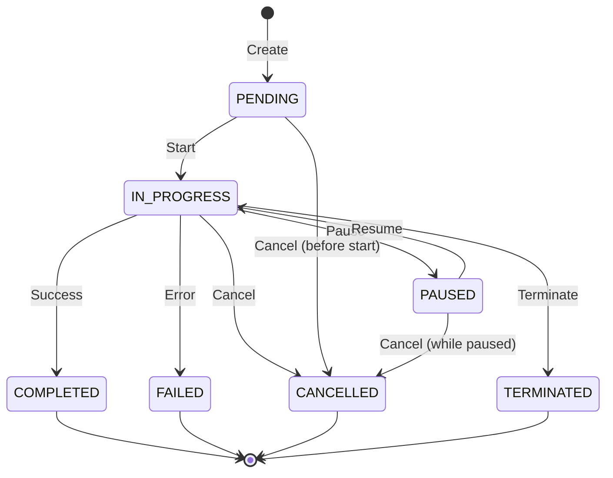
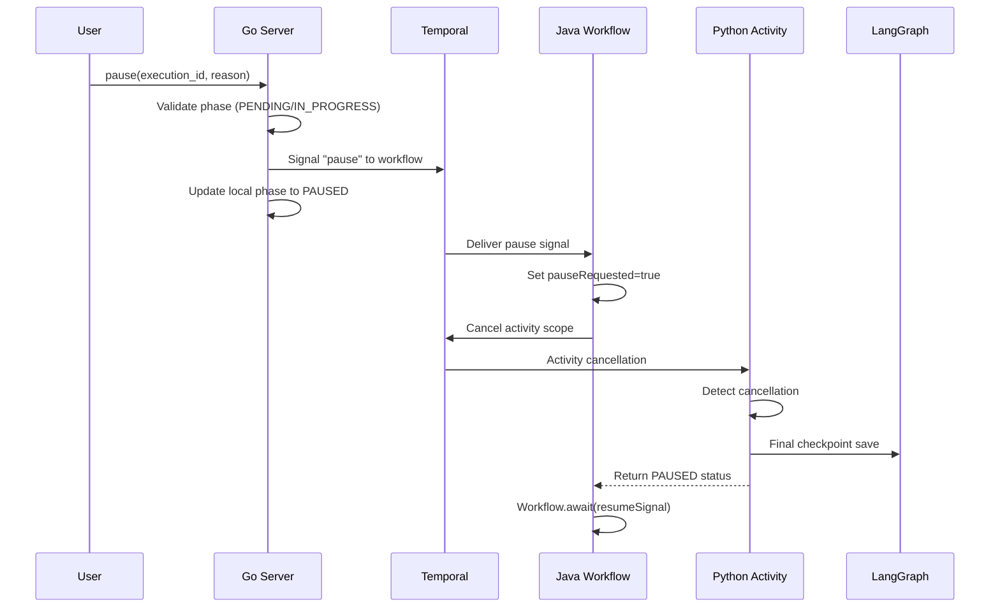
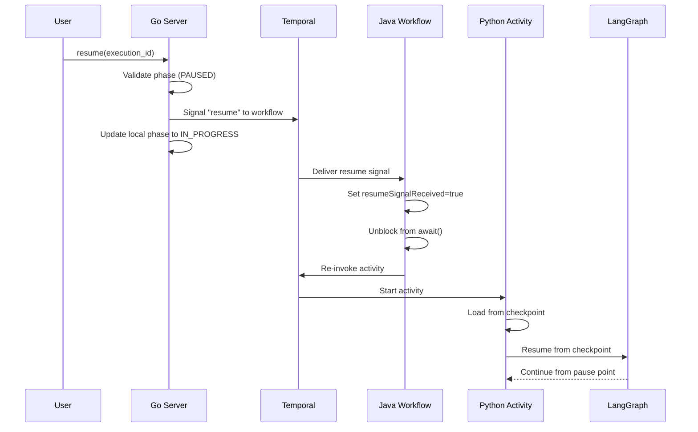

# Workflow Execution Lifecycle

Workflow executions in Stigmer follow a well-defined lifecycle with multiple phases and lifecycle commands. This document explains how workflows transition between phases, what each lifecycle command does, and how pause/resume enables temporary workflow suspension with full checkpoint preservation.

## Purpose

Understanding the workflow execution lifecycle is essential for:
- **Users**: Knowing when to pause vs cancel vs terminate workflows
- **Operators**: Monitoring workflow health and troubleshooting issues
- **Developers**: Building features that interact with workflow state

## Execution Phases

Workflow executions progress through the following phases:



### Phase Descriptions

#### PENDING
- **Description**: Workflow created but not yet started by Temporal
- **Duration**: Typically milliseconds to seconds
- **Can transition to**: IN_PROGRESS, CANCELLED
- **Characteristics**: Initial state, no compute resources consumed yet

#### IN_PROGRESS
- **Description**: Workflow is actively executing tasks
- **Duration**: Variable (seconds to hours/days)
- **Can transition to**: PAUSED, COMPLETED, FAILED, CANCELLED, TERMINATED
- **Characteristics**: Active execution, consuming compute resources

#### PAUSED
- **Description**: Workflow temporarily suspended by user, can be resumed
- **Duration**: Variable (user-controlled)
- **Can transition to**: IN_PROGRESS (via resume), CANCELLED
- **Characteristics**: Non-terminal state, checkpoint saved, no compute consumed

#### COMPLETED
- **Description**: Workflow finished successfully
- **Terminal**: Yes (no further transitions)
- **Characteristics**: Final state, all tasks completed successfully

#### FAILED
- **Description**: Workflow failed due to error
- **Terminal**: Yes (no further transitions)
- **Characteristics**: Final state, error captured in status

#### CANCELLED
- **Description**: Workflow cancelled gracefully by user
- **Terminal**: Yes (no further transitions)
- **Characteristics**: Final state, cleanup allowed before termination

#### TERMINATED
- **Description**: Workflow forcefully terminated (immediate kill)
- **Terminal**: Yes (no further transitions)
- **Characteristics**: Final state, no cleanup, immediate stop

## Lifecycle Commands

### Create
- **Purpose**: Initialize new workflow execution
- **Valid from phases**: N/A (creates new execution)
- **Results in phase**: PENDING
- **Use case**: Start a new workflow

### Cancel
- **Purpose**: Stop workflow gracefully with cleanup
- **Valid from phases**: PENDING, IN_PROGRESS, PAUSED
- **Results in phase**: CANCELLED
- **Use case**: User decided not to continue, wants cleanup activities to run
- **Behavior**: Allows graceful shutdown, cleanup handlers execute

### Terminate
- **Purpose**: Stop workflow immediately without cleanup
- **Valid from phases**: PENDING, IN_PROGRESS, PAUSED
- **Results in phase**: TERMINATED
- **Use case**: Emergency stop, workflow is misbehaving
- **Behavior**: Immediate forceful shutdown, no cleanup

### Pause ⭐ New
- **Purpose**: Temporarily suspend workflow with checkpoint
- **Valid from phases**: PENDING, IN_PROGRESS
- **Results in phase**: PAUSED
- **Use case**: Maintenance window, review progress, resource conservation
- **Behavior**: Graceful suspension with checkpoint save, can resume later

### Resume ⭐ New
- **Purpose**: Continue paused workflow from checkpoint
- **Valid from phases**: PAUSED
- **Results in phase**: IN_PROGRESS
- **Use case**: Resume after maintenance, continue after review
- **Behavior**: Loads checkpoint and continues from pause point

### Recover
- **Purpose**: Retry failed workflow execution
- **Valid from phases**: FAILED
- **Results in phase**: IN_PROGRESS
- **Use case**: Transient failure resolved, retry the workflow
- **Behavior**: Restarts workflow, may resume from checkpoint if available

## Pause vs Cancel vs Terminate

Understanding when to use each command:

| Aspect | Pause | Cancel | Terminate |
|--------|-------|--------|-----------|
| **Intent** | Temporary stop | Permanent stop | Emergency stop |
| **Cleanup** | Yes (checkpoint save) | Yes (cleanup handlers) | No (immediate kill) |
| **Resumable** | ✅ Yes | ❌ No | ❌ No |
| **Terminal** | ❌ No | ✅ Yes | ✅ Yes |
| **Data loss** | None (checkpoint preserved) | Possible (depends on cleanup) | Likely (no cleanup) |
| **Use case** | Maintenance, review, conserve resources | User cancelled task | Runaway workflow |

### When to Use Pause
- **Maintenance windows**: Pause workflows before infrastructure maintenance
- **Progress review**: Pause to review intermediate results before continuing
- **Resource management**: Pause idle workflows to conserve compute
- **External dependencies**: Pause while waiting for external conditions
- **Multi-day workflows**: Pause overnight, resume in the morning

### When to Use Cancel
- **User decision**: User decides not to continue the workflow
- **Requirements changed**: Workflow no longer needed
- **Cleanup needed**: Want cleanup activities to execute (close resources, etc.)
- **Normal termination**: Standard way to stop a workflow permanently

### When to Use Terminate
- **Emergency stop**: Workflow consuming too many resources
- **Misbehaving workflow**: Workflow stuck in infinite loop
- **Security issue**: Workflow doing something it shouldn't
- **Immediate stop needed**: No time for graceful shutdown

## Pause/Resume Architecture

Pause and resume leverage three key technologies:

1. **Temporal Signals**: Communication between Go server and Java workflow
2. **CancellationScope**: Graceful activity cancellation in Java workflow
3. **LangGraph Checkpoints**: State persistence and resume in Python activity

### Pause Flow



**Key Points:**
- Pause is **graceful** - activity finishes current step before stopping
- Checkpoint is **automatically saved** by LangGraph
- Workflow **waits** for resume signal (doesn't terminate)
- **No data loss** - all progress preserved in checkpoint

### Resume Flow



**Key Points:**
- Resume **re-invokes activity** with same execution context
- Activity uses **same thread_id** to load checkpoint
- LangGraph **automatically resumes** from saved checkpoint
- Agent **continues from exact pause point** (not from beginning)

## Checkpoint Preservation

LangGraph provides automatic checkpointing that preserves:
- **Agent state**: Current conversation context, variables, memory
- **Tool history**: Which tools were called and their results
- **Step counter**: Where in the workflow the pause occurred
- **Messages**: All conversation messages up to pause point

When paused:
1. LangGraph saves checkpoint after completing current step
2. thread_id preserved in heartbeat for resume
3. Activity returns PAUSED status (not failure)
4. Workflow awaits resume signal

When resumed:
1. Activity detects resume and loads checkpoint by thread_id
2. LangGraph restores full agent state
3. Agent continues from next step (not from beginning)
4. No conversation context lost

## Idempotency

All lifecycle commands are idempotent:

| Command | Current Phase | Behavior |
|---------|--------------|----------|
| pause | PAUSED | No-op, returns current state |
| pause | IN_PROGRESS | Sends pause signal, returns PAUSED |
| pause | COMPLETED/FAILED | Validation error (terminal state) |
| resume | IN_PROGRESS | No-op, returns current state |
| resume | PAUSED | Sends resume signal, returns IN_PROGRESS |
| resume | COMPLETED/FAILED | Validation error (terminal state) |

This ensures:
- Safe retry of lifecycle commands
- No unintended side effects from duplicate calls
- Clear error messages for invalid transitions

## Implementation Components

### Proto API (stigmer repo)
- `EXECUTION_PAUSED` phase in `workflowexecution/v1/enum.proto`
- `pause()` and `resume()` RPCs in `command.proto`
- `PauseWorkflowExecutionInput` and `ResumeWorkflowExecutionInput` in `io.proto`

### Go Server (stigmer repo)
- `ValidatePausableStep`: Validates PENDING/IN_PROGRESS, handles idempotency
- `ValidateResumableStep`: Validates PAUSED, handles idempotency
- `SignalPauseToTemporalStep`: Sends "pause" signal via Temporal client
- `SignalResumeToTemporalStep`: Sends "resume" signal via Temporal client
- `pause.go`: Handler with validation → signal → update → persist pipeline
- `resume.go`: Handler with validation → signal → update → persist pipeline

### Java Workflow (stigmer-cloud repo)
- Signal handlers: `@SignalMethod void pause(String reason)` and `resume()`
- State management: `pauseRequested`, `resumeSignalReceived` flags
- CancellationScope wrapping activity invocation
- Pause/resume loop in `executeWorkflowFlow()`
- `Workflow.await()` for resume signal

### Python Activity (stigmer repo)
- Cancellation detection: `if activity.is_cancelled()`
- Graceful handler: `except asyncio.CancelledError`
- PAUSED status reporting
- Heartbeat with paused flag
- LangGraph automatic checkpoint on cancellation

## Usage Examples

### Pause a running workflow
```bash
stigmer workflow pause exec-abc123 --reason "Maintenance window"
```

### Resume a paused workflow
```bash
stigmer workflow resume exec-abc123
```

### Check workflow status
```bash
stigmer workflow get exec-abc123
# Shows phase: PAUSED
```

## Monitoring and Observability

Lifecycle phase changes are:
- **Persisted** to database with timestamp
- **Broadcast** via real-time streaming API
- **Logged** to workflow execution history

Monitor workflow lifecycle:
```bash
# Watch workflow status changes
stigmer workflow status exec-abc123 --follow

# View execution history
stigmer workflow history exec-abc123
```

## Scope and Limitations

**Current scope (implemented):**
- ✅ Workflow execution pause/resume
- ✅ Proto API definitions
- ✅ Go server handlers
- ✅ Java workflow orchestration
- ✅ Python activity cancellation

**Not yet implemented (follow-up):**
- ⏸️ Agent execution pause/resume (direct agent invocations)
- ⏸️ Agent execution cancel/terminate/recover
- ⏸️ Signal handlers for agent workflows

The Python activity cancellation handling implemented for workflow executions is shared code and will work for agent executions once their lifecycle commands are implemented.

## Related Documentation

- [Temporal Integration](temporal-integration.md) - Polyglot workflow orchestration
- [Backend Abstraction](backend-abstraction.md) - Backend lifecycle patterns
- [Durable Execution Guide](../guides/durable-execution.md) - Checkpoint and retry patterns

---

**Remember**: Pause is for temporary stops with resume intent. Cancel is for permanent stops with cleanup. Terminate is for emergency immediate stops. Choose the right command based on your intent and whether you need the workflow to continue later.
