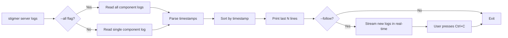
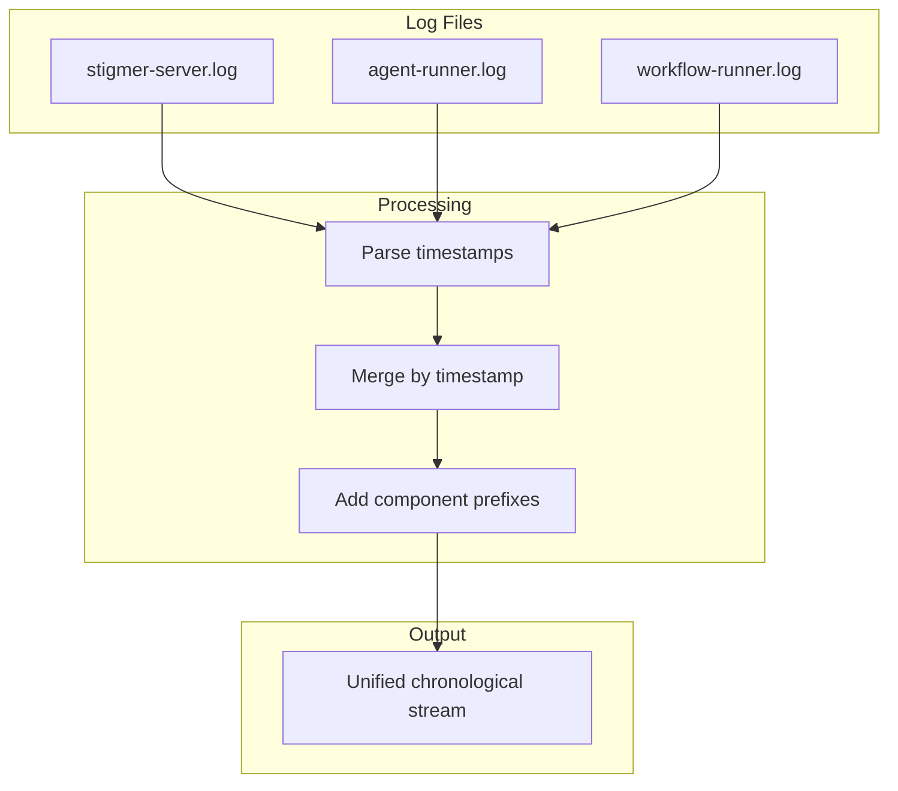
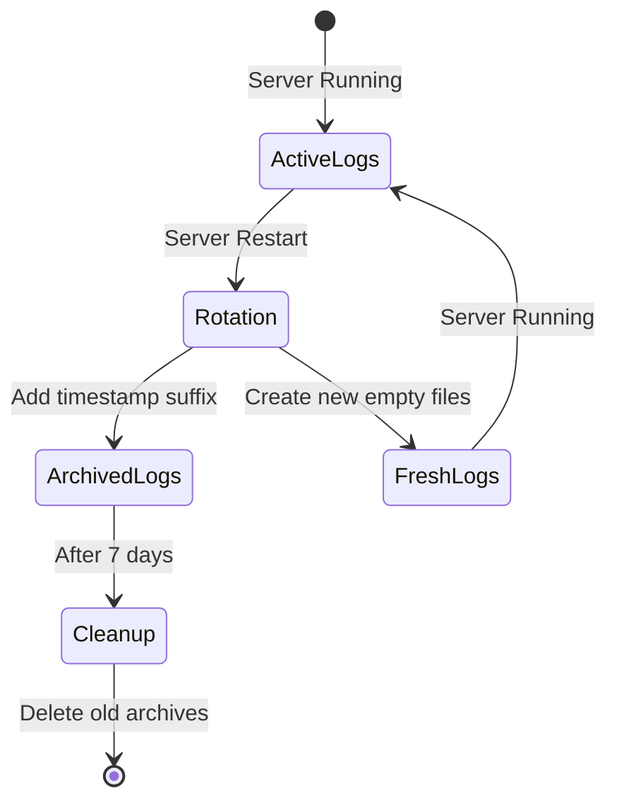

# Stigmer Server Logs

The `stigmer server logs` command provides Kubernetes-like log access for the Stigmer server daemon with unified log viewing, automatic rotation, and real-time streaming.

**Key Features (as of January 2026)**:
- **Unified viewing** - View logs from all components in a single stream with `--all`
- **Automatic rotation** - Logs are archived on restart with 7-day retention
- **Real-time streaming** - Follow logs as they're written (default behavior)
- **Component isolation** - View individual component logs with `-c` flag

## Quick Reference

```bash
# Stream logs in real-time (default, like kubectl logs -f)
# Shows last 50 lines + streams new logs
stigmer server logs

# View logs from ALL components in a single stream (unified view)
stigmer server logs --all

# Show all existing logs + stream new logs
stigmer server logs --tail=0

# Only show last 50 lines (no streaming)
stigmer server logs --follow=false

# View error logs (stderr) with streaming
stigmer server logs --stderr

# View all components' errors in unified stream
stigmer server logs --all --stderr

# View agent-runner logs with streaming
stigmer server logs --component agent-runner

# View workflow-runner logs with streaming
stigmer server logs --component workflow-runner

# Combine options
stigmer server logs -f -c agent-runner --stderr --tail 100
```

## How It Works

When you run `stigmer server logs`, it operates in two phases (Kubernetes-style):

1. **Phase 1 - Existing Logs**: Shows recent logs (last 50 lines by default, or specify with `--tail`)
2. **Phase 2 - Live Streaming**: Continuously streams new log lines as they're written

This gives you context (what happened before) while keeping you updated (what's happening now).



```bash
# Default: Show last 50 lines + stream new logs
$ stigmer server logs
ℹ Streaming logs from: ~/.stigmer/data/logs/stigmer-server.log (showing last 50 lines)
ℹ Press Ctrl+C to stop

[Last 50 lines of existing logs printed here]
[Then waits and streams new logs as they arrive]
^C  # Press Ctrl+C to stop
```

**To disable streaming** and only view existing logs:
```bash
stigmer server logs --follow=false
```

## Common Debugging Workflows

### Debugging Connection Failures

When `stigmer apply` fails with "Cannot connect to stigmer-server":

```bash
# Check if server is running
stigmer server status

# View server error logs
stigmer server logs --stderr

# Stream logs while reproducing issue
stigmer server logs --follow --stderr
```

### Debugging Agent Execution Issues

When AI agents fail or behave unexpectedly:

```bash
# View agent-runner logs
stigmer server logs --component agent-runner

# Stream agent errors in real-time
stigmer server logs -f -c agent-runner --stderr
```

### Debugging Workflow Execution Issues

When workflows fail during execution:

```bash
# View workflow-runner logs
stigmer server logs --component workflow-runner

# Stream workflow errors in real-time
stigmer server logs -f -c workflow-runner --stderr
```

### Monitoring Server Health

Keep an eye on server activity:

```bash
# Stream all server output
stigmer server logs --follow

# Watch for errors
stigmer server logs --follow --stderr
```

## Unified Log Viewing (All Components)

**As of January 2026**, you can view logs from all components in a single unified stream using the `--all` flag. This provides a complete picture of system-wide behavior, making it easier to understand how components interact and correlate events.

### How It Works

The `--all` flag interleaves logs from all three components (`server`, `agent-runner`, `workflow-runner`) sorted by timestamp, with component prefixes for easy identification:



```bash
$ stigmer server logs --all --tail 20 --follow=false

ℹ Showing last 20 lines from all components (interleaved by timestamp)

[agent-runner   ] 2026-01-20T18:04:48.567271Z  WARN Worker heartbeating configured
[workflow-runner] 2026/01/20 23:34:45 INFO  Started Worker Namespace default
[workflow-runner] 2026/01/20 23:34:45 INFO  Started Worker TaskQueue workflow_execution_runner
[server         ] 2026/01/20 23:34:46 INFO  gRPC server listening on :50051
[agent-runner   ] 2026/01/20 23:35:20 INFO  Connected to MCP server
[workflow-runner] 2026/01/20 23:35:21 INFO  Starting workflow validation
[workflow-runner] 2026/01/20 23:35:21 INFO  Step 1: Generating YAML from WorkflowSpec proto
[server         ] 2026/01/20 23:35:22 INFO  Workflow validation request received
```

### Why Use Unified Viewing?

**System-wide visibility**:
- See the complete picture of what's happening across all components
- Understand the flow of requests (server → workflow-runner → agent-runner)
- Correlate events by timestamp (what happened when across the system)

**Easier debugging**:
- No need to open three terminal windows
- Instantly see which component is logging what
- Track workflow execution across component boundaries

**Familiar UX**:
- Similar to `kubectl logs` with multiple pods
- Similar to `docker-compose logs` with multiple services
- Industry-standard log aggregation pattern

### Usage Examples

**View all component logs (last 50 lines + streaming)**:
```bash
stigmer server logs --all
```

**View last 100 lines from all components (no streaming)**:
```bash
stigmer server logs --all --tail 100 --follow=false
```

**Stream all error logs from all components**:
```bash
stigmer server logs --all --stderr -f
```

**Debug workflow execution across all components**:
```bash
# Terminal 1: Watch all logs in real-time
stigmer server logs --all -f

# Terminal 2: Execute workflow
stigmer apply

# See the complete flow:
# 1. [server] receives apply request
# 2. [workflow-runner] validates workflow
# 3. [agent-runner] executes agents
# 4. [workflow-runner] completes execution
# 5. [server] returns result
```

### Component Prefixes

Each log line shows its source component with a fixed-width prefix (15 characters):

| Prefix | Component | Description |
|--------|-----------|-------------|
| `[server         ]` | stigmer-server | Main daemon (gRPC API, database) |
| `[agent-runner   ]` | agent-runner | Python agent execution runtime |
| `[workflow-runner]` | workflow-runner | Go workflow execution runtime |

Fixed-width formatting ensures logs are aligned for easy scanning.

### Timestamp Handling

Stigmer automatically parses timestamps from different log formats:

- **Go logs** (workflow-runner): `2026/01/20 23:34:45`
- **Rust logs** (agent-runner): `2026-01-20T18:04:48.567271Z` (RFC3339)
- **Other formats**: RFC3339Nano, ISO8601, and more

Logs are sorted chronologically regardless of format. If timestamp parsing fails, the current time is used (shouldn't happen in practice).

### Streaming Mode

With `--all` and `--follow` (default), you get real-time unified log streaming:

```bash
$ stigmer server logs --all

ℹ Streaming logs from all components (interleaved by timestamp)
ℹ Press Ctrl+C to stop

[existing logs shown first, sorted by timestamp]
[then streams new logs from all components as they arrive]
```

The streaming implementation uses goroutines to tail all log files simultaneously, with a central channel for merging streams. This means you see logs from all components in (mostly) real-time chronological order.

### When to Use Unified vs Single Component

**Use `--all` (unified view) when:**
- Debugging workflow execution (spans multiple components)
- Understanding system-wide behavior
- Monitoring overall system health
- Investigating performance issues
- Learning how Stigmer works

**Use `-c component` (single component) when:**
- Debugging specific component issues
- Filtering noise from other components
- Following a specific component's execution
- Saving logs for a specific component

Both modes support the same flags (`--follow`, `--tail`, `--stderr`).

### Comparison with Multiple Terminals

**Before unified viewing** (3 terminals needed):
```bash
# Terminal 1
stigmer server logs -f

# Terminal 2  
stigmer server logs -f -c agent-runner

# Terminal 3
stigmer server logs -f -c workflow-runner

# Manual mental correlation required!
```

**With unified viewing** (1 terminal):
```bash
stigmer server logs --all -f

# Everything in one place, automatically sorted!
```

### Limitations

**Timestamp precision**:
- Logs are sorted by their logged timestamp (when the event occurred)
- For events that happen at the exact same millisecond, order may vary slightly
- In practice, this is rarely noticeable

**File-based streaming**:
- Logs must be written to disk first before they appear
- Very slight delay (100ms polling) compared to direct stdout
- Trade-off for reliable persistence and log rotation

**Missing timestamps**:
- If a log line has no parseable timestamp, it's assigned the current time
- This may cause slight reordering for malformed log lines
- Standard Stigmer components always include timestamps

## Command Options

| Flag | Short | Default | Description |
|------|-------|---------|-------------|
| `--follow` | `-f` | `true` | Stream logs in real-time (like `kubectl logs -f`). Use `--follow=false` to disable. |
| `--tail` | `-n` | `50` | Number of recent lines to show before streaming (`0` = all existing logs) |
| `--component` | `-c` | `server` | Component to view (`server`, `agent-runner`, or `workflow-runner`) |
| `--all` | | `false` | Show logs from all components in a single interleaved stream (sorted by timestamp) |
| `--stderr` | | `false` | Show error logs instead of stdout |

**⚠️ Behavior Changes (January 2026)**:
1. **Streaming by default**: `stigmer server logs` streams by default (Kubernetes-style). Shows existing logs first, then streams new ones continuously. Use `--follow=false` for view-only.
2. **Unified viewing**: New `--all` flag shows logs from all components in one stream, sorted by timestamp with component prefixes.

## Components

Stigmer server consists of three main components:

### `server` (default)
The main stigmer-server daemon that handles:
- gRPC API requests
- Database operations
- Workflow management
- Session handling

**Log files:**
- `~/.stigmer/data/logs/stigmer-server.log` - Standard output
- `~/.stigmer/data/logs/stigmer-server.err` - Error output

### `agent-runner`
The Python agent execution runtime that handles:
- AI agent execution
- LLM interactions
- Temporal workflow workers
- Tool execution

**Log files:**
- `~/.stigmer/data/logs/agent-runner.log` - Standard output
- `~/.stigmer/data/logs/agent-runner.err` - Error output

### `workflow-runner`
The Go workflow execution runtime that handles:
- Workflow validation
- Workflow execution
- Temporal activity workers
- Task orchestration

**Log files:**
- `~/.stigmer/data/logs/workflow-runner.log` - Standard output
- `~/.stigmer/data/logs/workflow-runner.err` - Error output

## Examples

### Example 1: First-time Setup Debugging

```bash
# Start server
stigmer server

# Server starts but immediate error
# Check what went wrong:
stigmer server logs --stderr
```

Output reveals the issue:
```
FATAL: [core] grpc: Server.RegisterService after Server.Serve
```

### Example 2: Monitoring Agent Execution (Unified View)

```bash
# Single terminal: Watch all components
stigmer server logs --all -f

# In another terminal: Run a workflow
stigmer apply
```

Watch the unified logs to see the complete flow:
```
[server         ] 2026/01/20 23:40:15 Received apply request
[workflow-runner] 2026/01/20 23:40:15 Starting workflow validation
[workflow-runner] 2026/01/20 23:40:15 Validation succeeded
[agent-runner   ] 2026-01-20T23:40:16 Starting agent execution
[agent-runner   ] 2026-01-20T23:40:17 Tool call: read_file
[workflow-runner] 2026/01/20 23:40:18 Workflow execution completed
[server         ] 2026/01/20 23:40:18 Apply succeeded
```

### Example 3: Finding Recent Errors (Unified View)

```bash
# Show last 100 error lines from all components in one stream
stigmer server logs --all --stderr --tail 100 --follow=false

# Or per-component if you prefer
stigmer server logs --stderr --tail 100
stigmer server logs -c agent-runner --stderr --tail 100
stigmer server logs -c workflow-runner --stderr --tail 100
```

## Comparison with Other Tools

If you're familiar with these tools, here's how `stigmer server logs` compares:

| Stigmer | Kubernetes | Docker Compose | Description |
|---------|-----------|--------|-------------|
| `stigmer server logs` | `kubectl logs -f pod-name` | `docker logs -f container` | Stream logs (default) |
| `stigmer server logs --all` | `kubectl logs -f pod-1 pod-2 pod-3` | `docker-compose logs -f` | All components unified |
| `stigmer server logs --follow=false` | `kubectl logs pod-name --follow=false` | `docker logs container` | View logs only (no streaming) |
| `stigmer server logs --tail=100` | `kubectl logs --tail=100 pod-name` | `docker logs --tail=100 container` | Last N lines + streaming |
| `stigmer server logs --tail=0` | `kubectl logs --tail=-1 pod-name` | `docker logs container` | All logs + streaming |
| `stigmer server logs -c agent-runner` | `kubectl logs pod -c container` | `docker-compose logs service` | Select component |

**Note**: Stigmer now matches Kubernetes behavior - streaming is the default, showing existing logs first then tailing new ones.

## Log Locations

All logs are stored in: `~/.stigmer/data/logs/`

```bash
$ ls -l ~/.stigmer/data/logs/
stigmer-server.log   # stigmer-server stdout
stigmer-server.err   # stigmer-server stderr  
agent-runner.log     # agent-runner stdout
agent-runner.err     # agent-runner stderr
workflow-runner.log  # workflow-runner stdout
workflow-runner.err  # workflow-runner stderr
temporal.log         # Temporal server logs (if managed)
```

You can also access these files directly if needed:

```bash
# Manual log access (before stigmer server logs existed)
tail -f ~/.stigmer/data/logs/stigmer-server.err
```

## Log Rotation

**As of January 2026**, Stigmer automatically rotates logs on server restart to prevent log bloat and provide clear session boundaries.

### How It Works

When you run `stigmer server start`, existing logs are automatically archived with timestamps:



**Before restart:**
```bash
~/.stigmer/data/logs/
  stigmer-server.log      (10 MB of accumulated logs)
  agent-runner.log        (5 MB of accumulated logs)
  workflow-runner.log     (8 MB of accumulated logs)
```

**After restart:**
```bash
~/.stigmer/data/logs/
  stigmer-server.log      (fresh empty log for new session)
  agent-runner.log        (fresh empty log for new session)
  workflow-runner.log     (fresh empty log for new session)
  stigmer-server.log.2026-01-20-150405  (previous session archived)
  agent-runner.log.2026-01-20-150405    (previous session archived)
  workflow-runner.log.2026-01-20-150405 (previous session archived)
```

### Archived Log Format

Archived logs use timestamp format: `filename.YYYY-MM-DD-HHMMSS`

**Example**: `stigmer-server.log.2026-01-20-150405`
- **Date**: 2026-01-20 (January 20, 2026)
- **Time**: 15:04:05 (3:04:05 PM)
- **Session**: Server restart at this exact time

This makes it easy to:
- Identify when logs are from
- Find logs for a specific session
- Correlate with events or issues

### Retention Policy

**Automatic cleanup**: Archived logs older than **7 days** are automatically deleted on restart.

**Why 7 days?**
- Balances disk space with debugging needs
- Industry standard for development environments
- Sufficient window for investigating recent issues

### Working with Archived Logs

**View archived logs:**
```bash
# List archived logs
ls -lh ~/.stigmer/data/logs/*.log.*

# View specific archived session
cat ~/.stigmer/data/logs/stigmer-server.log.2026-01-20-150405

# Search across archived logs
grep "ERROR" ~/.stigmer/data/logs/stigmer-server.log.2026-01-20-*

# View recent archived session
ls -t ~/.stigmer/data/logs/stigmer-server.log.* | head -1 | xargs cat
```

**Find logs from specific time period:**
```bash
# Find logs from January 20, 2026
ls ~/.stigmer/data/logs/stigmer-server.log.2026-01-20-*

# Find logs from last restart
ls -t ~/.stigmer/data/logs/stigmer-server.log.* | head -1
```

**Manually preserve important logs:**
```bash
# Before they're automatically deleted
cp ~/.stigmer/data/logs/stigmer-server.log.2026-01-15-* ~/important-logs/
```

### Rotation Behavior

**What gets rotated:**
- All component logs (daemon, agent-runner, workflow-runner)
- Both stdout (`.log`) and stderr (`.err`) files
- Only non-empty files (empty files aren't archived)

**When rotation happens:**
- On `stigmer server start` (automatic, every time)
- Includes automatic cleanup of orphaned processes from previous runs

**What doesn't trigger rotation:**
- `stigmer server stop` (just stops, doesn't rotate)
- Normal server operation (logs append)
- Using `stigmer server logs` (read-only)

### Smart Rotation

Stigmer only rotates log files that have content:

```bash
# If stigmer-server.log is empty, it stays as stigmer-server.log (not archived)
# If stigmer-server.log has logs, it becomes stigmer-server.log.2026-01-20-HHMMSS
```

This prevents clutter from empty log files.

### Troubleshooting Log Rotation

**Archived logs missing:**
- Check if they're older than 7 days (automatically deleted)
- Verify server has been restarted (rotation only happens on restart)
- Check disk space (cleanup may have failed if disk full)

**Old logs not cleaned up:**
- Check file modification times: `ls -lt ~/.stigmer/data/logs/`
- Verify server restart actually completed successfully
- Check for permission issues in logs directory

**Rotation failed:**
- Check log output: `stigmer server logs | grep -i "rotate"`
- Rotation failures are non-fatal (server continues)
- Check permissions: `ls -la ~/.stigmer/data/logs/`

## Tips and Tricks

### Watch for Specific Patterns

```bash
# Use grep to filter logs (works with --all too!)
stigmer server logs --tail 1000 | grep ERROR
stigmer server logs -f | grep -i "workflow"

# Filter unified logs for errors from any component
stigmer server logs --all -f | grep ERROR

# Filter unified logs for specific component
stigmer server logs --all -f | grep "\[agent-runner"
```

### Compare Component Logs

**Option 1: Unified view (recommended)**
```bash
# Single terminal: See all components together
stigmer server logs --all -f
```

**Option 2: Multiple terminals (old approach)**
```bash
# Terminal 1: Server logs
stigmer server logs -f --stderr

# Terminal 2: Agent logs  
stigmer server logs -f -c agent-runner --stderr

# Terminal 3: Workflow logs
stigmer server logs -f -c workflow-runner --stderr
```

### Save Logs for Bug Reports

**Option 1: Unified logs (recommended for complete picture)**
```bash
# Capture all component logs in chronological order
stigmer server logs --all --tail 1000 --follow=false > all-logs.txt
stigmer server logs --all --stderr --tail 1000 --follow=false > all-errors.txt
```

**Option 2: Per-component logs (for focused debugging)**
```bash
stigmer server logs --tail 1000 > server-logs.txt
stigmer server logs --stderr --tail 1000 > server-errors.txt
stigmer server logs -c agent-runner --stderr > agent-errors.txt
stigmer server logs -c workflow-runner --stderr > workflow-errors.txt
```

### Clear Old Logs

**⚠️ Note**: As of January 2026, logs are automatically rotated on restart with 7-day cleanup. Manual clearing is rarely needed.

If you need to manually clear logs:

```bash
# Stop server first
stigmer server stop

# Option 1: Clear current logs only (keep archived)
rm ~/.stigmer/data/logs/*.{log,err}

# Option 2: Clear all logs including archived (CAREFUL!)
rm ~/.stigmer/data/logs/daemon.* ~/.stigmer/data/logs/agent-runner.* ~/.stigmer/data/logs/workflow-runner.*

# Restart server
stigmer server
```

**Tip**: Logs are automatically archived when you run `stigmer server start` (even if server is already running).

## Troubleshooting

### "Log file does not exist"

The component hasn't started yet or failed to start.

**Solution:**
```bash
# Start the server
stigmer server

# Check status
stigmer server status
```

### Logs Are Empty

The component started but hasn't logged anything yet, or logs are going elsewhere.

**Possible causes:**
- Server just started (wait a moment)
- Server crashed immediately (check PID with `stigmer server status`)
- Logs redirected to different location (check `STIGMER_DATA_DIR`)

### "Permission Denied"

The CLI can't read the log files.

**Solution:**
```bash
# Fix permissions
chmod 644 ~/.stigmer/data/logs/*.{log,err}
```

---

## Recent Enhancements

### January 2026: Log Management Improvements

**Unified Log Viewing**:
- New `--all` flag to view all components in a single stream
- Automatic timestamp-based interleaving across components
- Component prefixes for easy identification
- Works with both streaming and non-streaming modes

**Automatic Log Rotation**:
- Logs automatically archived on server restart
- Timestamp-based naming (`stigmer-server.log.2026-01-20-150405`)
- 7-day retention policy with automatic cleanup
- Only non-empty files are rotated
- Non-fatal errors (server continues even if rotation fails)

**Why These Enhancements?**

**Unified viewing** solves the "three-terminal problem" - you no longer need multiple terminals to see what's happening across all components. Everything is chronologically sorted in one place, making debugging and understanding system behavior significantly easier.

**Log rotation** prevents log bloat from accumulating over time. Without rotation, a long-running server could accumulate gigabytes of logs. With rotation, each restart gives you a fresh start while preserving history for debugging.

Together, these features make Stigmer's log management feel **professional** and **production-ready**, matching the experience of tools like Kubernetes and Docker Compose.

---

## Related Commands

- `stigmer server` - Start the server
- `stigmer server status` - Check server status
- `stigmer server stop` - Stop the server
- `stigmer server restart` - Restart the server (includes automatic log rotation)

---

*"You can't debug what you can't see."* - With `stigmer server logs`, now you can see everything.
