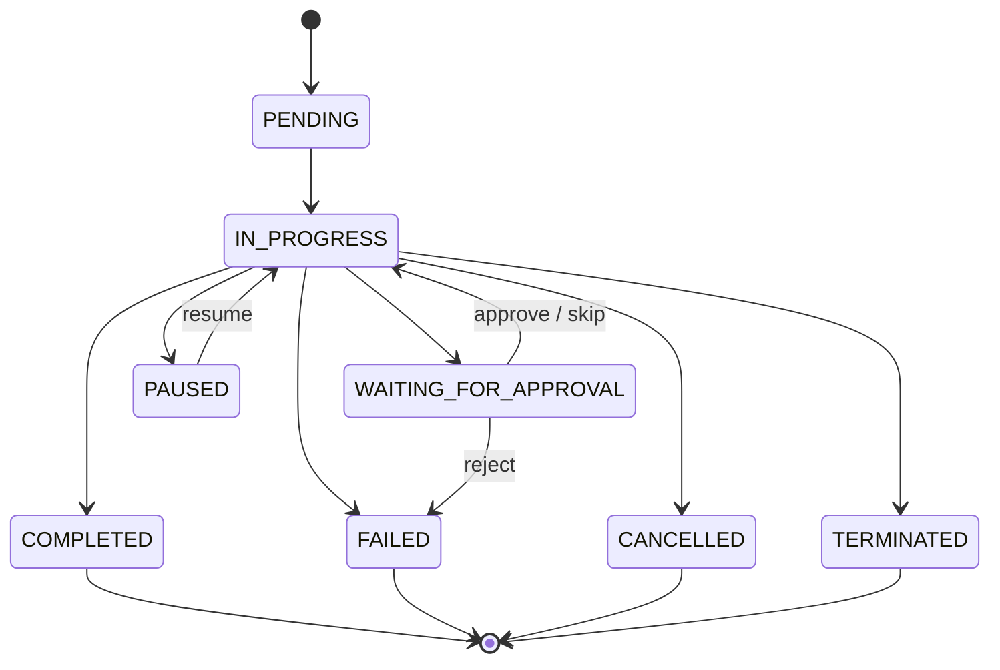

# What is an AgentExecution?

**An AgentExecution is `docker run` for AI — a single, observable invocation that you can pause, resume, cancel, or gate behind human approval.**

---

## Executive summary

An AgentExecution is the bottom layer of Stigmer's four-resource runtime stack. It represents one user message and the agent's complete response — including every tool call, sub-agent delegation, and generated artifact.

Unlike fire-and-forget LLM calls, an AgentExecution is a managed resource with a defined lifecycle. The platform tracks its phase, records every message and tool call, enforces cost caps, and supports human-in-the-loop approval gates. You observe and control it through the API, CLI, or SDK.

AgentExecutions are created at runtime — you trigger them with `stigmer run` or through the API, not by authoring YAML.

---

## The problem AgentExecution solves

### AI agent runs are opaque and uncontrollable

Most agent frameworks treat execution as a function call: you pass input, wait for output, and hope nothing goes wrong in between.

```python
result = agent.invoke("Delete the staging database and recreate it")
# What tools did it call? Can I stop it? What did it cost?
```

**What goes wrong:**

- No visibility into what the agent is doing mid-run — tool calls happen silently
- No way to pause or cancel — once started, the agent runs to completion or failure
- No approval gates — destructive operations execute without human review
- No cost tracking — a runaway agent drains API credits with no warning
- No structured error handling — failures surface as Python exceptions, not actionable state

---

## What AgentExecution provides

### Lifecycle control

Every AgentExecution moves through a defined set of phases. You can intervene at any point: pause an execution to review its progress, resume it later, or cancel it gracefully.

```bash
# Trigger an execution
stigmer run agent code-reviewer -m "Review the latest PR"

# Pause it
stigmer execution pause <execution-id>

# Resume it
stigmer execution resume <execution-id>

# Cancel it gracefully
stigmer execution cancel <execution-id>
```

### Human-in-the-loop approvals

When an agent reaches a tool that requires approval, the execution pauses at `WAITING_FOR_APPROVAL`. A human reviews the tool call and decides: approve, skip, or reject.

The approval policy chain has three levels:

1. **McpServer** — platform-wide defaults for which tools require approval
2. **Agent** — per-agent overrides that tighten or relax defaults
3. **AgentExecution** — runtime bypass via `auto_approve_all` for automation

### File attachments and artifacts

Inject input files before execution starts. Download files the agent creates during execution.

```bash
# Attach a file for the agent to process
stigmer run agent analyzer --attach ./data.csv -m "Analyze this dataset"
```

### Cost tracking and caps

Every execution tracks token usage and estimated cost in real time. Set `max_cost_usd` to terminate an execution before it exceeds a budget.

### Context management

For long-running conversations, Stigmer automatically summarizes older message history when the context window approaches the model's limit. This happens transparently — the agent continues without interruption.

---

## How it works

### Execution phases

An AgentExecution moves through a state machine of phases. Four are terminal (the execution is done). Two are non-terminal (the execution is paused and can resume).



| Phase | Terminal? | Meaning |
|---|---|---|
| `PENDING` | No | Queued, waiting to start |
| `IN_PROGRESS` | No | Actively executing — calling the model, running tools |
| `WAITING_FOR_APPROVAL` | No | Blocked on a human approval decision |
| `PAUSED` | No | Temporarily stopped, can resume from checkpoint |
| `COMPLETED` | Yes | Agent finished successfully |
| `FAILED` | Yes | Unexpected error or approval rejection |
| `CANCELLED` | Yes | User gracefully stopped the execution |
| `TERMINATED` | Yes | Platform stopped the agent — stall timeout, budget exhausted, or force-kill |

### Key spec properties

These are the inputs you provide when triggering an execution:

| Property | Purpose |
|---|---|
| `message` | The user's input — the prompt for this turn |
| `session_id` | Which Session to run in (auto-created if omitted) |
| `agent_id` | Which Agent to run (resolved from session if omitted) |
| `execution_config.model_name` | Model override for this run |
| `execution_config.max_cost_usd` | Cost cap in USD |
| `execution_config.max_tool_rounds` | Limit on model-tool reasoning cycles |
| `auto_approve_all` | Bypass all tool approval gates |
| `attachments` | Files to inject into the sandbox |

### Key status properties

These are populated by the platform during and after execution:

| Property | Purpose |
|---|---|
| `phase` | Current lifecycle phase |
| `messages` | Full conversation transcript (human, AI, tool, system) |
| `tool_calls` | Every tool invocation with args, result, and status |
| `sub_agent_executions` | Delegated sub-agent runs with their own message trails |
| `pending_approvals` | Tool calls waiting for human decision |
| `usage` | Token counts and estimated cost |
| `artifacts` | Files and directories the agent produced |
| `error` | Error details if the execution failed or was terminated |

---

## How it compares

| Without Stigmer | With Stigmer |
|---|---|
| Execution is a function call — no mid-run visibility | Every message, tool call, and sub-agent run is tracked in real time |
| No way to pause or cancel a running agent | Pause, resume, cancel, and terminate through the API |
| Destructive tool calls execute without review | Approval gates pause execution until a human decides |
| Cost tracking requires custom instrumentation | Per-execution token usage and cost caps built in |
| Failures are unstructured exceptions | Execution phases provide structured error states and recovery paths |
| Sub-agent runs are invisible | Sub-agent executions are first-class status records with their own metrics |

---

## Getting started

```bash
# 1. Run an agent
stigmer run agent my-assistant -m "Hello, what can you help me with?"

# 2. Check the execution status
stigmer execution list --agent my-assistant

# 3. Run with a cost cap
stigmer run agent my-assistant -m "Analyze this codebase" \
  --max-cost-usd 2.00

# 4. Run with auto-approval for automation
stigmer run agent deployer -m "Deploy to staging" --auto-approve
```

---

## Further reading

- [What is an Agent?](agent.mdx) — The template layer: what the agent can do
- [What is a Session?](session.mdx) — The conversation context that groups executions
- [What is a Workflow?](workflow.mdx) — Deterministic orchestration that invokes agents via `agent_call`
- [What is Stigmer?](what-is-stigmer.mdx) — Platform overview and the full resource model
