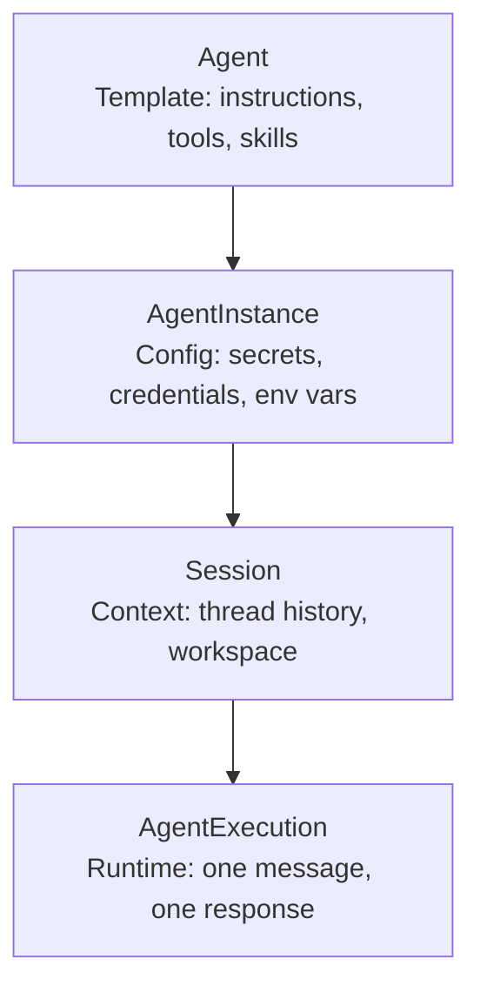

# What is an Agent?

**An Agent is a portable, versioned blueprint that defines what an AI worker can do — the same way a Docker image defines what a container can run.**

---

## Executive summary

An Agent is a Stigmer API resource that declares an AI worker's identity, behavior, tool access, and knowledge. It is the template layer of the four-resource runtime stack: Agent, AgentInstance, Session, AgentExecution.

Agents do not run on their own. You define an Agent in YAML, apply it with `stigmer apply`, and then execute it in a Session. The Agent declares *capabilities*. The runtime provides *secrets, state, and execution*.

This separation means a single Agent definition can run in development with test credentials and in production with real ones — without changing a line of YAML.

---

## The problem agents solve

### Agent definitions live in application code

Most teams define AI agents inline — a prompt string in Python, tool functions scattered across modules, knowledge baked into the application layer.

```python
agent = Agent(
    model="gpt-4",
    system_prompt="You review code for security issues...",
    tools=[search_code, get_file, create_pr],  # functions, not declarations
    knowledge=load_knowledge("./docs/style-guide.md"),
)
```

**What goes wrong:**

- The agent definition is locked to one codebase — no portability across teams or services
- Tool integrations are implementation-specific — switching from LangChain to another framework means rewriting every tool
- Knowledge is loaded at startup — versioning and updates require redeployment
- There is no separation between what the agent *can do* (template) and where it *runs* (environment)

---

## What an Agent provides

### Declarative YAML definition

An Agent is a YAML resource with a structured spec. You author it, version-control it, and deploy it with `stigmer apply`.

```yaml
apiVersion: agentic.stigmer.ai/v1
kind: Agent
metadata:
  name: github-assistant
spec:
  description: "Assists with GitHub operations and code management"
  instructions: |
    You help developers with GitHub tasks including searching code,
    creating pull requests, and managing issues.
  mcp_server_usages:
    - mcp_server_ref:
        kind: mcp_server
        slug: github
      enabled_tools:
        - search_code
        - create_pr
        - get_file
        - create_issue
  skill_refs:
    - kind: skill
      slug: code-review-best-practices
```

### Tool access via McpServer references

Agents connect to external tools through McpServer resources. Each `mcp_server_usages` entry references a McpServer by slug and optionally restricts which tools are available. The Agent declares *access*; the McpServer defines the *integration*.

Tool approval overrides let you customize which tools require human approval for a specific agent:

```yaml
mcp_server_usages:
  - mcp_server_ref:
      kind: mcp_server
      slug: kubernetes
    enabled_tools: [deploy_app, rollback_deployment, get_pod_status]
    tool_approval_overrides:
      - tool_name: deploy_app
        requires_approval: true
        message: "Deploy {{args.app_name}} to {{args.environment}}"
      - tool_name: rollback_deployment
        requires_approval: false
```

### Knowledge injection via Skills

Skills are portable packages of domain knowledge injected into the agent's context at runtime. An Agent references Skills by slug — the platform resolves content and version at execution time.

```yaml
skill_refs:
  - kind: skill
    slug: code-review-best-practices
  - kind: skill
    slug: company-style-guide
```

### Sub-agent delegation

An Agent can define specialized sub-agents that handle delegated tasks. Sub-agents inherit the parent's MCP server pool but can only access a restricted subset of tools.

```yaml
sub_agents:
  - name: code-reviewer
    description: "Reviews code changes for quality and security"
    instructions: |
      You review code for quality, security, and best practices.
      Provide specific, actionable feedback.
    mcp_access:
      - mcp_server: github
        enabled_tools: [search_code, get_file]
  - name: pr-creator
    description: "Creates well-formatted pull requests"
    instructions: |
      You create pull requests with clear titles and descriptions.
    mcp_access:
      - mcp_server: github
        enabled_tools: [create_pr, get_file]
    model_override: "claude-haiku-4"
```

Sub-agents can use a different model via `model_override` — route simple tasks to cheaper models while keeping the parent on a more capable one.

---

## How it works

An Agent sits at the top of a four-layer runtime stack. Each layer adds runtime context on top of the template.



| Layer | Resource | What it adds |
|---|---|---|
| Template | **Agent** | Instructions, MCP server usages, skill refs, sub-agents |
| Configuration | **AgentInstance** | Environment bindings — secrets, API keys, runtime values |
| Context | **[Session](session.mdx)** | Conversation thread, workspace state, session-level tools |
| Execution | **[AgentExecution](agent-execution.mdx)** | User message, model selection, attachments, cost cap |

The Agent is the only resource you author in YAML. AgentInstances are created automatically when you apply an Agent. Sessions and AgentExecutions are created at runtime via CLI or API.

### Key properties

| Property | Type | Purpose |
|---|---|---|
| `instructions` | string | System prompt — the core logic shaping agent behavior |
| `mcp_server_usages` | list | McpServer references with tool selection and approval overrides |
| `skill_refs` | list | Skill references for domain knowledge injection |
| `sub_agents` | list | Specialized delegates with restricted tool access |
| `env_spec` | object | Environment variable declarations (resolved at instance level) |
| `description` | string | Human-readable summary for UI and marketplace |
| `icon_url` | string | Display icon for marketplace and console |

---

## How it compares

| Without Stigmer | With Stigmer |
|---|---|
| Agent logic embedded in application code | Agent is a standalone YAML resource, versioned in Git |
| Tool integrations are per-framework, per-agent | McpServer resources are defined once, referenced by slug |
| Knowledge loaded at startup, hard to version | Skills are versioned, content-addressed packages |
| Same agent, same secrets in dev and prod | AgentInstance binds different Environments to the same Agent |
| Sub-tasks require custom delegation code | Sub-agents with restricted tool access, declared in YAML |

---

## Getting started

```bash
# 1. Create an agent
cat > agent.yaml << 'EOF'
apiVersion: agentic.stigmer.ai/v1
kind: Agent
metadata:
  name: my-assistant
spec:
  description: "A helpful assistant"
  instructions: |
    You are a helpful assistant that answers questions
    clearly and concisely.
EOF

# 2. Apply it
stigmer apply -f agent.yaml

# 3. Run it
stigmer run agent my-assistant -m "Hello, what can you help me with?"

# 4. List agents
stigmer list agents
```

---

## Further reading

- [What is an AgentExecution?](agent-execution.mdx) — The runtime layer: lifecycle, approvals, and observability
- [What is a Session?](session.mdx) — Conversation context: thread continuity and workspace persistence
- [What is a Workflow?](workflow.mdx) — Deterministic orchestration that can invoke agents as tasks
- [What is Stigmer?](what-is-stigmer.mdx) — Platform overview and the full resource model
