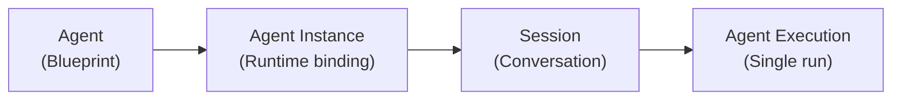
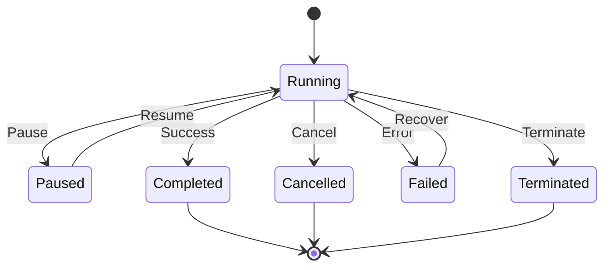

# Agents

An <Term>Agent</Term> is a declarative definition of an AI worker. It describes
what the worker does, what tools it can access, and what knowledge it carries,
but not where it runs or what credentials it uses. Think of it the same way you
think of a Docker image: a portable, versionable, shareable artifact.

```yaml
apiVersion: agentic.stigmer.ai/v1
kind: Agent
metadata:
  name: code-reviewer
  org: acme-corp
spec:
  description: Reviews code for quality, security, and best practices
  instructions: |
    You are a code review assistant. For every review:
    1. Check for security vulnerabilities
    2. Evaluate code quality
    3. Suggest actionable improvements
  mcp_server_usages:
    - mcp_server_ref:
        slug: github
      enabled_tools:
        - search_code
        - get_file
        - create_review_comment
  skill_refs:
    - slug: company-style-guide
```

You author this YAML once. You deploy it with `stigmer apply`. You run it with
`stigmer run`. The same file works on your laptop and in production.

## Blueprint versus runtime

Stigmer separates what an <Term>Agent</Term> does from where it runs.

<Callout type="warn">
  The separation between blueprint and runtime is a hard architectural
  invariant---the most important design decision in the platform. Blueprints
  carry zero secrets and zero <Term>Environment</Term>-specific values.
</Callout>

Four resources form the execution stack:



| Resource                         | Role                                                                                                     | Analogy                |
| -------------------------------- | -------------------------------------------------------------------------------------------------------- | ---------------------- |
| **<Term>Agent</Term>**           | Declares capabilities and behavior. No secrets. No <Term>Environment</Term>-specific values.             | Docker image           |
| **<Term>Agent Instance</Term>**  | Binds the Agent to an Environment with production credentials, staging API Keys, or per-customer tokens. | Docker Compose service |
| **<Term>Session</Term>**         | Groups related Executions into a conversation. Maintains message history and an optional Workspace.      | Terminal Session       |
| **<Term>Agent Execution</Term>** | A single run: one user message, one Agent response, with a full tool call audit trail.                   | `docker run`           |

**Why this matters for platform builders:** you create one

<Term>Agent</Term> definition for your code review bot. Then you create separate
<Term>Agent Instance</Term>s for each customer, each with their own GitHub token
and <Term>Organization</Term> context. The Agent YAML never changes. The
Instance handles the per-customer binding.

## Four building blocks

Every <Term>Agent</Term> composes four independent building blocks.

### Instructions

The system prompt: what the <Term>Agent</Term> does and how it behaves.
Instructions are versioned alongside the rest of the spec. When you change them,
Stigmer creates a new version and preserves the previous one.

```yaml
spec:
  instructions: |
    You are a deployment assistant for Acme Corp.
    Always verify the target environment before deploying.
    Require confirmation for production deployments.
```

### Tools (MCP Servers)

<Term>MCP Server</Term>s give Agents the ability to act in external systems like
GitHub, Slack, databases, internal APIs. Each MCP Server exposes named tools
that the Agent can call.

```yaml
spec:
  mcp_server_usages:
    - mcp_server_ref:
        slug: github
      enabled_tools:
        - search_code
        - create_pr
      tool_approval_overrides:
        - tool_name: create_pr
          requires_approval: true
```

The `enabled_tools` list defines the maximum tool set. Sub-Agents inherit a
subset and cannot expand beyond what the parent grants. The
`tool_approval_overrides` field adds human-in-the-loop checkpoints for specific
tools.

### Knowledge (Skills)

<Term>Skill</Term>s are versioned packages of domain knowledge (style guides,
runbooks, procedures) that get injected into the Agent's context at runtime.
Skills decouple knowledge from the Agent definition.

```yaml
spec:
  skill_refs:
    - slug: company-style-guide
    - slug: security-review-checklist
      version: stable
```

When the style guide <Term>Skill</Term> is updated, every Agent that references
it picks up the change at the next pinned version.

### Delegation (Sub-Agents)

Sub-Agents let a parent <Term>Agent</Term> dispatch specialized work to focused
workers. Each Sub-Agent has its own instructions and a restricted slice of the
parent's tool access.

```yaml
spec:
  sub_agents:
    - name: security-scanner
      description: Focuses exclusively on security vulnerabilities
      instructions: |
        Scan code for OWASP top 10 issues, secrets in code,
        and authentication flaws.
      mcp_access:
        - mcp_server: github
          enabled_tools:
            - search_code
            - get_file
```

The parent decides when to delegate. Each Sub-Agent stays focused and
independently auditable.

## Lifecycle control

Every <Term>Agent Execution</Term> runs on [Temporal](https://temporal.io/),
which provides Durable Execution guarantees. Five lifecycle operations give you
full control over running Agents:



| Operation     | What it does                                                                          |
| ------------- | ------------------------------------------------------------------------------------- |
| **Pause**     | Suspend the Execution at the current checkpoint. Resume later from the same point.    |
| **Resume**    | Continue a paused Execution from its checkpoint.                                      |
| **Cancel**    | Stop the Execution and allow the Agent to save its checkpoint and clean up.           |
| **Terminate** | Force-stop the Execution immediately. Use only when cancel does not respond.          |
| **Recover**   | Retry a failed Execution from its last checkpoint. Completed steps do not re-execute. |

Human-in-the-loop approval is separate from pause. When an Agent encounters a
tool that requires approval, the Execution enters a waiting state until a human
approves, skips, or rejects the tool call. You can pause an Execution that is
already waiting for approval.

```bash
stigmer run code-reviewer "Review PR #42"

# In another terminal:
stigmer agent exec pause --id exec-123 --reason "Pausing overnight"
stigmer agent exec resume --id exec-123
```

## Versioning

Every `stigmer apply` that changes an <Term>Agent</Term>'s spec creates a new
version. The version record includes the full spec, who made the change, and
when. You can always answer: "What were this Agent's instructions when it ran
that review six months ago?"

## Visibility and sharing

Agents support two visibility levels:

- **Private.** Only your <Term>Organization</Term> can see or use the Agent.
- **Public.** Anyone can discover and reference the Agent by its `org/slug`, the
  same way you pull a Docker image by its registry path.

Public Agents appear in the Stigmer marketplace.

## Next steps

- [Workflows](./workflows): Deterministic automation pipelines that can invoke
  Agents as steps.
- [Skills](./skills): Versioned domain knowledge that Agents carry.
- [Installation](../getting-started/installation): Set up Stigmer and create
  your first Agent.
