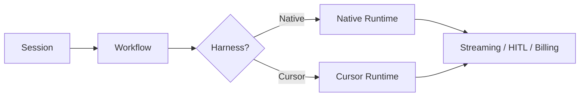

Every [Session](/docs/concepts/sessions) needs an execution engine — the runtime
that processes the Agent's turns, calls models, runs tools, and streams results.
In Stigmer, that engine is called a **Harness**.

Stigmer supports two harnesses:

- **Native** — Stigmer's built-in engine, powered by Python and LangGraph.
- **Cursor** — An alternate engine that uses the
  [Cursor SDK](https://docs.cursor.com/sdk) to run Agent activities.

The Harness is a Session-level choice. You pick it when you create a Session,
and it stays fixed for the life of that conversation.

## Native harness

The native Harness is Stigmer's default. When you create a Session without
specifying a Harness, it uses native.

**What you get:**

- Full control over model selection from all supported providers (Anthropic,
  OpenAI, Google, and others).
- Deep integration with Stigmer's checkpoint, pause/resume, and sandbox
  features.
- The same execution model documented throughout the rest of these docs —
  [Runners](/docs/concepts/runners) pick up work,
  [approval flows](/docs/concepts/approval-flows) gate tool calls, and
  [Skills](/docs/concepts/skills) inject domain knowledge.
- Shell command execution on local Workspaces through the `execute` tool.
  Commands run on the host machine attached to the runner, and every command
  goes through the same approval gate as other mutating tools. Plan mode
  (read-only Sessions) does not expose shell execution.

The native Harness is the right choice for most workloads. It gives you the
widest model catalog and the deepest platform integration.

## Cursor harness

The Cursor harness uses the Cursor SDK as the execution engine. Instead of
Stigmer's Python runtime processing the Agent's turns, the Cursor Agent runtime
handles them.

**What you get:**

- Access to Cursor-specific models and tooling — including built-in coding
  tools, file editing, and shell execution.
- The same Stigmer Session UX — streaming messages, tool call rendering,
  [approval flows](/docs/concepts/approval-flows), and usage tracking all work
  the same way.
- Ideal for developer-facing agents that need code-level capabilities out of the
  box.

**What differs:**

- Model availability is limited to models served through the Cursor platform.
- Checkpoint and pause/resume behavior differs from native — Cursor manages its
  own conversation state.
- Sandbox isolation follows Cursor's model, not Stigmer's container-based
  sandbox.

## Choosing a Harness

The Harness you choose depends on what your Agent needs to do.

|                         | Native                                                               | Cursor                                                     |
| ----------------------- | -------------------------------------------------------------------- | ---------------------------------------------------------- |
| **Default**             | Yes                                                                  | No — must be explicitly selected                           |
| **Model availability**  | All supported providers                                              | Cursor-served models only                                  |
| **Tool capabilities**   | MCP servers you configure                                            | MCP servers + Cursor's built-in coding tools               |
| **Checkpoints**         | Full Stigmer pause/resume                                            | Cursor-managed state                                       |
| **Platform commission** | 10% over provider rates                                              | 10% over provider rates                                    |
| **Cursor Token Rate**   | None                                                                 | Small per-token fee on non-Auto models                     |
| **Per-call context**    | Your prompt only                                                     | Adds Cursor system + tooling context                       |
| **Prompt caching**      | Full control (explicit breakpoints)                                  | Automatic and opaque                                       |
| **Latency**             | Lower (direct API)                                                   | Higher (agent startup + tooling)                           |
| **Best for**            | General-purpose agents, custom model selection, production workloads | Developer-facing agents, coding tasks, Cursor model access |

<Callout type="info">
  A Session's Harness is immutable after the first execution runs. Choose the
  right Harness when you create the Session — you cannot switch later.
</Callout>

## How it works

Both harnesses feed into the same Stigmer pipeline. The difference is which
runtime processes the Agent's turns — the rest of the system (streaming,
approval flows, billing, usage tracking) works the same regardless of Harness.



When a [Runner](/docs/concepts/runners) starts, it can host workers for both
harnesses. Native executions route to the base task queue, and Cursor executions
route to a dedicated queue. The runner handles both transparently — you don't
need separate runner processes for each Harness.

## Creating a Session with a Harness

You set the Harness when creating a Session. If you omit it, native is the
default.

<Tabs items={["TypeScript", "Go"]}>
  <Tab value="TypeScript">

```typescript
const session = await client.session.create({
  spec: {
    subject: "Refactor auth module",
    agentInstanceId: "ain-abc123",
    harness: "HARNESS_CURSOR",
  },
});
```

  </Tab>
  <Tab value="Go">

```go
session, err := client.Session.Create(ctx, &sessionv1.CreateInput{
    Spec: &sessionv1.SessionSpec{
        Subject:         "Refactor auth module",
        AgentInstanceId: "ain-abc123",
        Harness:         sessionv1.Harness_HARNESS_CURSOR,
    },
})
```

  </Tab>
</Tabs>

In the web console, the model picker shows models from both harnesses. Selecting
a Cursor-served model implicitly sets the Harness to Cursor for that Session.

## Cost considerations

Both harnesses apply the same 10% platform commission, so cost differences come
from three places: the Cursor Token Rate, per-call context, and prompt caching.

- **Cursor Token Rate** — most Cursor models add a small per-token fee (Cursor's
  own charge, folded into the price before commission). Native models never
  carry it, so the same underlying model is cheaper on native.
- **Per-call context** — Cursor's runtime sends its own system and tooling
  context with each call; native sends only your prompt.
- **Prompt caching** — native exposes explicit cache breakpoints, so a Session's
  stable prefix is re-read at about one-tenth the input rate (about 90% off
  those tokens) and the advantage compounds across turns. Cursor caches
  automatically but opaquely.

For multi-turn Sessions, native's caching control usually wins on cost. For
coding tasks that need Cursor's built-in tools, the extra context and token rate
buy capability that native does not have. For a full rundown of cost levers, see
[Optimizing your costs](/docs/concepts/billing#optimizing-your-costs).

## What's next

Ready to set up the Cursor harness? The
[Cursor harness guide](/docs/guides/runners/cursor-harness) walks you through
local and cloud setup, model selection, and troubleshooting.

To understand how Sessions work in more detail — including session-level
overrides for Skills and tools — see [Sessions](/docs/concepts/sessions).
