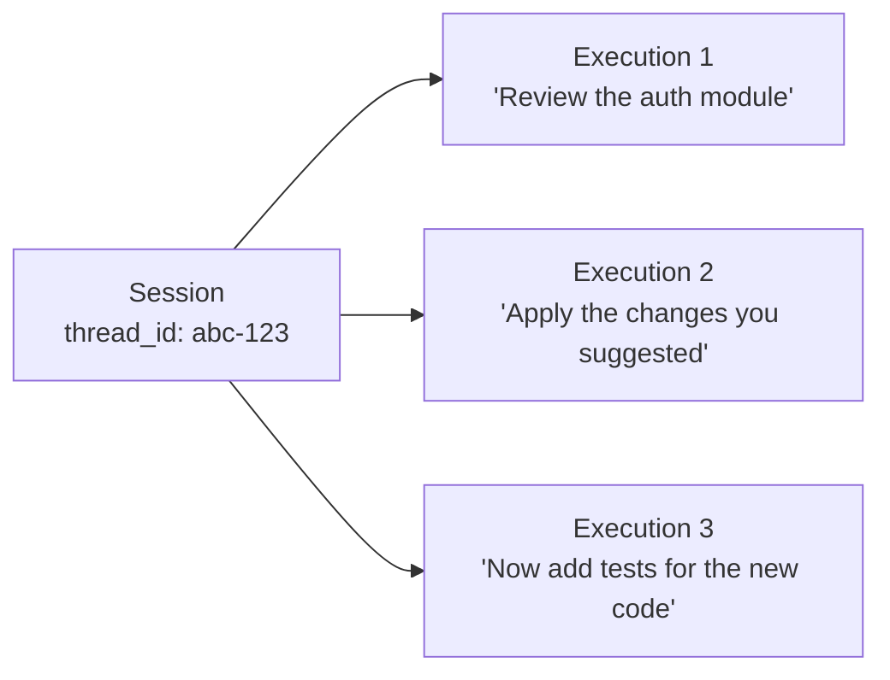
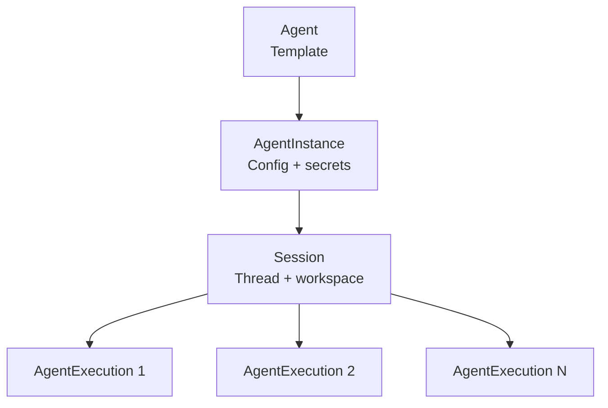

# What is a Session?

**A Session is a terminal session for AI — a persistent, named conversation context that carries message history and workspace state across every run within that conversation.**

---

## Executive summary

A Session is the third layer in Stigmer's four-resource runtime stack. It groups multiple [AgentExecutions](agent-execution.mdx) into a single conversation, ensuring that the agent "remembers" everything said in previous turns and can continue working with files created earlier.

Sessions are not ephemeral. A Session persists until you delete it. Everything the agent does across multiple turns — the conversation thread, the files it creates, the sandbox environment — is anchored to the Session.

You create Sessions explicitly (via CLI or API) or let the platform create them automatically when you trigger an execution without specifying one.

---

## The problem Sessions solve

### Conversation state is lost between runs

Without a durable conversation layer, every interaction with an AI agent starts from scratch.

```python
# Turn 1: Ask for a code review
result1 = agent.invoke("Review the auth module")
# Agent analyzes and suggests changes

# Turn 2: Follow up — but the agent has no memory of turn 1
result2 = agent.invoke("Now apply the changes you suggested")
# Agent: "I don't know what changes you're referring to."
```

**What goes wrong:**

- Message history evaporates between calls — the agent cannot build on previous work
- Workspace state is ephemeral — files the agent creates in one turn disappear before the next
- There is no way to group related interactions into a coherent conversation
- Multi-turn workflows require the caller to manage thread state manually

---

## What a Session provides

### Thread continuity

A Session holds a `thread_id` that carries the full conversation history across every execution. All AgentExecutions within a Session share the same thread. The agent sees the complete transcript — messages, tool calls, and results from every prior turn.



Execution 2 sees everything from Execution 1. Execution 3 sees everything from both. The agent builds on prior context without the caller managing any state.

### Workspace persistence

A Session optionally provisions a workspace — a git repository or local directory — that persists across all executions. Files the agent creates in turn one are still available in turn ten.

**Git workspace** — clone a repository and work against it:

```yaml
workspace_entries:
  - name: my-app
    source:
      git_repo:
        url: "https://github.com/acme/my-app.git"
        branch: main
```

**Local workspace** — use an existing directory on the host:

```yaml
workspace_entries:
  - name: my-project
    source:
      local_path:
        path: "/home/user/projects/my-project"
```

A Session supports multiple workspace entries (multi-root workspace), following the VS Code model. Each entry appears as a separate directory the agent can operate on.

### Session-level tool and skill augmentation

You can add McpServer usages and Skill references at the session level. These are merged with the [Agent's](agent.mdx) definitions at execution time — augmenting the agent's capabilities for a specific conversation without modifying the agent blueprint.

```yaml
mcp_server_usages:
  - mcp_server_ref:
      kind: mcp_server
      slug: jira
    enabled_tools: [create_issue, search_issues]
skill_refs:
  - kind: skill
    slug: project-context
```

Session-level entries take precedence when they reference the same McpServer slug as the agent.

---

## How it works

### Session in the runtime stack

A Session bridges the gap between the static configuration layer (AgentInstance) and the dynamic execution layer (AgentExecution).



| Property | Type | Purpose |
|---|---|---|
| `agent_instance_id` | string | The AgentInstance this session runs against |
| `subject` | string | Conversation title for UI display |
| `thread_id` | string | Conversation thread identifier (generated on first execution) |
| `sandbox_id` | string | Workspace sandbox identifier (created on first execution) |
| `workspace_entries` | list | Git repos or local paths provisioned as the workspace |
| `mcp_server_usages` | list | Session-level McpServer additions (merged with agent's) |
| `skill_refs` | list | Session-level Skill additions (merged with agent's) |
| `metadata` | map | Arbitrary key-value pairs (client info, tags) |

### Two creation modes

**Explicit** — create a Session with specific configuration, then pass its ID when triggering executions:

```bash
stigmer session create --agent my-assistant \
  --workspace https://github.com/acme/my-app.git
```

**Automatic** — trigger an execution without a `session_id` and the platform creates a Session using the agent's default instance:

```bash
stigmer run agent my-assistant -m "Hello"
# Platform auto-creates a session backed by my-assistant's default instance
```

Automatic creation is the common path for interactive use. Explicit creation is for scenarios that need workspace provisioning or session-level tool configuration.

---

## How it compares

| Without Stigmer | With Stigmer |
|---|---|
| Conversation history managed by the caller | Session holds the thread — agent sees the full transcript across turns |
| Workspace state is ephemeral per invocation | Workspace persists across all executions in the session |
| Adding tools for a specific conversation requires modifying the agent | Session-level MCP servers augment the agent without changing its definition |
| Multi-root workspace requires custom orchestration | Multiple workspace entries provisioned declaratively |
| No standard model for grouping related agent interactions | Session is the named, persistent unit of conversation |

---

## Getting started

```bash
# 1. Run an agent — session auto-created
stigmer run agent my-assistant -m "Review the auth module"

# 2. Continue the conversation in the same session
stigmer run agent my-assistant --session <session-id> \
  -m "Apply the changes you suggested"

# 3. Create a session with a git workspace
stigmer session create --agent code-reviewer \
  --workspace https://github.com/acme/my-app.git

# 4. List sessions
stigmer session list --agent my-assistant
```

---

## Further reading

- [What is an Agent?](agent.mdx) — The template layer that Sessions execute against
- [What is an AgentExecution?](agent-execution.mdx) — The individual runs grouped by a Session
- [What is a Workflow?](workflow.mdx) — Deterministic orchestration that can invoke agents in sessions
- [What is Stigmer?](what-is-stigmer.mdx) — Platform overview and the full resource model
