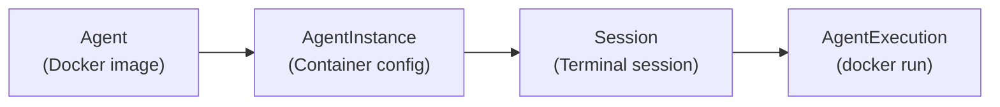
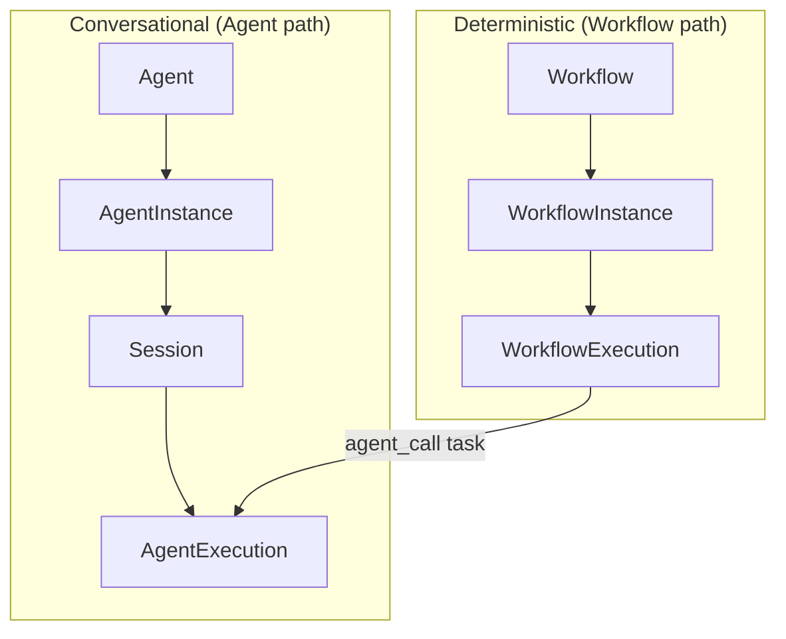

# What is Stigmer?

<DefinitionBanner analogy="Kubernetes for containers">
  Stigmer is an infrastructure platform for AI agents — you define agents
  and workflows as declarative YAML resources, and Stigmer handles execution,
  state, tool integration, observability, and multi-tenant isolation.
</DefinitionBanner>

## The problem Stigmer solves

<ProblemStatement>
### Building AI agents from scratch does not scale

Most teams building AI agent capabilities start the same way: a Python script, a prompt, an API key, and a growing pile of glue code.

```python
client = OpenAI()
response = client.chat.completions.create(
    model="gpt-4",
    messages=[{"role": "user", "content": user_input}],
    tools=[...],  # hand-maintained tool definitions
)
# Now handle tool calls, retries, state, auth, logs, costs...
```

**What goes wrong:**

- Agent definitions live in application code — no portability across teams or environments
- Conversation state is ad hoc — lost on restart, impossible to resume
- Tool integrations are hand-wired — each agent reinvents the same connectors
- No execution control — no pause, resume, cancel, or approval gates
- No cost visibility — runaway agents drain API credits silently
- Multi-tenancy is an afterthought — every customer gets the same agent with the same secrets

Frameworks like LangChain and CrewAI solve the LLM abstraction layer. Stigmer solves the infrastructure layer: how you deploy, run, observe, and manage agents at scale inside a product.
</ProblemStatement>

## What Stigmer provides

### Declarative agent definitions

Define agents as versioned YAML resources — portable across environments, teams, and platforms.

```yaml
apiVersion: agentic.stigmer.ai/v1
kind: Agent
metadata:
  name: code-reviewer
spec:
  description: "Reviews code for quality and security issues"
  instructions: |
    You review code changes. Focus on security vulnerabilities,
    performance issues, and adherence to best practices.
  mcp_server_usages:
    - mcp_server_ref:
        kind: mcp_server
        slug: github
      enabled_tools: [search_code, get_file, create_pr]
  skill_refs:
    - kind: skill
      slug: code-review-best-practices
```

### Durable execution with lifecycle control

Every agent run is an observable, controllable resource. Pause mid-execution, require human approval before destructive tool calls, resume after review, or cancel gracefully — all through the API.

### Tool integration via MCP

Agents connect to external tools through [McpServer](agent.mdx) resources that follow the Model Context Protocol. Define a tool server once, reference it from any agent. Stigmer manages the server lifecycle, tool discovery, and approval policies.

### Deterministic workflow orchestration

When you need structured automation — not conversation — Stigmer Workflows provide durable, Temporal-backed pipelines with 13 task types including `agent_call` to invoke agents as steps in a larger process.

### SDKs for every language

Stigmer is a platform for platforms. Go, TypeScript, and Python SDKs provide typed API clients, React hooks, and embeddable components. Your product consumes Stigmer through the SDK — the CLI and console are reference implementations.

## How it works

Stigmer organizes AI agent infrastructure into a four-layer resource hierarchy. Each layer has a distinct responsibility, and each maps to a familiar container analogy.



| Layer | Resource | Analogy | What it does |
|---|---|---|---|
| Template | [Agent](agent.mdx) | Docker image | Declares capabilities: instructions, tools, skills, sub-agents. Portable and versioned. |
| Configuration | AgentInstance | Container config | Binds an Agent to an Environment — injects secrets, credentials, and runtime values. Created automatically. |
| Context | [Session](session.mdx) | Terminal session | Groups executions into a conversation. Persists message history and workspace state across runs. |
| Execution | [AgentExecution](agent-execution.mdx) | `docker run` | A single run: one user message, the agent's full response. Observable, pausable, cancellable. |

You author the Agent layer in YAML. The platform manages the rest.

### Two execution models

Stigmer supports two complementary execution models. Agents handle conversational AI. Workflows handle deterministic orchestration. Workflows can invoke agents as tasks, connecting both models.



| | Agent | Workflow |
|---|---|---|
| **Purpose** | Conversational AI with tools | Deterministic orchestration |
| **Control flow** | Emergent (LLM-driven) | Explicit (defined in YAML) |
| **Execution engine** | LangGraph + MCP | Temporal durable workflows |
| **Invocation** | `stigmer run` or API | WorkflowInstance + trigger |
| **Use case** | Code review, research, customer support | Data pipelines, multi-step automation, batch processing |

## How it compares

<ComparisonTable rows={[
  { before: "Agent definitions live in application code", after: "Agents are versioned YAML resources, portable across environments" },
  { before: "Conversation state is ad hoc and ephemeral", after: "Sessions persist message history and workspace across runs" },
  { before: "Tool integrations are hand-wired per agent", after: "McpServer resources are defined once, shared across agents" },
  { before: "No execution control — fire and forget", after: "Pause, resume, cancel, and approval gates on every run" },
  { before: "No cost visibility", after: "Per-execution token tracking and cost caps" },
  { before: "Multi-tenancy requires custom isolation", after: "Organizations, Environments, and IAM policies built in" },
  { before: "Orchestration mixed with agent logic", after: "Workflows handle orchestration; agents handle conversation" },
]} />

## Getting started

```bash
# 1. Define an agent
cat > agent.yaml << 'EOF'
apiVersion: agentic.stigmer.ai/v1
kind: Agent
metadata:
  name: my-assistant
spec:
  description: "A helpful assistant"
  instructions: "You are a helpful assistant."
EOF

# 2. Apply it
stigmer apply -f agent.yaml

# 3. Run it
stigmer run agent my-assistant -m "What can you help me with?"
```

## Further reading

<RelatedDocs links={[
  { href: "agent", title: "What is an Agent?", description: "The template layer: instructions, tools, skills, and sub-agents" },
  { href: "agent-execution", title: "What is an AgentExecution?", description: "The runtime layer: lifecycle, approvals, and observability" },
  { href: "session", title: "What is a Session?", description: "Conversation context: thread continuity and workspace persistence" },
  { href: "workflow", title: "What is a Workflow?", description: "Deterministic orchestration: durable pipelines that invoke agents" },
]} />
