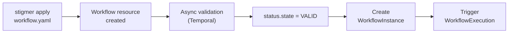

# What is a Workflow?

**A Workflow is a durable automation pipeline — the same way a CI/CD pipeline orchestrates build steps, a Stigmer Workflow orchestrates agents, HTTP calls, and business logic into a reliable, repeatable process.**

---

## Executive summary

A Workflow is a Stigmer API resource that defines a sequence of typed tasks — HTTP calls, gRPC calls, agent invocations, conditional branches, parallel forks, loops, and more. The platform executes it as a durable Temporal workflow, guaranteeing that every step completes or fails explicitly, even across process restarts and network partitions.

Workflows and [Agents](agent.mdx) serve different purposes. An Agent *thinks* — it uses an LLM to reason about tools and generate responses. A Workflow *orchestrates* — it follows a deterministic path defined in YAML. Workflows can invoke agents as tasks via `agent_call`, giving conversational AI a place inside structured automation.

You author Workflows in YAML, apply them with `stigmer apply`, and execute them through WorkflowInstances.

---

## The problem Workflows solve

### Glue code breaks under pressure

Most teams orchestrate AI agent calls with application code: a Python script that calls an agent, parses the result, makes an API request, calls another agent, and posts to Slack.

```python
# Fragile orchestration: what happens when step 2 fails after step 1 succeeds?
draft = agent_writer.invoke(f"Write a blog post about {topic}")
review = agent_editor.invoke(f"Review this draft: {draft}")
response = requests.post(cms_url, json={"content": review})
```

**What goes wrong:**

- No durability — if the process crashes between steps, partial work is lost
- No retries — a transient HTTP failure aborts the entire pipeline
- No parallelism without threading complexity
- No conditional branching without nested if/else chains
- No visibility into which step is running, failed, or waiting
- Agent calls and API calls use different error handling, different state, different observability

---

## What a Workflow provides

### Declarative task definitions

A Workflow is a YAML resource with an ordered list of typed tasks. Each task has a `kind` that determines its behavior and a `task_config` that provides the parameters.

```yaml
apiVersion: agentic.stigmer.ai/v1
kind: Workflow
metadata:
  name: content-pipeline
spec:
  description: "Drafts, reviews, and publishes a blog post"
  document:
    dsl: "1.0.0"
    namespace: acme
    name: content-pipeline
    version: "1.0.0"
  tasks:
    - name: draft
      kind: agent_call
      task_config:
        agent: "content-writer"
        message: "Write a blog post about: ${ .env.TOPIC }"
        config:
          model: "claude-sonnet-4"
      export:
        as: "${ .response }"
      flow:
        then: review

    - name: review
      kind: agent_call
      task_config:
        agent: "content-editor"
        message: "Review and improve this draft:\n\n${ $context.draft }"
        config:
          temperature: 0.3
      export:
        as: "${ .response }"
      flow:
        then: publish

    - name: publish
      kind: http_call
      task_config:
        method: POST
        endpoint:
          uri: "${ .env.CMS_API_URL }/posts"
        headers:
          Authorization: "Bearer ${ .env.CMS_API_TOKEN }"
        body:
          content: "${ $context.review }"
          status: "draft"
```

### Agent invocation via `agent_call`

The `agent_call` task type invokes a Stigmer Agent as a step in the workflow. The agent receives the message, executes with its configured tools and skills, and returns the result to the workflow context.

```yaml
- name: analyze
  kind: agent_call
  task_config:
    agent: "code-reviewer"
    message: "Review this code: ${ $context.fetchCode.body }"
    env:
      GITHUB_TOKEN: "${ .secrets.GH_TOKEN }"
    config:
      model: "claude-sonnet-4"
      timeout: 300
```

The workflow's execution context (environment variables, secrets) is passed to the agent, allowing it to access workflow state. The agent reference uses `slug` format (resolves to the workflow's Organization) or `org/slug` format for cross-organization references.

### 13 task types

Workflows support a full set of orchestration primitives:

| Task kind | Purpose |
|---|---|
| `agent_call` | Invoke an AI agent with a message |
| `http_call` | Make HTTP requests (GET, POST, PUT, DELETE, PATCH) |
| `grpc_call` | Make gRPC requests |
| `activity_call` | Execute Temporal activities |
| `set_vars` | Set variables in workflow state |
| `switch_case` | Conditional branching based on expressions |
| `for_each` | Iterate over collections |
| `fork` | Parallel execution of branches |
| `try_catch` | Error handling with catch blocks |
| `listen` | Wait for external signals or events |
| `wait` | Sleep/delay (Temporal timer) |
| `raise_error` | Raise errors to abort or trigger catch blocks |
| `run_workflow` | Execute sub-workflows |

### Durable execution

Every Workflow runs as a Temporal workflow. Temporal guarantees that each task completes or fails explicitly — even if the process crashes, the network drops, or the host restarts. Failed tasks can be retried. Long-running workflows can wait hours for an external signal and resume exactly where they left off.

---

## How it works

### Workflow lifecycle

A Workflow follows a create-validate-execute lifecycle. Validation happens asynchronously after apply — you do not block waiting for it.



1. **Author** a Workflow in YAML
2. **Apply** it with `stigmer apply` — the resource is created immediately
3. **Validation** runs asynchronously — Temporal validates the DSL and task structure
4. **Bind** it to an Environment via a WorkflowInstance (provides secrets and config)
5. **Execute** it — each run creates a WorkflowExecution backed by a Temporal workflow

### Workflow vs Agent

Workflows and Agents are complementary execution models. Use Agents for tasks that require LLM reasoning. Use Workflows for tasks that require deterministic orchestration.

| | Agent | Workflow |
|---|---|---|
| **Purpose** | Conversational AI with tools | Deterministic orchestration |
| **Control flow** | Emergent (LLM-driven) | Explicit (defined in YAML) |
| **Execution engine** | LangGraph + MCP | Temporal durable workflows |
| **State management** | Message thread + checkpoints | Temporal workflow state |
| **Durability** | Checkpointed per turn | Durable across restarts |
| **Use case** | Code review, research, support | Data pipelines, batch processing, multi-step automation |
| **Invokes the other** | No | Yes, via `agent_call` |

The connection point is `agent_call`. A Workflow can invoke an Agent as a task, wait for it to complete, and use its output in subsequent tasks. This enables patterns like: fetch data (HTTP), analyze it (Agent), post results (HTTP).

### Key properties

| Property | Type | Purpose |
|---|---|---|
| `document.dsl` | string | DSL version — must be `"1.0.0"` |
| `document.namespace` | string | Organizational namespace for the workflow |
| `document.name` | string | Unique identifier within the namespace |
| `document.version` | string | Semver version of this workflow definition |
| `tasks` | list | Ordered list of WorkflowTask entries (at least one required) |
| `tasks[].kind` | enum | Task type — determines how `task_config` is interpreted |
| `tasks[].task_config` | object | Task-specific configuration (varies by kind) |
| `tasks[].export` | object | How to save task output to workflow context |
| `tasks[].flow` | object | Which task executes next (default: next in sequence) |
| `env_spec` | object | Environment variable declarations |

---

## How it compares

| Without Stigmer | With Stigmer |
|---|---|
| Orchestration logic lives in application code | Workflows are declarative YAML, version-controlled and portable |
| No durability — crashes lose partial progress | Temporal guarantees every step completes or fails explicitly |
| Agent calls and API calls use different patterns | `agent_call` and `http_call` are both workflow tasks with the same lifecycle |
| Parallel execution requires threading code | `fork` runs branches in parallel declaratively |
| Error handling is ad hoc try/except blocks | `try_catch` with structured error types and retry patterns |
| No visibility into pipeline progress | WorkflowExecution tracks every task's status in real time |

---

## Getting started

```bash
# 1. Create a workflow
cat > workflow.yaml << 'EOF'
apiVersion: agentic.stigmer.ai/v1
kind: Workflow
metadata:
  name: hello-world
spec:
  description: "Sends a single HTTP request"
  document:
    dsl: "1.0.0"
    namespace: examples
    name: hello-world
    version: "1.0.0"
  tasks:
    - name: ping
      kind: http_call
      task_config:
        method: GET
        endpoint:
          uri: "https://httpbin.org/get"
EOF

# 2. Apply it
stigmer apply -f workflow.yaml

# 3. Check validation status
stigmer get workflow hello-world

# 4. List workflows
stigmer list workflows
```

---

## Further reading

- [What is an Agent?](agent.mdx) — The conversational AI resource that workflows invoke via `agent_call`
- [What is an AgentExecution?](agent-execution.mdx) — What happens when a workflow's `agent_call` runs
- [What is a Session?](session.mdx) — Conversation context for agent invocations
- [What is Stigmer?](what-is-stigmer.mdx) — Platform overview and the dual execution model
