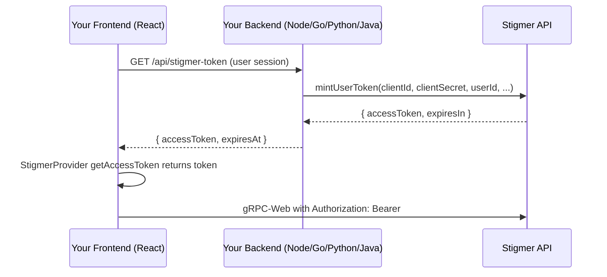

PlatformClient lets platform builders embed Stigmer into their products with
minimal friction. Instead of setting up OIDC federation, you create a
PlatformClient in the Stigmer Console, use its credentials from your backend to
mint user-scoped JWTs, and pass those tokens to the React SDK.

## When to use this

You're building a product that embeds Stigmer components (sessions, agents,
message threads) and your users need browser-side access to the Stigmer API.
PlatformClient is the right choice when:

- Your users don't have an OIDC provider that Stigmer can federate with
- You want a simpler integration path than full identity federation
- You already have your own authentication system and just need Stigmer access
  for your users

<Callout type="info">
  **Looking for a different auth method?** If your users already authenticate
  through an OIDC provider (Auth0, Okta, Entra ID), use [identity
  federation](/docs/guides/authentication/federation/overview) instead. If your
  backend calls the Stigmer API directly (no browser, no end users), use an [API
  key](/docs/sdk#authentication). See the [authentication
  overview](/docs/guides/authentication/overview) for a side-by-side comparison.
</Callout>

## How it works



1. Your backend authenticates the user (your auth, your session).
2. Your backend calls `mintUserToken` with PlatformClient credentials + user
   identity.
3. Stigmer returns a signed JWT scoped to that user.
4. Your frontend passes the token to `StigmerProvider` via `getAccessToken`.

## Prerequisites

- A PlatformClient created in the Stigmer Console (IAM > Platform Clients).
- The `client_id` (permanent, safe for config files) and `client_secret` (shown
  once at creation).
- Store `STIGMER_CLIENT_ID` and `STIGMER_CLIENT_SECRET` as environment variables
  on your backend. Never expose the secret in browser code.

## Backend: Mint user tokens

Each SDK provides a purpose-built helper for minting tokens. It is separate from
the main Stigmer client — you do not need an API key to use it.

### TypeScript (Node.js)

```typescript
import { createPlatformClientAuth } from "@stigmer/sdk/node";

const auth = createPlatformClientAuth({
  baseUrl: "https://api.stigmer.ai",
  clientId: process.env.STIGMER_CLIENT_ID!,
  clientSecret: process.env.STIGMER_CLIENT_SECRET!,
});

// In your /api/stigmer-token endpoint:
app.get("/api/stigmer-token", async (req, res) => {
  const { accessToken, expiresAt } = await auth.mintUserToken({
    userId: req.user.id,
    userEmail: req.user.email,
    userName: req.user.name,
  });
  res.json({ accessToken, expiresAt: expiresAt.toISOString() });
});
```

### Go

```go
import stigmer "github.com/stigmer/stigmer/sdk/go"

auth, err := stigmer.NewPlatformClientAuth(
    stigmer.WithPlatformClientCredentials(
        os.Getenv("STIGMER_CLIENT_ID"),
        os.Getenv("STIGMER_CLIENT_SECRET"),
    ),
)
if err != nil {
    log.Fatal(err)
}
defer auth.Close()

result, err := auth.MintUserToken(ctx, &stigmer.MintUserTokenInput{
    UserID:    user.ID,
    UserEmail: user.Email,
    UserName:  user.Name,
})
```

### Python

```python
from stigmer import platform_client_auth, MintUserTokenInput

auth = platform_client_auth(
    client_id=os.environ["STIGMER_CLIENT_ID"],
    client_secret=os.environ["STIGMER_CLIENT_SECRET"],
)

result = auth.mint_user_token(MintUserTokenInput(
    user_id=current_user.id,
    user_email=current_user.email,
    user_name=current_user.name,
))
```

### Java

```java
import ai.stigmer.sdk.PlatformClientAuth;
import ai.stigmer.sdk.MintUserTokenInput;
import ai.stigmer.sdk.MintUserTokenResult;

try (PlatformClientAuth auth = PlatformClientAuth.builder("api.stigmer.ai:443")
        .clientId(System.getenv("STIGMER_CLIENT_ID"))
        .clientSecret(System.getenv("STIGMER_CLIENT_SECRET"))
        .build()) {
    MintUserTokenResult result = auth.mintUserToken(MintUserTokenInput.builder()
        .userId(currentUser.getId())
        .userEmail(currentUser.getEmail())
        .userName(currentUser.getName())
        .build());
}
```

## Frontend: Wire up StigmerProvider

Your frontend fetches the token from your backend and passes it to
`StigmerProvider`. No `clientId` or `clientSecret` is needed in the browser.

```tsx
import { StigmerProvider } from "@stigmer/react";
import { Stigmer } from "@stigmer/sdk";

let cachedToken: { accessToken: string; expiresAt: Date } | null = null;

async function getAccessToken(): Promise<string | null> {
  if (cachedToken && cachedToken.expiresAt > new Date()) {
    return cachedToken.accessToken;
  }
  const res = await fetch("/api/stigmer-token");
  const data = await res.json();
  cachedToken = {
    accessToken: data.accessToken,
    expiresAt: new Date(data.expiresAt),
  };
  return cachedToken.accessToken;
}

const stigmer = new Stigmer({
  baseUrl: "https://api.stigmer.ai",
  getAccessToken,
});

function App() {
  return (
    <StigmerProvider client={stigmer}>
      {/* Your app with Stigmer components */}
    </StigmerProvider>
  );
}
```

## Automatic account creation

By default, `mintUserToken` fails with `NOT_FOUND` if the user doesn't have a
Stigmer Identity Account. Enable automatic provisioning on the PlatformClient to
create accounts on first encounter:

- **`auto_provision_accounts: true`** — creates an IdentityAccount on first
  encounter.
- **`auto_grant_on_org: true`** — grants a role on your organization
  immediately.
- **`auto_grant_role`** — the role to grant (default: `viewer`).

Identity resolution is **org-scoped**: the same `user_id` presented via any
PlatformClient in your organization resolves to a single Stigmer identity. If
you have separate PlatformClients for your dashboard, mobile app, and admin
tool, a user who signs in through any of them shares one identity account and
one set of permissions. Use a consistent, stable identifier across all your apps
(for example, your Auth0 `sub`, Clerk user ID, or database primary key).

## Error handling

All SDKs return structured errors with actionable messages:

| Error code            | When                                           | What to do                                                                                          |
| --------------------- | ---------------------------------------------- | --------------------------------------------------------------------------------------------------- |
| `UNAUTHENTICATED`     | Invalid `client_id` or `client_secret`         | Verify `STIGMER_CLIENT_ID` and `STIGMER_CLIENT_SECRET`. If rotated, the previous secret is invalid. |
| `NOT_FOUND`           | User doesn't exist, auto-provisioning disabled | Enable `auto_provision_accounts` or pre-create the account.                                         |
| `FAILED_PRECONDITION` | Client secret expired                          | Rotate the secret in the Console or CLI.                                                            |
| `PERMISSION_DENIED`   | Origin not in `allowed_origins`                | Add the requesting origin to the PlatformClient's `allowed_origins`.                                |

## Security notes

- The `client_secret` is a backend-only credential. Never include it in browser
  bundles, mobile apps, or client-side code.
- Secret rotation invalidates the old secret immediately. There is no grace
  period.
- The `client_id` is safe for configuration files, logs, and client-side code —
  it is not a secret.
- Tokens are signed by Stigmer's private key and verified in-process. There is
  no JWKS endpoint (yet).
- Use `allowed_origins` to restrict which browser origins can use tokens minted
  by this PlatformClient.

## Troubleshooting

<Steps>
<Step>

### Verify your credentials

`UNAUTHENTICATED` means the `client_id` or `client_secret` is wrong. Check that
`STIGMER_CLIENT_ID` and `STIGMER_CLIENT_SECRET` match the values from the
Stigmer Console. If you rotated the secret, the previous one is no longer valid.

</Step>
<Step>

### Check if the user exists

`NOT_FOUND` means the user doesn't have a Stigmer Identity Account and automatic
provisioning is disabled. Enable `auto_provision_accounts` on the PlatformClient
or create the account before calling `mintUserToken`.

</Step>
<Step>

### Verify the user ID is consistent

If the same person gets different Identity Accounts across your apps, you're
passing different `user_id` values. Identity resolution is org-scoped --- use
the same stable identifier (your database primary key, Auth0 `sub`, or Clerk
user ID) across all PlatformClients in your Organization.

</Step>
<Step>

### Check allowed origins

`PERMISSION_DENIED` when the browser calls the Stigmer API usually means the
requesting origin isn't in the PlatformClient's `allowed_origins` list. Add your
app's origin (for example, `https://app.example.com`) in the Console.

</Step>
</Steps>

## What's next

- **Manage PlatformClients** --- Create, rotate secrets, and configure settings
  in the Console under Settings > Platform Clients, or use the
  [PlatformClient API](/docs/sdk/resources/platform-client).
- **React hooks and components** ---
  [PlatformClient React reference](/docs/sdk/react/platform-client) documents
  the admin hooks for managing PlatformClients programmatically.
- **Need full SSO or IdP integration?** --- PlatformClient gives your users
  Stigmer access, but it doesn't provide a Stigmer Console login. If you need
  SSO, see the
  [federation guide](/docs/guides/authentication/federation/overview).
- **Compare authentication paths** --- the
  [authentication overview](/docs/guides/authentication/overview) has a
  side-by-side comparison of API keys, federation, and PlatformClient.
