# Deploying Resources with `stigmer apply`

The `apply` command deploys agents and workflows from your code automatically. Write your resources in Go using the SDK, run `stigmer apply`, and Stigmer discovers and deploys everything.

## How It Works

```mermaid
flowchart TB
    A[stigmer apply] --> B[Load Stigmer.yaml]
    B --> C[Validate main.go]
    C --> D[Execute: go run .]
    D --> E[SDK Synthesizes Manifests]
    E --> F[.stigmer/agent-manifest.pb]
    E --> G[.stigmer/workflow-manifest.pb]
    F --> H[CLI Reads Manifests]
    G --> H
    H --> I[Convert to API Resources]
    I --> J[Deploy via gRPC]
    J --> K[✅ Resources Deployed]
```



**No manual YAML** - Your Go code IS the configuration. The SDK automatically converts it to deployment manifests.

## Quick Start

### 1. Create a Project

```bash
stigmer new my-agent
cd my-agent
```

This creates:
```
my-agent/
├── Stigmer.yaml    # Project metadata
├── main.go         # Your agent/workflow code
├── go.mod          # Go dependencies
└── README.md       # Documentation
```

### 2. Write Your Code

The generated `main.go` already has a working example. Customize it:

```go
package main

import (
    "log"
    "github.com/stigmer/stigmer-sdk/go/stigmer"
    "github.com/stigmer/stigmer-sdk/go/agent"
)

func main() {
    err := stigmer.Run(func(ctx *stigmer.Context) error {
        agent.New(ctx,
            agent.WithName("my-agent"),
            agent.WithInstructions("You are a helpful assistant..."),
        )
        return nil
    })
    if err != nil {
        log.Fatal(err)
    }
}
```

### 3. Deploy

```bash
# Start server (if not already running)
stigmer server

# Deploy your code
stigmer apply
```

**Output**:
```
ℹ Loading project configuration...
✓ ✓ Loaded Stigmer.yaml
ℹ   Project:  my-agent
ℹ   Runtime:  go
ℹ   Main:     main.go

ℹ Executing entry point to discover resources...
✓ ✓ Synthesis complete: 1 resource(s) discovered (0 skill(s), 1 agent(s), 0 workflow(s))

ℹ Agents discovered: 1
ℹ   1. my-agent
ℹ      Description: A helpful assistant

ℹ Using organization from context: org-abc123
ℹ Connecting to backend...
✓ ✓ Connected to backend

✓ 🚀 Deployment successful!

┌───────┬──────────┬────────────┬─────────────────────────┐
│ TYPE  │   NAME   │   STATUS   │           ID            │
├───────┼──────────┼────────────┼─────────────────────────┤
│ Agent │ my-agent │ ✓ Created  │ agent_xyz789            │
└───────┴──────────┴────────────┴─────────────────────────┘

✅ Successfully applied 1 resource(s)

ℹ Next steps:
ℹ   - View agents: stigmer agent list
ℹ   - Update and redeploy: edit code and run 'stigmer apply' again
```

## The Stigmer.yaml File

Every Stigmer project has a minimal `Stigmer.yaml` configuration:

```yaml
name: my-project
runtime: go
version: 1.0.0
description: My Stigmer project
```

**Fields**:
- **name** (required) - Project name
- **runtime** (required) - SDK runtime (`go` for Go SDK)
- **version** (optional) - Project version
- **description** (optional) - Project description  
- **main** (optional) - Entry point file (default: `main.go`)
- **organization** (optional) - Override organization ID

**Filename**: Use `Stigmer.yaml` (capital S) following the Pulumi convention. The CLI also accepts `stigmer.yaml` (lowercase) for backwards compatibility.

**What it doesn't contain**: Resource definitions! Those are auto-discovered from your code.

## Command Flags

### Basic Usage

```bash
stigmer apply [flags]
```

### Available Flags

**`--config <path>`** - Specify Stigmer.yaml location

```bash
# Apply from different directory
stigmer apply --config /path/to/project/

# Apply with specific config file
stigmer apply --config /path/to/Stigmer.yaml
```

**`--dry-run`** - Validate without deploying

```bash
stigmer apply --dry-run
```

Output shows discovered resources but doesn't deploy:
```
✓ ✓ Synthesis complete: 3 resource(s) discovered (0 skill(s), 2 agent(s), 1 workflow(s))

ℹ Agents discovered: 2
ℹ   1. code-reviewer
ℹ   2. security-scanner

ℹ Workflows discovered: 1
ℹ   1. pr-analysis


Dry run: The following resources would be applied:

┌──────────┬──────────────────┬────────┐
│   TYPE   │       NAME       │ ACTION │
├──────────┼──────────────────┼────────┤
│ Agent    │ code-reviewer    │ Create │
│ Agent    │ security-scanner │ Create │
│ Workflow │ pr-analysis      │ Create │
└──────────┴──────────────────┴────────┘

💡 Dry run successful - no resources were deployed
```

**`--org <org-id>`** - Override organization

```bash
stigmer apply --org org-prod-123
```

Organization priority:
1. `--org` flag (highest)
2. `organization` in Stigmer.yaml
3. Organization from CLI context
4. Error if none specified

## Local vs Cloud Mode

The apply command automatically works with your current backend mode:

### Local Mode

```bash
# Set to local mode
stigmer backend set local

# Apply (connects to localhost:50051)
stigmer apply
```

Resources deployed to local BadgerDB.

### Cloud Mode

```bash
# Switch to cloud
stigmer backend set cloud

# Apply (connects to api.stigmer.ai:443)
stigmer apply
```

Resources deployed to Stigmer Cloud.

**No code changes needed** - Same `stigmer apply` command works in both modes!

## Development Workflow

### Iterative Development

```bash
# Initial deployment
stigmer apply

# Edit your code
vim main.go

# Redeploy (updates existing resources)
stigmer apply
```

The apply command uses upsert semantics - creates if new, updates if exists.

### Validation Before Deploy

```bash
# Check if code is valid
stigmer apply --dry-run

# If valid, deploy for real
stigmer apply
```

### Working with Multiple Agents

```go
func main() {
    stigmer.Run(func(ctx *stigmer.Context) error {
        // Multiple agents in one file
        agent.New(ctx,
            agent.WithName("code-reviewer"),
            agent.WithInstructions("Review code..."),
        )
        
        agent.New(ctx,
            agent.WithName("security-scanner"),
            agent.WithInstructions("Find security issues..."),
        )
        
        return nil
    })
}
```

Run `stigmer apply` → Both agents discovered and deployed.

### Working with Workflows and Agents

```go
func main() {
    stigmer.Run(func(ctx *stigmer.Context) error {
        // Define agent
        reviewer := agent.New(ctx,
            agent.WithName("pr-reviewer"),
            agent.WithInstructions("Review PRs..."),
        )
        
        // Define workflow that uses the agent
        workflow.New(ctx,
            workflow.WithName("review-prs"),
            workflow.WithTask(
                workflow.CallAgent("review",
                    workflow.Agent(reviewer),
                    workflow.Message("Review this PR..."),
                ),
            ),
        )
        
        return nil
    })
}
```

Run `stigmer apply` → Agent and workflow deployed in correct order.

## Under the Hood

### What Happens When You Run Apply

1. **Load Configuration**
   - Finds Stigmer.yaml in current directory
   - Validates required fields (name, runtime)
   - Resolves entry point path

2. **Validate Entry Point**
   - Checks main.go exists
   - Verifies it contains Stigmer SDK imports
   - Validates go.mod if present

3. **Execute and Synthesize**
   - Runs `go mod tidy` to ensure dependencies are current
   - Executes `go run .` with `STIGMER_OUT_DIR=.stigmer`
   - SDK's `stigmer.Run()` writes manifests to `.stigmer/`
   - Manifests contain all agents/workflows defined in code

4. **Read Manifests**
   - Reads `.stigmer/agent-manifest.pb` (if present)
   - Reads `.stigmer/workflow-manifest.pb` (if present)
   - Validates SDK metadata and resource definitions
   - Shows preview of discovered resources

5. **Deploy Resources**
   - Loads organization (from flag, config, or context)
   - Connects to backend (local daemon or cloud)
   - Converts AgentBlueprint → Agent API resource
   - Calls `apply` RPC for each resource (upsert semantics)
   - Reports deployment status

### The .stigmer Directory

After running apply, you'll see:

```
my-agent/
├── .stigmer/
│   ├── agent-manifest.pb        # Serialized agent definitions
│   └── workflow-manifest.pb     # Serialized workflow definitions
├── Stigmer.yaml
└── main.go
```

These `.pb` files are protobuf-serialized manifests generated by the SDK. The CLI reads them to deploy resources.

**Why protobuf?**
- Fast serialization/deserialization
- Type-safe schema validation
- SDK is proto-agnostic (doesn't need platform proto definitions)
- CLI handles platform proto conversion

## Comparison with YAML Manifests

### Old Way (Manual YAML)

```yaml
# agent.yaml - Manual manifest writing
apiVersion: agentic.stigmer.ai/v1
kind: Agent
metadata:
  name: code-reviewer
spec:
  instructions: |
    You are an expert code reviewer...
  skills:
    - name: security-guidelines
      content: |
        # Security Guidelines
        ...
```

```bash
stigmer apply -f agent.yaml  # Apply individual files
```

### New Way (Code)

```go
// main.go - Auto-discovered from code
package main

import (
    "github.com/stigmer/stigmer-sdk/go/stigmer"
    "github.com/stigmer/stigmer-sdk/go/agent"
)

func main() {
    stigmer.Run(func(ctx *stigmer.Context) error {
        agent.New(ctx,
            agent.WithName("code-reviewer"),
            agent.WithInstructions("You are an expert code reviewer..."),
            agent.WithSkillFromFile("security-guidelines", "skills/security.md"),
        )
        return nil
    })
}
```

```bash
stigmer apply  # Auto-discovers and deploys everything
```

**Benefits of code approach**:
- ✅ Type safety (Go compiler catches errors)
- ✅ IDE autocomplete and validation
- ✅ Programmatic resource generation (loops, conditionals)
- ✅ DRY - reuse functions and variables
- ✅ Testing - write unit tests for resource definitions
- ✅ Version control friendly (code diffs > YAML diffs)

**Note**: The `-f` manifest mode is not yet implemented in Stigmer OSS. This is intentional - the code-first approach is the recommended path.

## Error Messages

### Not in a Stigmer Project

```bash
$ stigmer apply
Error: Stigmer.yaml not found in current directory

This is not a Stigmer project directory.

To initialize a new Stigmer project:
  stigmer new

Or, if you have a Stigmer.yaml in another directory:
  stigmer apply --config /path/to/Stigmer.yaml
```

### Invalid Entry Point

```bash
$ stigmer apply
Error: file must import Stigmer SDK (agent, workflow, or stigmer package)
```

Your main.go must import at least one Stigmer SDK package.

### Organization Not Set

```bash
$ stigmer apply
Error: organization not set. Specify in Stigmer.yaml, use --org flag, or run:
  stigmer context set --org <org-id>
```

### Synthesis Failed

```bash
$ stigmer apply
Error: failed to execute Go agent:
./main.go:15:2: undefined: invalidFunction
...
```

Go compilation errors are shown directly - fix your code and retry.

## Best Practices

### 1. Use Dry Run for Validation

```bash
# Before deploying to production
stigmer apply --dry-run --org org-prod

# If valid, deploy
stigmer apply --org org-prod
```

### 2. Pin Organization in Stigmer.yaml

For production projects:

```yaml
name: production-agents
runtime: go-sdk
organization: org-prod-abc123  # Pin to specific org
```

Prevents accidental deployment to wrong organization.

### 3. Organize Skills in Files

```go
agent.New(ctx,
    agent.WithName("code-reviewer"),
    agent.WithInstructions("Review code..."),
    // Load skills from markdown files
    agent.WithSkillFromFile("security", "./skills/security.md"),
    agent.WithSkillFromFile("performance", "./skills/performance.md"),
)
```

Keeps agent definitions clean and skills version-controlled.

### 4. Use Version Field

```yaml
name: my-agent
version: 1.2.3  # Semantic versioning
runtime: go-sdk
```

Track your agent versions for rollback and history.

## Troubleshooting

### "go: no module declaration in go.mod"

Run:
```bash
go mod init your-project-name
go mod tidy
```

### "failed to update dependencies"

```bash
# Manually run go mod tidy
go mod tidy

# Then retry apply
stigmer apply
```

### "Backend not running"

```bash
# Check backend status
stigmer backend status

# Start if needed
stigmer server
```

### "no manifests found - synthesis failed"

Your code executed but didn't generate manifests. Check:
1. Did you call `stigmer.Run()`?
2. Did you define any agents or workflows inside the callback?
3. Are there Go compilation errors?

Run with debug to see execution output:
```bash
stigmer --debug apply
```

## Advanced Usage

### Custom Entry Point

```yaml
name: my-project
runtime: go-sdk
main: cmd/deploy/main.go  # Custom entry point
```

### Multiple Projects in One Repo

```
monorepo/
├── agent-a/
│   ├── Stigmer.yaml
│   └── main.go
└── agent-b/
    ├── Stigmer.yaml
    └── main.go
```

```bash
# Deploy each independently
cd agent-a && stigmer apply
cd agent-b && stigmer apply
```

### Environment-Specific Configurations

Use Go's build tags or environment variables:

```go
func main() {
    stigmer.Run(func(ctx *stigmer.Context) error {
        instructions := getInstructions() // Load from env or file
        
        agent.New(ctx,
            agent.WithName("my-agent"),
            agent.WithInstructions(instructions),
        )
        return nil
    })
}

func getInstructions() string {
    if os.Getenv("ENV") == "production" {
        // Production-specific instructions
        return "Be extra cautious..."
    }
    return "Development mode..."
}
```

## Architecture: Synthesis Model

Stigmer's apply command follows the **synthesis architecture** (inspired by Pulumi):

**Traditional approach** (manual manifests):
```
Write YAML → Apply YAML → Resources Created
```

**Stigmer approach** (code synthesis):
```
Write Code → Execute Code → Synthesize Manifests → Apply Manifests → Resources Created
```

**Why synthesis?**
- **Type safety** - Go compiler validates your code
- **Programmatic** - Generate resources dynamically
- **DRY** - Reuse functions and variables
- **Testable** - Write unit tests for resource generation
- **IDE-friendly** - Autocomplete, jump-to-definition, refactoring

The SDK is **proto-agnostic** - it only knows about manifests, not platform proto definitions. The CLI handles conversion from manifests to platform API resources.

## SDK-CLI Contract

The apply command relies on this contract between SDK and CLI:

**SDK responsibilities**:
1. Provide `stigmer.Run()` function
2. Check for `STIGMER_OUT_DIR` environment variable
3. Serialize resources to protobuf manifests
4. Write to `$STIGMER_OUT_DIR/agent-manifest.pb` and/or `workflow-manifest.pb`

**CLI responsibilities**:
1. Set `STIGMER_OUT_DIR` before executing user code
2. Read generated manifest files
3. Validate manifests (SDK metadata, required fields)
4. Convert to platform API resources
5. Deploy via gRPC

This separation allows SDKs to be simple and language-idiomatic while the CLI handles platform complexity.

## Comparison with Cloud Deployment

The code you write is **identical** for local and cloud deployments:

```go
// Same code works in both modes!
stigmer.Run(func(ctx *stigmer.Context) error {
    agent.New(ctx,
        agent.WithName("my-agent"),
        agent.WithInstructions("..."),
    )
    return nil
})
```

What changes:
- **Local mode**: `stigmer backend set local` → Deploys to localhost BadgerDB
- **Cloud mode**: `stigmer backend set cloud` → Deploys to Stigmer Cloud

The apply command automatically detects the current backend and connects appropriately.

## When to Use Apply vs New

**Use `stigmer new`** when:
- ✅ Starting a new project from scratch
- ✅ Want a working example to customize
- ✅ Learning Stigmer for the first time

**Use `stigmer apply`** when:
- ✅ Deploying existing project
- ✅ Updating deployed resources (redeploy after code changes)
- ✅ Validating project (with --dry-run)
- ✅ Switching organizations (with --org)

**Typical workflow**:
```bash
stigmer new my-project   # Once: Create project
cd my-project
stigmer apply            # First deploy

# Edit main.go
vim main.go

stigmer apply            # Update deployed resources
stigmer apply            # Update again
stigmer apply            # And again...
```

## Future Enhancements

Currently not implemented (but planned):

**Manifest mode with `-f` flag**:
```bash
stigmer apply -f environment.yaml   # Future
stigmer apply -f instance.yaml      # Future
```

**Selective deployment**:
```bash
stigmer apply --only agents         # Future
stigmer apply --only workflows      # Future
```

For now, apply deploys all discovered resources. Use code to control what gets deployed (comment out resources you don't want).

---

**Related Documentation**:
- [Local Mode Guide](../getting-started/local-mode.md) - Getting started with local development
- [CLI Commands Reference](../../client-apps/cli/COMMANDS.md) - All CLI commands
- [SDK Documentation](../sdk/README.md) - Writing agents and workflows with the SDK
