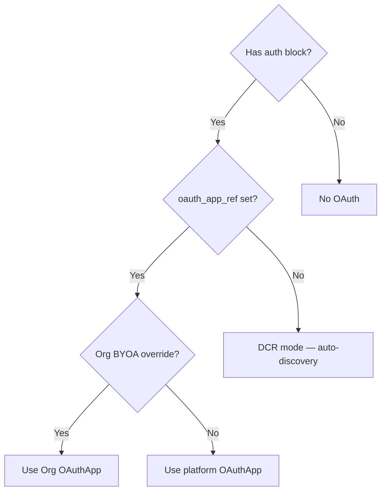
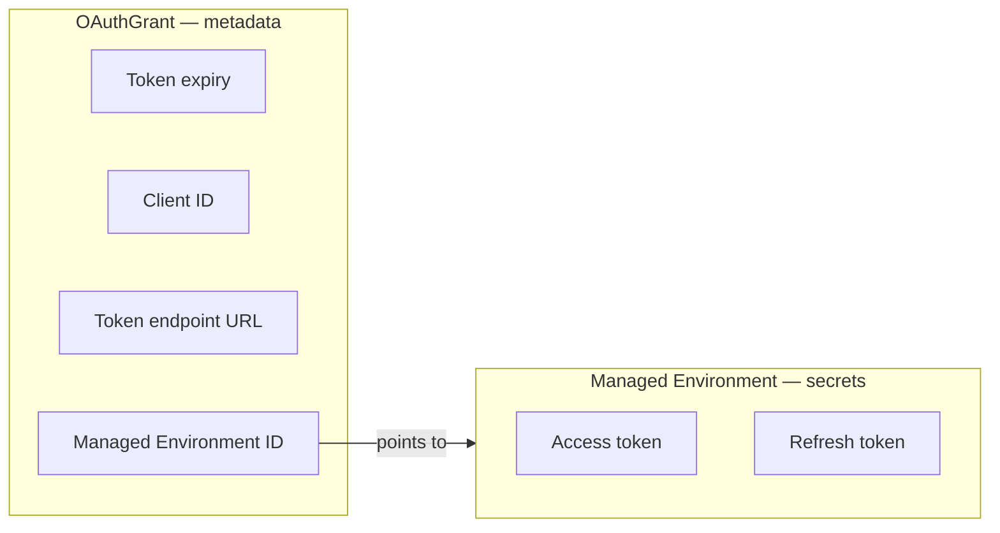
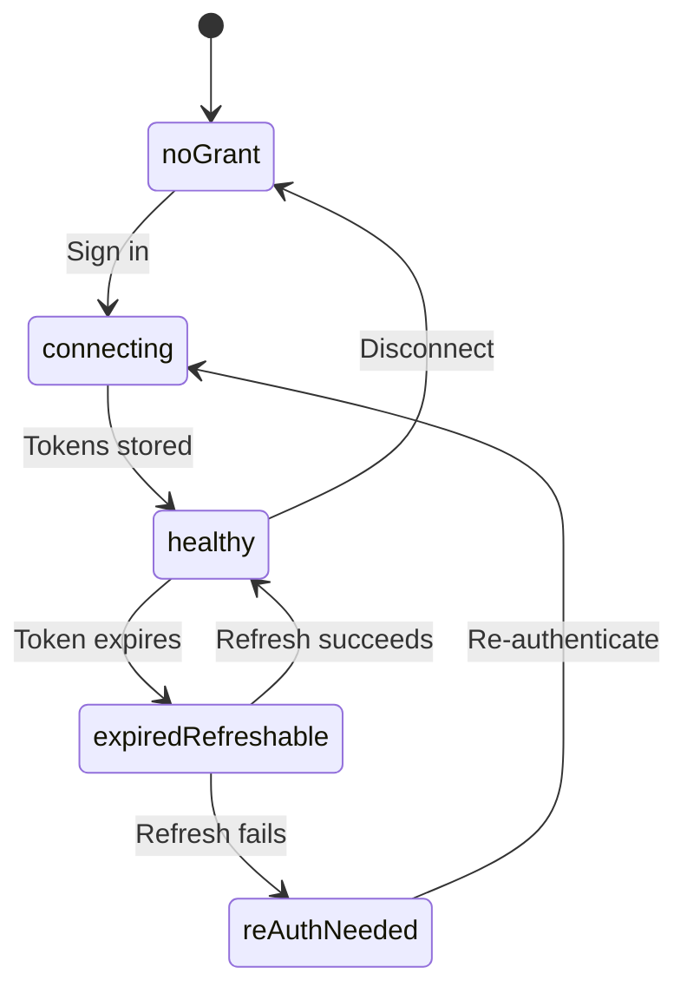

When you connect an OAuth-protected tool, several things happen behind the
scenes. The [OAuth for tools](/docs/guides/integrations/oauth-for-tools) and
[Bring Your Own OAuth App](/docs/guides/integrations/bring-your-own-oauth)
guides cover the user-facing experience. This page explains the architecture
underneath: how Stigmer decides which OAuth app to use, where tokens are stored,
and how they stay fresh.

## Two authentication modes

Stigmer supports two OAuth modes for MCP servers. The mode is determined by the
`auth` block in the server definition:

| Mode                | When it applies                            | How it works                                                                                                                                                                                                                 |
| ------------------- | ------------------------------------------ | ---------------------------------------------------------------------------------------------------------------------------------------------------------------------------------------------------------------------------- |
| **Automatic (DCR)** | `auth.oauth_app_ref` is empty              | Stigmer discovers the authorization server from the MCP server URL, registers a client via Dynamic Client Registration (RFC 7591), and performs the authorization code flow with PKCE. No pre-registered credentials needed. |
| **Vendor OAuth**    | `auth.oauth_app_ref` points to an OAuthApp | Stigmer uses pre-registered client credentials from an OAuthApp resource to perform the authorization code flow with the vendor (GitHub, Slack, Figma, etc.).                                                                |

From the user's perspective, both modes look identical: click a button,
authorize in a popup, done. The difference is where the client credentials come
from.

DCR servers derive everything from the server URL — the authorization endpoint,
token endpoint, and client registration are all discovered automatically. Vendor
OAuth servers use a pre-registered OAuthApp that holds the client ID, client
secret, and endpoint URLs for a specific vendor.

## How Stigmer picks the OAuth app

For vendor OAuth servers, Stigmer evaluates a resolution chain to determine
which OAuthApp credentials to use. This chain runs at two points: when you first
connect, and on every token refresh.

The resolution chain has three levels, from highest to lowest priority:

1. **Organization override** — An admin set up a
   [BYOA override](/docs/guides/integrations/bring-your-own-oauth) for this MCP
   server in this Organization. Stigmer uses the Organization's OAuthApp.
2. **Platform default** — The MCP server definition references a platform-level
   OAuthApp. Stigmer uses those credentials.
3. **None** — No OAuthApp exists. The server either uses DCR (automatic) or has
   no OAuth at all.

This chain is evaluated fresh every time — at connect, on token refresh, and
when the frontend queries the OAuth status. This is why removing a BYOA override
takes effect immediately: the next resolution returns the platform default
instead of the Organization's app.

## Where credentials live

OAuth tokens are split across two storage layers with a deliberate security
boundary between them.

**OAuthGrant** stores non-secret metadata: when the token expires, which client
ID was used, where to send refresh requests, and which Managed Environment holds
the actual tokens. The grant is keyed by three values: the user, the MCP server,
and the Organization. This composite key means the same user can maintain
separate OAuth connections for the same MCP server across different
Organizations.

**Managed Environment** stores the secrets: the access token and, if the vendor
issues one, a refresh token. The Environment is encrypted at rest and labeled as
system-managed to prevent user mutation. Each grant has exactly one Managed
Environment — deleting the grant deletes the Environment.

**Why the split?** The backend checks token expiry before every Agent execution.
This pre-flight check reads the grant's expiry timestamp — a non-secret value —
without accessing the encrypted secret store. The backend only touches the
Managed Environment when it needs to refresh or use the actual token. This
separation is a security boundary: the pre-flight path has no access to secrets.

### Environment priority at execution time

When an Agent runs, Environment variables are resolved from multiple sources.
The highest-priority value wins:

| Priority | Source                          | What it provides                                   |
| -------- | ------------------------------- | -------------------------------------------------- |
| Highest  | **OAuth Managed Environment**   | Access tokens acquired through OAuth connect flows |
|          | **Personal Environment**        | API keys and credentials the user enters manually  |
| Lowest   | **Agent Instance Environments** | Shared configuration attached at deployment time   |

This layering means an OAuth-managed token always takes precedence over a
manually entered value. If you set up OAuth for a server and also enter an API
key manually, the OAuth token wins at execution time.

## How tokens stay fresh

After the initial connect, Stigmer manages the full token lifecycle without
further action from you.

### The connect flow

When you click **Sign in to connect**, the backend performs three steps:

1. **Initiate** — Generates an authorization URL with a PKCE challenge, state
   parameter, and the scopes from the OAuthApp. For DCR servers, this step also
   discovers the authorization server and registers a client, then probes the
   built authorization URL server-side before returning it. Some vendors accept
   any redirect URI at registration but enforce a redirect-host allowlist at
   the authorization endpoint (Canva, for example, requires public callback
   hosts to be approved through its MCP waitlist). Without the probe, that
   rejection would only ever appear as a vendor error page inside the popup —
   the flow would never learn it failed. A definite rejection (HTTP 400) fails
   the initiate with an explanation of the deployment's callback host; any
   other response proceeds normally, so an unreachable or bot-protected
   authorization endpoint never blocks a working sign-in.
2. **Authorize** — You approve the request in the vendor's authorization page.
   The vendor redirects back with an authorization code.
3. **Complete** — The backend exchanges the code for tokens using the PKCE
   verifier, stores them in a new Managed Environment, and creates an OAuthGrant
   with the expiry metadata.

After this, the standard connect flow runs — discovering tools and classifying
approval policies, the same process described in the
[marketplace guide](/docs/guides/integrations/connect-from-marketplace#connect-an-mcp-server).

### Pre-flight check

Before every Agent execution, the backend reads the OAuthGrant and checks the
token expiry timestamp. If the token is still valid, execution proceeds
normally. If the token has expired, the backend attempts an automatic refresh
before the execution starts.

### Automatic refresh

When the access token has expired and a refresh token is available, the backend
sends a refresh request to the token endpoint recorded on the grant. It uses the
client credentials from the currently resolved OAuthApp — not necessarily the
OAuthApp that was active when the grant was originally created.

This distinction matters for BYOA: if you switch from an Organization override
to the platform default between refreshes, the next refresh request uses the
platform's client credentials.

If the refresh succeeds, the backend writes the new tokens to the same Managed
Environment and updates the grant's expiry timestamp.

### When refresh fails

If both the access token and refresh token have expired — or if the vendor has
revoked the grant — the refresh fails. The Agent execution does not start.
Instead, the connection status changes to **Re-auth needed**, and you
re-authenticate from the MCP server's connect page with a single click.

### Connection health

The backend evaluates four health states from the grant metadata:

| State                    | Meaning                                             | What happens                                     |
| ------------------------ | --------------------------------------------------- | ------------------------------------------------ |
| **Healthy**              | The access token is valid                           | Execution proceeds normally                      |
| **Expired, can refresh** | The access token expired but a refresh token exists | Backend refreshes automatically before execution |
| **Expired**              | Both tokens expired and no refresh is possible      | You must re-authenticate                         |
| **No grant**             | No OAuth connection exists                          | You have never connected or have disconnected    |

These map directly to the UI states shown in the
[OAuth for tools](/docs/guides/integrations/oauth-for-tools#token-lifecycle)
guide.

## What BYOA changes

A [BYOA override](/docs/guides/integrations/bring-your-own-oauth) shifts all
three architectural layers:

- **Resolution** — The chain returns the Organization's OAuthApp instead of the
  platform default. The connect flow, token refresh, and status queries all use
  the Organization's client credentials.
- **Storage** — New grants store the Organization's client ID and the
  Organization OAuthApp's token endpoint. Existing grants from before the
  override are unaffected — they still reference the original client
  credentials.
- **Lifecycle** — Token refreshes resolve the OAuthApp fresh each time. After a
  BYOA change, the next refresh uses the new credentials automatically.

This is also why removing a BYOA override breaks existing grants: those grants
were issued with the Organization's client ID. When the override is removed, the
next refresh uses the platform's client ID — and the vendor rejects it because
the refresh token was issued to a different client. Each affected user sees a
**Re-auth needed** state and reconnects with a single click.
