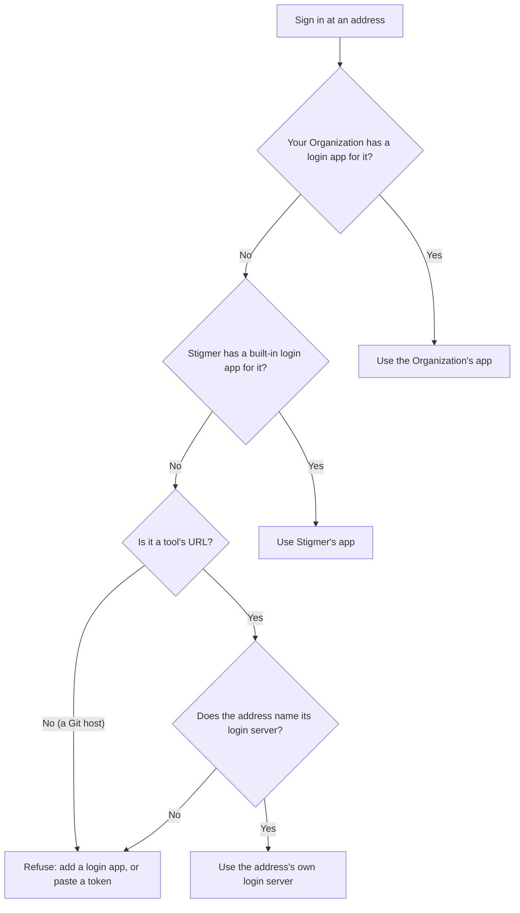
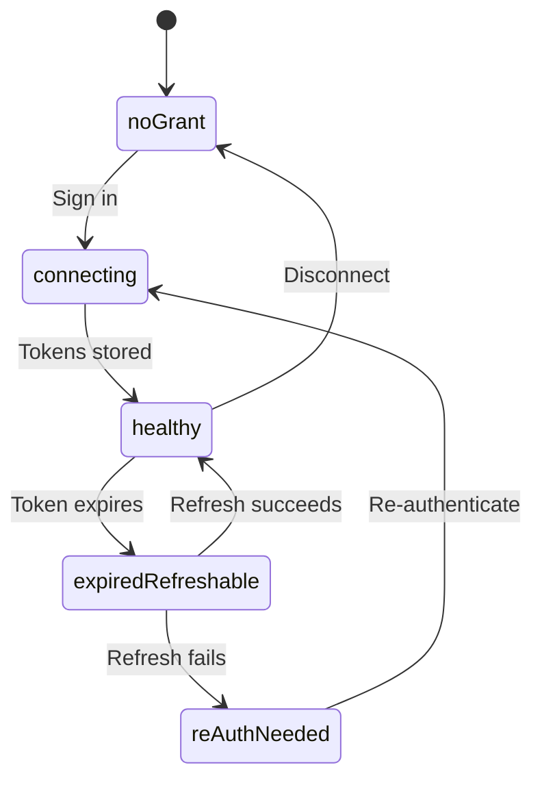

When you sign in to an OAuth-protected tool, several things happen behind the
scenes. The [OAuth for tools](/docs/guides/integrations/oauth-for-tools) and
[Bring Your Own OAuth App](/docs/guides/integrations/bring-your-own-oauth)
guides cover the user-facing experience. This page explains the architecture
underneath: how Stigmer decides which OAuth client signs you in, where tokens
are stored, and how they stay fresh.

## A login is found by its address

Every sign-in starts from an **address**: the URL of the tool you sign in to
(`https://mcp.linear.app/mcp`), or a Git host (`github.com`). Nothing in a tool
definition names an OAuth app. Stigmer looks for the OAuth client for that
address in one order, and the first match signs you in:

```mermaid
flowchart TD
    start["Sign in at an address"]
    orgApp{"Your Organization has a login app for it?"}
    builtIn{"Stigmer has a built-in login app for it?"}
    isTool{"Is it a tool's URL?"}
    discover{"Does the address name its login server?"}
    useOrg["Use the Organization's app"]
    useBuiltIn["Use Stigmer's app"]
    useServer["Use the address's own login server"]
    refuse["Refuse: add a login app, or paste a token"]

    start --> orgApp
    orgApp -->|Yes| useOrg
    orgApp -->|No| builtIn
    builtIn -->|Yes| useBuiltIn
    builtIn -->|No| isTool
    isTool -->|"No (a Git host)"| refuse
    isTool -->|Yes| discover
    discover -->|Yes| useServer
    discover -->|No| refuse
```

1. **Your Organization's login app.** An admin registered an OAuth app with the
   vendor and listed the addresses it signs in to
   ([Bring Your Own OAuth App](/docs/guides/integrations/bring-your-own-oauth)).
   Each address belongs to one app in an Organization.
2. **Stigmer's built-in login app.** The deployment's operator registered an app
   for a vendor and switched it on with two settings, such as
   `STIGMER_GITHUB_CLIENT_ID` and `STIGMER_GITHUB_CLIENT_SECRET`. GitHub is one:
   signing in at `github.com` uses it, in every Organization, with no setup.
3. **The address's own login server.** A tool that follows the MCP Authorization
   specification says where its login server is (RFC 9728 protected resource
   metadata). Stigmer reads that, then becomes a client of the login server in
   the order the specification gives:
   - a **Client ID Metadata Document**, when the login server accepts one and
     the deployment has a public `https` address: Stigmer's client ID is the URL
     of a document it serves, `/v1/oauth/client.json`, and nothing is
     registered;
   - otherwise **Dynamic Client Registration** (RFC 7591), done once per login
     server: the first sign-in registers Stigmer, and every later sign-in, in
     any Organization, reuses that client. Two tools behind the same login
     server share it. If the login server later forgets the client, Stigmer
     registers again on the next sign-in.
4. **Nothing.** The sign-in is refused with the address and the way forward, for
   example
   `nothing can sign in to https://mcp.example.com/mcp: … Add a login app for https://mcp.example.com/mcp in Settings, or paste a token`.
   A Git host has no login server to read, so only steps 1 and 2 apply to it.

From your side, all of these look the same: click **Sign in**, approve on the
vendor's page, done. The difference is whose OAuth client the vendor sees.

### The token is minted for the address

When Stigmer signs in through a login server it found from the address (step 3),
both requests to that login server carry the address as the `resource` (RFC
8707), as the MCP specification requires. A login server that honours it mints a
token for that address only. Stigmer also discards a tool's metadata when it
names a different address than the one asked, so a server cannot borrow another
tool's login server under its own name. A sign-in through a login app (steps 1
and 2) goes to the vendor's own endpoints, which are not asked for a `resource`.

## Where credentials live

A sign-in is saved as a **connection** in a [vault](/docs/concepts/vaults): your
own My vault, or a shared vault you may edit when you choose one. The connection
is saved at the address you signed in to, and it serves every HTTP tool whose
URL is that address, exactly as a login pasted at that address does. Two tools
on one host under different paths keep separate logins. A local program (a tool
that runs a command) has no address and no sign-in: it takes its keys from
secrets by name.

A connection holds:

- **The access token**, sealed at rest. A run fills the tool's login variable
  (`auth.target_env_var`) from it.
- **The sign-in record**: when the token expires, the client ID, the token
  endpoint, how the sign-in was performed and which login app it used, with the
  **refresh token** sealed beside them. The refresh token never reaches a run.

No read returns either token. Because each person's sign-in lives in their own
vault, a teammate's chat never uses yours, and each person signs in once for
themselves.

### Where a run's values come from

When an Agent runs, each key is looked for in the sending person's own vault,
when the conversation includes it, then in the vaults the conversation lists. A
tool's login variable is filled by a connection at the tool's address first,
then by a secret with the same name, so if you sign in to a tool and also save
an API key under its variable, the sign-in is the one the run uses.
[Vaults](/docs/concepts/vaults#which-vaults-a-run-uses) explains the order in
full.

## How tokens stay fresh

After the sign-in, Stigmer manages the full token lifecycle without further
action from you.

```mermaid
stateDiagram-v2
    [*] --> noGrant
    noGrant --> connecting: Sign in
    connecting --> healthy: Tokens stored
    healthy --> expiredRefreshable: Token expires
    expiredRefreshable --> healthy: Refresh succeeds
    expiredRefreshable --> reAuthNeeded: Refresh fails
    reAuthNeeded --> connecting: Re-authenticate
    healthy --> noGrant: Disconnect
```

### The sign-in flow

When you click **Sign in**, three steps run:

1. **Start** — The server finds the OAuth client for the address (above) and
   builds the login page's URL with a PKCE challenge, a state value and the
   scopes: the tool's own `scopes_supported`, else its login server's, else the
   login app's. For a client registered with the tool's login server, the server
   first probes that URL. Some vendors accept any redirect at registration but
   enforce a redirect-host allowlist at the login page (Canva, for example,
   requires public callback hosts to be approved through its MCP waitlist).
   Without the probe, that rejection would only appear as a vendor error page
   inside the popup. A definite rejection (HTTP 400) fails the start with an
   explanation naming the deployment's callback host; any other answer proceeds,
   so an unreachable or bot-protected login page never blocks a working sign-in.
2. **Authorize** — You approve the request on the vendor's page. The vendor
   sends you back with an authorization code to the console's callback page (or,
   for the desktop app, to a page the app serves on your machine).
3. **Complete** — The server exchanges the code for tokens using the PKCE
   verifier and saves them as a connection at the address, replacing any login
   saved there. When the login app names an account endpoint, the saved login is
   described by the account ("GitHub @ana"); otherwise by the host.

Only the person who started a sign-in can complete it, and the vault is checked
again at completion. After a sign-in from an MCP Server's page, the standard
connect runs — discovering tools and which of them the server marks destructive,
the same process described in
[Connect an MCP Server](/docs/guides/integrations/connect-an-mcp-server#connect-an-mcp-server).

### Pre-flight check

Before every run, the backend reads the connection's sign-in record and checks
the token expiry timestamp. If the token is still valid, the run proceeds
normally. If the token has expired, the backend attempts an automatic refresh
before the run starts.

### Automatic refresh

When the access token has expired and a refresh token is available, the backend
sends a refresh request to the token endpoint recorded on the sign-in, with the
client ID recorded there: a renewal always goes to the client the sign-in was
made with. A sign-in made through a login app is renewed with that app's client
secret, read fresh so an admin's fix to the app applies at once, and sent only
while the app's client ID and token URL are still the ones the sign-in recorded.
A sign-in through the address's own login server renews without a secret, and
again names the address as the `resource`.

If the refresh succeeds, the backend writes the new tokens and expiry to the
same connection. A refresh and a key you save at the same moment never undo each
other, and a login that two tools share is renewed once per run.

### When refresh fails

If both the access token and refresh token have expired — or if the vendor has
revoked the grant — the refresh fails. The run does not start. Instead, the
connection status changes to **Re-auth needed**, and you sign in again with a
single click.

### Connection health

The backend evaluates four health states from the connection's sign-in record:

| State                    | Meaning                                             | What happens                                   |
| ------------------------ | --------------------------------------------------- | ---------------------------------------------- |
| **Healthy**              | The access token is valid                           | The run proceeds normally                      |
| **Expired, can refresh** | The access token expired but a refresh token exists | Backend refreshes automatically before the run |
| **Expired**              | Both tokens expired and no refresh is possible      | You must re-authenticate                       |
| **No grant**             | No sign-in is saved at the address                  | You have never connected or have disconnected  |

These map directly to the UI states shown in the
[OAuth for tools](/docs/guides/integrations/oauth-for-tools#token-lifecycle)
guide.

## When an admin adds or changes a login app

A login app changes which client **new** sign-ins use. A sign-in already saved
keeps the client it was made with:

- **Adding an app** for an address makes the next sign-in there go through it.
  Existing sign-ins keep renewing with the client they were made with; sign in
  again to move one to the new app.
- **Changing an app's client ID or token URL**, or removing the app, means a
  sign-in made with the old one renews without a secret, which a vendor that
  requires one refuses. Each affected person sees **Re-auth needed** and signs
  in again with a single click.

## Signing in for someone else: Connect links

An integrator that keeps one vault per customer can let a customer sign in
without a Stigmer account. A **Connect link** is a one-time page for one vault
and one address: the customer opens it, signs in on the vendor's own page, and
is sent back to the integrator's app, and the login is saved into that vault.
[Vaults](/docs/concepts/vaults#connect-links-for-your-customers) shows how to
make one.
