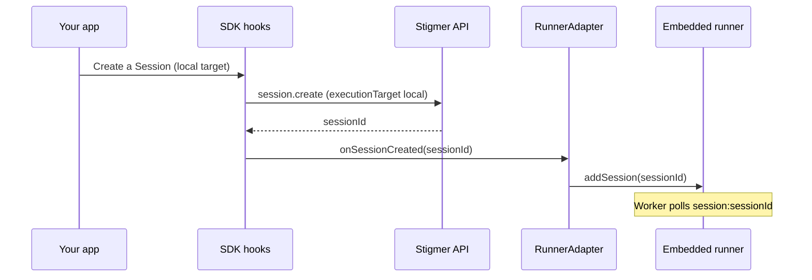
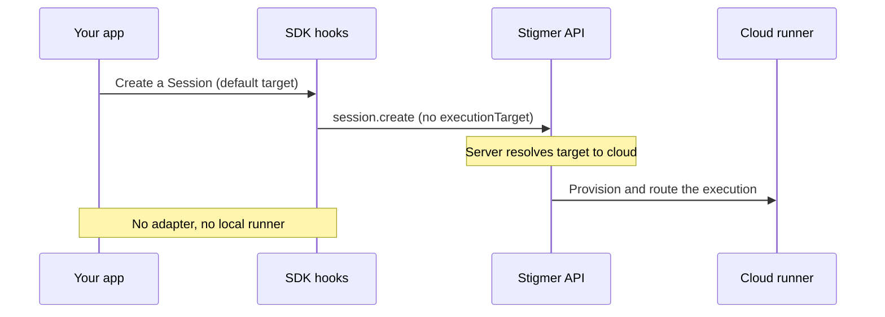

The runner is the process that executes your Agents and Workflows. Most
integrators never touch it: on Stigmer Cloud, the platform provisions a runner
for every execution. You **embed** the runner only when you want executions to
run somewhere you control — on a user's own machine (a desktop app) or on your
own infrastructure.

This guide shows you when to embed, what configuration each kind of integrator
passes, and how the SDK connects to a runner you host.

## Pick your path

Two questions decide everything that follows:

1. **Where should executions run?** On Stigmer-managed compute (**cloud**) or on
   compute you control (**local**)?
2. **Are you on Stigmer Cloud or running Stigmer yourself?**

<Callout type="info">
  If you only need cloud execution, you do not embed the runner at all. Pass
  your Stigmer token to the SDK and call the API. The platform provisions and
  configures the runner for you, and you can stop reading here. The rest of this
  guide is about hosting a runner yourself for local execution.
</Callout>

## What each integrator passes

The runner reads its configuration from the process it runs in. What you must
supply depends on your deployment. The table below is the minimal surface for
each audience; the full list lives in the runner README
(`backend/services/runner/README.md`), under its configuration reference.

| Your situation                                   | Stigmer token        | Backend endpoint      | Temporal address      | Cursor key                |
| ------------------------------------------------ | -------------------- | --------------------- | --------------------- | ------------------------- |
| **Cloud, cloud execution** (no embedding)        | Pass to the SDK only | Platform-managed      | Platform-managed      | Platform-managed          |
| **Cloud, embedded local execution** (desktop)    | Required             | Required (your Cloud) | Required (your Cloud) | Not needed (proxied)      |
| **Self-managed (OSS or self-hosted full stack)** | Optional             | Defaults to localhost | Defaults to localhost | Required (Cursor harness) |

How to read each row:

- **Cloud, cloud execution.** You give the SDK a Stigmer token and nothing else.
  The platform runs a system-managed runner and injects its Temporal, proxy, and
  backend configuration server-side. You never see Temporal.
- **Cloud, embedded local execution.** When you host the runner yourself but run
  against Stigmer Cloud, you supply `STIGMER_TOKEN` plus the Cloud
  `STIGMER_BACKEND_ENDPOINT` and `TEMPORAL_SERVICE_ADDRESS`. Setting the token
  activates **proxy mode**: the runner routes its model traffic and artifact
  uploads through the Stigmer proxy, which injects the real Cursor key, so you
  do not pass `CURSOR_API_KEY`.
- **Self-managed.** You run your own Temporal and Stigmer Server. In the default
  `MODE=local`, `TEMPORAL_SERVICE_ADDRESS` defaults to `localhost:7233` and
  `STIGMER_BACKEND_ENDPOINT` to `http://localhost:7234`. `STIGMER_TOKEN` is
  optional because a local server has no auth, and you pass `CURSOR_API_KEY`
  directly for the Cursor harness. A **managed self-hosted** deployment, where
  you run the full Stigmer stack on your own infrastructure with Stigmer
  support, uses this same surface — point the endpoints at your hosts instead of
  localhost.

<Callout type="warn">
  Today, a cloud integrator who embeds the runner still passes
  `TEMPORAL_SERVICE_ADDRESS` and `STIGMER_BACKEND_ENDPOINT`. The runner does not
  yet derive them from the Stigmer token, so "token only" applies to cloud
  _execution_, not cloud _embedding_. Deriving these from the token for
  embedders is a tracked improvement.
</Callout>

## Local versus cloud execution

The execution target decides who provides the runner. The SDK exposes it as
`executionTarget`, with two values:

- **`"local"`** — your embedded runner handles the work. The SDK calls a
  `RunnerAdapter` (below) to start and stop workers on the runner you host. The
  desktop app uses this: it runs Sessions on the user's own machine.
- **`"cloud"`** — the server provisions compute. You supply no runner and no
  adapter. The web console uses this.

When you leave `executionTarget` unset, the server resolves it from your
deployment: cloud on Stigmer Cloud, local in an OSS deployment.

## The RunnerAdapter

When `executionTarget` is `"local"`, the SDK needs a way to tell your runner
about new work. That is the `RunnerAdapter` — a small interface you implement
once and pass to the SDK. The SDK calls it at the right lifecycle points, so
your UI code never manages runner processes directly.

```typescript
interface RunnerAdapter {
  onSessionCreated(sessionId: string): Promise<void>;
  onSessionTerminated(sessionId: string): Promise<void>;
  onWorkflowExecutionCreated(executionId: string): Promise<void>;
  onWorkflowExecutionTerminated(executionId: string): Promise<void>;
}
```

In React, pass the adapter and the target to `StigmerProvider`:

```tsx
import { StigmerProvider } from "@stigmer/react";

<StigmerProvider
  client={stigmer}
  executionTarget="local"
  runnerAdapter={myRunnerAdapter}
>
  {/* your app */}
</StigmerProvider>;
```

For cloud execution you provide neither prop. The SDK skips all adapter calls
when no adapter is configured, so the same components work in both apps.

The interface type ships from `@stigmer/sdk` (framework-agnostic) and is
re-exported from `@stigmer/react` alongside the `useRunnerAdapter` hook. A Java
mirror exists too: `ai.stigmer.sdk.RunnerAdapter`, wired through
`StigmerClient.builder().runnerAdapter(...)`.

<Callout type="warn">
  The SDK calls `onSessionCreated`, `onWorkflowExecutionCreated`, and
  `onWorkflowExecutionTerminated`, but **no React hook calls
  `onSessionTerminated` today**. Session workers are not torn down automatically
  when a Session ends — only Workflow Execution workers are. Implement
  `onSessionTerminated` for completeness, but do not rely on the SDK to invoke
  it yet.
</Callout>

## Host the runner: In-process or subprocess

You can host the runner two ways. Both come from the `@stigmer/runner` package.

### In-process (library)

Import a factory and run the runner inside your own Node process. Use
`createStigmerRunnerManager` for the dynamic, per-Session topology an embedder
needs:

```typescript
import { createStigmerRunnerManager } from "@stigmer/runner";

const manager = await createStigmerRunnerManager({
  temporalAddress: "localhost:7233",
  stigmerEndpoint: "http://localhost:7234",
});

await manager.addSession("ses_abc123");
// ... later
await manager.removeSession("ses_abc123");
await manager.shutdown();
```

Your `RunnerAdapter` then delegates to this manager: `onSessionCreated` calls
`manager.addSession`, `onSessionTerminated` calls `manager.removeSession`, and
so on.

`createStigmerRunner` (static, single task queue) also exists, but it suits a
fixed worker rather than a dynamic embedder.

<Callout type="warn">
  The static `createStigmerRunner` factory derives its execution location from
  whether a proxy is set — proxy implies cloud, otherwise local — and exposes no
  way to request local execution with proxy transport. If you need that
  combination (the desktop case), use the manager factory or the standalone
  `stigmer-runner` binary instead. A dedicated `executionMode` option for the
  static factory is a tracked improvement.
</Callout>

### Subprocess (manager-mode IPC)

Spawn the runner binary as a child process with `STIGMER_RUNNER_MODE=manager`
and drive it over its stdin/stdout JSON protocol. This keeps the runner in its
own process, isolated from your host. It is how the desktop app embeds the
runner.

The command and response contract is documented in full in the
[manager-mode IPC protocol reference](/docs/guides/runners/ipc-protocol).

### How the two paths run

For local execution, the SDK routes new work through your adapter to the runner
you host:



For cloud execution, there is no adapter and no local runner — the server
provisions compute:



## Worked example: The desktop app

The Stigmer desktop app is the reference embedder for local execution. It uses
the subprocess path:

- [`client-apps/desktop/src-tauri/src/runner.rs`](https://github.com/stigmer/stigmer/blob/main/client-apps/desktop/src-tauri/src/runner.rs)
  spawns the bundled runner with `STIGMER_RUNNER_MODE=manager` and drives the
  IPC protocol from Rust.
- [`client-apps/desktop/src/hooks/useEmbeddedRunner.ts`](https://github.com/stigmer/stigmer/blob/main/client-apps/desktop/src/hooks/useEmbeddedRunner.ts)
  manages the runner process lifecycle and exposes `addSession`,
  `removeSession`, and friends over Tauri.
- [`client-apps/desktop/src/hooks/useTauriRunnerAdapter.ts`](https://github.com/stigmer/stigmer/blob/main/client-apps/desktop/src/hooks/useTauriRunnerAdapter.ts)
  is the `RunnerAdapter` that bridges the SDK to those Tauri commands.

The desktop runner executes locally yet runs in proxy mode against Stigmer
Cloud, which is exactly the "cloud, embedded local execution" row above.

## Three settings people confuse

Local execution involves four independent settings. Keep them distinct:

| Setting           | What it controls                                 | Desktop         | Web                |
| ----------------- | ------------------------------------------------ | --------------- | ------------------ |
| `deploymentMode`  | Which backend edition and features are available | From the server | From the server    |
| `executionTarget` | Who provides the runner                          | `local`         | `cloud` (resolved) |
| `MODE`            | Where the Agent's filesystem lives               | `local`         | Server-managed     |
| Run mode          | The runner's process topology                    | `manager`       | Server-managed     |

In particular, "local execution" (`executionTarget`) is not the same as "an OSS
deployment" (`deploymentMode`). The desktop app runs local execution against
Stigmer Cloud.

## Related console UI

This guide covers hosting the runner in code. The runner fleet that appears in
the Stigmer Console — the list, picker, and detail views — is documented in the
[React SDK runner reference](/docs/sdk/react/runner).

A separate, lighter integration model lets your app delegate to an already
installed Stigmer CLI or desktop app through `stigmer://` deep links, rather
than hosting the runner yourself. That model uses different SDK hooks
(`useLaunchLocalRunner`, `useRunnerCredential`) and is not covered here.

## What's next

- **Drive the subprocess** — the
  [manager-mode IPC protocol reference](/docs/guides/runners/ipc-protocol) is
  the full command and response contract for the subprocess path.
- **Configure the runner** — the runner README
  (`backend/services/runner/README.md`) documents every configuration value, run
  mode, and credential mode.
- **Understand the model** — the [Runners concept page](/docs/concepts/runners)
  explains the runner lifecycle, execution modes, and how Sessions find runners.
