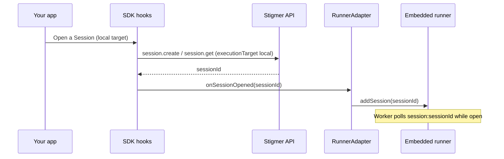
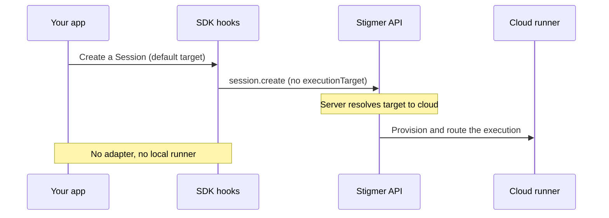

The runner is the process that executes your Agents and Workflows. Most
integrators never touch it: on Stigmer Cloud, the platform provisions a runner
for every execution. You **embed** the runner only when you want executions to
run somewhere you control — on a user's own machine (a desktop app) or on your
own infrastructure.

This guide shows you when to embed, what configuration each kind of integrator
passes, and how the SDK connects to a runner you host.

## Pick your path

Two questions decide everything that follows:

1. **Where should executions run?** On Stigmer-managed compute (**cloud**) or on
   compute you control (**local**)?
2. **Are you on Stigmer Cloud or running Stigmer yourself?**

<Callout type="info">
  If you only need cloud execution, you do not embed the runner at all. Pass
  your Stigmer token to the SDK and call the API. The platform provisions and
  configures the runner for you, and you can stop reading here. The rest of this
  guide is about hosting a runner yourself for local execution.
</Callout>

## What each integrator passes

The runner reads its configuration from the process it runs in. What you must
supply depends on your deployment. The table below is the minimal surface for
each audience; the full list lives in the runner README
(`backend/services/runner/README.md`), under its configuration reference.

| Your situation                                   | Stigmer token        | Backend endpoint      | Temporal address        | Cursor key                | LLM provider keys         |
| ------------------------------------------------ | -------------------- | --------------------- | ----------------------- | ------------------------- | ------------------------- |
| **Cloud, cloud execution** (no embedding)        | Pass to the SDK only | Platform-managed      | Platform-managed        | Platform-managed          | Platform-managed          |
| **Cloud, embedded local execution** (desktop)    | Required             | Required (your Cloud) | Discovered (token)      | Not needed (proxied)      | Not needed (proxied)      |
| **Self-managed (OSS or self-hosted full stack)** | Optional             | Defaults to localhost | Discovered or localhost | Required (Cursor harness) | Required (native harness) |

How to read each row:

- **Cloud, cloud execution.** You give the SDK a Stigmer token and nothing else.
  The platform runs a system-managed runner and injects its Temporal, proxy, and
  backend configuration server-side. You never see Temporal.
- **Cloud, embedded local execution.** When you host the runner yourself but run
  against Stigmer Cloud, you supply `STIGMER_TOKEN` plus the Cloud
  `STIGMER_BACKEND_ENDPOINT`. You do **not** supply `TEMPORAL_SERVICE_ADDRESS`:
  the runner discovers it from the control plane at boot using your token (see
  [Temporal self-discovery](#temporal-self-discovery)). Setting the token also
  activates **proxy mode**: the runner routes its model traffic and artifact
  uploads through the Stigmer proxy, which injects the real Cursor key, so you
  do not pass `CURSOR_API_KEY`.
- **Self-managed.** You run your own Temporal and Stigmer Server. In the default
  `MODE=local`, `TEMPORAL_SERVICE_ADDRESS` defaults to `localhost:7233` and
  `STIGMER_BACKEND_ENDPOINT` to `http://localhost:7234`. `STIGMER_TOKEN` is
  optional because a local server has no auth. Credentials are **bring your
  own**: you pass `CURSOR_API_KEY` directly for the Cursor harness, and
  `ANTHROPIC_API_KEY` / `OPENAI_API_KEY` for the native harness (there is no
  proxy to inject them — an execution that needs a missing key fails with
  `LLM_MISSING_API_KEY`). The Rust host crate exposes all three as typed config
  fields (`cursor_api_key`, `anthropic_api_key`, `openai_api_key`), so an
  embedder never has to prime its own process environment. A **managed
  self-hosted** deployment, where you run the full Stigmer stack on your own
  infrastructure with Stigmer support, uses this same surface — point the
  endpoints at your hosts instead of localhost.

## Temporal self-discovery

The runner needs a Temporal frontend address to poll for work, but that is an
infrastructure detail an integrator should not have to know. So the runner
**self-discovers** it at boot. You give it a token and a backend endpoint; it
asks the control plane where Temporal is. The resolution order is:

1. **Explicit wins.** If you set `TEMPORAL_SERVICE_ADDRESS` (or pass
   `temporalAddress`), the runner uses it verbatim — useful for local
   development.
2. **Otherwise discover.** If no address is set but a token is present, the
   runner calls the control plane (`getRunnerBootstrapConfig`) over the same
   authenticated connection it already uses, and connects to the Temporal
   address it returns. On Stigmer Cloud this is the external Temporal ingress
   for your environment.
3. **Otherwise localhost.** A tokenless local runner falls back to
   `localhost:7233`.

If discovery is attempted and fails (bad token, unreachable endpoint, or a
server too old to support it), the runner fails fast with an actionable error
rather than silently falling back — so a misconfiguration surfaces at startup,
not as a confusing failure later.

<Callout type="info">
  This is what makes a cloud embedder's contract "token only": one endpoint plus
  one token. You no longer pass `TEMPORAL_SERVICE_ADDRESS` for cloud embedding.
</Callout>

## Local versus cloud execution

The execution target decides who provides the runner. The SDK exposes it as
`executionTarget`, with two values:

- **`"local"`** — your embedded runner handles the work. The SDK calls a
  `RunnerAdapter` (below) to start and stop workers on the runner you host. The
  desktop app uses this: it runs Sessions on the user's own machine.
- **`"cloud"`** — the server provisions compute. You supply no runner and no
  adapter. The web console uses this.

When you leave `executionTarget` unset, the server resolves it from your
deployment: cloud on Stigmer Cloud, local in an OSS deployment.

## Start a session in one call

The deep-link moment every embedder builds first — the user clicks one action
and lands in a session that already has a workspace attached and the first
message running — is a single API call. Pass `sessionSpec` on
`agentExecution.create` and the server creates the session from that spec
(workspace entries, harness, execution target, MCP servers, skills) and
dispatches the message in the same request:

```typescript
import { ExecutionTarget } from "@stigmer/protos/ai/stigmer/agentic/session/v1/enum_pb";

const execution = await stigmer.agentExecution.create({
  name: `execution-${Date.now()}`,
  org: "acme",
  message: "Customize the landing page",
  sessionSpec: {
    agentInstanceId: "ain_abc123",
    workspaceEntries: [
      { name: "site", source: { localPath: { path: "/Users/me/site" } } },
    ],
    executionTarget: ExecutionTarget.LOCAL,
  },
});

const sessionId = execution.spec!.sessionId; // the created session

// Local target only: attach your runner's worker to the new session.
await runnerAdapter.onSessionOpened(sessionId);
```

Notes on the contract:

- `sessionSpec` and `sessionId` are mutually exclusive: define a new session or
  reference an existing one, never both.
- When `sessionSpec.agentInstanceId` is empty, the server resolves the agent's
  default instance from `agentId` (creating the instance if missing), or falls
  back to the platform default agent.
- For the **local** target, attach the runner right after the call returns, as
  shown. The order is safe: the execution's first activity waits on the
  session's task queue for a worker (a 5-minute window), so the worker you
  attach picks it up immediately.
- In React you rarely write this by hand — `useNewSessionFlow` (and the
  `NewSessionViewer` component built on it) submits through this one-call path
  and handles the runner attach for you. `useCreateAgentExecution` accepts the
  same `sessionSpec` input for custom flows.

## The RunnerAdapter

When `executionTarget` is `"local"`, the SDK needs a way to tell your runner
about new work. That is the `RunnerAdapter` — a small interface you implement
once and pass to the SDK. The SDK calls it at the right lifecycle points, so
your UI code never manages runner processes directly.

```typescript
interface RunnerAdapter {
  onSessionOpened(sessionId: string): Promise<void>;
  onSessionClosed(sessionId: string): Promise<void>;
  onWorkflowExecutionCreated(executionId: string): Promise<void>;
  onWorkflowExecutionTerminated(executionId: string): Promise<void>;
}
```

Sessions and workflow executions have different lifecycles, and the method names
reflect that. A Session is a long-lived, multi-turn conversation with no
terminal phase, so its worker is tied to whether the session is **open** (in
use): the SDK calls `onSessionOpened` when a session is opened and
`onSessionClosed` when it is closed. A Workflow Execution runs to a terminal
phase, so its worker is tied to **creation and completion**.

In React, pass the adapter and the target to `StigmerProvider`:

```tsx
import { StigmerProvider } from "@stigmer/react";

<StigmerProvider
  client={stigmer}
  executionTarget="local"
  runnerAdapter={myRunnerAdapter}
>
  {/* your app */}
</StigmerProvider>;
```

For cloud execution you provide neither prop. The SDK skips all adapter calls
when no adapter is configured, so the same components work in both apps.

The interface type ships from `@stigmer/sdk` (framework-agnostic) and is
re-exported from `@stigmer/react` alongside the `useRunnerAdapter` hook. A Java
mirror exists too: `ai.stigmer.sdk.RunnerAdapter`, wired through
`StigmerClient.builder().runnerAdapter(...)`.

Most TypeScript embedders do not write that object by hand. If you already have
a runner backend with `addSession` / `removeSession` / `addWorkflowExecution` /
`removeWorkflowExecution` methods — the in-process manager (below), the
desktop's embedded-runner context, or your own runner API — pass it to
`createRunnerAdapter` and it wires the lifecycle mapping for you:

```typescript
import { createRunnerAdapter } from "@stigmer/sdk";

const runnerAdapter = createRunnerAdapter(myRunnerHost);
```

<Callout>
  In React, the session worker lifecycle is wired at the
  `useSessionConversation` layer (which `SessionViewer` and `useSessionPageFlow`
  build on, and which the Ink/terminal SDK uses directly): the SDK calls
  `onSessionOpened` when a session view opens and `onSessionClosed` when it
  closes. Because `onSessionOpened` runs on every open, re-opening an existing
  session re-attaches its worker — so follow-ups always have a poller. Implement
  both methods idempotently; the reference desktop adapter maps them to
  `addSession` / `removeSession`, which are already idempotent.
</Callout>

## Host the runner: In-process or subprocess

You can host the runner two ways. Both come from the `@stigmer/runner` package.

### In-process (library)

Import a factory and run the runner inside your own Node process. Use
`createStigmerRunnerManager` for the dynamic, per-Session topology an embedder
needs:

```typescript
import { createStigmerRunnerManager } from "@stigmer/runner";

const manager = await createStigmerRunnerManager({
  temporalAddress: "localhost:7233",
  stigmerEndpoint: "http://localhost:7234",
});

await manager.addSession("ses_abc123");
// ... later
await manager.removeSession("ses_abc123");
await manager.shutdown();
```

The manager already exposes `addSession` / `removeSession` /
`addWorkflowExecution` / `removeWorkflowExecution`, so it is a
`RunnerWorkerHost` — pass it straight to `createRunnerAdapter(manager)` to get
your `RunnerAdapter`, no hand-wiring needed.

`createStigmerRunner` (static, single task queue) also exists. It suits a fixed
worker rather than a dynamic embedder. Like the manager, it accepts an
`executionMode` option (`"local"` or `"cloud"`) that sets execution location
independently of proxy transport, so you can run local execution with proxy
transport — the desktop case. When you omit `executionMode`, the static factory
derives the location from the proxy: a proxy implies `"cloud"`, otherwise
`"local"`.

### Subprocess (manager-mode IPC)

Spawn the runner binary as a child process with `STIGMER_RUNNER_MODE=manager`
and drive it over its stdin/stdout JSON protocol. This keeps the runner in its
own process, isolated from your host. It is how the desktop app embeds the
runner.

The command and response contract is documented in full in the
[manager-mode IPC protocol reference](/docs/guides/runners/ipc-protocol).

#### Use the official Rust host crate

If your host is Rust (for example, a Tauri app), do not hand-roll the subprocess
driver. Use the published
[`stigmer-runner-host`](https://crates.io/crates/stigmer-runner-host) crate. Add
it to your `Cargo.toml` like any other dependency — no monorepo clone or
machine-specific path dependency required:

```toml
[dependencies]
stigmer-runner-host = { version = "3", features = ["tauri"] }
```

It spawns the runner, performs the versioned `ready` handshake, and exposes the
full lifecycle as an async API:

```rust
use stigmer_runner_host::{RunnerHost, RunnerConfig};
use tauri::{Manager, path::BaseDirectory};

// Resolve the bundled entry to an ABSOLUTE path. `node` resolves a relative
// script argument against the process working directory, which for an app
// launched from Finder or the Start menu is `/` — not your resource directory.
// `app` here is your `tauri::App` or `AppHandle`.
let runner_entry = app
    .path()
    .resolve("resources/runner/dist/main.js", BaseDirectory::Resource)?;

let host = RunnerHost::new();
host.start(RunnerConfig {
    node_binary: "node".into(),
    runner_entry: runner_entry.to_string_lossy().into_owned(),
    // Token-only: leave the address unset and the runner discovers it from the
    // control plane. Pass Some("host:7233") to pin it for local development.
    temporal_address: None,
    stigmer_endpoint: "https://api.stigmer.ai".into(),
    temporal_namespace: None,
    stigmer_token: Some("stigmer_token".into()),
    // Credentials for direct (BYOK) mode. With a proxy_endpoint set, leave all
    // three None — the proxy injects the real keys server-side.
    cursor_api_key: None,
    anthropic_api_key: None,
    openai_api_key: None,
    workspace_root_dir: None,
    proxy_endpoint: Some("https://api.stigmer.ai".into()),
    // OSS/local mode only (no proxy): the artifact dir shared with the local
    // stigmer-server. Ignored here since a proxy is set.
    local_artifact_path: None,
    // Additional env for the runner (e.g. LOG_LEVEL). Keys the host composes
    // itself, including the credential vars above, are reserved and rejected.
    extra_env: Default::default(),
})
.await?;

host.add_session("ses_abc123").await?;
// ... later
host.stop().await?;
```

The core has no Tauri dependency. Enable the `tauri` feature for the desktop
binding (`RunnerState` plus the `#[tauri::command]` surface). This is the
supported way to embed the runner in a Rust app, and the Stigmer desktop app
uses it.

#### Process lifecycle and logging resilience

Two guarantees matter when you embed the runner as a subprocess, both hardened
in response to [#177](https://github.com/stigmer/stigmer/issues/177):

- **Logging degrades, execution does not.** The runner's stdout is its IPC
  channel and its stderr is a log channel. If a host drops either read end, the
  runner detaches that output and keeps running the in-flight turn — results
  stream to the control plane, not through your pipes, so a lost log channel
  must never abort work. Your host is therefore free to stop reading stderr, but
  it must **not** assume stderr is lossless: agent and tool output can contain
  arbitrary (non-UTF8) bytes. The official crate decodes stderr lossily and
  never abandons the pipe on a bad byte; if you forward the runner's stderr
  yourself, do the same (lossy decode, log-and-continue) rather than exiting on
  the first read error.
- **The runner is reaped with its host.** The crate spawns the runner with
  kill-on-drop, so dropping `RunnerHost` (a clean app exit, `stop()`, or a panic
  that unwinds) kills the child instead of leaving an orphan. A hard crash of
  the host — where no destructor runs — is covered from the other side: the
  runner shuts itself down when its stdin reaches EOF, which happens as soon as
  the parent's write end closes. You do not need a separate watchdog.

#### Reap the runner on app exit

Reap the runner from your Tauri `RunEvent::Exit` handler with
`RunnerState::kill()`:

```rust
app.run(|app_handle, event| {
    if let tauri::RunEvent::Exit = event {
        // `kill()` is timer-free, so it is safe to block on at teardown.
        tauri::async_runtime::block_on(app_handle.state::<RunnerState>().kill());
    }
});
```

Use `kill()`, not `stop()`, here. `stop()` performs a _graceful_ shutdown whose
bounded wait relies on the tokio time driver — which is no longer pumped at
`RunEvent::Exit`. With a mid-execution runner that never acks the shutdown, a
`block_on(stop())` in the exit handler parks forever
([#178](https://github.com/stigmer/stigmer/issues/178)). `kill()` sends an
immediate `SIGKILL` and reaps the child without a timer, so it cannot park.
Reserve `stop()` for an explicit in-app stop (a "stop runner" action) while the
event loop is still healthy.

### Stage the runner in a packaged app

The Rust crate _drives_ the runner, but it does not contain it: the subprocess
path launches the runner's compiled JavaScript with `node`. Those files must
travel **inside** your installable app, because the end user's machine has no
Stigmer checkout. Get them from npm rather than cloning the monorepo —
specifically, from the **slim embedding build**:

1. **Add the package.** `npm install @stigmer/runner-slim`. This is the
   bundle-friendly build of the runner, made for exactly this use case: a
   self-contained `main.js` (the entire runner, tree-shaken and bundled) plus
   only the dependencies that genuinely cannot be bundled — the Temporal native
   bridge (pruned to your platform via `optionalDependencies`), the Cursor SDK
   with its native helper binaries, and the jq wasm module. It installs at **~85
   MB per platform** instead of the full `@stigmer/runner` package's ~508 MB
   `node_modules`.
2. **Copy it into your app's resources at build time.** Stage the installed
   package and its resolved `node_modules` into a resources folder, then have
   your packager bundle that folder into the installer. In Tauri, declare it
   under `bundle.resources` in `tauri.conf.json`:

   ```json
   {
     "bundle": {
       "resources": ["resources/runner"]
     }
   }
   ```

3. **Point the host at the bundled entry.** Set `runner_entry` (the Rust snippet
   above) to the staged `main.js` as an **absolute** path, resolved from the
   app's resource directory at runtime with
   `app.path().resolve(..., BaseDirectory::Resource)`. Do not pass the bare
   relative string `"resources/runner/dist/main.js"`: it works under `tauri dev`
   (where the working directory is your project) but not in a packaged app
   (where it is `/`). The slim entry accepts the same modes, environment
   variables, and IPC protocol as the full package's `dist/main.js`.

<Callout type="info">
  The slim `main.js` is a **CommonJS** bundle, and its `package.json`
  intentionally has no `"type": "module"`. Launch it with `node main.js` as-is;
  do not rename it to `.mjs` or add `"type": "module"` to the staged manifest.
  (CommonJS is what preserves the runner's internal interceptor load order — see
  [#170](https://github.com/stigmer/stigmer/issues/170).) If you install the
  package and stage it with the provided script, this is already correct and you
  do not need to think about it.
</Callout>

<Callout type="info">
  `@stigmer/runner-slim` is for the subprocess path. If you embed **in-process**
  (importing `createStigmerRunnerManager` into your own Node app), keep using
  `@stigmer/runner` — it is the library entry, and your bundler resolves what it
  needs. The Stigmer desktop app stages the slim artifact into
  `resources/runner` at packaging time
  (`client-apps/desktop/scripts/stage-runner-slim.sh`); in development it
  symlinks the in-repo runner instead. The Tauri `bundle.resources` config is
  identical either way.
</Callout>

<Callout type="warn">
  **`node` must be resolvable.** The subprocess runner is launched with `node`.
  A GUI app started from the dock or Start menu does **not** inherit the user's
  shell `PATH`, so a bare `node` command can fail to resolve even when Node is
  installed. Resolve an absolute path to `node` at startup (or bundle a Node
  runtime with the app) rather than relying on `PATH`.
</Callout>

<Callout type="warn">
  **`runner_entry` must be absolute in a packaged app.** Same root cause as
  above: `node` resolves the entry script against the process working directory,
  which for a Finder/dock-launched app is `/`, not your resource directory. A
  relative entry like `resources/runner/dist/main.js` only resolves under `tauri
  dev`. Resolve it from the resource directory at runtime
  (`app.path().resolve(..., BaseDirectory::Resource)`). If the path does not
  resolve, the host fails fast with a `RunnerEntryNotFound` error naming the
  working directory it tried.
</Callout>

### How the two paths run

For local execution, the SDK routes new work through your adapter to the runner
you host:



For cloud execution, there is no adapter and no local runner — the server
provisions compute:



## Worked example: The desktop app

The Stigmer desktop app is the reference embedder for local execution. It uses
the subprocess path:

- [`client-apps/desktop/src-tauri/src/runner.rs`](https://github.com/stigmer/stigmer/blob/main/client-apps/desktop/src-tauri/src/runner.rs)
  is a thin binding that re-exports the
  [`stigmer-runner-host`](https://github.com/stigmer/stigmer/tree/main/crates/stigmer-runner-host)
  crate, which spawns the bundled runner with `STIGMER_RUNNER_MODE=manager` and
  drives the IPC protocol from Rust.
- [`client-apps/desktop/src/hooks/useEmbeddedRunner.ts`](https://github.com/stigmer/stigmer/blob/main/client-apps/desktop/src/hooks/useEmbeddedRunner.ts)
  manages the runner process lifecycle and exposes `addSession`,
  `removeSession`, and friends over Tauri.
- [`client-apps/desktop/src/hooks/useTauriRunnerAdapter.ts`](https://github.com/stigmer/stigmer/blob/main/client-apps/desktop/src/hooks/useTauriRunnerAdapter.ts)
  is the `RunnerAdapter` that bridges the SDK to those Tauri commands.

The desktop runner executes locally yet runs in proxy mode against Stigmer
Cloud, which is exactly the "cloud, embedded local execution" row above.

## Three settings people confuse

Local execution involves four independent settings. Keep them distinct:

| Setting           | What it controls                                 | Desktop         | Web                |
| ----------------- | ------------------------------------------------ | --------------- | ------------------ |
| `deploymentMode`  | Which backend edition and features are available | From the server | From the server    |
| `executionTarget` | Who provides the runner                          | `local`         | `cloud` (resolved) |
| `MODE`            | Where the Agent's filesystem lives               | `local`         | Server-managed     |
| Run mode          | The runner's process topology                    | `manager`       | Server-managed     |

In particular, "local execution" (`executionTarget`) is not the same as "an OSS
deployment" (`deploymentMode`). The desktop app runs local execution against
Stigmer Cloud.

## What's next

- **Drive the subprocess** — the
  [manager-mode IPC protocol reference](/docs/guides/runners/ipc-protocol) is
  the full command and response contract for the subprocess path.
- **Configure the runner** — the runner README
  (`backend/services/runner/README.md`) documents every configuration value, run
  mode, and credential mode.
- **Understand the model** — the [Runners concept page](/docs/concepts/runners)
  explains the runner lifecycle, execution modes, and how Sessions find runners.
