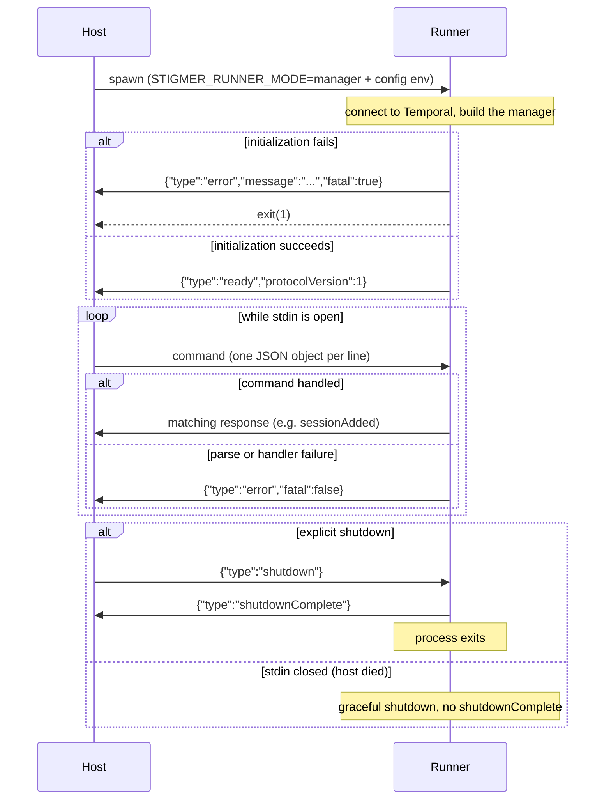

This is the reference for the stdin/stdout protocol that drives the runner in
**manager mode**. Read it if you are building a host process that embeds the
runner and manages Sessions or Workflow Executions dynamically, the way the
Stigmer desktop app does.

If you only run the runner as a single-queue worker, you do not need this
protocol. See the runner README (`backend/services/runner/README.md`) for static
mode, and the [embedding guide](/docs/guides/runners/embedding) for the wider
integration picture.

## When this protocol applies

The runner enters manager mode when you start it with
`STIGMER_RUNNER_MODE=manager`. In this mode it does not poll a fixed task queue.
Instead, the host spawns the runner as a child process and drives it with
line-delimited JSON: the host writes **commands** to the runner's stdin, and the
runner writes **responses** to its stdout.

A host uses manager mode to run many short-lived workers from one process — one
Temporal worker per Session and per Workflow Execution — over a single shared
Temporal connection.

## Transport and framing

| Channel | Direction     | Carries                             |
| ------- | ------------- | ----------------------------------- |
| stdin   | host → runner | Commands                            |
| stdout  | runner → host | Responses                           |
| stderr  | runner → host | Logs only (never protocol messages) |

Framing rules:

- Each message is one JSON object on a single line, terminated by `\n`.
- Encoding is UTF-8.
- There is no length prefix and no envelope — the `type` field identifies the
  message.
- The runner reserves stdout for protocol messages. In manager mode it redirects
  its own `console.log` to stderr so application logs never corrupt the stream.
  A host must treat stderr as logs, not protocol.

## Protocol version

The runner advertises a protocol version in its [`ready`](#ready) message:

```json
{ "type": "ready", "protocolVersion": 1 }
```

- `protocolVersion` is an **integer**. The current version is `1`.
- The number increments **only on a breaking change** — a removed or renamed
  message, a changed field type, or a changed lifecycle guarantee. Adding a new
  optional field or a new message type does **not** bump it, because those
  changes do not break an older host.
- Versioning is **one-way**: the runner advertises its version; it does not read
  a version from the host. The runner is always spawned fresh by the host, so
  the host owns the compatibility decision.

How a host should use it:

1. Read `protocolVersion` from the `ready` message.
2. If the value is greater than the highest version the host understands, the
   runner is newer than the host. The host should refuse to proceed and surface
   a clear upgrade message rather than driving a protocol it does not
   understand.
3. If the field is **absent**, treat the runner as protocol version `1` (the
   field was introduced in version 1; a runner that omits it predates this
   field).

The runner does not negotiate or downgrade. Compatibility is the host's
decision.

## Lifecycle



Key points:

- `ready` is the **first** line the host reads, and the runner sends it only
  **after** it has connected to Temporal and built the manager. `ready`
  therefore means "initialized and accepting commands," not merely "process
  started."
- If initialization fails, the runner sends a fatal `error` and exits with code
  `1`. The host should treat any first message other than `ready` as a startup
  failure.
- After `ready`, the host may send commands in any order.
- If the host closes stdin (for example, the host process dies), the runner
  performs a graceful shutdown of its workers but does **not** send
  `shutdownComplete` — there is no one to read it.

## Commands (host → runner)

### addSession

Start a Temporal worker for a Session. The worker polls the task queue
`session:<sessionId>`.

```json
{ "type": "addSession", "sessionId": "ses_abc123" }
```

| Field       | Type   | Required | Description                       |
| ----------- | ------ | -------- | --------------------------------- |
| `type`      | string | yes      | `"addSession"`                    |
| `sessionId` | string | yes      | The Session to start a worker for |

Idempotent: adding a Session that is already active is a no-op and still returns
[`sessionAdded`](#sessionadded).

### removeSession

Stop the worker for a Session.

```json
{ "type": "removeSession", "sessionId": "ses_abc123" }
```

| Field       | Type   | Required | Description         |
| ----------- | ------ | -------- | ------------------- |
| `type`      | string | yes      | `"removeSession"`   |
| `sessionId` | string | yes      | The Session to stop |

Idempotent: removing a Session that is not active is a no-op and still returns
[`sessionRemoved`](#sessionremoved).

### addWorkflowExecution

Start a Temporal worker for a Workflow Execution. The worker polls the task
queue `wfexec:<executionId>`.

```json
{ "type": "addWorkflowExecution", "executionId": "wfe_abc123" }
```

| Field         | Type   | Required | Description                                  |
| ------------- | ------ | -------- | -------------------------------------------- |
| `type`        | string | yes      | `"addWorkflowExecution"`                     |
| `executionId` | string | yes      | The Workflow Execution to start a worker for |

Idempotent in the same way as [`addSession`](#addsession).

### removeWorkflowExecution

Stop the worker for a Workflow Execution.

```json
{ "type": "removeWorkflowExecution", "executionId": "wfe_abc123" }
```

| Field         | Type   | Required | Description                    |
| ------------- | ------ | -------- | ------------------------------ |
| `type`        | string | yes      | `"removeWorkflowExecution"`    |
| `executionId` | string | yes      | The Workflow Execution to stop |

Idempotent in the same way as [`removeSession`](#removesession).

### updateToken

Push a refreshed auth token to every active worker. Use this when the host's
token rotates so in-flight and future activities use the new credential.

```json
{ "type": "updateToken", "token": "eyJ..." }
```

To clear the token, send `null`:

```json
{ "type": "updateToken", "token": null }
```

| Field   | Type               | Required | Description                          |
| ------- | ------------------ | -------- | ------------------------------------ |
| `type`  | string             | yes      | `"updateToken"`                      |
| `token` | `string` or `null` | yes      | The new token, or `null` to clear it |

### shutdown

Perform a graceful shutdown of all workers and the shared Temporal connection.

```json
{ "type": "shutdown" }
```

| Field  | Type   | Required | Description  |
| ------ | ------ | -------- | ------------ |
| `type` | string | yes      | `"shutdown"` |

The runner replies with [`shutdownComplete`](#shutdowncomplete) and then exits.

## Responses (runner → host)

### ready

Sent once at startup, after the manager is initialized.

```json
{ "type": "ready", "protocolVersion": 1 }
```

| Field             | Type    | Description                                                                        |
| ----------------- | ------- | ---------------------------------------------------------------------------------- |
| `type`            | string  | `"ready"`                                                                          |
| `protocolVersion` | integer | The protocol version the runner speaks (see [Protocol version](#protocol-version)) |

### sessionAdded

Acknowledges [`addSession`](#addsession).

```json
{
  "type": "sessionAdded",
  "sessionId": "ses_abc123",
  "taskQueue": "session:ses_abc123"
}
```

| Field       | Type   | Description                                           |
| ----------- | ------ | ----------------------------------------------------- |
| `type`      | string | `"sessionAdded"`                                      |
| `sessionId` | string | The Session the worker serves                         |
| `taskQueue` | string | The Temporal task queue, always `session:<sessionId>` |

### sessionRemoved

Acknowledges [`removeSession`](#removesession).

```json
{ "type": "sessionRemoved", "sessionId": "ses_abc123" }
```

| Field       | Type   | Description                          |
| ----------- | ------ | ------------------------------------ |
| `type`      | string | `"sessionRemoved"`                   |
| `sessionId` | string | The Session whose worker was stopped |

### workflowExecutionAdded

Acknowledges [`addWorkflowExecution`](#addworkflowexecution).

```json
{
  "type": "workflowExecutionAdded",
  "executionId": "wfe_abc123",
  "taskQueue": "wfexec:wfe_abc123"
}
```

| Field         | Type   | Description                                            |
| ------------- | ------ | ------------------------------------------------------ |
| `type`        | string | `"workflowExecutionAdded"`                             |
| `executionId` | string | The Workflow Execution the worker serves               |
| `taskQueue`   | string | The Temporal task queue, always `wfexec:<executionId>` |

### workflowExecutionRemoved

Acknowledges [`removeWorkflowExecution`](#removeworkflowexecution).

```json
{ "type": "workflowExecutionRemoved", "executionId": "wfe_abc123" }
```

| Field         | Type   | Description                                     |
| ------------- | ------ | ----------------------------------------------- |
| `type`        | string | `"workflowExecutionRemoved"`                    |
| `executionId` | string | The Workflow Execution whose worker was stopped |

### tokenUpdated

Acknowledges [`updateToken`](#updatetoken).

```json
{ "type": "tokenUpdated" }
```

| Field  | Type   | Description      |
| ------ | ------ | ---------------- |
| `type` | string | `"tokenUpdated"` |

### error

Reports a failure. Errors are either fatal or non-fatal.

```json
{ "type": "error", "message": "Command addSession failed: ...", "fatal": false }
```

| Field     | Type    | Description                                              |
| --------- | ------- | -------------------------------------------------------- |
| `type`    | string  | `"error"`                                                |
| `message` | string  | A human-readable description of what failed              |
| `fatal`   | boolean | `true` if the runner is exiting; `false` if it continues |

Behavior by `fatal`:

- `fatal: true` — the runner cannot continue and exits. The host should treat
  the runner as gone (clear its state and stop reading stdout). The only fatal
  error is a failure to initialize the manager at startup.
- `fatal: false` — the runner keeps running. These come from a single command:
  malformed JSON, an unknown command `type`, or a handler that threw. The host
  can log the error and keep sending commands.

### shutdownComplete

Sent in response to [`shutdown`](#shutdown), just before the process exits.

```json
{ "type": "shutdownComplete" }
```

| Field  | Type   | Description          |
| ------ | ------ | -------------------- |
| `type` | string | `"shutdownComplete"` |

Note: a shutdown triggered by the host closing stdin does **not** produce this
message.

## Backward compatibility and host tolerance

The protocol grows by addition. A host must **ignore unknown fields** so that a
newer runner, which may add fields to existing messages, does not break an older
host. Both reference hosts get this for free: Rust `serde` ignores unknown
fields unless `deny_unknown_fields` is set, and Go's `encoding/json` ignores
them by default. If you implement a host in another language, replicate this
tolerance.

Conversely, a host that needs a field a runner does not send (for example,
`protocolVersion` from a pre-version-1 runner) should apply a sensible default
rather than failing. See [Protocol version](#protocol-version).

## Reference host implementations

Two hosts in the Stigmer repository implement the protocol and are useful as
worked examples. They differ in how they treat responses:

- **Desktop app (Rust)** —
  [`client-apps/desktop/src-tauri/src/runner.rs`](https://github.com/stigmer/stigmer/blob/main/client-apps/desktop/src-tauri/src/runner.rs).
  Blocks on the `ready` handshake, then drives commands **fire-and-forget**: it
  writes a command to stdin and tracks state locally rather than correlating
  each response. A background reader logs responses and acts only on a fatal
  `error`.
- **Integration harness (Go)** —
  [`test/integration/harness/unified_runner.go`](https://github.com/stigmer/stigmer/blob/main/test/integration/harness/unified_runner.go).
  Drives the protocol **synchronously**: after each command it blocks until it
  reads the matching response. This is the strict request/response form of the
  contract.

Both styles are valid. Choose synchronous correlation when you need to confirm
each command took effect; choose fire-and-forget when the host tracks intended
state itself.

## Keeping implementations in sync

There is no code generation binding the definitions of this protocol. It is
defined in four places that must change together:

| Definition                                    | Role                                                               |
| --------------------------------------------- | ------------------------------------------------------------------ |
| `backend/services/runner/src/ipc-protocol.ts` | Canonical machine-readable definition (the runner emits from here) |
| This page                                     | Canonical human-readable contract                                  |
| `client-apps/desktop/src-tauri/src/runner.rs` | Hand-maintained Rust mirror (desktop host)                         |
| `test/integration/harness/unified_runner.go`  | Hand-maintained Go mirror (test harness)                           |

When you change the protocol, update all four and bump `IPC_PROTOCOL_VERSION` in
`backend/services/runner/src/ipc-protocol.ts` if the change is breaking. The Go
and Rust structs carry a comment pointing back to this page.
