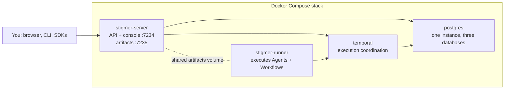

The Docker Compose stack is the one-server shape from
[Self-hosting](./overview): the server with the web console, one runner,
Postgres and a real Temporal server, on a machine you control. One rule holds
for the whole page: every setting you change is a line in `.env`. You never edit
`docker-compose.yml`; it belongs to the release you're running.

<Callout type="warn">
  **No sign-in until you turn it on.** A fresh stack trusts every caller that
  can reach its ports. Keep it on a private network until you [turn
  authentication on](./authentication). stdio MCP Servers spawn **inside the
  runner container**: they can reach that container's filesystem and network,
  not your host's.
</Callout>

## What's in the stack

Four services. The server and the runner share one artifact volume: file sharing
is the contract between them, not HTTP.



The stack keeps its state in four Docker volumes and your `.env` file. Three
volumes hold durable state: `postgres-data` (every resource and execution
record, and Temporal's own tables), `artifacts` (files produced by executions)
and `server-data` (the Skill content store). The fourth, `runner-data`, holds
in-flight Session checkpoints so a paused run survives a container restart;
losing it abandons runs in flight but loses no durable data. Those three volumes
plus `.env` are a complete backup.
[Back up and upgrade your stack](./operations) has the procedures.

## What you need

- A machine with Docker and the Compose plugin. Both amd64 and arm64 work; every
  release is smoke-tested on both before its images publish.
- Host ports 7234 and 7235 free. If the laptop stack runs on this machine, stop
  it first with `stigmer down`; it uses the same ports.
- The Stigmer CLI on whichever machine you drive the stack from, this one or
  your laptop. The [local quickstart](/docs/getting-started/local) has the
  install commands.
- An LLM provider key if you want Agents to answer. Workflows without Agent
  tasks run without one.

## Install

<Steps>

### Get the stack

Clone the repository. The compose file and its `.env` template live at the root.

```bash
git clone https://github.com/stigmer/stigmer.git
cd stigmer
```

### Fill in `.env`

Copy the template and fill in the three required values. The stack refuses to
start until all three exist; that's deliberate, so the keys you must back up are
never generated somewhere you can't see.

```bash
cp .env.example .env
```

```bash
# POSTGRES_PASSWORD, internal to the stack
openssl rand -hex 24

# STIGMER_ENCRYPTION_KEY, encrypts secret values at rest
openssl rand -base64 32

# STIGMER_RUNNER_TOKEN_KEY, signs the runner's execution-scoped tokens
openssl rand -base64 32
```

Paste each value into its line. Two optional lines are worth setting now:

- `ANTHROPIC_API_KEY`, so Agents can answer. Without it the stack still serves
  the console, the API and LLM-free Workflow executions; Agent runs fail at the
  LLM call.
- `STIGMER_OPERATOR_EMAIL`, your own email. It's stamped on what you create, and
  when you later turn authentication on, the person who signs in with this email
  becomes an administrator of every Organization.

<Callout type="info">
  Back up `.env` like a key file. Losing `STIGMER_ENCRYPTION_KEY` strands every
  encrypted value in the database with no recovery path.
</Callout>

### Start it

```bash
docker compose up -d
```

The first start pulls four images and lets Temporal create its databases, so
give it a few minutes. `docker compose ps` is the health check: every service
shows `Up`, and `postgres`, `temporal` and `stigmer-server` also show
`(healthy)`.

### Open the console

Open [http://localhost:7234](http://localhost:7234). The console asks you to
create an Organization: a fresh stack has none yet. Create one for your team and
note its slug, the short name under its display name; everything on this page
lands in it. Download links the platform mints point at port 7235.

### Connect the CLI

Tell the CLI where the stack is, as a named backend, switch to it, and point it
at the Organization you created:

```bash
stigmer config backend add myserver --endpoint localhost:7234
stigmer config backend use myserver
stigmer config context set --org <your-org-slug>
```

The last command checks that you belong to the Organization before it saves it,
so a mistyped slug is refused on the spot. Every `apply`, `run` and `get` on
this page now lands where the console looks; `--org <slug>` on a command, or
`STIGMER_ORG_ID` set for the process, points one command at another
Organization.

From your laptop, use the machine's address instead of `localhost`. A named
backend keeps its own address and, later, its own API key, so switching between
this stack, your laptop and Stigmer Cloud is one command. For CI jobs and
scripts, setting `STIGMER_SERVER_ADDRESS=<host>:<port>` in the process's
variables overrides the active backend for that process. The
[`stigmer config`](/docs/cli/commands/config) reference lists every backend and
context command, and [Organizations](/docs/concepts/organizations) explains how
more than one fits together.

<Callout type="info">
  Setting a stack up from a script, with no browser? Skip the console step and
  run [`stigmer bootstrap`](/docs/cli/commands/bootstrap) instead of `context
  set`. It creates the `stigmer` Organization, the one the CLI uses when you
  name none, and is safe to run again, with authentication on or off.
</Callout>

### Run your first Agent

Create a file called `agent.yaml`:

```yaml
apiVersion: agentic.stigmer.ai/v1
kind: Agent
metadata:
  name: my-first-agent
spec:
  instructions: |
    You are a helpful assistant. Answer questions clearly
    and concisely. When you don't know something, say so.
```

Apply it and run it:

```bash
stigmer apply -f agent.yaml
stigmer run my-first-agent -m "What can you help me with?"
```

The Agent responds in your terminal. The run traveled from the CLI to the
server, through Temporal, and executed inside the runner container: your whole
stack, end to end. Reload the console: your Agent is on the workbench.

</Steps>

## Reach it from outside the VM

To serve your team, put a TLS reverse proxy in front of the stack. Any proxy
works if it does three things:

- Accepts HTTPS from clients and forwards **HTTP/2 in the clear** (h2c) to
  port 7234. The CLI and SDKs speak gRPC, which needs HTTP/2 all the way to the
  server; the console speaks Connect, which is happy on the same upstream. One
  h2c upstream serves all of them.
- Serves the API on **port 443**. The CLI decides whether to use TLS from the
  port alone: `:443` is HTTPS, anything else is plain HTTP.
- Uses two hostnames, one for the API and console and one for downloads. The
  artifact file server is a separate listener and cannot share a host with the
  API. The Helm chart's Ingress uses the same two.

Then tell the stack the addresses your clients reach it on, so the URLs it mints
for downloads and Skill transfers point at the proxy. Two lines in `.env`:

```bash
# .env
STIGMER_PUBLIC_URL=https://stigmer.example.com
STIGMER_ARTIFACT_PUBLIC_URL=https://artifacts.stigmer.example.com
```

```bash
docker compose up -d
```

Compose recreates the services whose settings changed. A worked example with
[Caddy](https://caddyserver.com), which fetches and renews its certificates
itself when the hostnames resolve to this machine:

```text
stigmer.example.com {
    reverse_proxy h2c://127.0.0.1:7234
}

artifacts.stigmer.example.com {
    reverse_proxy 127.0.0.1:7235
}
```

Point your CLI at the API host on port 443:

```bash
stigmer config backend add prod --endpoint stigmer.example.com:443
stigmer config backend use prod
```

The console needs nothing: it reads its own origin, so the proxy needs no
forwarded-header configuration. The stack still publishes ports 7234 and 7235 on
every interface of the machine; with the proxy in place, close both at the
machine's firewall so the proxy is the only way in.

## Turn authentication on

Authentication is off until you set the issuer. Three lines in `.env` turn it
on; from the next start every caller needs a credential, and the console signs
in through your OIDC provider:

```bash
# .env
STIGMER_OIDC_ISSUER=https://auth.example.com/realms/main
STIGMER_OIDC_AUDIENCE=https://stigmer.example.com
STIGMER_OIDC_CONSOLE_CLIENT_ID=stigmer-console
```

```bash
docker compose up -d
```

Sign in through the console. The person whose provider email matches
`STIGMER_OPERATOR_EMAIL` becomes an administrator of every Organization. The
[authentication guide](./authentication) has the rest: what to register with
your OIDC provider, how API keys work for the CLI and CI, and where the runner's
own key goes.

## Bring your own Postgres and Temporal

The compose stack bundles both, on purpose: one machine, one backup story. If
your team already runs Postgres or Temporal, the [Helm chart](./kubernetes) is
the shape that points at them, through its `externalDatabase` and
`externalTemporal` values.

## Back up, upgrade, uninstall

A complete backup is the three durable volumes and `.env`. `STIGMER_VERSION` in
`.env` moves both Stigmer images together to a released version;
`docker compose pull` then `docker compose up -d` performs the upgrade, and the
server migrates its schema forward on start. `docker compose down` stops the
stack and keeps every volume; `docker compose down -v` deletes them.
[Back up and upgrade your stack](./operations) has each procedure in full.

## Every setting

`.env.example` documents every line you can set, with the reason behind it. Read
it before you change anything; if a setting isn't there, the stack doesn't
expect you to change it.

## Next step

Your stack is running, and right now anyone who can reach its ports has full
control of it. Before your team uses it, turn authentication on with your OIDC
provider.

<Cards>
  <Card
    title="Enable authentication"
    href="/docs/guides/self-hosting/authentication"
    description="Sign in with your OIDC provider and give the CLI and CI their API keys."
  />
</Cards>
