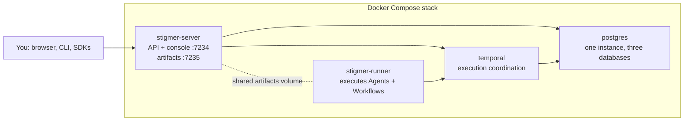

The Stigmer repository ships a Docker Compose file that runs the complete
platform on a machine you control: the server (API and web console), Postgres, a
real Temporal server, and the runner that executes your Agents and Workflows.
All state lives in Docker volumes on your machine.

<Callout type="warn">
  **Know the limitations before you start.** A self-hosted server has **no
  authentication** — it's a single-operator trust domain. Anyone who can reach
  the port has full control, so keep the stack on localhost or a private network
  you trust, and never expose it to the internet. stdio MCP Servers spawn
  **inside the runner container**: they can reach that container's filesystem
  and network, not your host's.
</Callout>

Both amd64 and arm64 are supported — every release is smoke-tested on both
architectures before its images publish.

## What's in the stack

Four services. The server and the runner share one artifact volume — file
sharing is the contract between them, not HTTP.



Durable state lives in three volumes — `postgres-data`, `artifacts`, and
`server-data` — plus your `.env` file. See
[Back up and upgrade your stack](/docs/guides/self-hosting/operations) for the
complete backup story.

<Steps>
<Step>

## Get the stack

Clone the repository. The compose file and its `.env` template live at the root.

```bash
git clone https://github.com/stigmer/stigmer.git
cd stigmer
```

**Prerequisites**: Docker with the Compose plugin, and free host ports 7234
and 7235. If the laptop stack is running on this machine, stop it first with
`stigmer down` — it uses the same ports.

</Step>
<Step>

## Configure your secrets

Copy the template and fill in the three required secrets:

```bash
cp .env.example .env
```

The stack refuses to boot until all three exist — that's deliberate. Keys that
materialize implicitly make the backup story invisible exactly where you need it
explicit.

```bash
# Postgres superuser password (internal to the stack)
openssl rand -hex 24

# STIGMER_ENCRYPTION_KEY — encrypts secret values at rest
openssl rand -base64 32

# STIGMER_RUNNER_TOKEN_KEY — signs the runner's execution-scoped tokens
openssl rand -base64 32
```

Paste each value into its line in `.env`. To run Agents, also set
`ANTHROPIC_API_KEY` in `.env` now — without it the stack still serves the
console, the API, and LLM-free Workflow executions, but Agent runs fail at the
LLM call.

<Callout type="info">
  Back up `.env` like a key file. Losing the two `STIGMER_*` keys strands every
  encrypted value in the database.
</Callout>

</Step>
<Step>

## Start the stack

```bash
docker compose up -d
```

The first boot pulls four images and sets up Temporal's databases, so give it a
few minutes. The command returns once the server is healthy and the runner has
started; confirm with `docker compose ps` — every service shows `Up`, with
`postgres`, `temporal`, and `stigmer-server` also reporting `(healthy)`.

Open the web console at [http://localhost:7234](http://localhost:7234). The
artifact file server answers on port 7235 — download links the platform mints
point there.

</Step>
<Step>

## Bootstrap with the CLI

Install the Stigmer CLI on the host if you don't have it:

<Tabs items={["Homebrew", "Shell script", "npm"]}>
  <Tab value="Homebrew">```bash brew install stigmer/tap/stigmer ```</Tab>
  <Tab value="Shell script">
    ```bash curl -fsSL https://stigmer.ai/install.sh | sh ```
  </Tab>
  <Tab value="npm">```bash npm install -g @stigmer/cli ```</Tab>
</Tabs>

The CLI's local backend points at `localhost:7234` by default — exactly where
the stack serves. If you've used Stigmer Cloud from this machine, switch back
first with `stigmer config backend set local`.

Apply the system Seedpack. It creates the default `stigmer` Organization and the
built-in Agents, Skills, and Workflows — the same bootstrap `stigmer up`
performs on the laptop tier:

```bash
stigmer seedpack apply
```

</Step>
<Step>

## Run your first Agent

Create a file called `agent.yaml`:

```yaml
apiVersion: agentic.stigmer.ai/v1
kind: Agent
metadata:
  name: my-first-agent
spec:
  instructions: |
    You are a helpful assistant. Answer questions clearly
    and concisely. When you don't know something, say so.
```

Apply it and run it:

```bash
stigmer apply -f agent.yaml
stigmer run my-first-agent -m "What can you help me with?"
```

The Agent responds in your terminal. The run traveled from the CLI to the
server, through Temporal, and executed inside the runner container — your whole
stack, end to end.

</Step>
</Steps>

## Connect from another machine

Point any CLI at the stack by setting the server address:

```bash
export STIGMER_SERVER_ADDRESS=<stack-host>:7234
```

Two things to know before you do:

- **There is no authentication by default.** Every machine that can reach the
  port has full control. Treat network reachability as the access boundary — or
  [turn authentication on](/docs/guides/self-hosting/authentication) with your
  own identity provider and API keys.
- Artifact download links are minted for the stack host by default
  (`http://localhost:7235`). To serve them to other machines, change the
  `x-artifact-serve-url` anchor in `docker-compose.yml` to an address they can
  reach.

## Next step

Your stack is running, which means it now holds state worth protecting. Learn
what a complete backup is and how upgrades work.

<Cards>
  <Card
    title="Back up and upgrade your stack"
    href="/docs/guides/self-hosting/operations"
  >
    The complete backup story — three volumes plus your `.env` — and the
    version-pin upgrade path.
  </Card>
</Cards>
