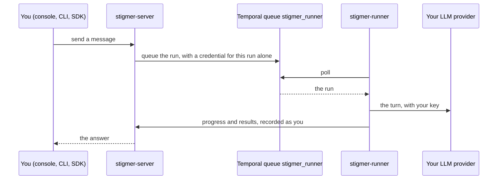

Every self-hosting guide ends the same way: a run "traveled from the CLI to the
server, through Temporal, and executed inside the runner". This page says what
that sentence means. The server stores your resources and serves the console and
the API. It never calls your LLM provider and never runs a tool. The runner does
both, on behalf of whoever started the run.

A runner isn't a resource. There's nothing to apply, nothing listed in the
console, and the server keeps no record of which runners exist. It's a process
your shape starts beside the server, and every shape starts exactly one:

- On your laptop, `stigmer up` starts a runner as its own process next to the
  server; `stigmer up server` starts the server alone, without one. The
  [all-in-one container](./all-in-one) runs the same composition inside one
  container.
- On the [Docker Compose stack](./docker-compose), the runner is the
  `stigmer-runner` service.
- On the [Helm chart](./kubernetes), the runner is the second container of the
  one pod.

## How a run reaches the runner

The server and the runner never talk about who does what. Between them sits a
Temporal task queue named `stigmer_runner`. The server puts each run on it; the
runner polls it and takes what's there. The name is written once for both sides,
in the compose file's one anchor and the chart's one template, so the two can't
drift apart.



Two things ride along with the run. The first is the Session's Harness (native
or Cursor); one runner serves both from the same queue. The second is a
credential the server mints for that run alone. Everything the runner does for
the run, including the status it reports and the resources it creates, is
recorded as the person who started it, whoever's key the runner process holds.
The [authentication guide](./authentication#what-changes) has the rules.

## When the runner is gone

Nothing on the server notices a runner leaving; it finds out when a run has
nobody to take it. What happens next depends on the kind of run:

- **An Agent run waits five minutes, then fails.** Its status carries the
  reason: `No worker available to execute activity`, followed by the three usual
  causes, starting with "the Stigmer runner is not running". The console and the
  CLI both show it. Start the run again once the runner is back.
- **A Workflow run waits.** It has no deadline of its own, so a Workflow started
  while the runner is down begins as soon as a runner polls the queue again.

A runner that dies in the middle of an Agent turn is a different case. The
runner reports to Temporal every 30 seconds while it works; when two minutes
pass without a report, the server resumes the turn from the runner's last
checkpoint, up to ten times, as long as a runner is back within the same five
minutes. The checkpoint lives under the runner's own `/data`, which is why the
`runner-data` volume and the `stigmer-runner-data` claim exist: lose them and
runs in flight lose their place, but nothing durable is lost.

How you know the runner is alive today: its log.
`Worker ready, polling for tasks...` is the line to look for, in
`docker compose logs stigmer-runner` or
`kubectl logs deployment/stigmer -c runner`. The runner has no health endpoint
yet, so the chart gives its container no probe on purpose
([stigmer#1101](https://github.com/stigmer/stigmer/issues/1101)), and the
console has no runner page.

## What the runner is given

Everything the runner needs arrives through the file your shape already uses.
You never edit the compose file or the chart.

| What                                         | Docker Compose (`.env`)               | Kubernetes (values file)             | Who sets it                                                                 |
| -------------------------------------------- | ------------------------------------- | ------------------------------------ | --------------------------------------------------------------------------- |
| Server address, Temporal address, queue name | Fixed in the compose file             | Fixed in the chart                   | The release. Two things named once can't drift.                             |
| Your LLM key                                 | `ANTHROPIC_API_KEY`, `CURSOR_API_KEY` | `runner.llm.existingSecret`          | You. The runner holds it; the server never does.                            |
| Files a run produces                         | The `artifacts` volume                | The `stigmer-artifacts` claim        | The release. One disk the server writes and the runner reads.               |
| The runner's own state                       | The `runner-data` volume              | The `stigmer-runner-data` claim      | The release. Checkpoints and Agents' working directories, not backup state. |
| The runner's own API key                     | `STIGMER_TOKEN`                       | `runner.stigmerToken.existingSecret` | You, once [authentication is on](./authentication#give-the-runner-its-key). |

Three of these rows carry a design decision worth knowing.

**The LLM key lives with the runner and nowhere else.** The server has no
setting for it. Agents on the native Harness need `ANTHROPIC_API_KEY`; Agents on
the Cursor Harness need `CURSOR_API_KEY`; Workflows without Agent tasks run with
neither. At start the runner moves its keys out of the variables it started with
into a store only it reads, so the commands an Agent runs and the processes the
runner starts don't inherit them.

**Files are shared by disk, not by HTTP.** The server writes an artifact to a
path and the runner reads the same path, so the two must see one disk. That is
why the compose stack gives them one volume, why the chart puts them in one pod,
and why neither shape runs the runner on another machine today. An artifact
store that needs no shared disk is
[stigmer#1099](https://github.com/stigmer/stigmer/issues/1099).

**The runner's own API key is its credential, not the runs'.** Runs travel on
that per-run credential, so the runner's key doesn't decide whose runs it serves
or who is recorded as running them. The authenticated install asks for it; the
authentication guide says when to create it, and
[Back up and upgrade your stack](./operations) how to rotate it.

## One trust domain

An Agent turn can run shell commands, call tools, and start stdio MCP Servers,
and the runner installs packages at run time. All of that happens inside the
runner container, as root, with that container's filesystem and network. The
compose file states the rule in its header, and the chart's notes repeat it:

> stdio MCP servers spawn INSIDE this container — they can reach this
> container's filesystem and network, not your host's.

Two consequences for a team:

- **Whoever can start a run can run code in the runner.** With authentication
  on, that is your Organization's members; before it, anyone who can reach the
  port. The runner's network is your team's network: give the container the
  reach your team may have, and no more.
- **One runner, one replica.** The chart runs one replica on purpose and
  replaces the pod rather than rolling it, because two runners on one disk would
  race for the same working directories and checkpoints. Running a second shared
  runner isn't something these guides teach.

## A runner per Session

The shared runner is one posture. The server can also start a runner per
Session, the way Stigmer Cloud does, through a sandbox provisioner. Three
built-in drivers exist, selected with `SANDBOX_PROVISIONER_TYPE` on the server:
`local-process` (a child process per Session), `docker` (a container per
Session) and `kubernetes` (a Deployment per Session in the namespace
`STIGMER_SANDBOX_K8S_NAMESPACE` names). The container drivers need the addresses
a sandbox reaches the server and Temporal on, `STIGMER_SANDBOX_BACKEND_ENDPOINT`
and `STIGMER_SANDBOX_TEMPORAL_ADDRESS`, and take the image and command from
`STIGMER_SANDBOX_RUNNER_IMAGE` and `STIGMER_SANDBOX_RUNNER_COMMAND`.

A provisioner changes how runs are routed. Each Session gets its own queue,
`session:<id>`, which is `STIGMER_ACTIVITY_ROUTING=session`; and a Session is
provisioned only when its execution target is `cloud`, which
`STIGMER_DEFAULT_EXECUTION_TARGET=cloud` makes the default. The server refuses
to boot half-configured, in its own words:

```text
sandbox provisioner 'docker' requires STIGMER_SANDBOX_BACKEND_ENDPOINT — a container cannot reach the server on this process's localhost
SANDBOX_PROVISIONER_TYPE='docker' requires a per-queue routing mode — set STIGMER_ACTIVITY_ROUTING=session and/or STIGMER_WORKFLOW_ACTIVITY_ROUTING=execution
```

<Callout type="warn">
  **The shipped stack can't exercise this yet.** The published server image
  carries no `docker` CLI and the compose file mounts no Docker socket, so the
  `docker` driver fails at its first Session. And the two container drivers hand
  the per-Session runner no artifact path, so attachments a run needs don't
  resolve ([stigmer#1099](https://github.com/stigmer/stigmer/issues/1099)). The
  chart offers no sandbox values until that lands. This section describes the
  mechanism so the settings you meet in the server's configuration make sense;
  it isn't a procedure.
</Callout>

## Next step

You know what executes your Agents, how a run reaches it, and that whoever can
start a run can run code inside it. Right now, on a fresh stack, that is anyone
who can reach the port. Turn authentication on, and read there how each run is
recorded as the person who started it.

<Cards>
  <Card
    title="Enable authentication"
    href="/docs/guides/self-hosting/authentication"
    description="Sign in with your OIDC provider, give machines their API keys, and see how a run is attributed."
  />
</Cards>
