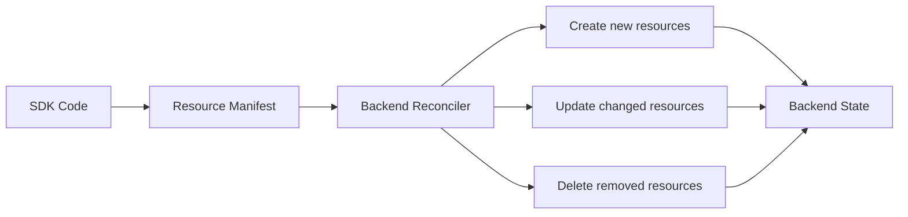
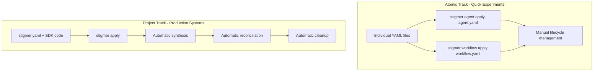
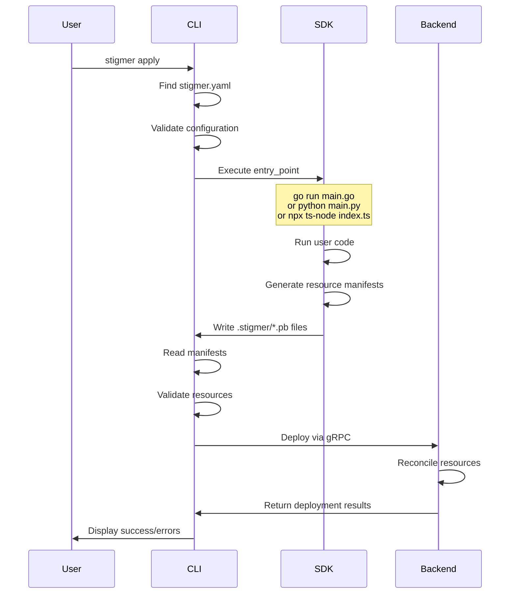
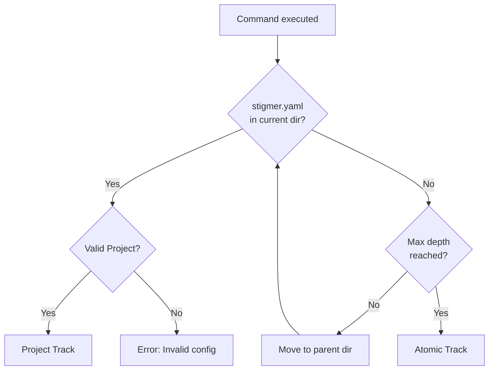

# Stigmer Projects: The Complete Guide

This guide explains Stigmer's Project Track - an SDK-based approach to managing agentic resources at scale. By the end, you'll understand how projects work, when to use them, and how to build production-ready agentic systems.

## Table of Contents

1. [Understanding Projects](#understanding-projects)
2. [The stigmer.yaml File](#the-stigmeryaml-file)
3. [SDK Integration](#sdk-integration)
4. [Track Detection](#track-detection)
5. [Local Commands](#local-commands)
6. [Workflows and Patterns](#workflows-and-patterns)
7. [Migration Guide](#migration-guide)

---

## Understanding Projects

### What is a Project?

A Stigmer project is a **configuration + code** approach to defining resources. Instead of manually writing YAML for each agent, workflow, or skill, you write code that generates them automatically.

The project is represented by a single `stigmer.yaml` file at the root of your directory. This file tells Stigmer:
- Which SDK runtime to use (Go, Python, or Node.js)
- Which file to execute to generate resources
- Metadata about the project (name, organization, labels)

### The Aggregate Root Pattern

In Domain-Driven Design, an **aggregate root** is an entity that controls access to a cluster of related objects. The Project entity serves this role for Stigmer resources.

**What this means in practice:**

```
Project (aggregate root)
├── Agents[]        ← Managed resources
├── Workflows[]     ← Managed resources
├── MCP Servers[]   ← Managed resources
└── Skills[]        ← Managed resources
```

When you deploy a project:
1. Stigmer reads your SDK code
2. Generates a complete manifest of all resources
3. Reconciles backend state with your manifest
4. **Automatically deletes resources removed from your code**

This last point is crucial - **reconciliation** means your backend always matches your code. Remove an agent from your SDK? It's automatically deleted from the backend.

### Why Projects Matter

**Without projects (Atomic Track):**
```bash
# Manual resource management
stigmer agent apply agent1.yaml
stigmer agent apply agent2.yaml
stigmer workflow apply workflow1.yaml

# Later... remove agent1
# Must manually delete:
stigmer agent delete agent1

# Easy to forget, leads to orphaned resources
```

**With projects (Project Track):**
```bash
# Define all resources in code
stigmer apply

# Later... remove agent1 from SDK code
stigmer apply
# agent1 automatically deleted - no orphans!
```

### Reconciliation Model Explained

**Reconciliation** is the process of making your backend state match your desired state (SDK code).



**How reconciliation works:**

1. **Synthesis**: CLI runs your entry_point, SDK generates manifest
2. **Comparison**: Backend compares manifest with current state
3. **Plan**: Backend determines create/update/delete operations
4. **Execute**: Backend applies operations in dependency order
5. **Result**: Backend state matches manifest exactly

**Example reconciliation:**

*First deploy:*
```go
// main.go
agent.New(ctx, agent.WithName("agent-a"))
agent.New(ctx, agent.WithName("agent-b"))
```
```bash
stigmer apply
# Creates: agent-a, agent-b
# Backend now has: [agent-a, agent-b]
```

*Second deploy (removed agent-b, added agent-c):*
```go
// main.go
agent.New(ctx, agent.WithName("agent-a"))
agent.New(ctx, agent.WithName("agent-c"))  // New
// agent-b removed from code
```
```bash
stigmer apply
# Updates: agent-a (if changed)
# Creates: agent-c
# Deletes: agent-b (orphan)
# Backend now has: [agent-a, agent-c]
```

### Atomic Track vs Project Track

Stigmer provides two deployment modes optimized for different use cases.



**Atomic Track:**
- Direct resource deployment from YAML
- No reconciliation - manual delete required
- Fast iteration for single resources
- Good for learning and experimentation

**Project Track:**
- SDK-based resource generation
- Automatic reconciliation and orphan cleanup
- Version-controlled resource definitions
- Good for production systems with multiple resources

**When to use Atomic Track:**
- Experimenting with a single agent or workflow
- Learning Stigmer for the first time
- Quick prototypes and demos
- No interdependencies between resources

**When to use Project Track:**
- Managing 3+ resources together
- Production systems requiring consistency
- Resources with dependencies (agents → workflows)
- Team collaboration on resource definitions
- Need automatic cleanup of old resources

---

## The stigmer.yaml File

The `stigmer.yaml` file is deliberately minimal - it's configuration, not resource definitions. All resources live in your SDK code.

### Minimal Valid Configuration

```yaml
apiVersion: tenancy.stigmer.ai/v1
kind: Project
metadata:
  name: my-project
  org: my-org
spec:
  runtime: go
```

That's all you need! The rest has sensible defaults.

### Complete Configuration Reference

```yaml
apiVersion: tenancy.stigmer.ai/v1  # Required: API version
kind: Project                       # Required: Resource kind

metadata:
  # Required: Unique project identifier within organization
  name: customer-analytics-pipeline
  
  # Required: Organization slug or ID where project will be deployed
  org: data-team
  
  # Optional: Structured key-value labels for organization
  labels:
    team: data-engineering           # Owning team
    environment: production          # Deployment environment
    tier: critical                   # Service tier
    cost-center: analytics           # Budget allocation
  
  # Optional: Unstructured tags for flexible categorization
  tags:
    - etl
    - customer-data
    - scheduled

spec:
  # Required: SDK runtime (go | python | node)
  runtime: python
  
  # Optional: Entry point file (defaults: main.go, main.py, index.ts)
  entry_point: pipelines/main.py
  
  # Optional: Human-readable project description
  description: |
    Daily customer analytics pipeline.
    Processes transaction data, extracts features, generates reports.
```

### Field Validation Rules

#### apiVersion

**Required**: Must be exactly `tenancy.stigmer.ai/v1`

This follows Kubernetes-style API versioning. Future versions may introduce new fields or behaviors while maintaining backward compatibility.

#### kind

**Required**: Must be exactly `Project`

Identifies this as a Project resource (not Agent, Workflow, etc.)

#### metadata.name

**Required**  
**Format**: `^[a-z][a-z0-9-]*$` (lowercase letters, numbers, hyphens; starts with letter)  
**Length**: 1-63 characters  
**Uniqueness**: Must be unique within the organization

**Valid examples:**
- `data-pipeline`
- `customer-api-gateway`
- `ml-feature-extraction`

**Invalid examples:**
- `Data_Pipeline` - uppercase and underscore
- `123-project` - starts with number
- `my project` - contains space
- `api_gateway` - contains underscore

**Reserved names** (platform use only):
- `default`, `system`, `admin`, `root`, `stigmer`, `test`

**Why naming matters:**
- Used in URLs: `https://app.stigmer.ai/projects/my-org/data-pipeline`
- Used in CLI: `stigmer project get data-pipeline`
- Used in logs and monitoring

#### metadata.org

**Required**  
**Format**: Organization slug or ID  
**Determines**: Where the project and its resources are deployed

**Resolution order:**
1. Explicit value in stigmer.yaml
2. `--org` flag: `stigmer apply --org production-team`
3. Current organization in CLI context

**Example usage:**

```yaml
# Option 1: Hardcode (simplest, less flexible)
metadata:
  org: data-team

# Option 2: Omit, use --org flag (more flexible)
metadata:
  name: my-project
  # org omitted - specify via flag
```

```bash
# Use flag for different environments
stigmer apply --org dev-team
stigmer apply --org production-team
```

#### metadata.labels

**Optional**  
**Type**: map[string]string  
**Purpose**: Structured metadata for filtering, organization, and automation

**Best practices:**

```yaml
labels:
  # Ownership
  team: platform-engineering      # Which team owns this
  owner: alice                    # Primary maintainer
  
  # Environment
  environment: production         # dev | staging | production
  region: us-east-1               # Geographic region
  
  # Organization
  cost-center: infrastructure     # Budget allocation
  business-unit: core-platform    # Organizational structure
  
  # Technical
  tier: critical                  # critical | high | medium | low
  compliance: pci                 # Compliance requirements
```

**Label conventions:**
- Use lowercase kebab-case for keys and values
- Keep values enumerable (not free-form text)
- Standardize across organization for consistency
- Use for programmatic filtering and automation

**Using labels:**
```bash
# Future: filter projects by label
stigmer project list --label environment=production
stigmer project list --label team=data-engineering
```

#### metadata.tags

**Optional**  
**Type**: []string  
**Purpose**: Unstructured categorization (simple string identifiers)

**Example:**
```yaml
tags:
  - notifications
  - real-time
  - typescript
  - webhooks
```

**Tags vs Labels:**
| Aspect | Labels | Tags |
|--------|--------|------|
| Structure | Key-value pairs | Simple strings |
| Use case | Filtering, automation | Categorization |
| Best for | Operational metadata | Domain concepts |

**When to use tags:**
- Domain-specific keywords
- Flexible categorization
- Full-text search terms
- Less structured than labels

#### spec.runtime

**Required**  
**Type**: enum  
**Values**: `go` | `python` | `node`

Determines which SDK executes your entry_point:
- `go`: Executes `go run <entry_point>`
- `python`: Executes `python <entry_point>`
- `node`: Executes `npx ts-node <entry_point>` (TypeScript) or `node <entry_point>` (JavaScript)

**Default entry points by runtime:**
- `go` → `main.go`
- `python` → `main.py`
- `node` → `index.ts`

See [examples/project/multi-runtime-comparison.md](../../examples/project/multi-runtime-comparison.md) for detailed comparison.

#### spec.entry_point

**Optional**  
**Type**: string (file path)  
**Default**: Runtime-specific (main.go, main.py, index.ts)

Path to the file executed for SDK synthesis.

**Validation rules:**
1. **Must be relative path** - Absolute paths rejected for security
   - ✅ `src/main.py`
   - ❌ `/usr/local/bin/main.py`

2. **No directory traversal** - `..` blocked to prevent escape
   - ✅ `pipelines/deploy.py`
   - ❌ `../../secrets/keys.py`

3. **Extension must match runtime:**
   - Go: `.go`
   - Python: `.py`
   - Node.js: `.ts`, `.js`, `.mjs`, `.mts`

**Examples:**

```yaml
# Go with cmd/ directory
spec:
  runtime: go
  entry_point: cmd/deploy/main.go

# Python with src/ layout
spec:
  runtime: python
  entry_point: src/workflows/main.py

# Node.js TypeScript
spec:
  runtime: node
  entry_point: src/index.ts

# Node.js ES Module
spec:
  runtime: node
  entry_point: src/deploy.mjs
```

#### spec.description

**Optional**  
**Type**: string  
**Purpose**: Explain what this project does and why it exists

**Best practices:**
- First line: One-sentence summary
- Include key capabilities
- Mention deployment/scheduling info
- Keep under 300 chars for table display (use multi-line for longer)

**Example:**

```yaml
spec:
  description: |
    Real-time fraud detection pipeline for transaction processing.
    
    Analyzes transactions using ML models and rule-based agents.
    Flags suspicious activity, triggers alerts, and blocks fraudulent txns.
    
    Processes ~1M transactions/day with <100ms p99 latency.
    Deployed to us-east-1 and eu-west-1 for low latency.
```

---

## SDK Integration

### How Entry Points Work

When you run `stigmer apply`, here's what happens:



### SDK Synthesis Process

**Step 1: Environment Setup**

CLI sets environment variables for SDK:
```bash
export STIGMER_OUT_DIR=.stigmer  # Where to write manifests
export STIGMER_PROJECT_NAME=my-project
export STIGMER_ORG=my-org
```

**Step 2: Dependency Installation**

CLI ensures dependencies are current:
```bash
# Go
go mod tidy

# Python
pip install -r requirements.txt

# Node.js
npm install
```

**Step 3: Entry Point Execution**

CLI runs your code:
```bash
# Go
go run main.go

# Python
python main.py

# Node.js (TypeScript)
npx ts-node src/index.ts

# Node.js (JavaScript)
node src/index.js
```

**Step 4: Resource Generation**

Your SDK code defines resources:
```go
// Go example
stigmer.Run(func(ctx *stigmer.Context) error {
    agent.New(ctx,
        agent.WithName("support-bot"),
        agent.WithInstructions("..."),
    )
    return nil
})
```

**Step 5: Manifest Writing**

SDK writes protobuf manifests:
```
.stigmer/
├── agent-manifest.pb
├── workflow-manifest.pb
└── metadata.json
```

**Step 6: Manifest Reading**

CLI reads and validates manifests:
- Schema validation (required fields, types)
- Resource uniqueness (no duplicate names)
- Cross-resource references (agents → workflows)

**Step 7: Backend Deployment**

CLI converts manifests to API resources and deploys:
```
Manifest → API Resource → gRPC → Backend
```

### Resource Manifest Generation

Manifests are protobuf-serialized resource definitions. Why protobuf?

**Benefits:**
- **Fast**: Binary format, faster than JSON/YAML
- **Type-safe**: Schema validation built-in
- **Compact**: Smaller files than text formats
- **SDK-agnostic**: SDK doesn't need platform proto definitions

**Manifest structure:**

```protobuf
// agent-manifest.pb contains:
message AgentManifest {
  repeated AgentBlueprint agents = 1;
  
  message AgentBlueprint {
    string name = 1;
    string instructions = 2;
    repeated string mcp_servers = 3;
    // ... other fields
  }
}
```

**Why "Blueprint" vs final resource:**
- SDKs generate blueprints (simplified resource definitions)
- CLI converts blueprints to full API resources
- Backend assigns IDs, validates, and stores
- Decouples SDK from platform API evolution

### Example SDK Code

**Go:**
```go
package main

import (
    "log"
    "github.com/stigmer/stigmer-sdk/go/stigmer"
    "github.com/stigmer/stigmer-sdk/go/agent"
    "github.com/stigmer/stigmer-sdk/go/workflow"
)

func main() {
    err := stigmer.Run(func(ctx *stigmer.Context) error {
        // Define agent
        bot := agent.New(ctx,
            agent.WithName("support-bot"),
            agent.WithInstructions("You are a helpful customer support agent..."),
            agent.WithMCPServers("github", "slack"),
        )
        
        // Define workflow using the agent
        workflow.New(ctx,
            workflow.WithName("ticket-triage"),
            workflow.WithAgent(bot),
            // ... workflow definition
        )
        
        return nil
    })
    if err != nil {
        log.Fatal(err)
    }
}
```

**Python:**
```python
from stigmer import Context, run
from stigmer.agent import Agent
from stigmer.workflow import Workflow

def define_resources(ctx: Context):
    # Define agent
    bot = Agent(
        ctx,
        name="support-bot",
        instructions="You are a helpful customer support agent...",
        mcp_servers=["github", "slack"]
    )
    
    # Define workflow
    triage = Workflow(
        ctx,
        name="ticket-triage",
        agent=bot,
        # ... workflow definition
    )

if __name__ == "__main__":
    run(define_resources)
```

**Node.js:**
```typescript
import { Context, run } from '@stigmer/sdk';
import { Agent } from '@stigmer/sdk/agent';
import { Workflow } from '@stigmer/sdk/workflow';

async function defineResources(ctx: Context) {
    // Define agent
    const bot = new Agent(ctx, {
        name: 'support-bot',
        instructions: 'You are a helpful customer support agent...',
        mcpServers: ['github', 'slack']
    });
    
    // Define workflow
    const triage = new Workflow(ctx, {
        name: 'ticket-triage',
        agent: bot,
        // ... workflow definition
    });
}

run(defineResources);
```

---

## Track Detection

Stigmer automatically determines which track you're using based on whether a `stigmer.yaml` file exists.

### The Walk-Up Algorithm

When you run any Stigmer command, the CLI:

1. **Starts** from current working directory
2. **Checks** for `stigmer.yaml` in current directory
3. **Validates** if found (correct apiVersion and kind)
4. **Walks up** to parent directory if not found
5. **Repeats** steps 2-4 up to 10 directory levels
6. **Decides** track based on result:
   - Valid `stigmer.yaml` found → **Project Track**
   - No `stigmer.yaml` after 10 levels → **Atomic Track**



### Directory Structure Examples

**Single project:**
```
my-project/
├── stigmer.yaml          ← Root of project
├── main.go
├── src/
│   └── agents/
│       └── support.go
└── tests/
    └── integration/
        └── (run commands from here - walks up to find stigmer.yaml)
```

Running `stigmer apply` from any subdirectory (`src/`, `tests/integration/`) will find the stigmer.yaml at the root.

**Monorepo with isolated projects:**
```
company-monorepo/
├── services/
│   ├── api-gateway/
│   │   ├── stigmer.yaml      ← Project A root
│   │   └── main.go
│   └── data-pipeline/
│       ├── stigmer.yaml      ← Project B root
│       └── main.py
└── shared/
    └── libraries/
        └── (no stigmer.yaml - libraries, not projects)
```

Each `stigmer.yaml` is detected only within its subtree:
- Commands in `services/api-gateway/` detect Project A
- Commands in `services/data-pipeline/` detect Project B
- Commands in `shared/` find no project (Atomic Track)

**Nested projects (not recommended):**
```
outer/
├── stigmer.yaml          ← Outer project
└── inner/
    ├── stigmer.yaml      ← Inner project (detected first)
    └── main.go
```

If you run commands from `inner/`, the walk-up finds `inner/stigmer.yaml` first, not `outer/stigmer.yaml`. Nested projects are discouraged - use separate directories instead.

### Troubleshooting Detection

**Problem**: "Stigmer.yaml not found" when it exists

**Possible causes:**
1. File is named incorrectly
   - ✅ `stigmer.yaml` (lowercase)
   - ❌ `STIGMER.yaml`, `Stigmer.yml`, `stigmer.yml`

2. File is deeper than 10 levels from current directory
   ```bash
   # If you're too deep:
   cd ../../../  # Move closer to project root
   stigmer apply
   ```

3. File contains invalid YAML
   ```bash
   # Validate YAML syntax
   stigmer project validate
   # Reads and validates stigmer.yaml
   ```

**Solution**: Verify file location and name
```bash
# Find all stigmer.yaml files
find . -name "stigmer.yaml"

# Check file exists in expected location
ls stigmer.yaml

# If in wrong location, move it
mv stigmer.yaml ../
```

---

## Local Commands

The `stigmer project` command group provides local-only operations for viewing and validating your project configuration.

### stigmer project info

Display your local project configuration.

**Usage:**
```bash
stigmer project info [flags]
```

**Flags:**
- `--output, -o`: Output format (table | yaml | json) - default: table
- `--dir`: Directory to search for stigmer.yaml - default: current directory

**Examples:**

```bash
# Table format (human-readable, default)
stigmer project info

# Output:
# Project Information
# 
# Name:         customer-analytics
# Organization: data-team
# Runtime:      python
# Entry Point:  pipelines/main.py
# Description:  Daily customer analytics pipeline
# 
# Labels:
#   environment:  production
#   team:         data-engineering

# YAML format (for copying/editing)
stigmer project info --output yaml

# Output:
# apiVersion: tenancy.stigmer.ai/v1
# kind: Project
# metadata:
#   name: customer-analytics
#   org: data-team
#   ...

# JSON format (for automation/scripts)
stigmer project info --output json

# Output:
# {"apiVersion":"tenancy.stigmer.ai/v1","kind":"Project",...}

# From a specific directory
stigmer project info --dir /path/to/project
```

**Use cases:**

1. **Quick reference**: Check project configuration while working
   ```bash
   # "What's the entry point for this project?"
   stigmer project info | grep "Entry Point"
   ```

2. **Copying configuration**: Get YAML for creating similar project
   ```bash
   stigmer project info -o yaml > new-project/stigmer.yaml
   # Edit and customize
   ```

3. **CI/CD reporting**: Log project metadata in build scripts
   ```bash
   echo "Deploying project:"
   stigmer project info -o json | jq '.metadata.name'
   ```

4. **Troubleshooting**: Verify configuration is loaded correctly
   ```bash
   # Does stigmer.yaml have what I expect?
   stigmer project info -o yaml
   ```

**What if no project found:**

If you run `stigmer project info` in a directory without `stigmer.yaml`:

```
No stigmer.yaml found - Atomic Track mode

This directory is not a Stigmer project. You are in Atomic Track mode,
where resources are deployed individually:
  stigmer agent apply agent.yaml
  stigmer workflow apply workflow.yaml

To create a project, add a stigmer.yaml file:
  apiVersion: tenancy.stigmer.ai/v1
  kind: Project
  metadata:
    name: my-project
    org: my-org
  spec:
    runtime: go
```

### stigmer project validate

Validate your project configuration without deploying.

**Usage:**
```bash
stigmer project validate [flags]
```

**Flags:**
- `--dir`: Directory to search for stigmer.yaml - default: current directory

**Exit codes:**
- `0` - Project is valid
- `1` - Project is invalid or not found

**Examples:**

```bash
# Validate current project
stigmer project validate
# ✓ Project configuration is valid

# Validate from specific directory
stigmer project validate --dir /path/to/project

# Use in CI/CD (check exit code)
if stigmer project validate; then
  echo "Configuration valid, proceeding with deployment"
  stigmer apply
else
  echo "Configuration invalid, failing build"
  exit 1
fi
```

**What gets validated:**

1. **File existence**: stigmer.yaml exists and is readable
2. **YAML syntax**: Valid YAML format
3. **Schema validation**: Required fields present, correct types
4. **Cross-field validation**:
   - Runtime and entry_point extension match
   - Project name not reserved
   - Entry point is safe relative path (no `..`, `/`)

**Example validation errors:**

```bash
# Missing required field
stigmer project validate
# Error: metadata.name is required

# Runtime mismatch
stigmer project validate
# Error: entry_point extension .py incompatible with runtime go
# Fix: Use .go extension or change runtime to python

# Reserved name
stigmer project validate
# Error: project name 'default' is reserved for platform use
# Use a descriptive name like 'customer-api' instead

# Unsafe path
stigmer project validate
# Error: entry_point cannot contain directory traversal (..)
# Use a simple relative path like 'src/main.py'
```

**CI/CD integration patterns:**

```yaml
# GitHub Actions example
name: Validate Project
on: [push, pull_request]
jobs:
  validate:
    runs-on: ubuntu-latest
    steps:
      - uses: actions/checkout@v2
      - name: Install Stigmer CLI
        run: curl -sSL https://get.stigmer.ai | sh
      - name: Validate configuration
        run: stigmer project validate
      - name: Deploy if valid (main branch only)
        if: github.ref == 'refs/heads/main'
        run: stigmer apply --org production
```

```bash
# GitLab CI example
validate:
  stage: test
  script:
    - stigmer project validate
  only:
    - merge_requests

deploy:
  stage: deploy
  script:
    - stigmer project validate  # Double-check before deploy
    - stigmer apply --org production
  only:
    - main
```

---

## Workflows and Patterns

### Development Workflow

**Typical iterative development:**

```bash
# 1. Edit your SDK code
vim main.go

# 2. Validate configuration
stigmer project validate
# ✓ Project configuration is valid

# 3. Preview what would be deployed (dry-run)
stigmer apply --dry-run
# ℹ Executing entry point...
# ✓ Synthesis complete: 3 resources discovered
# [Preview of resources...]
# 💡 Dry run successful - no resources were deployed

# 4. Deploy for real
stigmer apply
# ✓ Successfully applied 3 resource(s)

# 5. Test deployed resources
stigmer agent run support-bot "Test query"
stigmer workflow run ticket-triage
```

**Red-green-refactor cycle:**

```bash
# Make changes
vim src/agents.go

# Quick validation
stigmer project validate && stigmer apply --dry-run

# If valid, deploy
stigmer apply

# If issues, fix and repeat
vim src/agents.go
stigmer project validate && stigmer apply --dry-run
```

### Multi-Environment Strategies

**Strategy 1: Organization-based environments**

```yaml
# stigmer.yaml (same for all environments)
metadata:
  name: customer-api
  # org omitted - specify via flag
spec:
  runtime: go
```

```bash
# Deploy to different orgs for different environments
stigmer apply --org dev-team       # Development
stigmer apply --org staging-team   # Staging
stigmer apply --org prod-team      # Production
```

**Strategy 2: Environment variables in SDK code**

```go
// main.go
func main() {
    stigmer.Run(func(ctx *stigmer.Context) error {
        env := os.Getenv("ENVIRONMENT")  // Set by CI/CD
        
        var instructions string
        if env == "production" {
            instructions = "Production mode: be cautious..."
        } else {
            instructions = "Development mode: feel free to experiment..."
        }
        
        agent.New(ctx,
            agent.WithName("support-bot"),
            agent.WithInstructions(instructions),
        )
        return nil
    })
}
```

```bash
# In CI/CD
ENVIRONMENT=production stigmer apply --org prod-team
```

**Strategy 3: Separate projects per environment**

```
environments/
├── dev/
│   ├── stigmer.yaml      # org: dev-team
│   └── main.go
├── staging/
│   ├── stigmer.yaml      # org: staging-team
│   └── main.go           # Symlink or copy
└── prod/
    ├── stigmer.yaml      # org: prod-team
    └── main.go           # Symlink or copy
```

```bash
cd environments/dev && stigmer apply
cd environments/staging && stigmer apply
cd environments/prod && stigmer apply
```

### Monorepo Patterns

**Pattern 1: Microservices monorepo**

```
company-monorepo/
├── services/
│   ├── api-gateway/
│   │   ├── stigmer.yaml
│   │   └── main.go
│   ├── auth-service/
│   │   ├── stigmer.yaml
│   │   └── main.py
│   └── notification-service/
│       ├── stigmer.yaml
│       └── src/index.ts
└── Makefile
```

```makefile
# Makefile
.PHONY: deploy-all deploy-gateway deploy-auth deploy-notifications

deploy-all: deploy-gateway deploy-auth deploy-notifications

deploy-gateway:
	cd services/api-gateway && stigmer apply

deploy-auth:
	cd services/auth-service && stigmer apply

deploy-notifications:
	cd services/notification-service && stigmer apply
```

**Pattern 2: Shared libraries with projects**

```
monorepo/
├── libraries/
│   ├── agents/          # Shared agent logic
│   └── workflows/       # Shared workflow logic
├── projects/
│   ├── customer/
│   │   ├── stigmer.yaml
│   │   └── main.go      # Imports ../libraries
│   └── analytics/
│       ├── stigmer.yaml
│       └── main.go      # Imports ../libraries
```

```go
// projects/customer/main.go
import (
    "github.com/company/monorepo/libraries/agents"
    "github.com/stigmer/stigmer-sdk/go/stigmer"
)

func main() {
    stigmer.Run(func(ctx *stigmer.Context) error {
        // Reuse shared agent logic
        agents.CreateSupportBot(ctx)
        agents.CreateSalesBot(ctx)
        return nil
    })
}
```

### Programmatic Resource Generation

**Example: Generate agents from configuration**

```python
# main.py
from stigmer import Context, run
from stigmer.agent import Agent

# Configuration-driven agent generation
AGENT_CONFIGS = [
    {"name": "support-tier1", "instructions": "Handle basic support..."},
    {"name": "support-tier2", "instructions": "Handle complex issues..."},
    {"name": "support-escalation", "instructions": "Escalate to humans..."},
]

def define_resources(ctx: Context):
    # Generate agents from config
    for config in AGENT_CONFIGS:
        Agent(
            ctx,
            name=config["name"],
            instructions=config["instructions"]
        )

if __name__ == "__main__":
    run(define_resources)
```

**Example: Environment-specific resource counts**

```go
// main.go
func main() {
    stigmer.Run(func(ctx *stigmer.Context) error {
        env := os.Getenv("ENVIRONMENT")
        
        // Scale based on environment
        numAgents := 3  // Default for dev
        if env == "production" {
            numAgents = 10  // Scale up for prod
        }
        
        for i := 0; i < numAgents; i++ {
            agent.New(ctx,
                agent.WithName(fmt.Sprintf("worker-%d", i)),
                agent.WithInstructions("Process tasks..."),
            )
        }
        
        return nil
    })
}
```

---

## Migration Guide

### From Atomic Track to Project Track

**Why migrate:**
- Automatic reconciliation (no manual cleanup)
- Version-controlled resource definitions
- Programmatic resource generation
- Better for teams (code review, testing)

**When to migrate:**
- You have 3+ related resources
- Resources have interdependencies
- You're removing/adding resources frequently
- Multiple team members are collaborating

### Migration Process

**Step 1: Audit existing resources**

```bash
# List all agents
stigmer agent list > agents.txt

# List all workflows
stigmer workflow list > workflows.txt

# Document what you have
```

**Step 2: Create project structure**

```bash
mkdir my-project
cd my-project
```

**Step 3: Create stigmer.yaml**

```yaml
apiVersion: tenancy.stigmer.ai/v1
kind: Project
metadata:
  name: my-project
  org: my-org
spec:
  runtime: go  # or python, node
```

**Step 4: Convert YAML resources to SDK code**

*Before (Atomic Track):*
```yaml
# support-bot.yaml
apiVersion: agentic.stigmer.ai/v1
kind: Agent
metadata:
  name: support-bot
spec:
  instructions: |
    You are a helpful customer support agent...
  mcpServers:
    - github
    - slack
```

*After (Project Track):*
```go
// main.go
package main

import (
    "github.com/stigmer/stigmer-sdk/go/stigmer"
    "github.com/stigmer/stigmer-sdk/go/agent"
)

func main() {
    stigmer.Run(func(ctx *stigmer.Context) error {
        agent.New(ctx,
            agent.WithName("support-bot"),
            agent.WithInstructions("You are a helpful customer support agent..."),
            agent.WithMCPServers("github", "slack"),
        )
        return nil
    })
}
```

**Step 5: Validate SDK code**

```bash
# Initialize module (Go)
go mod init my-project
go mod tidy

# Validate project
stigmer project validate
```

**Step 6: Dry-run deployment**

```bash
stigmer apply --dry-run
# Verify resources match your YAML resources
```

**Step 7: Deploy via Project Track**

```bash
stigmer apply
# Resources created/updated via SDK
```

**Step 8: Verify resources**

```bash
# Check deployed resources
stigmer agent list
stigmer workflow list

# Test functionality
stigmer agent run support-bot "test query"
```

**Step 9: Clean up old YAML files**

```bash
# Once verified, delete old YAML files
rm support-bot.yaml
rm sales-bot.yaml
rm ticket-workflow.yaml
```

### Rollback Strategy

If migration doesn't go as planned:

**Option 1: Redeploy from original YAML**

```bash
# You kept the YAML files, right?
stigmer agent apply support-bot.yaml
stigmer workflow apply ticket-workflow.yaml
```

**Option 2: Delete project resources**

```bash
# Delete all project-deployed resources
stigmer agent delete support-bot
stigmer workflow delete ticket-workflow

# Redeploy from YAML
stigmer agent apply support-bot.yaml
```

**Best practice:** Keep original YAML files until Project Track is proven stable.

---

## Summary

**Key Takeaways:**

1. **Projects are aggregate roots** - they manage clusters of related resources
2. **Reconciliation ensures consistency** - backend always matches your code
3. **stigmer.yaml is minimal** - just config, resources live in SDK code
4. **Track detection is automatic** - based on stigmer.yaml presence
5. **Local commands for validation** - `project info` and `project validate`
6. **Choose the right track** - Atomic for experiments, Project for production

**Next Steps:**

1. Review examples: [examples/project/](../../examples/project/)
2. Create your first project: Follow the quickstart in [examples/project/README.md](../../examples/project/README.md)
3. Learn deployment: [deploying-with-apply.md](deploying-with-apply.md)

**Questions or Issues:**

- Documentation: [stigmer.ai/docs](https://stigmer.ai/docs)
- Community: [github.com/stigmer/stigmer/discussions](https://github.com/stigmer/stigmer/discussions)
- Support: [support@stigmer.ai](mailto:support@stigmer.ai)
