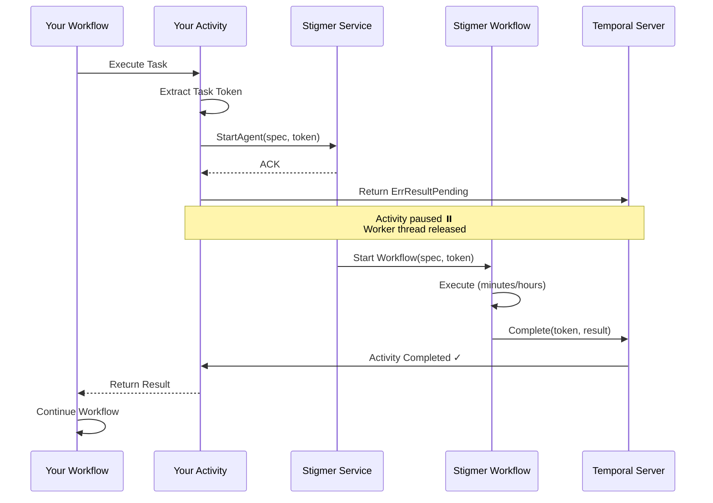

# Developer Guide: Temporal Async Activity Completion (Token Handshake)

**Purpose**: Guide for developers integrating with Stigmer's async activity completion pattern for long-running agent and workflow executions.

**Target Audience**: Developers building services that orchestrate Stigmer agents or workflows using Temporal

**When to Use**: When your Temporal workflow needs to wait for actual completion of a Stigmer agent/workflow (which may run for minutes to hours) without blocking worker threads

---

## Overview

The **Temporal Async Activity Completion** pattern (also called "token handshake") enables non-blocking orchestration of long-running Stigmer operations from external Temporal workflows.

### The Problem

When calling Stigmer's agent/workflow APIs from a Temporal activity, the gRPC call returns immediately with an acknowledgment (ACK). Without the token handshake pattern, your workflow would continue to the next step before the agent actually completes its work.

### The Solution

Your Temporal activity passes a **task token** to Stigmer, returns `ErrResultPending`, and releases the worker thread. When the Stigmer agent/workflow finishes (minutes or hours later), Stigmer completes your external activity using the token, and your workflow resumes.

### Benefits

✅ **Correctness**: Wait for actual completion, not just ACK  
✅ **Resource Efficiency**: Worker threads not blocked during long-running operations  
✅ **Resilience**: Token is durable; survives service restarts  
✅ **Scalability**: Worker pool doesn't exhaust under load  
✅ **Observability**: Both workflows visible in Temporal UI

---

## Architecture



---

## Quick Start (Go)

### 1. Create Activity with Token Handshake

```go
package activities

import (
    "context"
    "encoding/base64"
    
    "go.temporal.io/sdk/activity"
    agentpb "path/to/stigmer/apis/ai/stigmer/agentic/agentexecution/v1"
)

type StigmerActivities struct {
    stigmerClient agentpb.AgentExecutionServiceClient
}

func (a *StigmerActivities) ExecuteAgent(ctx context.Context, input AgentInput) (*agentpb.AgentExecution, error) {
    // 1. Extract the Temporal task token
    activityInfo := activity.GetInfo(ctx)
    taskToken := activityInfo.TaskToken
    
    // 2. Log token for debugging (Base64, truncated)
    tokenBase64 := base64.StdEncoding.EncodeToString(taskToken)
    tokenPreview := tokenBase64[:20] + "..."
    activity.GetLogger(ctx).Info("Extracted task token", 
        "token_preview", tokenPreview, 
        "token_length", len(taskToken))
    
    // 3. Create agent execution with callback token
    req := &agentpb.AgentExecutionCreateRequest{
        Spec: &agentpb.AgentExecutionSpec{
            AgentId:       input.AgentID,
            // ... other spec fields ...
            CallbackToken: taskToken, // ← Pass token here
        },
    }
    
    // 4. Call Stigmer API (returns immediately with ACK)
    resp, err := a.stigmerClient.Create(ctx, req)
    if err != nil {
        return nil, err // Immediate failure
    }
    
    activity.GetLogger(ctx).Info("Agent execution started, waiting for completion",
        "execution_id", resp.GetId())
    
    // 5. Tell Temporal to wait for external completion
    return nil, activity.ErrResultPending
}
```

### 2. Configure Activity Options

```go
package workflows

import (
    "time"
    "go.temporal.io/sdk/temporal"
    "go.temporal.io/sdk/workflow"
)

func YourWorkflow(ctx workflow.Context, input WorkflowInput) error {
    // Configure activity with appropriate timeout
    activityOptions := workflow.ActivityOptions{
        StartToCloseTimeout: 24 * time.Hour, // Max time for agent to complete
        RetryPolicy: &temporal.RetryPolicy{
            MaximumAttempts: 1, // No retries (token is single-use)
        },
        HeartbeatTimeout: 0, // No heartbeat for pending activities
    }
    
    ctx = workflow.WithActivityOptions(ctx, activityOptions)
    
    // Execute activity (will wait until Stigmer completes it)
    var result agentpb.AgentExecution
    err := workflow.ExecuteActivity(ctx, "ExecuteAgent", input).Get(ctx, &result)
    if err != nil {
        return err
    }
    
    workflow.GetLogger(ctx).Info("Agent execution completed", 
        "execution_id", result.GetId(),
        "status", result.GetStatus().GetPhase())
    
    // Continue with your workflow logic
    return nil
}
```

### 3. Register Activity

```go
package worker

import (
    "go.temporal.io/sdk/worker"
)

func main() {
    // Create Temporal client
    temporalClient, err := client.NewClient(client.Options{...})
    if err != nil {
        log.Fatal(err)
    }
    defer temporalClient.Close()
    
    // Create worker
    w := worker.New(temporalClient, "your-task-queue", worker.Options{})
    
    // Create activities with Stigmer client
    stigmerActivities := &activities.StigmerActivities{
        stigmerClient: createStigmerClient(),
    }
    
    // Register activities
    w.RegisterActivity(stigmerActivities.ExecuteAgent)
    
    // Register workflows
    w.RegisterWorkflow(workflows.YourWorkflow)
    
    // Start worker
    if err := w.Run(worker.InterruptCh()); err != nil {
        log.Fatal(err)
    }
}
```

---

## Quick Start (Java)

### 1. Create Activity with Token Handshake

```java
package com.example.activities;

import io.temporal.activity.Activity;
import io.temporal.activity.ActivityInterface;
import io.temporal.activity.ActivityMethod;
import ai.stigmer.apis.agentexecution.v1.AgentExecutionSpec;
import ai.stigmer.apis.agentexecution.v1.AgentExecutionServiceGrpc;
import java.util.Base64;

@ActivityInterface
public interface StigmerActivities {
    @ActivityMethod
    AgentExecution executeAgent(AgentInput input);
}

public class StigmerActivitiesImpl implements StigmerActivities {
    
    private final AgentExecutionServiceGrpc.AgentExecutionServiceBlockingStub stigmerClient;
    
    @Override
    public AgentExecution executeAgent(AgentInput input) {
        // 1. Extract the Temporal task token
        byte[] taskToken = Activity.getExecutionContext().getInfo().getTaskToken();
        
        // 2. Log token for debugging (Base64, truncated)
        String tokenBase64 = Base64.getEncoder().encodeToString(taskToken);
        String tokenPreview = tokenBase64.substring(0, Math.min(20, tokenBase64.length())) + "...";
        Activity.getExecutionContext().getLogger().info(
            "Extracted task token: preview={}, length={}", 
            tokenPreview, taskToken.length);
        
        // 3. Create agent execution with callback token
        AgentExecutionSpec spec = AgentExecutionSpec.newBuilder()
            .setAgentId(input.getAgentId())
            // ... other spec fields ...
            .setCallbackToken(ByteString.copyFrom(taskToken)) // ← Pass token here
            .build();
        
        AgentExecutionCreateRequest request = AgentExecutionCreateRequest.newBuilder()
            .setSpec(spec)
            .build();
        
        // 4. Call Stigmer API (returns immediately with ACK)
        AgentExecutionCreateResponse response = stigmerClient.create(request);
        
        Activity.getExecutionContext().getLogger().info(
            "Agent execution started, waiting for completion: execution_id={}", 
            response.getId());
        
        // 5. Tell Temporal to wait for external completion
        Activity.getExecutionContext().doNotCompleteOnReturn();
        
        // Return null (actual result will come via external completion)
        return null;
    }
}
```

### 2. Configure Activity in Workflow

```java
package com.example.workflows;

import io.temporal.activity.ActivityOptions;
import io.temporal.common.RetryOptions;
import io.temporal.workflow.Workflow;
import io.temporal.workflow.WorkflowInterface;
import io.temporal.workflow.WorkflowMethod;
import java.time.Duration;

@WorkflowInterface
public interface YourWorkflow {
    @WorkflowMethod
    void execute(WorkflowInput input);
}

public class YourWorkflowImpl implements YourWorkflow {
    
    private final StigmerActivities activities;
    
    public YourWorkflowImpl() {
        // Configure activity options
        ActivityOptions options = ActivityOptions.newBuilder()
            .setStartToCloseTimeout(Duration.ofHours(24)) // Max time for agent
            .setRetryOptions(RetryOptions.newBuilder()
                .setMaximumAttempts(1) // No retries (token is single-use)
                .build())
            .build();
        
        this.activities = Workflow.newActivityStub(StigmerActivities.class, options);
    }
    
    @Override
    public void execute(WorkflowInput input) {
        // Execute activity (will wait until Stigmer completes it)
        AgentExecution result = activities.executeAgent(input);
        
        Workflow.getLogger(YourWorkflow.class).info(
            "Agent execution completed: execution_id={}, status={}", 
            result.getId(), result.getStatus().getPhase());
        
        // Continue with your workflow logic
    }
}
```

### 3. Register Activity Worker

```java
package com.example.worker;

import io.temporal.client.WorkflowClient;
import io.temporal.serviceclient.WorkflowServiceStubs;
import io.temporal.worker.Worker;
import io.temporal.worker.WorkerFactory;

public class WorkerMain {
    public static void main(String[] args) {
        // Create Temporal client
        WorkflowServiceStubs service = WorkflowServiceStubs.newInstance();
        WorkflowClient client = WorkflowClient.newInstance(service);
        
        // Create worker factory
        WorkerFactory factory = WorkerFactory.newInstance(client);
        
        // Create worker
        Worker worker = factory.newWorker("your-task-queue");
        
        // Register workflows
        worker.registerWorkflowImplementationTypes(YourWorkflowImpl.class);
        
        // Register activities
        StigmerActivitiesImpl activities = new StigmerActivitiesImpl(
            createStigmerClient()
        );
        worker.registerActivitiesImplementations(activities);
        
        // Start worker
        factory.start();
    }
}
```

---

## Configuration

### Activity Timeout

Set `StartToCloseTimeout` based on expected agent/workflow duration:

**Go**:
```go
activityOptions := workflow.ActivityOptions{
    StartToCloseTimeout: 24 * time.Hour, // Adjust based on use case
}
```

**Java**:
```java
ActivityOptions options = ActivityOptions.newBuilder()
    .setStartToCloseTimeout(Duration.ofHours(24)) // Adjust based on use case
    .build();
```

**Guidelines**:
- **AI Agents**: 1-4 hours (complex reasoning, tool use)
- **Workflows**: 30 minutes to 2 hours (multi-step orchestration)
- **Add Buffer**: 2x expected duration for safety margin

**Why Important**: If Stigmer never completes the activity (e.g., bug, crash), the timeout ensures your workflow doesn't hang forever.

### Retry Policy

**Recommended**: No retries for async activities with token handshake

```go
RetryPolicy: &temporal.RetryPolicy{
    MaximumAttempts: 1, // No retries
}
```

**Rationale**:
- Task token is single-use (can't be reused)
- Retry would fail with "token already used" error
- If API call fails, activity returns error immediately (before `ErrResultPending`)
- If agent execution fails, Stigmer completes activity with error

### Heartbeat

**Recommended**: No heartbeat for pending activities

```go
HeartbeatTimeout: 0, // No heartbeat
```

**Rationale**:
- Activity is not actively running (waiting for external completion)
- Heartbeat only makes sense for activities doing work
- Stigmer handles timeout internally; will complete activity with timeout error if needed

---

## API Reference

### Proto Definition

```protobuf
// File: apis/ai/stigmer/agentic/agentexecution/v1/spec.proto

message AgentExecutionSpec {
    // Agent to execute
    string agent_id = 1;
    
    // ... other fields ...
    
    // Optional callback token for async activity completion
    // If provided, Stigmer will complete the external activity when done
    // If empty, behaves as fire-and-forget (returns immediately)
    bytes callback_token = 10;
}

message WorkflowExecutionSpec {
    // Workflow to execute
    string workflow_id = 1;
    
    // ... other fields ...
    
    // Optional callback token for async activity completion
    bytes callback_token = 10;
}
```

### Go SDK

**Extract Token**:
```go
activityInfo := activity.GetInfo(ctx)
taskToken := activityInfo.TaskToken // []byte
```

**Return Pending**:
```go
return nil, activity.ErrResultPending
```

**Import**:
```go
import "go.temporal.io/sdk/activity"
```

**Documentation**: https://pkg.go.dev/go.temporal.io/sdk/activity#ErrResultPending

### Java SDK

**Extract Token**:
```java
byte[] taskToken = Activity.getExecutionContext().getInfo().getTaskToken();
```

**Return Pending**:
```java
Activity.getExecutionContext().doNotCompleteOnReturn();
return null; // Actual result comes via external completion
```

**Import**:
```java
import io.temporal.activity.Activity;
```

**Documentation**: https://www.javadoc.io/doc/io.temporal/temporal-sdk/latest/io/temporal/activity/Activity.html

---

## Best Practices

### 1. Log Token for Debugging (Securely)

**Pattern**: Base64-encode and truncate to first 20 characters

```go
// Go
tokenBase64 := base64.StdEncoding.EncodeToString(taskToken)
tokenPreview := tokenBase64[:20] + "..."
logger.Info("Token", "token_preview", tokenPreview)
```

```java
// Java
String tokenBase64 = Base64.getEncoder().encodeToString(taskToken);
String tokenPreview = tokenBase64.substring(0, Math.min(20, tokenBase64.length())) + "...";
logger.info("Token: preview={}", tokenPreview);
```

**Why**:
- **Debugging**: Correlate activity across systems (your workflow, Stigmer, Temporal)
- **Security**: Full token in logs is security risk (could be replayed)
- **Balance**: 20 chars provides correlation without exposing full token

### 2. Validate Token Before Passing

**Pattern**: Check token is not empty

```go
if len(taskToken) == 0 {
    return nil, fmt.Errorf("task token is empty")
}
```

**Why**: Empty token means activity info wasn't properly extracted; fail fast

### 3. Set Appropriate Timeout

**Pattern**: 2x expected duration + buffer

```go
// If agent typically takes 30 minutes, set 1 hour timeout
StartToCloseTimeout: 1 * time.Hour
```

**Why**: Prevents workflow hanging forever if Stigmer fails to complete

### 4. Handle Completion Errors

When Stigmer completes your activity, it may return an error (e.g., agent execution failed):

```go
var result agentpb.AgentExecution
err := workflow.ExecuteActivity(ctx, "ExecuteAgent", input).Get(ctx, &result)
if err != nil {
    workflow.GetLogger(ctx).Error("Agent execution failed", "error", err.Error())
    // Handle error (retry, fallback, etc.)
    return err
}
```

**Common Errors**:
- `AGENT_EXECUTION_FAILED`: Agent encountered error during execution
- `AGENT_EXECUTION_TIMEOUT`: Agent exceeded internal timeout
- `AGENT_EXECUTION_CANCELLED`: Agent was cancelled by user

### 5. Don't Retry Async Activities

**Pattern**: Set `MaximumAttempts: 1`

```go
RetryPolicy: &temporal.RetryPolicy{
    MaximumAttempts: 1,
}
```

**Why**: Token is single-use; retry would fail anyway

### 6. Monitor Pending Activities

**Pattern**: Add metrics and alerts for stuck activities

```go
// Pseudo-code
if activityState == "running" && duration > timeout * 0.8 {
    metrics.Increment("stigmer.async_activity.approaching_timeout")
    alerts.Warning("Activity approaching timeout: " + activityID)
}
```

**Why**: Early warning system for potential issues

---

## Troubleshooting

### Activity Never Completes

**Symptoms**: Activity stuck in "Running" state, never returns

**Possible Causes**:
1. Token not passed to Stigmer (check request logs)
2. Stigmer service crashed before completion
3. Network issue prevented completion call
4. Timeout not set (activity waits forever)

**Solutions**:
1. Verify token is in request: Check Stigmer service logs for "Callback token detected"
2. Check Stigmer workflow status in Temporal UI
3. Ensure `StartToCloseTimeout` is set (will timeout eventually)
4. Check Stigmer metrics for `external_activity_completion_failures`

**Debugging**:
```bash
# Check your activity logs
grep "Extracted task token" your-service.log | grep <workflow_id>

# Check Stigmer service logs
grep "Callback token detected" stigmer-server.log | grep <token_preview>

# Check Stigmer workflow in Temporal UI
temporal workflow show --workflow-id <stigmer_workflow_id>
```

### Token Already Used Error

**Symptoms**: Error "activity task not found" or "invalid task token"

**Possible Causes**:
1. Activity retried (token is single-use)
2. Activity completed but workflow retried activity call
3. Token corruption during transmission

**Solutions**:
1. Set `MaximumAttempts: 1` (no retries)
2. Don't retry activity execution in workflow code
3. Verify token bytes are not modified during gRPC call

### Activity Times Out

**Symptoms**: Activity fails with "activity timeout" error

**Possible Causes**:
1. Stigmer execution took longer than `StartToCloseTimeout`
2. Stigmer failed to complete activity (bug, crash)

**Solutions**:
1. Increase `StartToCloseTimeout` based on actual duration
2. Check Stigmer workflow status (may still be running or failed)
3. Review Stigmer logs for completion errors

### Activity Completes with Error

**Symptoms**: Activity completes but returns error

**Possible Causes**:
1. Stigmer agent execution failed (expected behavior)
2. Stigmer workflow encountered error

**Solutions**:
1. Check error message (contains details from Stigmer)
2. Review agent execution status in Stigmer UI
3. Check Stigmer workflow history in Temporal UI
4. Implement error handling in your workflow (retry, fallback, etc.)

---

## Examples

### Example 1: Simple Agent Execution

Execute an agent and continue workflow:

```go
func ProcessDocumentWorkflow(ctx workflow.Context, input DocumentInput) error {
    // Step 1: Execute agent with async completion
    var agentResult agentpb.AgentExecution
    err := workflow.ExecuteActivity(ctx, "ExecuteAgent", AgentInput{
        AgentID: "document-processor-v1",
        Inputs: map[string]string{
            "document_url": input.DocumentURL,
        },
    }).Get(ctx, &agentResult)
    
    if err != nil {
        return fmt.Errorf("agent execution failed: %w", err)
    }
    
    // Step 2: Extract results from agent execution
    processingResult := parseAgentOutput(agentResult)
    
    // Step 3: Continue workflow with results
    return workflow.ExecuteActivity(ctx, "SaveResults", processingResult).Get(ctx, nil)
}
```

### Example 2: Parallel Agent Executions

Execute multiple agents concurrently:

```go
func AnalyzeContentWorkflow(ctx workflow.Context, content Content) error {
    // Execute 3 agents in parallel
    futures := []workflow.Future{
        workflow.ExecuteActivity(ctx, "ExecuteAgent", AgentInput{
            AgentID: "sentiment-analyzer",
            Inputs: map[string]string{"text": content.Text},
        }),
        workflow.ExecuteActivity(ctx, "ExecuteAgent", AgentInput{
            AgentID: "entity-extractor",
            Inputs: map[string]string{"text": content.Text},
        }),
        workflow.ExecuteActivity(ctx, "ExecuteAgent", AgentInput{
            AgentID: "summarizer",
            Inputs: map[string]string{"text": content.Text},
        }),
    }
    
    // Wait for all agents to complete
    var results []agentpb.AgentExecution
    for _, future := range futures {
        var result agentpb.AgentExecution
        if err := future.Get(ctx, &result); err != nil {
            return err
        }
        results = append(results, result)
    }
    
    // Combine results
    return workflow.ExecuteActivity(ctx, "CombineResults", results).Get(ctx, nil)
}
```

### Example 3: Workflow Execution with Timeout Handling

Execute workflow with custom timeout handling:

```go
func DataPipelineWorkflow(ctx workflow.Context, input PipelineInput) error {
    // Configure activity with 2-hour timeout
    activityCtx := workflow.WithActivityOptions(ctx, workflow.ActivityOptions{
        StartToCloseTimeout: 2 * time.Hour,
        RetryPolicy: &temporal.RetryPolicy{
            MaximumAttempts: 1,
        },
    })
    
    // Execute workflow
    var result workflowpb.WorkflowExecution
    err := workflow.ExecuteActivity(activityCtx, "ExecuteWorkflow", WorkflowInput{
        WorkflowID: "data-pipeline-v2",
        Inputs: input.ToMap(),
    }).Get(activityCtx, &result)
    
    if err != nil {
        // Check if timeout
        if temporal.IsTimeoutError(err) {
            workflow.GetLogger(ctx).Warn("Workflow timed out after 2 hours")
            // Handle timeout (send notification, retry with different config, etc.)
            return handleTimeout(ctx, input)
        }
        return err
    }
    
    // Process successful result
    return processWorkflowResult(ctx, result)
}
```

---

## Reference

### Related Documentation

- **ADR**: [Async Agent Execution - Temporal Token Handshake](../adr/20260122-async-agent-execution-temporal-token-handshake.md)
- **Architecture**: [Temporal Integration](../architecture/temporal-integration.md)
- **Testing Guide**: `stigmer-cloud/docs/guides/temporal-token-handshake-testing.md`
- **Operator Runbook**: [Temporal Token Handshake Operations](temporal-token-handshake-operations.md)

### External Resources

- **Temporal Docs**: [Asynchronous Activity Completion](https://docs.temporal.io/activities#asynchronous-activity-completion)
- **Temporal Go SDK**: [activity.ErrResultPending](https://pkg.go.dev/go.temporal.io/sdk/activity#ErrResultPending)
- **Temporal Java SDK**: [Activity.doNotCompleteOnReturn()](https://www.javadoc.io/doc/io.temporal/temporal-sdk/latest/io/temporal/activity/Activity.html)

### Getting Help

- **Questions**: #temporal-integration Slack channel
- **Issues**: GitHub Issues (stigmer/stigmer)
- **On-Call**: ops@stigmer.ai

---

**Remember**: The token handshake pattern is critical for correct async orchestration. Always pass the token, always return `ErrResultPending` (Go) or call `doNotCompleteOnReturn()` (Java), and always set appropriate timeouts.
