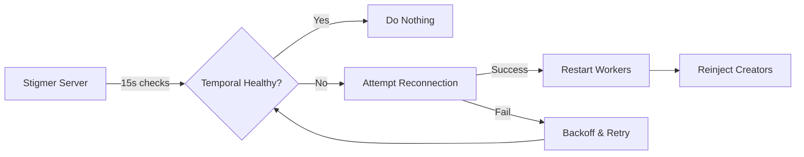

# Temporal Connection Resilience - Quick Start Guide

**TL;DR**: The stigmer server now automatically connects/reconnects to Temporal. Start services in any order, no manual restarts needed.

## For Developers

### The Old Way (Broken) ❌

```bash
# HAD to start in this exact order:
1. temporal server start-dev
2. ./stigmer server start
3. Hope they connected
4. If not, restart stigmer server
5. Pray it works this time
```

### The New Way (Just Works) ✅

```bash
# Start in ANY order:
./stigmer server start    # Terminal 1
temporal server start-dev # Terminal 2 (whenever)

# Server automatically connects when Temporal is ready
# Watch logs for: "✅ Temporal reconnected successfully"
```

## What Changed

### Before
- Server **required** Temporal at startup
- Connection failure = broken workflows forever
- Had to manually restart to reconnect
- Tests flaky due to timing issues

### After
- Server **tolerates** Temporal being down
- Connection failure = automatic retry every 15s
- Reconnects automatically on Temporal restart
- Tests reliable regardless of startup order

## Common Scenarios

### Scenario 1: Start Server First

```bash
# Terminal 1
$ ./stigmer server start

[INFO] Starting Stigmer Server
[WARN] Failed initial Temporal connection - will retry automatically
[INFO] Stigmer Server started successfully
[INFO] Starting Temporal health monitor

# Terminal 2 (5 seconds later)
$ temporal server start-dev

# Back to Terminal 1
[INFO] Attempting Temporal reconnection (attempt 1, backoff 1s)
[INFO] ✅ Temporal reconnected successfully
[INFO] ✅ Workers restarted successfully
[INFO] ✅ Workflow creators reinjected successfully
```

### Scenario 2: Temporal Restarts During Operation

```bash
# Create an execution
$ ./stigmer agent-execution create ...
✅ Created: aex-abc123

# Temporal crashes/restarts
# [In server logs]
[WARN] Temporal connection unhealthy, initiating reconnection
[INFO] Stopping old workers
[INFO] Attempting Temporal reconnection (attempt 1, backoff 1s)
[INFO] ✅ Temporal reconnected successfully

# Create another execution (works immediately)
$ ./stigmer agent-execution create ...
✅ Created: aex-def456
```

### Scenario 3: Temporal Down

```bash
# Temporal is not running
$ ./stigmer agent-execution create ...

❌ Error: Temporal workflow engine is unavailable. Please try again later.
Code: UNAVAILABLE

# Start Temporal
$ temporal server start-dev

# Wait ~15 seconds for auto-connection
# [In server logs]
[INFO] ✅ Temporal reconnected successfully

# Try again (now works)
$ ./stigmer agent-execution create ...
✅ Created: aex-ghi789
```

## How It Works (Simple Version)



1. **Health Monitor** checks Temporal every 15 seconds
2. **If unhealthy**: Attempt reconnection with exponential backoff
3. **If reconnected**: 
   - Stop old workers
   - Start new workers with new connection
   - Update workflow creators in controllers
4. **If failed**: Wait longer (1s, 2s, 4s, 8s, 16s, max 30s) and retry

## Log Messages to Look For

### Good Signs ✅

```
[INFO] ✅ Initial Temporal connection successful
[INFO] ✅ Temporal reconnected successfully
[INFO] ✅ Workers restarted successfully
[INFO] ✅ Workflow creators reinjected successfully
[INFO] All Temporal workers started
```

### Expected Warnings ⚠️

```
[WARN] Failed initial Temporal connection - will retry automatically
[WARN] Temporal connection unhealthy, initiating reconnection
[WARN] Temporal reconnection failed, will retry
```

### Bad Signs ❌ (need investigation)

```
[ERROR] Failed to start worker
[ERROR] Failed to create grpc connection
```

## Testing the Resilience

### Test 1: Delayed Start

```bash
# 1. Start server first
./stigmer server start

# 2. Wait 10 seconds

# 3. Start Temporal
temporal server start-dev

# 4. Within 15 seconds, check logs for:
#    "✅ Temporal reconnected successfully"

# 5. Create execution (should work)
./stigmer agent-execution create ...
```

### Test 2: Temporal Restart

```bash
# 1. Both running normally

# 2. Create execution (should work)
./stigmer agent-execution create ...

# 3. Stop Temporal
# Press Ctrl+C in Temporal terminal

# 4. Try to create execution (should fail with UNAVAILABLE)
./stigmer agent-execution create ...

# 5. Restart Temporal
temporal server start-dev

# 6. Wait ~15-30 seconds

# 7. Create execution again (should work)
./stigmer agent-execution create ...
```

### Test 3: Connection Loss

```bash
# 1. Both running normally

# 2. Block Temporal port (Linux/Mac)
sudo iptables -A OUTPUT -p tcp --dport 7233 -j DROP

# 3. Server detects unhealthy connection
# 4. Server attempts reconnection (will fail)

# 5. Unblock port
sudo iptables -D OUTPUT -p tcp --dport 7233 -j DROP

# 6. Server reconnects automatically
```

## Troubleshooting

### Problem: Server won't connect to Temporal

**Check**:
```bash
# 1. Is Temporal running?
temporal operator namespace list

# 2. Is port accessible?
nc -zv localhost 7233

# 3. Check server logs for connection attempts
grep "Temporal" /path/to/stigmer.log
```

**Solution**: Verify `TEMPORAL_HOST_PORT` environment variable matches your Temporal instance.

### Problem: Executions stuck in PENDING

**Check**:
```bash
# 1. Check Temporal connection status in logs
grep "Temporal" /path/to/stigmer.log | tail -20

# 2. Verify workers are running
grep "worker" /path/to/stigmer.log | tail -10
```

**Solution**: If no recent "✅ Temporal reconnected successfully", restart both services.

### Problem: Connection reconnects every 15 seconds (loop)

**Check**:
```bash
# This means health check is failing
# Check Temporal logs for errors
temporal server start-dev --log-level debug
```

**Solution**: Usually a namespace or permissions issue. Verify namespace "default" exists.

## For E2E Tests

### Old Test Pattern (Flaky) ❌

```go
// Assumed Temporal was already running
server := startServer()
execution := createExecution() // Sometimes times out
```

### New Test Pattern (Reliable) ✅

```go
// Start server first
server := startServer()

// Start Temporal
temporal := startTemporal()

// Wait for automatic connection
require.Eventually(t, func() bool {
    return server.IsTemporalConnected()
}, 30*time.Second, 1*time.Second)

// Now safe to create executions
execution := createExecution()
```

## Environment Variables

```bash
# Temporal connection settings
TEMPORAL_HOST_PORT=localhost:7233    # Default
TEMPORAL_NAMESPACE=default           # Default

# For production
TEMPORAL_HOST_PORT=temporal.prod:7233
TEMPORAL_NAMESPACE=prod
```

## Architecture Notes (For Deep Divers)

### Thread Safety

- **Client access**: Lock-free using `atomic.Value`
- **Worker management**: Mutex-protected (`workersMu`)
- **Reconnection state**: Separate mutex (`reconnectMu`)

### Performance Impact

- **Zero impact** on happy path (Temporal healthy)
- **Lightweight health check**: `DescribeNamespace()` ~5-10ms
- **Reconnection**: ~2-5 seconds to restart workers
- **Backoff**: Prevents log spam and Temporal overload

### What Gets Reinitialized on Reconnection

1. Temporal client
2. All workers (3 workers: agent execution, workflow execution, workflow validation)
3. Workflow creators in controllers:
   - AgentExecutionController
   - WorkflowExecutionController
   - WorkflowController (validator)

## Related Documentation

- **Implementation Details**: `TEMPORAL_CONNECTION_RESILIENCE_IMPLEMENTATION.md`
- **Architectural Decision**: `_cursor/adr-doc.md`
- **Original Problem**: `FIX_TEMPORAL_CONNECTION_RESILIENCE.md`

## Questions?

- **"Do I need to change my code?"** No, it just works.
- **"What if Temporal is down?"** Executions fail fast with UNAVAILABLE error.
- **"How long until reconnection?"** First try: 1s, max: 30s with backoff.
- **"Can I disable auto-reconnection?"** Not currently, but you could fork and comment out health monitor start.

## Key Takeaway

**You no longer need to think about Temporal connection timing.** The server handles it automatically. Start services in any order, restart Temporal anytime, and the server recovers gracefully.

Just watch the logs for that beautiful ✅ and you're good to go!
