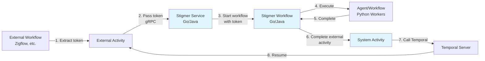

# Operator Runbook: Temporal Token Handshake Operations

**Purpose**: Production operations guide for monitoring, troubleshooting, and maintaining Stigmer's async activity completion pattern.

**Target Audience**: DevOps engineers, SREs, on-call engineers

**Scope**: Temporal token handshake pattern for agent/workflow execution

---

## System Overview

The **Temporal Token Handshake** pattern enables non-blocking orchestration of long-running Stigmer operations. External workflows (e.g., Zigflow) wait for actual completion without blocking worker threads.

### Components



### Critical Path

1. **Token Extraction** (External): Activity extracts task token from Temporal
2. **Token Transmission** (gRPC): Token passed to Stigmer in request
3. **Token Persistence** (Stigmer): Token saved with execution (durable)
4. **Workflow Execution** (Stigmer): Long-running agent/workflow runs
5. **External Completion** (Stigmer): System activity completes external activity via token
6. **Activity Resume** (External): External workflow continues

**Failure Point Impact**:
- **Before step 3**: Immediate failure (activity fails, workflow retries/fails)
- **After step 3**: Activity remains pending (safe, will timeout eventually)
- **Step 5 fails**: Activity times out (alertable, recoverable with manual completion)

---

## Monitoring

### Key Metrics

#### 1. External Activity Completion Rate

**Metric**: `stigmer_external_activity_completions_total`  
**Labels**: `status={success,failure}`, `service={go,java}`  
**Type**: Counter

**Healthy**: Success rate > 95%  
**Alert**: Success rate < 90% for 5 minutes

**Query** (Prometheus):
```promql
# Success rate over last 5 minutes
rate(stigmer_external_activity_completions_total{status="success"}[5m]) 
/ 
rate(stigmer_external_activity_completions_total[5m]) * 100
```

#### 2. External Activity Completion Duration

**Metric**: `stigmer_external_activity_completion_duration_seconds`  
**Labels**: `status={success,failure}`, `service={go,java}`  
**Type**: Histogram

**Healthy**: p50 < 50ms, p99 < 200ms  
**Alert**: p99 > 500ms for 5 minutes

**Query** (Prometheus):
```promql
# P99 completion duration
histogram_quantile(0.99, 
    rate(stigmer_external_activity_completion_duration_seconds_bucket[5m]))
```

#### 3. Pending External Activities

**Metric**: `stigmer_pending_external_activities`  
**Labels**: `service={go,java}`, `age_bucket={0-1h,1-4h,4-12h,12-24h,24h+}`  
**Type**: Gauge

**Healthy**: Most activities < 4 hours  
**Alert**: Any activities > 24 hours

**Query** (Prometheus):
```promql
# Activities pending > 24 hours
stigmer_pending_external_activities{age_bucket="24h+"}
```

#### 4. External Activity Errors

**Metric**: `stigmer_external_activity_errors_total`  
**Labels**: `error_type={token_empty,client_error,timeout,unknown}`, `service={go,java}`  
**Type**: Counter

**Healthy**: Error rate < 1%  
**Alert**: Error rate > 5% for 5 minutes

**Query** (Prometheus):
```promql
# Error rate over last 5 minutes
rate(stigmer_external_activity_errors_total[5m]) * 100
```

### Log Patterns to Monitor

#### Success Path Logs

**Go OSS**:
```
INFO [ASYNC-PATTERN] Callback token detected - will complete external activity on finish
    execution_id=<id> token_length=<bytes>

INFO [ASYNC-PATTERN] Completing external activity with success
    execution_id=<id> token_preview=<base64_prefix>... result_present=true

INFO [ASYNC-PATTERN] External activity completed successfully
    execution_id=<id>
```

**Java Cloud**:
```
INFO StartWorkflowStep - Callback token detected (async completion pattern)
    executionId=<id> tokenLength=<bytes> tokenPreview=<base64_prefix>...

INFO InvokeAgentExecutionWorkflowImpl - Completing external activity with success
    executionId=<id> tokenPreview=<base64_prefix>...

INFO SystemActivitiesImpl - External activity completed successfully
    tokenPreview=<base64_prefix>...
```

#### Failure Path Logs

**Go OSS**:
```
ERROR Failed to complete external activity with success
    error="<error_message>" execution_id=<id>

WARN [ASYNC-PATTERN] Completing external activity with error
    execution_id=<id> error="<error_message>"
```

**Java Cloud**:
```
WARN InvokeAgentExecutionWorkflowImpl - Agent execution failed, completing external activity with error
    executionId=<id> error="<error_message>"

ERROR SystemActivitiesImpl - Failed to complete external activity
    error="<error_message>" tokenPreview=<base64_prefix>...
```

### Temporal UI Monitoring

**Navigate to**: Temporal UI → Workflows → Search

**Filters**:
```
# Find pending external activities
WorkflowType=<external_workflow_type> AND Status=Running

# Find specific execution by token (use token preview from logs)
# Search in workflow history for StartActivity events
```

**What to Check**:
1. **Activity State**: Should be "Running" until completion
2. **Activity Duration**: Compare with expected duration
3. **Pending Activities Count**: Spike indicates backlog or completion failures
4. **Workflow History**: Verify token passed in StartActivity event

---

## Alerting Rules

### Critical Alerts (Page Immediately)

#### 1. External Activity Stuck > 24 Hours

**Severity**: Critical  
**Trigger**: Any activity pending > 24 hours (likely bug)

**Prometheus Alert**:
```yaml
- alert: StigmerExternalActivityStuck
  expr: stigmer_pending_external_activities{age_bucket="24h+"} > 0
  for: 5m
  labels:
    severity: critical
  annotations:
    summary: "External activities stuck for > 24 hours"
    description: "{{ $value }} activities pending > 24 hours. Likely completion failure."
    runbook: "https://docs.stigmer.ai/guides/temporal-token-handshake-operations#stuck-activities"
```

**Action**: See [Troubleshooting: Activity Never Completes](#activity-never-completes)

#### 2. External Activity Completion Failure Rate High

**Severity**: Critical  
**Trigger**: Success rate < 50% for 5 minutes

**Prometheus Alert**:
```yaml
- alert: StigmerExternalActivityCompletionFailureHigh
  expr: |
    (rate(stigmer_external_activity_completions_total{status="failure"}[5m]) 
    / 
    rate(stigmer_external_activity_completions_total[5m])) * 100 > 50
  for: 5m
  labels:
    severity: critical
  annotations:
    summary: "External activity completion failure rate > 50%"
    description: "{{ $value }}% of external completions failing. Check Temporal connectivity."
    runbook: "https://docs.stigmer.ai/guides/temporal-token-handshake-operations#completion-failures"
```

**Action**: See [Troubleshooting: Completion Failures](#completion-failures)

### Warning Alerts (Monitor, May Page if Persists)

#### 3. External Activity Completion Slow

**Severity**: Warning  
**Trigger**: P99 completion duration > 500ms for 10 minutes

**Prometheus Alert**:
```yaml
- alert: StigmerExternalActivityCompletionSlow
  expr: |
    histogram_quantile(0.99, 
      rate(stigmer_external_activity_completion_duration_seconds_bucket[5m])) > 0.5
  for: 10m
  labels:
    severity: warning
  annotations:
    summary: "External activity completion slow (P99 > 500ms)"
    description: "P99 completion time: {{ $value }}s. May indicate Temporal API latency."
```

**Action**: Check Temporal server health, network latency

#### 4. Pending External Activities Backlog

**Severity**: Warning  
**Trigger**: > 100 activities pending 1-4 hours

**Prometheus Alert**:
```yaml
- alert: StigmerExternalActivityBacklog
  expr: stigmer_pending_external_activities{age_bucket="1-4h"} > 100
  for: 15m
  labels:
    severity: warning
  annotations:
    summary: "Large backlog of pending external activities"
    description: "{{ $value }} activities pending 1-4 hours. Normal if agents are slow."
```

**Action**: Review agent execution times, check for unusual delays

---

## Troubleshooting

### Activity Never Completes

**Symptoms**:
- Activity stuck in "Running" state for > expected duration
- No completion logs in Stigmer service
- External workflow waiting indefinitely

**Investigation Steps**:

1. **Find Activity in Temporal UI**
```bash
# Get workflow ID from external workflow logs
grep "Agent execution started" external-service.log | grep <execution_id>

# Search Temporal UI
# Navigate to: Workflows → Search → WorkflowID: <workflow_id>
```

2. **Check Token Was Passed**
```bash
# Check external activity logs (token extraction)
grep "Extracted task token" external-service.log | grep <activity_id>

# Check Stigmer service logs (token received)
grep "Callback token detected" stigmer-service.log | grep <token_preview>
```

3. **Check Stigmer Workflow Status**
```bash
# Find Stigmer workflow ID (in Stigmer service logs)
grep "Starting workflow" stigmer-service.log | grep <execution_id>

# Check Stigmer workflow in Temporal UI
temporal workflow show --workflow-id <stigmer_workflow_id>
```

4. **Check for Completion Errors**
```bash
# Check Stigmer workflow logs
grep "Completing external activity" stigmer-service.log | grep <execution_id>

# Check for completion failures
grep "Failed to complete external activity" stigmer-service.log | grep <execution_id>
```

**Common Causes & Fixes**:

| Cause | Fix |
|-------|-----|
| Token not passed to Stigmer | Verify external activity passes `callback_token` in request |
| Stigmer workflow stuck/failed | Check Stigmer workflow history in Temporal UI; may need manual intervention |
| Completion call failed | Check Stigmer → Temporal connectivity; verify Temporal client configured |
| System activity not registered | Check worker logs for "Registered CompleteExternalActivity"; restart worker if missing |

**Manual Completion** (Last Resort):
```bash
# Use tctl to manually complete activity
tctl activity complete \
  --workflow-id <external_workflow_id> \
  --run-id <external_run_id> \
  --activity-id <activity_id> \
  --result '{"status": "completed", "message": "Manually completed"}'
```

### Completion Failures

**Symptoms**:
- High rate of external activity completion errors
- Logs show "Failed to complete external activity"
- External workflows timing out

**Investigation Steps**:

1. **Check Error Types**
```bash
# Check Stigmer logs for completion errors
grep "Failed to complete external activity" stigmer-service.log | tail -50

# Common errors:
# - "task token not found" → Token already used (activity completed/timed out)
# - "invalid task token" → Token corrupted or wrong Temporal namespace
# - "connection refused" → Temporal server unreachable
```

2. **Check Temporal Connectivity**
```bash
# Test Temporal server from Stigmer service
temporal workflow list --namespace default

# Check network connectivity
curl -v http://temporal-server:7233/health

# Check DNS resolution
nslookup temporal-server
```

3. **Check Temporal Client Configuration**
```bash
# Verify Temporal namespace matches external workflow
# Go: Check worker_config.go
# Java: Check application.properties

# Ensure client configured correctly
grep "Temporal client" stigmer-service.log | head -20
```

**Common Causes & Fixes**:

| Cause | Fix |
|-------|-----|
| Temporal server down | Check Temporal server health; scale up if needed |
| Wrong namespace | Verify Temporal namespace matches external workflow |
| Network issue | Check network connectivity, firewall rules, DNS |
| Token already used | Activity may have timed out; external workflow already retried |
| Client misconfigured | Verify Temporal client initialization in worker config |

**Immediate Mitigation**:
```bash
# Scale up Temporal server if overloaded
kubectl scale deployment temporal-frontend --replicas=5

# Restart Stigmer workers if client connection stale
kubectl rollout restart deployment stigmer-server
kubectl rollout restart deployment stigmer-service
```

### High Activity Duration

**Symptoms**:
- Activities completing successfully but taking longer than expected
- External workflows spending most time waiting
- Backlog of pending activities growing

**Investigation Steps**:

1. **Identify Slow Agents/Workflows**
```bash
# Find slowest executions
grep "External activity completed successfully" stigmer-service.log \
  | grep -oP 'execution_id=\K[^ ]+' \
  | xargs -I {} grep {} stigmer-service.log \
  | grep "Workflow execution duration"
```

2. **Check Agent/Workflow Execution Time**
```bash
# Check Stigmer workflow duration (not token handshake overhead)
temporal workflow show --workflow-id <stigmer_workflow_id> \
  | grep "Execution Time"
```

3. **Analyze Token Handshake Overhead**
```bash
# Token handshake overhead should be < 100ms
# Compare agent execution time vs external activity duration
# If difference > 1 second, investigate token handshake
```

**Common Causes**:

| Cause | Impact | Action |
|-------|--------|--------|
| Agent genuinely slow | High (hours) | Optimize agent, scale Python workers |
| Python worker queue backlog | Medium (minutes) | Scale Python workers, check queue depth |
| Temporal API latency | Low (milliseconds) | Check Temporal server load, network |
| System activity slow | Very low (< 100ms) | Check Temporal client connection pool |

**Optimization**:
- **Agent**: Profile agent code, optimize tool calls, use caching
- **Workers**: Scale Python worker pool based on queue depth
- **Temporal**: Ensure adequate Temporal server capacity

### Token Corruption

**Symptoms**:
- Error "invalid task token" in Stigmer logs
- Activities fail immediately with token error
- Token preview in logs doesn't match expected format

**Investigation Steps**:

1. **Verify Token in Logs**
```bash
# External activity logs (token extracted)
grep "Extracted task token" external-service.log | grep <activity_id>

# Stigmer service logs (token received)
grep "Callback token detected" stigmer-service.log | grep <execution_id>

# Compare token previews (first 20 chars Base64)
# Should match exactly
```

2. **Check Token Transmission**
```bash
# Capture gRPC request (if possible)
# Verify callback_token field in proto message

# Check for encoding issues (should be raw bytes, not Base64 string)
```

3. **Check Proto Version Mismatch**
```bash
# Verify proto versions match
# External service should use same proto version as Stigmer

# Check proto field number for callback_token (should be same)
grep "callback_token" apis/ai/stigmer/agentic/*/v1/*.proto
```

**Common Causes & Fixes**:

| Cause | Fix |
|-------|-----|
| Proto version mismatch | Regenerate protos from same source; ensure versions match |
| Token encoded as string | Pass raw bytes, not Base64-encoded string |
| Token truncated | Check request size limits; token is ~1KB |
| Memory corruption | Restart service; check for memory leaks |

**Prevention**:
- Use same proto definitions across all services
- Regenerate protos when updating
- Pass token as `bytes` field (not `string`)
- Don't modify token bytes after extraction

### Worker Not Registered

**Symptoms**:
- Error "activity not found" in Temporal logs
- External activities fail immediately
- Workflow can't schedule CompleteExternalActivity

**Investigation Steps**:

1. **Check Worker Registration Logs**
```bash
# Go OSS
grep "Registered CompleteExternalActivity" stigmer-server.log

# Java Cloud
grep "registerActivitiesImplementations" stigmer-service.log
grep "SystemActivities" stigmer-service.log
```

2. **Verify Worker Running**
```bash
# Check worker process
ps aux | grep stigmer-server  # Go
ps aux | grep stigmer-service  # Java

# Check worker health endpoint
curl http://localhost:8080/health
```

3. **Check Activity Registration**
```bash
# List registered activities (Temporal UI)
# Navigate to: Workers → <worker_name> → Activities

# Should see:
# - stigmer/system/complete-external-activity (Go)
# - SystemActivities.completeExternalActivity (Java)
```

**Common Causes & Fixes**:

| Cause | Fix |
|-------|-----|
| Worker not started | Start worker process; check deployment |
| Activity not registered | Verify registration code; check logs for errors |
| Wrong task queue | Verify worker task queue matches workflow |
| Worker crashed on startup | Check startup logs for errors; fix configuration |

**Fix**:
```bash
# Restart worker
kubectl rollout restart deployment stigmer-server  # Go
kubectl rollout restart deployment stigmer-service  # Java

# Verify registration in logs
kubectl logs -f deployment/stigmer-server | grep "Registered"
kubectl logs -f deployment/stigmer-service | grep "Activities"
```

---

## Operations Procedures

### Deployment

**Pre-Deployment Checklist**:
- [ ] Verify proto versions match across services
- [ ] Review pending activities (drain if possible)
- [ ] Check Temporal server health
- [ ] Notify on-call about deployment window

**Deployment Steps**:

1. **Deploy Stigmer Services** (Zero-Downtime)
```bash
# Deploy Go OSS (rolling update)
kubectl rollout status deployment/stigmer-server
kubectl set image deployment/stigmer-server stigmer-server=<new_image>
kubectl rollout status deployment/stigmer-server

# Deploy Java Cloud (rolling update)
kubectl rollout status deployment/stigmer-service
kubectl set image deployment/stigmer-service stigmer-service=<new_image>
kubectl rollout status deployment/stigmer-service
```

2. **Verify Workers Registered**
```bash
# Check worker registration logs
kubectl logs -f deployment/stigmer-server | grep "Registered CompleteExternalActivity"
kubectl logs -f deployment/stigmer-service | grep "SystemActivities"
```

3. **Monitor Pending Activities**
```bash
# Check for spike in pending activities
watch -n 5 'kubectl exec -it stigmer-server -- curl -s localhost:8080/metrics | grep stigmer_pending_external_activities'
```

4. **Smoke Test**
```bash
# Trigger test agent execution with token
curl -X POST http://stigmer-service/v1/agent-executions \
  -H "Content-Type: application/json" \
  -d '{"spec": {"agent_id": "test-agent", "callback_token": "<test_token>"}}'

# Verify completion in logs
kubectl logs -f deployment/stigmer-service | grep "External activity completed"
```

**Post-Deployment**:
- Monitor metrics for 30 minutes
- Check error rates (should be < 1%)
- Verify completion duration (should be < 100ms P99)

**Rollback Triggers**:
- Error rate > 10% for 5 minutes
- Completion failures > 50% for 5 minutes
- Any critical alert

**Rollback Steps**:
```bash
# Rollback deployment
kubectl rollout undo deployment/stigmer-server
kubectl rollout undo deployment/stigmer-service

# Verify rollback successful
kubectl rollout status deployment/stigmer-server
kubectl rollout status deployment/stigmer-service
```

### Scaling

**Worker Scaling Guidelines**:

**Go OSS Workers** (stigmer-server):
- **Baseline**: 3 replicas (HA)
- **Scale Up**: If pending activities > 100 for > 15 minutes
- **Max**: 10 replicas (Temporal client connection limit)

**Java Cloud Workers** (stigmer-service):
- **Baseline**: 3 replicas (HA)
- **Scale Up**: If pending activities > 100 for > 15 minutes
- **Max**: 10 replicas (Temporal client connection limit)

**Scaling Commands**:
```bash
# Scale up
kubectl scale deployment/stigmer-server --replicas=5
kubectl scale deployment/stigmer-service --replicas=5

# Scale down (during low traffic)
kubectl scale deployment/stigmer-server --replicas=3
kubectl scale deployment/stigmer-service --replicas=3
```

**Auto-Scaling** (HPA):
```yaml
# Go OSS
apiVersion: autoscaling/v2
kind: HorizontalPodAutoscaler
metadata:
  name: stigmer-server-hpa
spec:
  scaleTargetRef:
    apiVersion: apps/v1
    kind: Deployment
    name: stigmer-server
  minReplicas: 3
  maxReplicas: 10
  metrics:
  - type: Pods
    pods:
      metric:
        name: stigmer_pending_external_activities
      target:
        type: AverageValue
        averageValue: "20"  # 20 pending activities per pod
```

### Maintenance Windows

**Impact**: None (async pattern is resilient)

**Procedure**:

1. **Stigmer Service Maintenance**
```bash
# No special steps needed
# Pending activities safe (token durable in Temporal)
# Workers can restart without losing state

kubectl rollout restart deployment/stigmer-server
kubectl rollout restart deployment/stigmer-service
```

2. **Temporal Server Maintenance**
```bash
# Pending activities safe (state persisted)
# Completion calls will retry automatically

# Monitor completion error rate during maintenance
# May spike temporarily (expected)
```

3. **Extended Downtime** (> 1 hour)
```bash
# Notify users (external workflows may timeout)
# Consider increasing StartToCloseTimeout temporarily

# Drain workers
kubectl scale deployment/stigmer-server --replicas=0
kubectl scale deployment/stigmer-service --replicas=0

# Perform maintenance
# ...

# Restore workers
kubectl scale deployment/stigmer-server --replicas=3
kubectl scale deployment/stigmer-service --replicas=3
```

---

## Metrics Dashboard

### Grafana Dashboard Configuration

```json
{
  "dashboard": {
    "title": "Stigmer - Temporal Token Handshake",
    "panels": [
      {
        "title": "External Activity Completion Rate",
        "targets": [
          {
            "expr": "rate(stigmer_external_activity_completions_total{status=\"success\"}[5m]) / rate(stigmer_external_activity_completions_total[5m]) * 100"
          }
        ],
        "type": "graph"
      },
      {
        "title": "External Activity Completion Duration (P50, P95, P99)",
        "targets": [
          {
            "expr": "histogram_quantile(0.50, rate(stigmer_external_activity_completion_duration_seconds_bucket[5m]))",
            "legendFormat": "P50"
          },
          {
            "expr": "histogram_quantile(0.95, rate(stigmer_external_activity_completion_duration_seconds_bucket[5m]))",
            "legendFormat": "P95"
          },
          {
            "expr": "histogram_quantile(0.99, rate(stigmer_external_activity_completion_duration_seconds_bucket[5m]))",
            "legendFormat": "P99"
          }
        ],
        "type": "graph"
      },
      {
        "title": "Pending External Activities by Age",
        "targets": [
          {
            "expr": "stigmer_pending_external_activities",
            "legendFormat": "{{age_bucket}}"
          }
        ],
        "type": "graph"
      },
      {
        "title": "External Activity Errors by Type",
        "targets": [
          {
            "expr": "rate(stigmer_external_activity_errors_total[5m])",
            "legendFormat": "{{error_type}}"
          }
        ],
        "type": "graph"
      }
    ]
  }
}
```

---

## Reference

### Log Correlation

**Correlate logs across services using token preview**:

```bash
# Extract token preview from external activity logs
TOKEN_PREVIEW=$(grep "Extracted task token" external.log | grep <activity_id> | grep -oP 'token_preview=\K[^ ]+')

# Find related logs in Stigmer service
grep "$TOKEN_PREVIEW" stigmer-service.log

# Find related logs in Stigmer workflow
grep "$TOKEN_PREVIEW" stigmer-workflow.log
```

### Related Documentation

- **Developer Guide**: [Temporal Async Activity Completion](temporal-async-activity-completion.md)
- **ADR**: [Async Agent Execution - Temporal Token Handshake](../adr/20260122-async-agent-execution-temporal-token-handshake.md)
- **Architecture**: [Temporal Integration](../architecture/temporal-integration.md)
- **Testing Guide**: `stigmer-cloud/docs/guides/temporal-token-handshake-testing.md`

### Escalation Path

1. **Check runbook** (this document)
2. **Search logs** (see Log Correlation above)
3. **Check Temporal UI** (workflow status, activity state)
4. **Slack**: #stigmer-oncall
5. **Page**: Use PagerDuty if critical alert
6. **Escalate**: Engineering lead if prolonged outage

---

**Remember**: The token handshake pattern is resilient by design. Token is durable in Temporal history, completion can retry, and timeouts prevent infinite waits. Most issues are recoverable with restart or manual completion.
