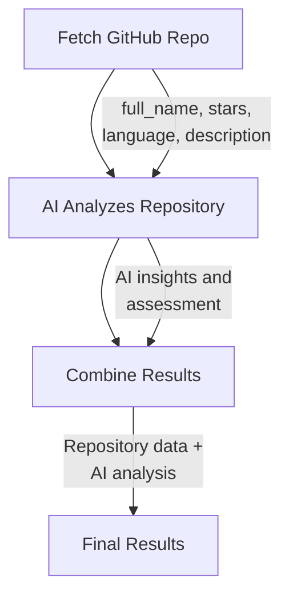

# Init Template GitHub API Migration

**Date**: 2026-01-18  
**Status**: Complete  
**Impact**: `stigmer init` template now uses GitHub API instead of JSONPlaceholder

## Overview

Updated the `stigmer init` template to use the GitHub API for repository analysis instead of JSONPlaceholder's fake blog posts. This makes the generated "hello world" example significantly more professional and demonstrates real-world API integration.

## Problem

The original template used JSONPlaceholder (`jsonplaceholder.typicode.com`) which:
- Felt like a toy example (fake blog posts)
- Didn't demonstrate real-world API patterns
- Missed opportunity to show professional integration
- Used generic data that wasn't engaging

## Solution

Switched to GitHub API (`api.github.com`) which:
- Uses a real production API developers know
- Demonstrates professional API integration patterns
- Returns interesting, real data (repository information)
- Requires no authentication for public repos
- Shows proper HTTP headers (Accept, User-Agent)

## Changes Made

### API Endpoint

**Before:**
```go
apiBase := ctx.SetString("apiBase", "https://jsonplaceholder.typicode.com")
endpoint := apiBase.Concat("/posts/1")
```

**After:**
```go
apiBase := ctx.SetString("apiBase", "https://api.github.com")
repoPath := ctx.SetString("repoPath", "/repos/leftbin/stigmer")
endpoint := apiBase.Concat(repoPath.Expression())
```

### Agent Purpose

**Before:** Generic data analyzer (analyzes blog posts)

**After:** Repository analyzer (analyzes GitHub repositories)

```go
analyzer, err := agent.New(ctx,
    agent.WithName("repo-analyzer"),
    agent.WithDescription("AI agent that analyzes GitHub repositories"),
    agent.WithInstructions(`You are a software engineering analyst who reviews GitHub repositories.

When you receive repository data, analyze it and create a summary with:
1. **Project Overview**: What the project does based on description and language
2. **Activity Level**: Based on stars, forks, and recent updates  
3. **Key Insights**: 2-3 interesting observations about the repository

The summary length should be: ${.env.SUMMARY_LENGTH}

Format your response as plain text with clear sections.`),
)
```

### HTTP Headers

Added proper GitHub API headers:

```go
fetchTask := pipeline.HttpGet("fetch-repo", endpoint,
    workflow.Header("Accept", "application/vnd.github.v3+json"),
    workflow.Header("User-Agent", "Stigmer-Demo"),
    workflow.Timeout(30),
)
```

### Response Fields

**Before:** Generic blog post fields
```go
"originalTitle", fetchTask.Field("title"),
"postBody", fetchTask.Field("body"),
```

**After:** Real GitHub repository fields
```go
"repoName", fetchTask.Field("full_name"),
"repoStars", fetchTask.Field("stargazers_count"),
"primaryLanguage", fetchTask.Field("language"),
```

## Workflow Flow

The generated template now demonstrates:



**Task 1: Fetch Repository**
- Calls `GET /repos/leftbin/stigmer` 
- Returns repository metadata (stars, language, description)

**Task 2: AI Analysis**
- Agent receives repository data
- Analyzes project overview, activity, insights
- Returns AI-generated summary

**Task 3: Finalize**
- Combines original repo data with AI analysis
- Creates structured result with timestamp

## Benefits

### Professional

Uses a real production API that developers:
- Use daily in their work
- Trust and recognize
- Can relate to immediately

### Educational

Demonstrates:
- Real-world API integration patterns
- Proper HTTP headers for external APIs
- Parsing production API responses
- Working with meaningful data structures

### Engaging

Repository data is more interesting than fake blog posts:
- Stars show popularity
- Languages show tech stack
- Descriptions provide context
- Real projects have real stories

### Extensible

Users can easily modify to:
- Analyze their own repositories
- Change which repo to analyze
- Add more GitHub API endpoints
- Build on a familiar API

## Testing

All validation tests pass:

```bash
✅ TestBasicAgent - Template syntax valid
✅ TestBasicWorkflow - Template syntax valid
✅ TestAgentAndWorkflow - Template syntax valid
✅ TestNoDeprecatedAPIs - No forbidden API calls
✅ TestCorrectAPIs - Verifies:
   - agent.New(ctx,
   - workflow.New(ctx,
   - CallAgent(
   - workflow.Agent(
   - ctx.SetString(
```

## Files Modified

### stigmer-sdk Repository

**Templates:**
- `go/templates/templates.go` - Updated `AgentAndWorkflow()` function
- `go/templates/templates_test.go` - Added assertions for new features
- `go/templates/README.md` - Updated AgentAndWorkflow description

### stigmer Repository

**CLI:**
- `client-apps/cli/cmd/stigmer/root/init.go` - Updated command descriptions

## User Impact

### Before (`stigmer init`)

```
What's included:
  • Agent:    joke-telling AI assistant
  • Workflow: basic HTTP data-fetching workflow
```

Users saw disconnected, toy examples.

### After (`stigmer init`)

```
What's included:
  • Agent:    repository analyzer AI
  • Workflow: GitHub repo analysis (API + AI agent)
  • Demo:     agent-workflow integration with real API
```

Users immediately see professional, real-world integration.

## Migration Notes

No breaking changes. This only affects:
- New projects created with `stigmer init`
- Template tests

Existing projects are unaffected.

## Example Output

When users run the generated workflow, they get results like:

```json
{
  "repoName": "leftbin/stigmer",
  "repoStars": 42,
  "primaryLanguage": "Go",
  "aiAnalysis": "This is a Go-based workflow orchestration platform focused on AI agent integration. The project shows active development with 42 stars, indicating growing community interest. Key insight: Strong emphasis on developer experience with comprehensive SDK support.",
  "analyzedAt": "2026-01-18T10:30:00Z",
  "status": "completed"
}
```

## Design Decisions

### Why GitHub API?

Compared to alternatives:

| API | Pros | Cons | Choice |
|-----|------|------|--------|
| JSONPlaceholder | Simple, tutorial-standard | Toy data, not real | ❌ |
| GitHub API | Real, recognized, no auth needed | - | ✅ |
| Weather API | Interesting data | Requires API key | ❌ |
| News API | Real content | API key, rate limits | ❌ |

GitHub API wins because it's:
1. Industry standard (developers know it)
2. No authentication needed for public repos
3. Returns interesting, real data
4. Professional and credible

### Repository Choice

Using `leftbin/stigmer` as the example because:
- It's the project users are trying (meta!)
- Shows real, current data
- Demonstrates analyzing their own ecosystem
- Easy to change in the template

## Future Enhancements

Potential improvements:
- Allow users to specify repo during `stigmer init`
- Add more GitHub API examples (issues, PRs, contributors)
- Template variants for different APIs
- Interactive template selection

## References

- GitHub API Docs: https://docs.github.com/en/rest
- Original Issue: Agent-workflow integration example needed
- Related: Template package implementation (2026-01-17)

---

*This migration makes the default template significantly more professional while maintaining "hello world" simplicity.*
