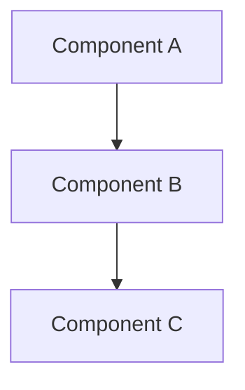

{/*
  ARCHITECTURE TEMPLATE
  =====================
  Use this template for architecture documents that explain *why* something
  is designed the way it is. These live in docs/architecture/.

  Architecture docs differ from concept docs: concept docs explain a resource
  from the user's perspective. Architecture docs explain the internal design,
  trade-offs, and implementation rationale for contributors and advanced users.

  Architecture docs differ from ADRs: ADRs capture a single decision at a
  point in time. Architecture docs describe the current state of a design
  area and may reference multiple ADRs.

  Section order is mandatory. Do not reorder or skip sections.
*/}

# {Architecture topic}

{/*
  One paragraph summarizing the design area and why it matters.
*/}

{Summary of the design area.}

---

## Overview

{/*
  2-3 paragraphs providing context. What does this part of the system do?
  Who interacts with it? What are the key constraints?
*/}

{High-level description of the design area.}

---

## Problem statement

{/*
  What problem does this design solve? What were the requirements and
  constraints that shaped the solution? Be specific about the forces
  at play (performance, simplicity, portability, etc.).
*/}

{Description of the problem and constraints.}

---

## Design

{/*
  The core of the document. Explain the architecture with:
  - A Mermaid diagram showing component relationships
  - Prose explaining the key design decisions
  - Subsections for each major component or layer

  Cross-reference related concept docs for user-facing explanations.
*/}

### {Component or layer 1}

{Description of this component's role and design.}

### {Component or layer 2}

{Description.}

---

## Key decisions

{/*
  List the most important design decisions and their rationale.
  For decisions that have a dedicated ADR, link to it.
  For smaller decisions, explain inline.
*/}

| Decision | Rationale | ADR |
|---|---|---|
| {Decision 1} | {Why} | [{ADR title}](../adr/{slug}.mdx) |
| {Decision 2} | {Why} | — |

---

## Trade-offs

{/*
  Every design has trade-offs. Be explicit about what this design
  gains and what it gives up. This helps future contributors
  understand whether the trade-offs still apply.
*/}

| What we gain | What we give up |
|---|---|
| {Benefit} | {Cost} |

---

## Implementation notes

{/*
  Practical details for contributors working in this area.
  Include: relevant source paths, key types/interfaces,
  configuration knobs, and known limitations.
*/}

### Source locations

| Component | Path |
|---|---|
| {Component} | `{path/to/source}` |

### Known limitations

- {Limitation 1}
- {Limitation 2}

---

## Related docs

- [{Related concept}](../concepts/{slug}.mdx) — User-facing explanation
- [{Related architecture doc}](../architecture/{slug}.mdx) — {Brief description}
- [{Related ADR}](../adr/{slug}.mdx) — {Brief description}
