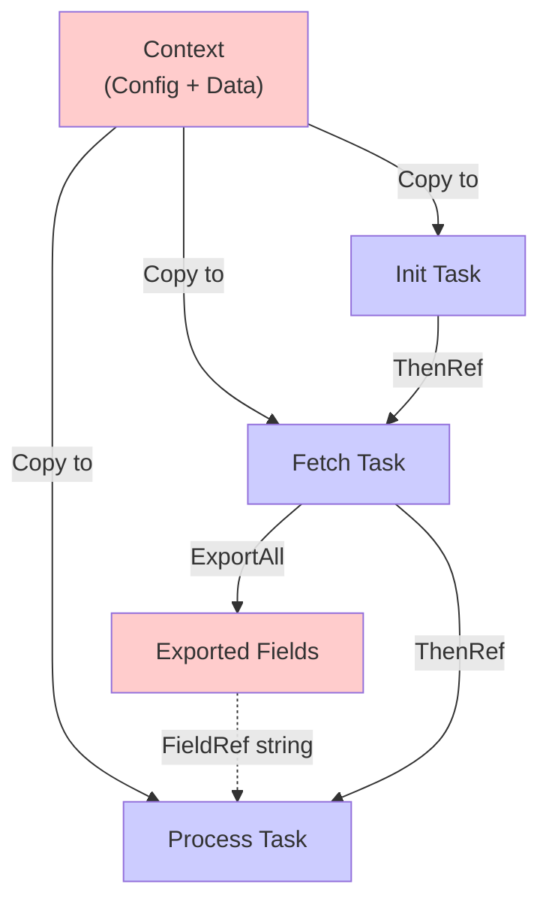
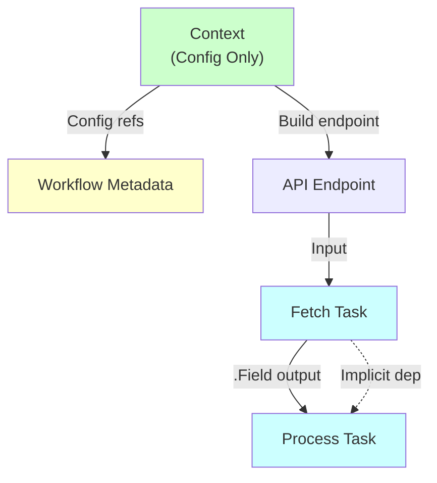
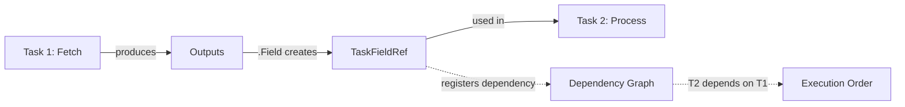
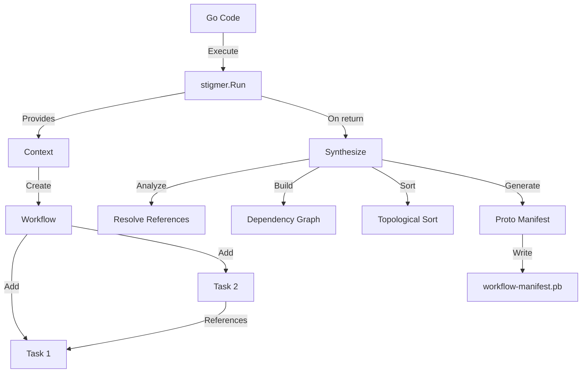

# Pulumi-Aligned Patterns Architecture

This document explains the architectural principles behind the Stigmer SDK's Pulumi-aligned design.

---

## Core Philosophy

> **"Make the SDK feel like writing Pulumi code, not writing proto messages."**

The Stigmer SDK follows proven patterns from Pulumi (and Terraform, CloudFormation, etc.) to provide a professional, intuitive developer experience.

---

## Design Principles

### 1. Context is Configuration, Not Data Flow

**Pattern**: Like Pulumi's `pulumi.Config`, context stores **configuration** known before resources are created, not runtime data.

#### Pulumi Example

```go
// Pulumi - Config for stack-level settings
config := pulumi.Config("myapp")
region := config.Require("region")  // From Pulumi.stack.yaml

bucket := s3.NewBucket(ctx, "my-bucket", &s3.BucketArgs{
    Region: region,  // Use config
})
```

**Key insight**: Config is for "what region?", "what org?", "what API endpoint?" - things you know upfront.

#### Stigmer Alignment

```go
// Stigmer - Context for shared configuration
apiBase := ctx.SetString("apiBase", "https://api.example.com")
orgName := ctx.SetString("org", "my-org")

wf, _ := workflow.New(ctx,
    workflow.WithOrg(orgName),  // Use config
)

endpoint := apiBase.Concat("/posts/1")  // Build from config
fetchTask := wf.HttpGet("fetch", endpoint)  // Use in tasks
```

**Key insight**: Context is for "what API base URL?", "what org?" - shared configuration across workflows and agents.

#### Anti-Pattern (OLD SDK)

```go
// ❌ Using context for workflow data flow
apiURL := ctx.SetString("apiURL", "https://api.example.com")
retryCount := ctx.SetInt("retryCount", 0)

// Then copying to tasks (redundant!)
initTask := workflow.SetTask("init",
    workflow.SetVar("currentURL", apiURL),
    workflow.SetVar("retries", retryCount),
)
```

**Problem**: Context was being used for BOTH configuration AND internal workflow data, creating confusion.

---

### 2. Resource Outputs → Direct References

**Pattern**: Resources produce typed outputs. Other resources reference them directly. Dependencies are implicit.

#### Pulumi Example

```go
// Create bucket - produces outputs
bucket := s3.NewBucket(ctx, "my-bucket", ...)

// Use bucket's output in another resource
website := s3.NewBucketWebsite(ctx, "website", &s3.BucketWebsiteArgs{
    Bucket: bucket.ID(),  // Direct reference to bucket's ID output
    // Dependency is automatic!
})
```

**Key insights**:
- `bucket.ID()` is a typed output reference
- Dependency tracking is automatic
- Clear data flow: website depends on bucket
- No manual `DependsOn()` needed

#### Stigmer Alignment

```go
// Task 1: Fetch data - produces outputs
fetchTask := wf.HttpGet("fetchData", endpoint)

// Task 2: Use fetchTask's outputs
processTask := wf.SetVars("processResponse",
    "postTitle", fetchTask.Field("title"),  // Direct reference to fetchTask output
    "postBody", fetchTask.Field("body"),    // Direct reference to fetchTask output
)
// Dependency is automatic!
```

**Key insights**:
- `fetchTask.Field("title")` is a typed output reference
- Dependency tracking is automatic
- Clear data flow: processTask depends on fetchTask
- No manual `ThenRef()` needed

#### Anti-Pattern (OLD SDK)

```go
// ❌ Magic string references with unclear origin
fetchTask := workflow.HttpCallTask("fetch", ...).ExportAll()

processTask := workflow.SetTask("process",
    workflow.SetVar("title", workflow.FieldRef("title")), // Where is "title" from???
)

// Manual dependency management
fetchTask.ThenRef(processTask)
```

**Problems**:
1. `FieldRef("title")` - where does "title" come from?
2. `ExportAll()` - what does this do? Why needed?
3. Manual `ThenRef()` - error-prone, tedious

---

### 3. Implicit Dependencies via References

**Pattern**: Dependencies are inferred from resource references, not declared manually.

#### Pulumi Example

```go
// Create VPC
vpc := ec2.NewVpc(ctx, "main-vpc", &ec2.VpcArgs{
    CidrBlock: "10.0.0.0/16",
})

// Create subnet - references VPC
subnet := ec2.NewSubnet(ctx, "main-subnet", &ec2.SubnetArgs{
    VpcId: vpc.ID(),  // Reference creates dependency
    CidrBlock: "10.0.1.0/24",
})

// Create instance - references subnet
instance := ec2.NewInstance(ctx, "web-server", &ec2.InstanceArgs{
    SubnetId: subnet.ID(),  // Reference creates dependency
    InstanceType: "t2.micro",
})

// Dependency chain: vpc → subnet → instance
// All automatic through references!
```

**Key insight**: No `DependsOn()` needed 90% of the time. References encode dependencies.

#### Stigmer Alignment

```go
// Task 1: Fetch user data
userTask := wf.HttpGet("fetchUser", userEndpoint)

// Task 2: Fetch posts for user
postsTask := wf.HttpGet("fetchPosts", 
    userTask.Field("id").Concat("/posts"),  // Reference userTask
)

// Task 3: Process results
summaryTask := wf.SetVars("createSummary",
    "userName", userTask.Field("name"),     // Reference userTask
    "postCount", postsTask.Field("total"),  // Reference postsTask
)

// Dependency chain: userTask → postsTask → summaryTask
// All automatic through field references!
```

**Key insight**: `task.Field()` creates a `TaskFieldRef` that encodes dependency, just like Pulumi's `resource.Output()`.

#### Explicit Dependencies (Escape Hatch)

Sometimes dependencies don't naturally flow through data references:

```go
// Pulumi - explicit dependency when needed
vpc := ec2.NewVpc(...)
igw := ec2.NewInternetGateway(..., pulumi.DependsOn([]pulumi.Resource{vpc}))
```

**Stigmer equivalent** (if needed in future):
```go
// Potential future API
setupTask := wf.SetVars("setup", ...)
cleanupTask := wf.SetVars("cleanup", ..., workflow.DependsOn(setupTask))
```

**Current status**: Not implemented yet. 99% of cases work with implicit dependencies.

---

### 4. Clean Builder APIs

**Pattern**: Intuitive constructors that combine related parameters.

#### Pulumi Example

```go
// Clear, concise bucket creation
bucket := s3.NewBucket(ctx, "my-bucket", &s3.BucketArgs{
    Acl: "private",
    Region: "us-west-2",
    Website: &s3.BucketWebsiteArgs{
        IndexDocument: "index.html",
    },
})
```

**Key insight**: Related parameters grouped together, one function call.

#### Stigmer Alignment

```go
// OLD ❌ - Verbose, multi-step
task := workflow.HttpCallTask("fetch",
    workflow.WithHTTPGet(),           // 1. Set method
    workflow.WithURI(endpoint),       // 2. Set URI
    workflow.WithHeader("Content-Type", "application/json"),
)

// NEW ✅ - Clean, one-liner
task := wf.HttpGet("fetch", endpoint,
    workflow.Header("Content-Type", "application/json"),
    workflow.Timeout(30),
)
```

**Key insight**: Common patterns get dedicated convenience methods.

**Available builders:**
- `wf.HttpGet(name, uri, opts...)` - GET request
- `wf.HttpPost(name, uri, opts...)` - POST request  
- `wf.HttpPut(name, uri, opts...)` - PUT request
- `wf.HttpDelete(name, uri, opts...)` - DELETE request
- `wf.SetVars(name, key1, val1, key2, val2, ...)` - Variable setting

---

### 5. Typed References with Compile-Time Safety

**Pattern**: Strong typing catches errors at compile time, not runtime.

#### Pulumi Example

```go
bucket := s3.NewBucket(ctx, "my-bucket", ...)

// ✅ Type-checked at compile time
website := s3.NewBucketWebsite(ctx, "website", &s3.BucketWebsiteArgs{
    Bucket: bucket.ID(),  // s3.BucketOutput type
})

// ❌ Compile error - wrong type
website := s3.NewBucketWebsite(ctx, "website", &s3.BucketWebsiteArgs{
    Bucket: "my-bucket-name",  // String literal - type error!
})
```

#### Stigmer Alignment

```go
fetchTask := wf.HttpGet("fetch", endpoint)

// ✅ Task reference checked at compile time
processTask := wf.SetVars("process",
    "title", fetchTask.Field("title"),  // fetchTask is a Task type
)

// ❌ Compile error - variable not a task
wrongTask := "some-task-name"
processTask := wf.SetVars("process",
    "title", wrongTask.Field("title"),  // Type error!
)
```

**Key benefit**: Typos in task names caught by compiler, not at runtime.

---

## Architecture Diagrams

### OLD: Confusing Context + Manual Dependencies



**Problems**:
- ❌ Context used for both config and data
- ❌ Redundant copying to tasks
- ❌ Unclear where `FieldRef("title")` comes from
- ❌ Manual `ThenRef()` dependencies

### NEW: Clear Config + Implicit Dependencies



**Benefits**:
- ✅ Context for config only (clear scope)
- ✅ No redundant copies
- ✅ Direct task references: `fetchTask.Field("title")`
- ✅ Implicit dependencies via references

---

## Data Flow Comparison

### OLD: Magic Strings + Manual Wiring

```
┌─────────────────┐
│   Context       │  (Everything!)
│  apiURL: "..."  │
│  retryCount: 3  │
└────────┬────────┘
         │
         ├──► Init Task (copy context vars)
         │
         ├──► Fetch Task .ExportAll()
         │         │
         │         └──► [title, body, ...] (exported fields)
         │                      │
         │                      │ FieldRef("title") - where from???
         │                      ▼
         └──► Process Task (magic string reference)

Dependencies: init.ThenRef(fetch), fetch.ThenRef(process)
```

### NEW: Direct References + Implicit Dependencies

```
┌─────────────────┐
│   Context       │  (Config only!)
│  apiBase: "..." │
│  org: "..."     │
└────────┬────────┘
         │
         ├──► Workflow.Org (use config)
         │
         └──► Build endpoint
                   │
                   ▼
              Fetch Task
                   │
                   │ .Field("title") - clear!
                   ▼
              Process Task

Dependencies: Automatic via field references!
```

---

## Reference Types Architecture

### StringRef - String Values

```go
// Create from context config
apiBase := ctx.SetString("apiBase", "https://api.example.com")

// Operations
endpoint := apiBase.Concat("/users")  // String concatenation
fullURL := endpoint.Concat("/", userID)  // Multiple parts

// Use in tasks
task := wf.HttpGet("fetch", endpoint)
```

**Implementation**: `StringRef` stores either a literal value or a context variable reference. During synthesis, it resolves to the appropriate expression.

### TaskFieldRef - Task Output References

```go
// Create from task
fetchTask := wf.HttpGet("fetch", endpoint)
titleRef := fetchTask.Field("title")  // TaskFieldRef

// Use in other tasks
processTask := wf.SetVars("process",
    "title", titleRef,  // Direct reference
)
```

**Implementation**: `TaskFieldRef` stores:
1. Source task name
2. Field name
3. Automatically adds dependency edge

**Synthesis**: Generates expression like `$context.fetchTask.title` in workflow manifest.

### Other Ref Types

```go
// Integer references
ctx.SetInt("timeout", 30)

// Boolean references
ctx.SetBool("verbose", true)

// Object references (complex types)
ctx.SetObject("config", map[string]interface{}{
    "region": "us-west-2",
    "tier": "premium",
})
```

---

## Dependency Tracking System

### How It Works



### Example Flow

```go
// 1. Create task - registers in workflow
fetchTask := wf.HttpGet("fetch", endpoint)
// wf.tasks = ["fetch"]

// 2. Create field reference - records source
titleRef := fetchTask.Field("title")
// titleRef.taskName = "fetch"
// titleRef.fieldName = "title"

// 3. Use in another task - automatic dependency
processTask := wf.SetVars("process",
    "title", titleRef,  // Uses TaskFieldRef
)
// wf.detectDependencies(processTask) sees TaskFieldRef
// wf.addDependency(processTask, fetchTask)
// wf.dependencyGraph: process → fetch

// 4. Synthesis - generates correct order
// manifest.tasks = [fetch, process]  (topological sort)
```

### Dependency Detection Algorithm

```go
func (wf *Workflow) detectDependencies(task *Task) {
    for _, input := range task.Inputs {
        if fieldRef, ok := input.(TaskFieldRef); ok {
            sourceTask := wf.findTask(fieldRef.TaskName)
            wf.addDependency(task, sourceTask)
        }
    }
}
```

**Key insight**: Dependencies are metadata - tracked separately from task definitions, inferred from references.

---

## Synthesis Process

### How Code Becomes Manifests



### Context Resolution

```go
// During execution
apiBase := ctx.SetString("apiBase", "https://api.example.com")
endpoint := apiBase.Concat("/posts")

// During synthesis
ctx.Synthesize() {
    // 1. Collect all context variables
    contextVars = ["apiBase"]
    
    // 2. Resolve StringRef chains
    endpoint.Resolve() {
        // Base: $context.apiBase
        // Concat: $context.apiBase + "/posts"
        return "$context.apiBase/posts"
    }
    
    // 3. Generate context manifest
    workflowContext = {
        variables: [
            {name: "apiBase", type: STRING, value: "https://api.example.com"}
        ]
    }
}
```

### Task Reference Resolution

```go
// During execution
fetchTask := wf.HttpGet("fetch", endpoint)
titleRef := fetchTask.Field("title")

// During synthesis
titleRef.Resolve() {
    // Generates expression: $context.fetchTask.title
    return TaskOutputExpression{
        taskName: "fetch",
        fieldPath: "title",
    }
}

// In manifest proto
task {
    name: "process"
    input {
        key: "title"
        value {
            expression: "$context.fetchTask.title"  // Resolved reference
        }
    }
}
```

---

## Comparison with Other IaC Tools

### Pulumi

| Feature | Pulumi | Stigmer SDK |
|---------|--------|-------------|
| **Context/Config** | `pulumi.Config("stack")` | `stigmer.Context` |
| **Resource Creation** | `s3.NewBucket(ctx, name, args)` | `wf.HttpGet(name, uri)` |
| **Output References** | `bucket.ID()` | `task.Field("id")` |
| **Implicit Dependencies** | ✅ via output refs | ✅ via field refs |
| **Explicit Dependencies** | `pulumi.DependsOn()` | Future: `workflow.DependsOn()` |
| **Type Safety** | ✅ Strong typing | ✅ Typed refs |

### Terraform

| Feature | Terraform | Stigmer SDK |
|---------|-----------|-------------|
| **Variables** | `var.region` | `ctx.SetString("region", ...)` |
| **Resource Creation** | `resource "aws_s3_bucket" "main" {}` | `wf.HttpGet("main", ...)` |
| **Output References** | `aws_s3_bucket.main.id` | `task.Field("id")` |
| **Implicit Dependencies** | ✅ via references | ✅ via field refs |
| **Explicit Dependencies** | `depends_on = [...]` | Future: `workflow.DependsOn()` |

### CloudFormation

| Feature | CloudFormation | Stigmer SDK |
|---------|----------------|-------------|
| **Parameters** | `!Ref MyParameter` | `ctx.SetString(...)` |
| **Resource Creation** | YAML resource definitions | `wf.HttpGet(...)` |
| **Output References** | `!GetAtt Bucket.Arn` | `task.Field("arn")` |
| **Implicit Dependencies** | ✅ via !Ref, !GetAtt | ✅ via field refs |
| **Explicit Dependencies** | `DependsOn: [...]` | Future: `workflow.DependsOn()` |

**Key insight**: All mature IaC tools converged on similar patterns. Stigmer aligns with industry standards.

---

## Design Decisions

### Why Pulumi vs. Terraform Style?

**Pulumi**: Code-first, strongly typed

```go
bucket := s3.NewBucket(ctx, "my-bucket", &s3.BucketArgs{})
```

**Terraform**: DSL-first, loosely typed

```hcl
resource "aws_s3_bucket" "main" {}
```

**Decision**: Pulumi-style because:
1. ✅ Go SDK - naturally code-first
2. ✅ Strong typing benefits
3. ✅ Better IDE support
4. ✅ More familiar to Go developers

### Why `stigmer.Run()` vs. Manual Context?

**Option 1**: Manual context management
```go
ctx := stigmer.NewContext()
// ... create resources ...
ctx.Synthesize()
```

**Option 2**: `stigmer.Run()` wrapper
```go
stigmer.Run(func(ctx *stigmer.Context) error {
    // ... create resources ...
    return nil
})
```

**Decision**: `stigmer.Run()` because:
1. ✅ Automatic synthesis on completion
2. ✅ Error handling built-in
3. ✅ Matches Pulumi's `pulumi.Run()`
4. ✅ Less boilerplate for users
5. ✅ Prevents forgot-to-synthesize bugs

### Why Implicit Dependencies?

**Manual** (old style):
```go
task1.ThenRef(task2)
task2.ThenRef(task3)
```

**Implicit** (new style):
```go
// Dependency inferred from field reference
task3 := wf.SetVars("task3",
    "data", task2.Field("result"),
)
```

**Decision**: Implicit because:
1. ✅ Less code (40% reduction)
2. ✅ Fewer errors (can't forget `ThenRef`)
3. ✅ Clear data flow (reference shows relationship)
4. ✅ Industry standard (Pulumi, Terraform, CloudFormation all use this)
5. ✅ Escape hatch available (future `DependsOn()` for edge cases)

### Why Context for Config Only?

**Option 1**: Context for everything (old style)
```go
ctx.SetString("apiURL", ...)  // config
ctx.SetInt("retryCount", ...) // workflow state
```

**Option 2**: Context for config only (new style)
```go
ctx.SetString("apiBase", ...)  // config
// workflow state lives in tasks
```

**Decision**: Config-only because:
1. ✅ Matches Pulumi's `pulumi.Config` scope
2. ✅ Clear separation of concerns
3. ✅ No redundant copying between context and tasks
4. ✅ Context shared between workflows and agents (makes sense for config, not for workflow-specific state)

---

## Future Enhancements

### Potential Additions

1. **Explicit Dependencies** (escape hatch)
   ```go
   task := wf.SetVars("cleanup", ..., workflow.DependsOn(setupTask))
   ```

2. **Conditional Execution** (Pulumi-style)
   ```go
   task := wf.Conditional("process",
       condition: isProduction,
       then: productionTask,
       else: stagingTask,
   )
   ```

3. **Dynamic Task Creation** (Terraform-style)
   ```go
   for _, endpoint := range endpoints {
       wf.HttpGet(endpoint.Name, endpoint.URL)
   }
   ```

4. **Parallel Execution Groups** (explicit)
   ```go
   wf.Parallel(
       wf.HttpGet("fetch1", url1),
       wf.HttpGet("fetch2", url2),
       wf.HttpGet("fetch3", url3),
   )
   ```

---

## Testing the Patterns

### Unit Testing

```go
func TestImplicitDependencies(t *testing.T) {
    ctx := stigmer.NewTestContext()
    
    wf, _ := workflow.New(ctx,
        workflow.WithName("test"),
    )
    
    // Create tasks
    t1 := wf.HttpGet("fetch", "https://api.example.com")
    t2 := wf.SetVars("process", "data", t1.Field("result"))
    
    // Verify dependency was recorded
    assert.True(t, wf.HasDependency(t2, t1))
}
```

### Integration Testing

```go
func TestWorkflowSynthesis(t *testing.T) {
    var manifest *workflowpb.Workflow
    
    err := stigmer.Run(func(ctx *stigmer.Context) error {
        apiBase := ctx.SetString("apiBase", "https://api.example.com")
        
        wf, _ := workflow.New(ctx,
            workflow.WithName("test"),
        )
        
        endpoint := apiBase.Concat("/data")
        fetchTask := wf.HttpGet("fetch", endpoint)
        processTask := wf.SetVars("process",
            "data", fetchTask.Field("result"),
        )
        
        manifest = wf.Synthesize()
        return nil
    })
    
    assert.NoError(t, err)
    assert.Len(t, manifest.Tasks, 2)
    // Verify task order (topological sort)
    assert.Equal(t, "fetch", manifest.Tasks[0].Name)
    assert.Equal(t, "process", manifest.Tasks[1].Name)
}
```

---

## Summary

**Core Patterns Aligned with Pulumi:**

1. ✅ **Context = Configuration** (not data flow)
2. ✅ **Direct Output References** (`task.Field()` like `bucket.ID()`)
3. ✅ **Implicit Dependencies** (inferred from references)
4. ✅ **Clean Builders** (intuitive, one-liner APIs)
5. ✅ **Typed References** (compile-time safety)
6. ✅ **Automatic Synthesis** (`stigmer.Run()` pattern)

**Benefits:**

- 🎯 Professional, industry-standard patterns
- 🎯 40% less code than old API
- 🎯 Clearer data flow and dependencies
- 🎯 Better compile-time safety
- 🎯 Easier to learn for developers familiar with IaC tools

**Result**: A workflow SDK that feels like writing Pulumi code, not wrangling proto messages.

---

*Last Updated: 2026-01-16 (Phase 5.2 Complete)*
