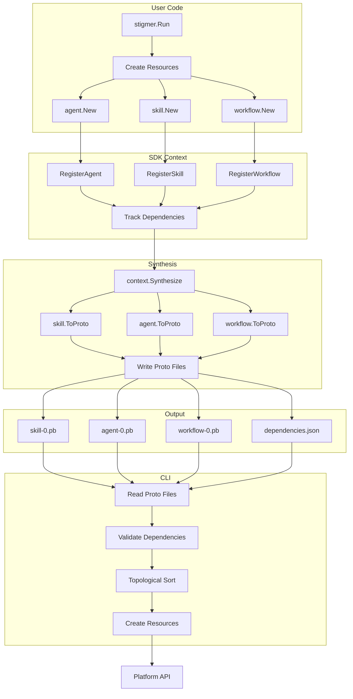

# Synthesis Architecture

**Status**: ✅ Production Ready (Code Generators Complete)  
**Version**: 0.2.0  
**Last Updated**: 2026-01-22

---

## Overview

The Stigmer Go SDK implements a **Pulumi-inspired synthesis model** where resources (agents, skills, workflows) defined in Go code are automatically converted to platform proto files for deployment. The synthesis pipeline handles dependency tracking, topological sorting, and proto conversion automatically.

---

## How It Works

### 1. Define Resources with stigmer.Run()

Users write declarative Go code that creates resources:

```go
package main

import (
    "github.com/stigmer/stigmer/sdk/go/stigmer"
    "github.com/stigmer/stigmer/sdk/go/agent"
    "github.com/stigmer/stigmer/sdk/go/skill"
    "github.com/stigmer/stigmer/sdk/go/workflow"
)

func main() {
    stigmer.Run(func(ctx *stigmer.Context) error {
        // Create inline skill
        skill1, _ := skill.New(
            skill.WithName("code-analysis"),
            skill.WithMarkdown("# Code Analysis..."),
        )
        
        // Create agent using skill
        agent1, _ := agent.New(ctx,
            agent.WithName("code-reviewer"),
            agent.WithInstructions("Review code"),
            agent.WithSkills(*skill1),  // Dependency tracked automatically
        )
        
        // Create workflow that calls agent
        wf, _ := workflow.New(ctx,
            workflow.WithNamespace("ci-cd"),
            workflow.WithName("pr-review"),
            workflow.WithVersion("1.0.0"),
        )
        
        wf.CallAgent("review", 
            workflow.Agent("code-reviewer"),  // Dependency tracked
            workflow.Message("Review this PR"),
        )
        
        return nil  // Resources synthesize on return
    })
}
```

**Key Pattern**: `stigmer.Run()` provides context, registers resources, and handles synthesis automatically.

### 2. Resources Registered in Context

As resources are created, they're registered in the context:

```go
// agent.New() registers with context
agent.New(ctx, opts...)  → ctx.RegisterAgent(agent)

// workflow.New() registers with context
workflow.New(ctx, opts...)  → ctx.RegisterWorkflow(workflow)

// Skills registered when used
skill.New(opts...)  → ctx.RegisterSkill(skill)  // When passed to agent
```

**Context Tracks**:
- Agents: `ctx.agents []agent.Agent`
- Workflows: `ctx.workflows []workflow.Workflow`
- Skills: `ctx.skills []skill.Skill` (inline only)
- Dependencies: `ctx.dependencies map[string][]string`

### 3. Automatic Dependency Tracking

Dependencies are tracked implicitly as resources reference each other:

```go
// When agent uses skill
agent.New(ctx, agent.WithSkills(skill1))
→ Context records: "agent:reviewer" → ["skill:code-analysis"]

// When workflow calls agent
wf.CallAgent("review", workflow.Agent("code-reviewer"))
→ Context records: "workflow:pr-review" → ["agent:code-reviewer"]
```

**Resource ID Format**:
- Skills: `skill:{slug}`
- Agents: `agent:{slug}`
- Workflows: `workflow:{name}`
- External: `{type}:external:{slug}`

### 4. Synthesis Triggered Automatically

When `stigmer.Run()` completes, synthesis is triggered automatically:

```go
func Run(fn func(*Context) error) error {
    ctx := newContext()
    
    if err := fn(ctx); err != nil {
        return err
    }
    
    // Automatic synthesis on success
    if err := ctx.Synthesize(); err != nil {
        return err
    }
    
    return nil
}
```

**Two Modes**:

**Dry-Run Mode** (no STIGMER_OUT_DIR):
```bash
go run main.go
```
- Validates resource definitions
- No files written
- Useful for testing

**Synthesis Mode** (with STIGMER_OUT_DIR):
```bash
STIGMER_OUT_DIR=/tmp/.stigmer go run main.go
```
- Converts resources to proto
- Writes individual .pb files
- Used by CLI for deployment

### 5. Individual Proto File Generation

Each resource is converted to a platform proto and written to its own file:

```go
// For each skill
skill.ToProto() → skillProto
proto.Marshal(skillProto) → skill-0.pb, skill-1.pb, ...

// For each agent
agent.ToProto() → agentProto
proto.Marshal(agentProto) → agent-0.pb, agent-1.pb, ...

// For each workflow
workflow.ToProto() → workflowProto
proto.Marshal(workflowProto) → workflow-0.pb, workflow-1.pb, ...

// Dependency graph
json.Marshal(dependencies) → dependencies.json
```

**Output Structure**:
```
.stigmer/
├── skill-0.pb          # First inline skill (Skill proto)
├── skill-1.pb          # Second inline skill
├── agent-0.pb          # First agent (Agent proto)
├── agent-1.pb          # Second agent
├── workflow-0.pb       # First workflow (Workflow proto)
├── workflow-1.pb       # Second workflow
└── dependencies.json   # Dependency graph
```

**Why Individual Files?**:
- ✅ Easier debugging (inspect single resource)
- ✅ Better version control (clear diffs)
- ✅ Simpler error messages (know which resource failed)
- ✅ Follows Kubernetes multi-document pattern
- ✅ CLI can parallelize reading (future optimization)

### 6. CLI Reads and Orders Resources

The CLI synthesis reader loads all resources and orders them by dependencies:

```go
// Read all proto files
result, err := synthesis.ReadFromDirectory(outputDir)
// result.Skills, result.Agents, result.Workflows, result.Dependencies

// Validate dependencies
if err := result.ValidateDependencies(); err != nil {
    return err  // Missing or circular dependencies
}

// Get resources in topological order
ordered, err := result.GetOrderedResources()
// Skills first, then agents, then workflows (dependency order)

// Create resources sequentially
for _, res := range ordered {
    switch r := res.Resource.(type) {
    case *skillv1.Skill:
        // Create skill on platform
    case *agentv1.Agent:
        // Create agent (skills already exist)
    case *workflowv1.Workflow:
        // Create workflow (agents already exist)
    }
}
```

**Topological Sort**:
- Uses Kahn's algorithm (O(V + E) complexity)
- Detects circular dependencies
- Handles external references
- Ensures dependencies exist before dependents

---

## Architecture Diagram



---

## Key Components

### Context (stigmer.Context)

**Responsibilities**:
- Resource registration (agents, workflows, skills)
- Dependency tracking (automatic)
- Variable management (typed context)
- Synthesis orchestration

**Methods**:
```go
// Registration
ctx.RegisterAgent(agent)
ctx.RegisterWorkflow(workflow)
ctx.RegisterSkill(skill)

// Inspection
ctx.Agents() []*agent.Agent
ctx.Workflows() []*workflow.Workflow
ctx.Skills() []*skill.Skill
ctx.Dependencies() map[string][]string

// Synthesis
ctx.Synthesize() error
```

### ToProto() Methods

Each resource type implements ToProto() to convert from SDK types to platform protos:

**Agent Conversion**:
```go
func (a *Agent) ToProto() (*agentv1.Agent, error) {
    return &agentv1.Agent{
        ApiVersion: "agentic.stigmer.ai/v1",
        Kind:       "Agent",
        Metadata:   &apiresource.ApiResourceMetadata{
            Name: a.Name,
            Slug: a.Slug,
            Annotations: SDKAnnotations(),  // SDK metadata
        },
        Spec: &agentv1.AgentSpec{
            Instructions: a.Instructions,
            SkillRefs:    convertSkills(a.Skills),
            // ... other fields
        },
    }, nil
}
```

**Workflow Conversion**:
```go
func (w *Workflow) ToProto() (*workflowv1.Workflow, error) {
    return &workflowv1.Workflow{
        ApiVersion: "agentic.stigmer.ai/v1",
        Kind:       "Workflow",
        Metadata:   &apiresource.ApiResourceMetadata{
            Name: w.Document.Name,
            Slug: w.Slug,
            Annotations: SDKAnnotations(),
        },
        Spec: &workflowv1.WorkflowSpec{
            Document: convertDocument(w.Document),
            Tasks:    convertTasks(w.Tasks),  // All 13 task types
            // ... other fields
        },
    }, nil
}
```

**Skill Conversion**:
```go
func (s *Skill) ToProto() (*skillv1.Skill, error) {
    return &skillv1.Skill{
        ApiVersion: "agentic.stigmer.ai/v1",
        Kind:       "Skill",
        Metadata:   &apiresource.ApiResourceMetadata{
            Name: s.Name,
            Slug: s.Slug,
            Annotations: SDKAnnotations(),
        },
        Spec: &skillv1.SkillSpec{
            MarkdownContent: s.MarkdownContent,
            Description:     s.Description,
        },
    }, nil
}
```

### SDK Annotations

Every proto includes SDK metadata for tracking and telemetry:

```go
annotations: {
    "stigmer.ai/sdk.language":    "go",
    "stigmer.ai/sdk.version":     "0.2.0",
    "stigmer.ai/sdk.generated-at": "1737552008",  // Unix timestamp
}
```

**Purpose**:
- Track which SDK generated the resource
- Support for multi-language SDKs (Go, Python, TypeScript, etc.)
- Telemetry and debugging
- Version compatibility checking

### CLI Synthesis Reader

**Location**: `client-apps/cli/internal/cli/synthesis/`

**Responsibilities**:
- Read individual proto files from output directory
- Validate dependencies
- Order resources topologically
- Provide resources to CLI for creation

**Key Methods**:
```go
// Read all resources
ReadFromDirectory(outputDir) (*Result, error)

// Validate dependency graph
result.ValidateDependencies() error

// Get resources in creation order
result.GetOrderedResources() ([]*ResourceWithID, error)

// Visualize dependencies
result.GetDependencyGraph() string
```

### Topological Sort

**Algorithm**: Kahn's Algorithm (BFS-based)

**Process**:
1. Calculate in-degree (dependency count) for each resource
2. Queue resources with zero dependencies
3. Process queue:
   - Pop resource with no remaining dependencies
   - Add to result list
   - Remove its outgoing edges
   - Update in-degree for dependent resources
4. Detect cycles if not all resources processed

**Complexity**: O(V + E) where V = resources, E = dependencies

**Example**:

**Input**:
```
skill:coding → (none)
skill:security → (none)
agent:reviewer → [skill:coding, skill:security]
workflow:pr-check → [agent:reviewer]
```

**Output Order**:
```
1. skill:coding
2. skill:security
3. agent:reviewer
4. workflow:pr-check
```

---

## Synthesis Flow Detail

### Step-by-Step Execution

```go
// 1. User runs stigmer.Run()
stigmer.Run(func(ctx *stigmer.Context) error {
    
    // 2. Create skill (inline)
    skill1, _ := skill.New(
        skill.WithName("code-analysis"),
        skill.WithMarkdown("# Analysis..."),
    )
    // → No context needed for inline skills
    
    // 3. Create agent (registers with context)
    agent1, _ := agent.New(ctx,
        agent.WithName("reviewer"),
        agent.WithInstructions("Review code"),
        agent.WithSkills(*skill1),
    )
    // → ctx.RegisterAgent(agent1)
    // → ctx.RegisterSkill(skill1)  // Auto-register inline skill
    // → ctx.addDependency("agent:reviewer", "skill:code-analysis")
    
    // 4. Create workflow (registers with context)
    wf, _ := workflow.New(ctx,
        workflow.WithNamespace("ci"),
        workflow.WithName("pr-review"),
        workflow.WithVersion("1.0.0"),
    )
    // → ctx.RegisterWorkflow(wf)
    
    // 5. Add task that calls agent
    wf.CallAgent("review",
        workflow.Agent("reviewer"),  // Reference by slug
    )
    // → ctx.addDependency("workflow:pr-review", "agent:reviewer")
    
    return nil  // Success
})
// 6. stigmer.Run() automatically calls ctx.Synthesize()
```

### Synthesis Process

```go
// Called automatically by stigmer.Run()
func (c *Context) Synthesize() error {
    outputDir := os.Getenv("STIGMER_OUT_DIR")
    if outputDir == "" {
        return nil  // Dry-run mode
    }
    
    // 1. Synthesize skills (they have no dependencies)
    for i, skill := range c.skills {
        proto, _ := skill.ToProto()
        data, _ := proto.Marshal(proto)
        os.WriteFile(filepath.Join(outputDir, fmt.Sprintf("skill-%d.pb", i)), data, 0644)
    }
    
    // 2. Synthesize agents (may depend on skills)
    for i, agent := range c.agents {
        proto, _ := agent.ToProto()
        data, _ := proto.Marshal(proto)
        os.WriteFile(filepath.Join(outputDir, fmt.Sprintf("agent-%d.pb", i)), data, 0644)
    }
    
    // 3. Synthesize workflows (may depend on agents)
    for i, workflow := range c.workflows {
        proto, _ := workflow.ToProto()
        data, _ := proto.Marshal(proto)
        os.WriteFile(filepath.Join(outputDir, fmt.Sprintf("workflow-%d.pb", i)), data, 0644)
    }
    
    // 4. Write dependency graph
    json.Marshal(c.dependencies) → dependencies.json
    
    return nil
}
```

### CLI Ordering and Deployment

```go
// CLI execution
func deploy(goFile string) error {
    // 1. Run user code with STIGMER_OUT_DIR set
    outputDir := createTempDir()
    cmd := exec.Command("go", "run", goFile)
    cmd.Env = append(os.Environ(), "STIGMER_OUT_DIR="+outputDir)
    cmd.Run()
    
    // 2. Read all synthesized resources
    result, _ := synthesis.ReadFromDirectory(outputDir)
    // result.Skills: []*skillv1.Skill
    // result.Agents: []*agentv1.Agent
    // result.Workflows: []*workflowv1.Workflow
    // result.Dependencies: map[string][]string
    
    // 3. Validate dependencies
    if err := result.ValidateDependencies(); err != nil {
        return err  // Error: missing or circular dependencies
    }
    
    // 4. Order resources topologically
    ordered, _ := result.GetOrderedResources()
    // Returns resources in creation order
    
    // 5. Create resources in order
    for _, res := range ordered {
        switch r := res.Resource.(type) {
        case *skillv1.Skill:
            createSkillOnPlatform(r)
        case *agentv1.Agent:
            createAgentOnPlatform(r)  // Skills already exist
        case *workflowv1.Workflow:
            createWorkflowOnPlatform(r)  // Agents already exist
        }
    }
    
    return nil
}
```

---

## Proto Conversion Details

### Workflow Task Conversion

All 13 task types convert from SDK structs to protobuf Struct:

```go
// SDK Task
task := &Task{
    Name: "fetchData",
    Kind: TaskKindHttpCall,
    Config: &HttpCallTaskConfig{
        Method: "GET",
        URI: "https://api.example.com",
        Headers: map[string]string{"Authorization": "Bearer token"},
        TimeoutSeconds: 30,
    },
    ExportAs: "${.}",
    ThenTask: "processData",
}

// Converts to Proto
&workflowv1.WorkflowTask{
    Name: "fetchData",
    Kind: apiresource.WorkflowTaskKind_WORKFLOW_TASK_KIND_HTTP_CALL,
    TaskConfig: &structpb.Struct{
        Fields: {
            "method": {Kind: &structpb.Value_StringValue{StringValue: "GET"}},
            "endpoint": {Kind: &structpb.Value_StructValue{...}},
            "headers": {Kind: &structpb.Value_StructValue{...}},
            "timeout_seconds": {Kind: &structpb.Value_NumberValue{NumberValue: 30}},
        },
    },
    Export: &workflowv1.Export{As: "${.}"},
    Flow: &workflowv1.FlowControl{Then: "processData"},
}
```

**Task Config Conversion**:
- SDK structs → map[string]interface{}
- map → google.protobuf.Struct
- Type conversions handled automatically
- map[string]string → map[string]interface{} (structpb requirement)
- []map[string]interface{} → []interface{} (structpb requirement)

---

## Dependency Management

### Automatic Tracking

Dependencies are tracked automatically when resources reference each other:

**Skill → Agent**:
```go
skill1, _ := skill.New(skill.WithName("coding"))
agent1, _ := agent.New(ctx, 
    agent.WithName("reviewer"),
    agent.WithSkills(*skill1),
)
// → ctx.dependencies["agent:reviewer"] = ["skill:coding"]
```

**Agent → Workflow**:
```go
wf.CallAgent("review", workflow.Agent("reviewer"))
// → ctx.dependencies["workflow:pr-review"] = ["agent:reviewer"]
```

### Dependency Graph

**Format**:
```json
{
  "agent:code-reviewer": [
    "skill:code-analysis",
    "skill:security"
  ],
  "agent:sec-scanner": [
    "skill:security"
  ],
  "workflow:pr-review": [
    "agent:code-reviewer",
    "agent:sec-scanner"
  ]
}
```

**Validation**:
- All dependencies must reference valid resources
- External references (`skill:external:platform-security`) are allowed
- Circular dependencies are rejected

### Circular Dependency Detection

```go
// Agent A depends on Agent B
// Agent B depends on Agent A
// → Error!

dependencies: {
    "agent:agent-a": ["agent:agent-b"],
    "agent:agent-b": ["agent:agent-a"],
}

// CLI detects cycle:
// "circular dependency detected: [agent:agent-a agent:agent-b]"
```

**Error Message**:
```
failed to order resources by dependencies: circular dependency detected among resources: [agent:agent-a agent:agent-b]
Processed 0 of 2 resources
```

---

## File Structure

### SDK Package Structure
```
sdk/go/
├── agent/
│   ├── agent.go           # Agent type and New()
│   ├── options.go         # Functional options
│   ├── proto.go           # ToProto() method
│   ├── annotations.go     # SDK metadata
│   └── proto_integration_test.go
├── skill/
│   ├── skill.go
│   ├── proto.go
│   ├── annotations.go
│   └── proto_integration_test.go
├── workflow/
│   ├── workflow.go        # Workflow type and New()
│   ├── task.go            # Task types
│   ├── proto.go           # ToProto() method
│   ├── annotations.go     # SDK metadata
│   ├── set_task.go        # Generated task configs
│   ├── httpcall_task.go   # (13 task type files)
│   └── proto_integration_test.go
└── stigmer/
    ├── context.go         # Context with synthesis
    └── context_test.go
```

### CLI Package Structure
```
client-apps/cli/internal/cli/synthesis/
├── reader.go           # Read proto files
├── result.go           # Result type
├── ordering.go         # Topological sort
└── ordering_test.go    # Sort tests
```

---

## Error Handling

### Resource Creation Errors

```go
agent, err := agent.New(ctx,
    agent.WithName("Invalid Name!"),  // ❌ Invalid characters
    agent.WithInstructions("Test"),
)
// Error: validation failed for field "name": name must be lowercase 
// alphanumeric with hyphens, starting and ending with alphanumeric
```

### Synthesis Errors

```go
// Missing required field
workflow.ToProto()
// Error: failed to convert workflow: document.namespace is required
```

### Dependency Errors

```go
// Non-existent dependency
result.ValidateDependencies()
// Error: resource agent:reviewer depends on non-existent resource: skill:missing
```

### Circular Dependency Errors

```go
// Circular reference
result.GetOrderedResources()
// Error: circular dependency detected among resources: [agent:a agent:b]
```

---

## Testing

### Test Coverage

**Unit Tests** (stigmer/context_test.go):
- Context variable management
- Resource registration
- Dependency tracking
- Inspection methods

**Integration Tests** (proto_integration_test.go):
- ToProto() conversion correctness
- Proto structure validation
- SDK annotations
- All task type conversions
- Environment variable conversion

**End-to-End Tests** (examples/examples_test.go):
- Complete SDK → Proto → CLI flow
- Real synthesis execution
- Dependency ordering validation
- Multiple resource types

**CLI Tests** (synthesis/ordering_test.go):
- Topological sort correctness
- Circular dependency detection
- External reference handling
- Dependency validation

### Running Tests

```bash
# All SDK tests
cd sdk/go
go test ./agent ./skill ./workflow ./stigmer ./examples -v

# All CLI tests
cd client-apps/cli/internal/cli/synthesis
go test -v

# Specific integration tests
cd sdk/go/agent && go test -v -run "TestAgentToProto"
cd sdk/go/skill && go test -v -run "TestSkillToProto"
cd sdk/go/workflow && go test -v -run "TestWorkflowToProto"
```

---

## Migration from Old Architecture

### Old Architecture (Pre-v0.2.0)

**Pattern**:
```go
defer synth.AutoSynth()

agent, _ := agent.New(...)  // Global registry
```

**Output**:
- Single `manifest.pb` file
- AgentManifest with array of agents
- WorkflowManifest with array of workflows

### New Architecture (v0.2.0+)

**Pattern**:
```go
stigmer.Run(func(ctx *stigmer.Context) error {
    agent, _ := agent.New(ctx, ...)  // Context-based
    return nil
})
```

**Output**:
- Individual proto files (agent-0.pb, workflow-0.pb, etc.)
- Platform protos (Agent, Workflow, Skill)
- Dependency graph (dependencies.json)

### Migration Guide

**Update Code**:
```go
// Before
defer synth.AutoSynth()
agent.New(agent.WithName("reviewer"), ...)

// After
stigmer.Run(func(ctx *stigmer.Context) error {
    agent.New(ctx,  // Pass context
        agent.WithName("reviewer"),
        ...,
    )
    return nil
})
```

**Update Tests**:
```go
// Before
var manifest agentv1.AgentManifest
readProto("agent-manifest.pb", &manifest)
agent := manifest.Agents[0]

// After
var agent agentv1.Agent
readProto("agent-0.pb", &agent)
// Use agent directly
```

---

## Best Practices

### 1. Use stigmer.Run() Pattern
```go
// ✅ GOOD
stigmer.Run(func(ctx *stigmer.Context) error {
    // All resource creation here
    return nil
})

// ❌ BAD
func main() {
    ctx := stigmer.NewContext()  // Manual context
    agent.New(ctx, ...)
    ctx.Synthesize()  // Manual synthesis
}
```

### 2. Pass Context to Resources
```go
// ✅ GOOD - Resources registered automatically
agent.New(ctx, ...)  → auto-registered
workflow.New(ctx, ...)  → auto-registered

// ❌ BAD - Resources not tracked
agent.New(nil, ...)  // No context, not registered
```

### 3. Use Functional Options
```go
// ✅ GOOD - Clear, self-documenting
wf.Set("process",
    workflow.SetVar("status", "success"),
    workflow.SetVar("count", 10),
)

// ❌ BAD - Positional args, unclear
wf.SetVars("process", "status", "success", "count", 10)
```

### 4. Let SDK Handle Dependencies
```go
// ✅ GOOD - Automatic dependency tracking
agent.New(ctx, agent.WithSkills(skill1))  // Auto-tracked

// ❌ BAD - Manual dependency management (don't do this)
ctx.addDependency("agent:name", "skill:name")  // Internal method
```

---

## Troubleshooting

### Issue: Deadlock During Synthesis

**Symptoms**: "fatal error: all goroutines are asleep - deadlock!"

**Cause**: Code calling public methods while holding locks

**Solution**: Use direct field access in internal methods when lock is held

**Fixed in**: v0.2.0

### Issue: structpb Type Error

**Symptoms**: `proto: invalid type: map[string]string`

**Cause**: structpb.NewStruct() requires map[string]interface{}

**Solution**: Convert map[string]string to map[string]interface{} before passing to structpb

**Fixed in**: Workflow proto.go conversion helpers

### Issue: Resources Created in Wrong Order

**Symptoms**: Agent creation fails because skills don't exist yet

**Cause**: No dependency ordering

**Solution**: CLI topological sort orders resources before creation

**Fixed in**: v0.2.0

---

## Performance

### Synthesis Performance
- Skill ToProto(): < 1ms per skill
- Agent ToProto(): < 5ms per agent (with skills)
- Workflow ToProto(): < 10ms per workflow (with tasks)
- Proto Marshal: < 1ms per proto
- File Write: < 1ms per file

**Total**: ~50-100ms for typical project (2-3 agents, 1-2 workflows)

### CLI Performance
- Read Proto Files: ~10ms (per file)
- Validate Dependencies: ~1ms (typical graph)
- Topological Sort: ~1ms (O(V + E), typically < 100 nodes)
- Create Resources: ~100-500ms per resource (platform API latency)

**Total**: ~500ms - 2s for typical deployment

---

## References

- **SDK README**: `sdk/go/README.md`
- **Pulumi Patterns**: `docs/architecture/pulumi-aligned-patterns.md`
- **Proto Mapping**: `docs/references/proto-mapping.md`
- **Examples**: `sdk/go/examples/`
- **Project Documentation**: `_projects/2026-01/20260122.01.sdk-code-generators-go/`

---

**Last Updated**: 2026-01-22  
**Version**: 0.2.0  
**Status**: Production Ready
