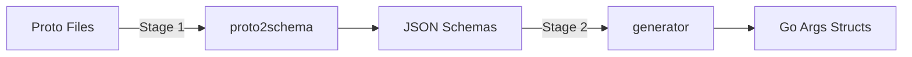

# SDK Code Generation Architecture

## Overview

The Stigmer Go SDK uses a **data-driven, two-stage code generation pipeline** that automatically discovers and generates Args structs for all proto messages across all namespaces.

**Key Innovation:** Proto file paths drive everything - no configuration, no hardcoding, no manual maintenance.

## Pipeline Stages



### Stage 1: Proto → Schema (proto2schema)

**Tool:** `tools/codegen/proto2schema/main.go`

**Input:** Proto definitions in `apis/ai/stigmer/agentic/*`

**Output:** JSON schemas in `tools/codegen/schemas/*`

**Discovery Process:**

```go
// Scans all namespaces automatically
apis/ai/stigmer/agentic/
├── agent/v1/spec.proto          → schemas/agent/agent.json
├── agentinstance/v1/spec.proto  → schemas/agentinstance/agentinstance.json
├── skill/v1/spec.proto          → schemas/skill/skill.json
└── workflow/v1/spec.proto       → schemas/workflow/workflow.json
```

**Key Features:**
- **Comprehensive Mode (`--comprehensive`):** Scans all namespaces automatically
- **Message Filtering:** Extracts all messages ending in `Spec` (or `TaskConfig` for workflow tasks)
- **Type Collection:** Recursively discovers nested shared types
- **Namespace Organization:** Outputs schemas to namespace-specific directories

### Stage 2: Schema → Go (generator)

**Tool:** `tools/codegen/generator/main.go`

**Input:** JSON schemas from Stage 1

**Output:** Go Args structs in `sdk/go/gen/*`

**Routing Logic:**

```go
// Extracts subdomain from proto file path
protoFile: "apis/ai/stigmer/agentic/agent/v1/spec.proto"
  ↓ extractSubdomainFromProtoFile()
subdomain: "agent"
  ↓
outputDir: "sdk/go/gen/agent/"
  ↓
package: "agent"
```

**Discovery Process:**

```go
// Automatically discovers all namespace directories
tools/codegen/schemas/
├── agent/               → sdk/go/gen/agent/
├── agentinstance/       → sdk/go/gen/agentinstance/
├── skill/               → sdk/go/gen/skill/
└── workflow/            → sdk/go/gen/workflow/
```

**Generated Output:**

For each `*Spec` message, generates:
1. **Args struct** - Following Pulumi Args pattern
2. **ToProto method** - Converts Args to proto (future)
3. **Helper functions** - Type conversion utilities

## Data-Driven Architecture

### Proto Path Determines Everything

The proto file path contains all routing information:

```
apis/ai/stigmer/agentic/{namespace}/v1/spec.proto
                         └─────┬────┘
                          Extracted as subdomain
                                 ↓
                    sdk/go/gen/{namespace}/
```

**Examples:**

| Proto Path | Subdomain | Output Directory | Package |
|------------|-----------|------------------|---------|
| `apis/ai/stigmer/agentic/agent/v1/spec.proto` | `agent` | `sdk/go/gen/agent/` | `agent` |
| `apis/ai/stigmer/agentic/skill/v1/spec.proto` | `skill` | `sdk/go/gen/skill/` | `skill` |
| `apis/ai/stigmer/agentic/workflow/v1/spec.proto` | `workflow` | `sdk/go/gen/workflow/` | `workflow` |

### No Configuration Required

The system needs **zero configuration**:

- ✅ No namespace lists to maintain
- ✅ No output directory mappings
- ✅ No package name configurations
- ✅ No manual schema creation

**Proto structure defines everything.**

## Generated Files Organization

```
sdk/go/gen/
├── agent/
│   ├── agentspec_args.go        # AgentArgs
│   ├── inlinesubagentspec_args.go # InlineSubAgentArgs
│   └── helpers.go               # Shared helpers
├── agentinstance/
│   ├── agentinstancespec_args.go # AgentInstanceArgs
│   └── helpers.go
├── skill/
│   ├── skillspec_args.go        # SkillArgs
│   └── helpers.go
├── workflow/
│   ├── workflowspec_args.go     # WorkflowArgs
│   ├── signalspec_args.go       # SignalArgs
│   ├── <task>taskconfig.go     # Task configs
│   └── helpers.go
└── types/
    ├── agentic_types.go         # Shared agentic types
    └── commons_types.go         # Shared commons types
```

## Adding New Resource Types

To add a new resource type, simply create the proto:

```bash
# 1. Create proto
vim apis/ai/stigmer/agentic/newtype/v1/spec.proto

# 2. Define message
message NewTypeSpec {
  string name = 1;
  // ... fields
}

# 3. Run codegen
cd sdk/go
make codegen

# 4. Generated automatically!
# - tools/codegen/schemas/newtype/newtype.json
# - sdk/go/gen/newtype/newtypespec_args.go
```

**No code changes required** - the system discovers and generates automatically.

## Shared Types

Shared types are automatically extracted and organized:

**Discovery:**
- When generating Args, tool recursively discovers referenced message types
- Extracts domain from proto namespace (e.g., `ai.stigmer.agentic.*` → `agentic`)
- Groups by domain in `sdk/go/gen/types/`

**Example:**

```go
// Message references HttpEndpoint
type HttpCallArgs struct {
    Endpoint *types.HttpEndpoint `json:"endpoint,omitempty"`
}

// HttpEndpoint extracted to shared types
// sdk/go/gen/types/agentic_types.go
type HttpEndpoint struct {
    Uri    string            `json:"uri,omitempty"`
    Method string            `json:"method,omitempty"`
    Headers map[string]string `json:"headers,omitempty"`
}
```

**Benefits:**
- Single source of truth for shared types
- Consistent imports across all Args
- No type duplication

## Args Struct Pattern

Generated Args follow the **Pulumi Args pattern**:

```go
// AgentArgs contains the configuration arguments for creating an Agent.
//
// This struct follows the Pulumi Args pattern for resource configuration.
type AgentArgs struct {
    // Field documentation from proto comments
    Description  string                        `json:"description,omitempty"`
    Instructions string                        `json:"instructions,omitempty"`
    McpServers   []*McpServerDefinition        `json:"mcpServers,omitempty"`
    SkillRefs    []*types.ApiResourceReference `json:"skillRefs,omitempty"`
    EnvSpec      *types.EnvironmentSpec        `json:"envSpec,omitempty"`
}
```

**Characteristics:**
- Public struct (exported)
- JSON tags for serialization
- Optional fields (`omitempty`)
- Proto comment documentation preserved
- Shared types imported from `sdk/go/gen/types`

## Usage in SDK

Hand-written SDK code uses generated Args:

```go
// sdk/go/agent/agent.go
package agent

import (
    genagent "github.com/stigmer/stigmer/sdk/go/gen/agent"
)

// Agent creates a new agent resource
func Agent(name string, args *genagent.AgentArgs) (*Agent, error) {
    return &Agent{
        Metadata: &Metadata{Name: name},
        Spec:     args.ToProto(), // Convert Args to proto
    }, nil
}
```

**User code:**

```go
import (
    "github.com/stigmer/stigmer/sdk/go/agent"
    genagent "github.com/stigmer/stigmer/sdk/go/gen/agent"
)

myAgent, err := agent.Agent("my-agent", &genagent.AgentArgs{
    Description:  "My AI assistant",
    Instructions: "Help users with coding tasks",
    McpServers: []*genagent.McpServerDefinition{
        {Name: "github", Stdio: &genagent.StdioServer{Command: "github-mcp"}},
    },
})
```

## Build Integration

```makefile
# Stage 1: Proto → Schema
codegen-schemas:
    go run tools/codegen/proto2schema/main.go \
        --comprehensive \
        --include-dir apis

# Stage 2: Schema → Go
codegen-go:
    go run tools/codegen/generator/main.go \
        --schema-dir tools/codegen/schemas \
        --output-dir sdk/go/gen/workflow \
        --package workflow

# Full pipeline
codegen: codegen-schemas codegen-go
```

**Commands:**

```bash
# Generate everything
make codegen

# Just schemas (proto → JSON)
make codegen-schemas

# Just Go code (JSON → Go)
make codegen-go

# Verify generated code
make codegen-verify
```

## Extensibility

The system can be extended to generate:

1. **Other languages** - Add TypeScript, Python generators
2. **Other message types** - Generate for `Status`, `Input`, `Output` suffixes
3. **Additional code** - Generate FromProto, validation helpers, builders
4. **Other patterns** - Adapt for different SDK patterns

## Design Decisions

### Why Data-Driven?

**Problem:** Hardcoded namespace lists require code changes for each new resource.

**Solution:** Proto file path contains all routing information.

**Benefits:**
- Zero maintenance
- Automatically extensible
- Self-documenting (proto path = output path)

### Why Two-Stage Pipeline?

**Problem:** Proto parsing is complex and slow.

**Solution:** Separate parsing from code generation.

**Benefits:**
- **Stage 1** (proto2schema): One-time parsing, cached schemas
- **Stage 2** (generator): Fast iteration on generation logic
- Can regenerate Go code without re-parsing protos
- Easy to add new language generators

### Why Comprehensive Mode?

**Problem:** Manual schema creation for each resource type.

**Solution:** Automatically discover and generate for ALL messages.

**Benefits:**
- Never miss a resource type
- Consistent patterns across all namespaces
- Proto definitions are single source of truth

## Troubleshooting

### Generated Args Missing

**Issue:** Args not generated for a new Spec message.

**Check:**
1. Proto file in correct location? `apis/ai/stigmer/agentic/{namespace}/v1/spec.proto`
2. Message name ends with `Spec`? `message MyTypeSpec { ... }`
3. Schema generated? Check `tools/codegen/schemas/{namespace}/`
4. Run full pipeline: `make codegen`

### Wrong Package Name

**Issue:** Generated code has incorrect package name.

**Cause:** Package name derived from output directory path.

**Fix:** Verify proto file path follows pattern: `apis/ai/stigmer/agentic/{namespace}/v1/`

### Import Errors

**Issue:** Cannot import generated Args.

**Check:**
1. Run `go mod tidy` in `sdk/go/`
2. Verify import path: `github.com/stigmer/stigmer/sdk/go/gen/{namespace}`
3. Check generated file exists

## References

- **Proto2Schema Tool:** `tools/codegen/proto2schema/main.go`
- **Generator Tool:** `tools/codegen/generator/main.go`
- **Makefile:** `sdk/go/Makefile`
- **Generated Args:** `sdk/go/gen/*/`
- **Proto Definitions:** `apis/ai/stigmer/agentic/*/v1/`
- **Changelog:** `_changelog/2026-01/2026-01-24-104500-comprehensive-args-codegen-all-proto-namespaces.md`
