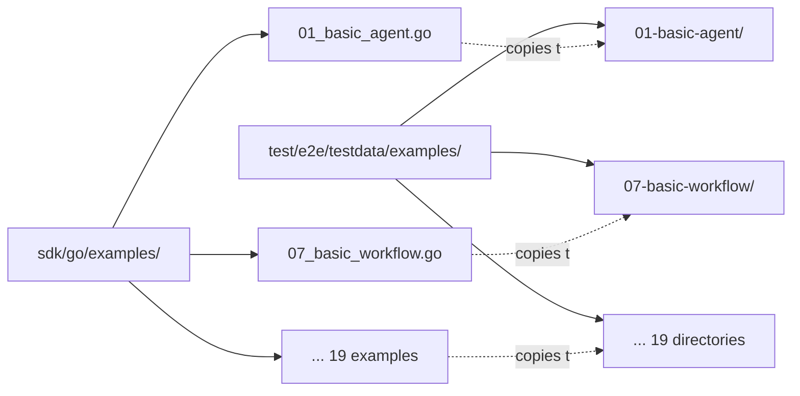
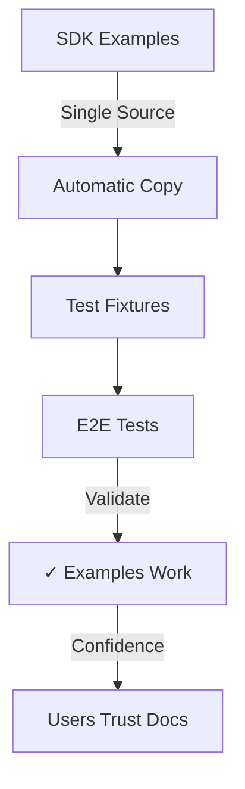

# Test Fixture Reorganization: SDK-Aligned Structure

**Date**: 2026-01-23  
**Impact**: All E2E test fixtures reorganized to mirror SDK examples

## Why This Change

Test fixtures were organized by type (`agents/`, `workflows/`) but SDK examples are organized by example number (`01_basic_agent.go`, `02_agent_with_skills.go`). This mismatch made it harder to understand which test fixture corresponded to which SDK example.

**Problem**: Finding the test fixture for `07_basic_workflow.go` wasn't obvious - was it in `agents/` or `workflows/`?

**Solution**: Reorganize test fixtures to directly mirror SDK structure with consistent naming.

## What Changed

### Directory Structure



**Before:**
```
testdata/
├── agents/          # Some examples
│   └── basic-agent/
└── workflows/       # Other examples
    └── simple-sequential/
```

**After:**
```
testdata/
└── examples/        # All SDK examples
    ├── 01-basic-agent/
    ├── 02-agent-with-skills/
    ├── 07-basic-workflow/
    └── ... (19 total)
```

### Naming Convention

SDK examples use underscores: `01_basic_agent.go`  
Test fixtures use hyphens: `01-basic-agent/`

This follows the lowercase-with-hyphens convention for directories while maintaining clear correspondence to SDK files.

### SDK Fixture Copy Expansion

The automatic copy mechanism was enhanced to copy all SDK examples:

**Before**: 1 SDK example copied (`01_basic_agent.go`)  
**After**: 19 SDK examples copied (agents 01-06, 12 + workflows 07-11, 13-19)

**Implementation** (`sdk_fixtures_test.go`):
```go
examples := []SDKExample{
    {
        SDKFileName:    "01_basic_agent.go",
        TestDataDir:    "examples/01-basic-agent",
        TargetFileName: "main.go",
    },
    // ... all 19 examples
}
```

## Files Modified

### Code Changes
- `sdk_fixtures_test.go` - Added all 19 SDK examples to copy list
- `e2e_run_full_test.go` - Updated 2 path references
- `basic_agent_run_test.go` - Updated 3 path references
- `basic_agent_apply_test.go` - Updated 3 path references
- `cli_runner_test.go` - Updated comment references

### Documentation Updates
- `testdata/README.md` - Complete rewrite for new structure
- `testdata/examples/01-basic-agent/README.md` - New comprehensive guide
- `docs/test-organization.md` - Updated structure and examples
- `docs/sdk-sync-strategy.md` - Updated paths and status
- `docs/test-coverage-enhancement-2026-01-23.md` - Updated paths

### Deprecated
- `testdata/agents/` - Deleted (fixtures moved to `testdata/examples/01-basic-agent/`)

## Benefits

### 1. Clear Correspondence
Finding test fixtures is now straightforward:
- SDK: `01_basic_agent.go` → Test: `testdata/examples/01-basic-agent/`
- SDK: `07_basic_workflow.go` → Test: `testdata/examples/07-basic-workflow/`

### 2. Complete Coverage
All 19 SDK examples are now available as test fixtures:
- Agent examples: 01-06, 12 (7 examples)
- Workflow examples: 07-11, 13-19 (12 examples)

### 3. Unified Structure
No more distinction between "agent tests" and "workflow tests" - all examples live in one place.

### 4. Scalable
Adding new SDK examples is straightforward:
1. Create SDK example (e.g., `20_new_feature.go`)
2. Add to copy list in `sdk_fixtures_test.go`
3. Optionally create `Stigmer.yaml` config
4. Write tests

## Migration Path

No external migration needed - this was an internal test structure change.

For developers with local changes:
- Old paths: Update any local scripts referencing `testdata/agents/` to `testdata/examples/01-basic-agent/`
- Tests automatically run with new structure
- Copy mechanism ensures fixtures are up-to-date

## Verification

Tests verify everything works correctly:

```bash
# Run tests (copy mechanism runs automatically in SetupSuite)
cd test/e2e
go test -v -tags=e2e -run TestBasicAgent

# Verify copy mechanism
rm -rf testdata/examples/01-basic-agent/main.go
go test -v -tags=e2e -run TestApplyBasicAgent
# Should automatically copy main.go and pass
```

## Impact on Test Development

### Before
```go
// Which directory should this go in?
testdataDir := filepath.Join("testdata", "workflows", "simple-sequential")
// Wait, is it workflows or agents?
```

### After
```go
// Clear correspondence to SDK example
testdataDir := filepath.Join("testdata", "examples", "07-basic-workflow")
// Matches sdk/go/examples/07_basic_workflow.go exactly
```

### Writing New Tests

To test a new SDK example:

1. **Add to copy list** (`sdk_fixtures_test.go`):
   ```go
   {
       SDKFileName:    "20_new_feature.go",
       TestDataDir:    "examples/20-new-feature",
       TargetFileName: "main.go",
   }
   ```

2. **Create config** (if needed):
   ```bash
   mkdir -p testdata/examples/20-new-feature
   cat > testdata/examples/20-new-feature/Stigmer.yaml <<EOF
   name: new-feature-test
   runtime: go
   main: main.go
   EOF
   ```

3. **Write test**:
   ```go
   func (s *E2ESuite) TestNewFeature() {
       testdataDir := filepath.Join("testdata", "examples", "20-new-feature")
       // ... test logic
   }
   ```

## SDK Sync Strategy Alignment

This change strengthens the SDK Sync Strategy principle: **Test what we promise users**.



**Key principle**: SDK examples are the source of truth. Tests validate those exact examples work correctly.

With all 19 examples now copied automatically, we can expand test coverage to validate every SDK example we provide to users.

## Metrics

| Metric | Before | After | Change |
|--------|--------|-------|--------|
| SDK examples copied | 1 | 19 | +1800% |
| Directory structure | Split (agents/workflows) | Unified (examples/) | Simplified |
| Naming clarity | Indirect mapping | Direct mapping | Improved |
| Test fixture setup | Manual for some | Automatic for all | Scalable |

## Next Steps

Test fixtures are now ready for comprehensive test coverage:

1. **Current**: Basic agent fully tested (01-basic-agent)
2. **Ready**: 18 more SDK examples available as fixtures
3. **Future**: Write tests for remaining examples as needed

The foundation is in place - adding tests for any SDK example is now straightforward and follows a consistent pattern.

---

**Result**: Test fixtures now directly mirror SDK examples, making it clear what's being tested and enabling comprehensive validation of all SDK examples we provide to users.
